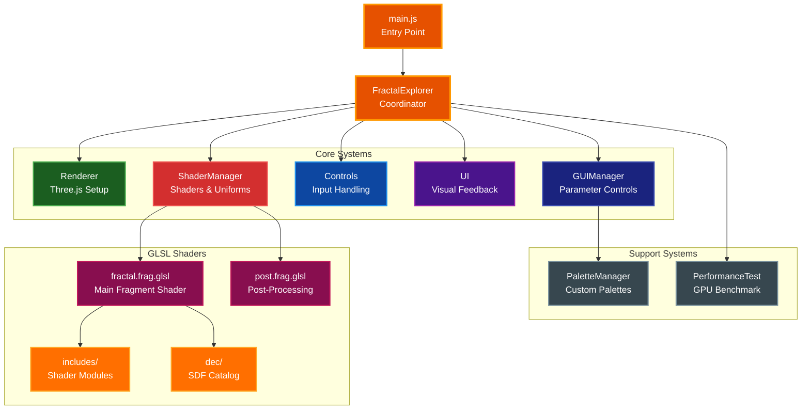
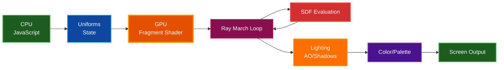

# Fractal Explorer (Three.js)

<!-- Pages badge owner set to @paulrobello -->

[](https://github.com/paulrobello/fractals/actions/workflows/pages.yml)

Real‑time GPU ray‑marched fractals (Menger, Mandelbulb, Sierpinski, Mandelbox, World/Gyroid, Truchet Pipes) with flight controls, full GUI, and production‑grade performance tuning.

## Features

- Real‑time ray marching with AO and soft shadows
- 8 fractal types (Primitives, Menger Sponge, Mandelbulb, Sierpinski Tetrahedron, Mandelbox, World/Amazing Surf, World/Truchet Pipes, DEC Preview)
- Visual presets for one‑click looks (Deep Ocean Menger, Molten Mandelbulb, Electric Sierpinski, Organic Mandelbox, Bridges, Cathedral, etc.)
- Custom palettes (import/export JSON, up to 8 stops, linear/cosine interpolation, clamp/repeat/mirror wrap) with live preview
- Full color system (Material / Orbit Trap / Distance / Normal) + palettes
- Procedural textures (FBM Noise, Voronoi, Truchet, Checkerboard) with triplanar mapping and LOD
- Performance suite: Adaptive relaxation, epsilon LOD, Budget LOD (steps/AO/shadows) with far‑shadow skip, Debug Overlay, live budget Estimate
- Robust floor/plane pipeline (2025‑10‑10): analytic ground plane with post‑refine visibility resolve — no SDF union, no seam "gasket"; floor shadows optional
- Help overlay, screenshot export, camera state auto‑save
- Auto GPU benchmark (no modal): measures on‑screen FPS and picks Ultra/High/Medium/Low
- DEC Preview system: Hot-swappable SDF catalog from `dec/` directory

## Quick Start

- Requirements: Node 18+ (Node 20 recommended), npm
- Install: `npm ci` (or `npm install`)
- Dev: `npm run dev` → opens http://localhost:3333/
- Build: `npm run build`
- Preview: `npm run preview` (use `-- --port 3333` to match dev port)

## New: World Fractal + Presets

World (Amazing Surf) adds a gyroid‑style world you can fly through.

- Pick it: GUI → Fractal → Type → “World (Amazing Surf)”.
- Controls (GUI → Fractal → World):
  - Tile Period (bigger = larger rooms)
  - Shell Thickness (smaller = more open)
  - Domain Warp (adds organic variation)
  - Advanced: DE Safety (stability), Segment Clamp (segment step limit)
- Fly Mode (Camera → “Fly Mode (Pitch Forward)”) makes W/S move along camera forward (pitch). Enabled automatically for World.

Presets to try

- Bridges (World, Segment) — fast fly‑through (Segment tuned)
- Cathedral (World, Sphere) — beauty shot (Sphere Plain, Electric palette)
- Cathedral Cavern (World) — sphere baseline

Tip: Segment is faster; if you see banded “shelves” far away on thin shells, lower Segment Clamp and/or increase DE Safety.

### Chrome/macOS note: Palette dropdown

On Chrome for macOS, the native `<select>` used by lil‑gui can occasionally skip `onChange`. The app includes a tiny DOM hook (Palette control only) to keep the dropdown label and shader uniforms in sync. You can disable this hook for diagnostics in DevTools, then reload:

```
window.__paletteDomHook = false
```

First run auto‑benchmarks if no quality is cached, then applies the result.

## Controls

- Click canvas to lock pointer (first‑person look)
- Move: `W/A/S/D`, Up `E`, Down `Q`
- Speed boost: `Shift`
- Reset camera: `O`
- Toggle auto-rotate: `R`
- Toggle morph: `M`
- Fractal: `1..7`
- Iterations: `[` and `]`
- Toggle help: `H`

## GUI Overview (lil‑gui)

- Fractal: type, iterations, power (Mandelbulb), scale
- Animation: auto‑rotate, per‑axis speeds
- Camera: movement speed, FOV, reset
- Lighting: light position, ambient/diffuse/specular, shininess, AO, soft shadows, shadow quality/sharpness, normal precision
- Environment: fog (exp/exp2/linear), density/near/far, background color, Floor Receives Shadows
- Color: color mode, palette, intensity, orbit‑trap scale, material color
- Performance: Quality Preset (Low/Medium/High/Ultra), Max Steps, Step Size
  - Note: Shaders are specialized per fractal (compile-time FRAC_TYPE) by default.
- Advanced Optimizations: Adaptive step size, Epsilon LOD (near/far), Budget LOD (step cap, AO/Shadow floors, far‑shadow skip), Budget Presets, Estimate label, Debug Overlay toggle
- Presets: visual preset selector (top‑level)

## Auto GPU Benchmark

- Runs automatically when `fractalExplorer_quality` is not in localStorage
- Measures real delivered FPS using requestAnimationFrame (on‑screen)
- Ultra is measured first with your current settings; other tiers derive from Ultra
- Caches `{ quality, maxSteps, iterations }` and applies on subsequent loads
- Clear cache to re‑run: `localStorage.removeItem('fractalExplorer_quality')`

## Troubleshooting

- Shader error modal: If shaders fail, a red panel appears and the loading screen stays visible. Click “Copy Log” and check DevTools console for full GLSL sources and driver logs (we capture both compile and link logs).
- Clear cached quality: See command above if you want to re‑benchmark.
- Reset camera: `R`. Camera pose auto‑saves every second to `fractalExplorer_cameraPosition`.
- If dev reload looks stale: enable “Disable cache” in DevTools Network tab and hard‑reload.

## Architecture

### Modular Class Architecture

The application uses a coordinator pattern with specialized classes:



**Flow:**
- **FractalExplorer** owns the animation loop and coordinates all systems
- **Renderer** manages Three.js scene, camera, and WebGL renderer
- **ShaderManager** owns all uniforms (canonical state) and compiles specialized shaders
- **Controls** handles PointerLockControls and keyboard input
- **UI** provides Stats, loading screen, toasts, and help overlay
- **GUIManager** syncs 100+ parameters between GUI and uniforms
- **PerformanceTest** auto-benchmarks GPU and sets quality tier
- **PaletteManager** handles custom palette creation/editing/persistence

### Rendering Pipeline



**Key Concept:** Rendering uses GPU ray marching via GLSL fragment shaders, not traditional Three.js meshes. A full-screen quad shader does all the work—fractal geometry is defined by Signed Distance Functions (SDFs).

## Project Structure

```
fractals/
├─ src/
│  ├─ main.js                      # Entry point (3 lines)
│  ├─ app/                         # Core application classes
│  │  ├─ FractalExplorer.js        # Main coordinator, animation loop
│  │  ├─ Renderer.js               # Three.js setup, camera, scene
│  │  ├─ ShaderManager.js          # Shaders, uniforms, materials
│  │  ├─ Controls.js               # PointerLockControls, keyboard
│  │  └─ UI.js                     # Stats, loading, toasts, help
│  ├─ shaders/
│  │  ├─ fractal.frag.glsl         # Main fragment shader
│  │  ├─ fractal.vert.glsl         # Vertex shader
│  │  ├─ post.frag.glsl            # Post-processing fragment
│  │  ├─ screen.vert.glsl          # Post-processing vertex
│  │  └─ includes/                 # Shader modules
│  │     ├─ common.glsl
│  │     ├─ sdf-*.glsl             # Fractal SDFs
│  │     ├─ ray-marching.glsl
│  │     ├─ lighting.glsl
│  │     ├─ coloring.glsl
│  │     ├─ procedural-textures.glsl
│  │     ├─ space-transforms.glsl
│  │     └─ dec/                   # DEC preview catalog
│  │        ├─ manifest.json
│  │        ├─ __user__.glsl
│  │        ├─ primitive/
│  │        ├─ fractal/
│  │        └─ operator/
│  ├─ ui/
│  │  └─ GUIManager.js             # lil-gui controls (100+ parameters)
│  ├─ core/
│  │  ├─ PerformanceTest.js        # GPU benchmarking
│  │  └─ PaletteManager.js         # Custom palette system
│  ├─ config/
│  │  ├─ defaults.js               # All default values
│  │  ├─ presets.js                # Visual preset configurations
│  │  └─ utils.js                  # Preset override utilities
│  └─ controls/
│     └─ FlyControls.js            # (deprecated)
├─ public/
│  └─ CNAME                        # Custom domain for GitHub Pages
├─ .github/
│  └─ workflows/
│     └─ pages.yml                 # GitHub Pages deployment
├─ docs/
│  ├─ DOCUMENTATION_STYLE_GUIDE.md
│  ├─ references/
│  └─ research/
│     └─ RAY_MARCHING_RESEARCH.md
├─ scripts/
│  └─ extract-sdfs-from-dec.mjs    # DEC extraction utility
└─ vite.config.js                  # Vite configuration with GLSL plugin
```

## Performance Tips

- Start with Quality preset = “Quality” Budget LOD for best visuals at speed
- If FPS dips: lower Max Steps or raise Step Cap Far Factor (fewer far steps)
- Use Debug Overlay to confirm LOD ranges and budgets match expectations

## 2025‑10‑10: Floor/Plane Pipeline

- The ground plane is now an analytic ray–plane candidate, not part of the SDF.
- A single ResolveHit step compares the fractal hit vs. plane t and resolves visibility with a seam‑tolerant rule based on adaptive epsilon.
- Floor pixels: AO is skipped (AO=1), shadows only when “Floor Receives Shadows” is ON.
- Fog uses the final resolved distance tHit for both surfaces.
- Result: no “black gasket” at the floor seam, no under‑floor imprinting, and simpler defaults (no floor‑specific biases/pads/clips).

## Deployment

### GitHub Pages (via Actions)

This repo includes a Pages workflow at `.github/workflows/pages.yml` that builds with Vite and deploys `dist/` on pushes to `main`.

1. Push to `main` (or run the workflow manually from the Actions tab).
2. In GitHub → Settings → Pages:
   - Build and deployment → Source: GitHub Actions
   - Custom domain: `fractals.pardev.net`
   - Enforce HTTPS: ON
3. DNS: create a CNAME record for `fractals.pardev.net` pointing to `<your-user-or-org>.github.io`.

Notes

- `public/CNAME` is committed so the domain is tracked in-repo.
- With a custom domain, Vite `base` can remain the default (`/`). No extra config is needed.

### Static Hosts

- Build locally with `npm run build` (outputs `dist/`).
- Ensure your host serves `.glsl` files; `text/plain` or `text/x-glsl` is fine. Includes are bundled via `vite-plugin-glsl`.
- Netlify/Vercel: deploy the `dist/` directory.

## License

MIT

**Status:** Core complete • **Last Updated:** 2025‑10‑26
