# Distance Estimator Compendium (DEC)

- Source: https://jbaker.graphics/writings/DEC.html
- Page last updated: 4/6/2024
- Retrieved: 2025-10-17
- Assets: ./DEC_assets

## Introduction

My goal here is to provide a collected resource of these signed distance functions (SDFs) in a standardized format given by `float de( vec3 p ){...}`.

SDFs are an interesting method for representing geometry as an implicit functional representation, which produces a result by querying with a given point in space and returning an estimate of the distance to the surface - positive outside, and negative inside. I emphasize that this result is an estimate, especially for some of the fractal SDFs which produce a result by distorting the space in a highly nonlinear fashion.

This representation is often used in realtime raymarching, but they come up in applications such as pathtracing and producing of meshes. I have seen several resources on this topic but I hope to gather as much as I can in one place on this page.

Click titles to show/hide section. Mouse over each of the images to view it larger.

## Contents

- [Primitives](#primitives-49-entries)
- [Operators](#operators-1-entries)
- [Fractals](#fractals-339-entries)
- [Composed Shapes](#composed-shapes-37-entries)

## Primitives (49 entries)

### // Rhombic Dodecahedron — yx

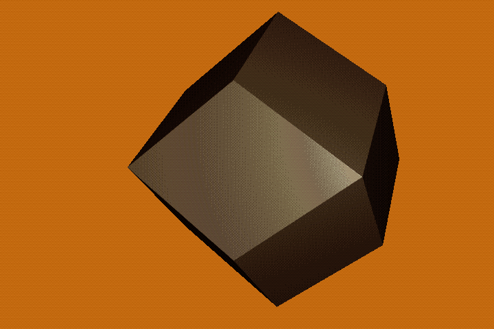

```glsl
float de( vec3 p ){
  p = abs( p );
  p += p.yzx;
  return ( max( max( p.x, p.y ), p.z ) - 1.0 ) * sqrt( 0.5 );
}
```

### 2D Disc - no thickness - subtract some amount from result to make a rounded disk — Cupe / Mercury

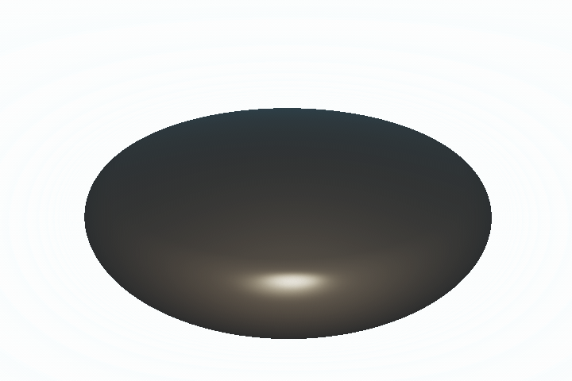

```glsl
float de(vec3 p){
    float r = 1.; // radius of the circle
    float l = length(p.xz) - r;

    return length(vec2(p.y, l));
  }
```

### 2d Infinite Box — Cupe / Mercury

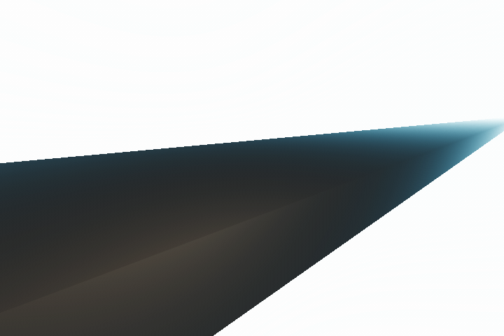

```glsl
float de(vec3 p){  // cheap version
    vec2 p0 = p.xy;    // the plane the box is in (xy, yz, xz)
    vec2 bd = vec2(1.) // the dimensions of the box
    vec2 d = abs(p0) - bd;

    return max(d.x, d.y);
  }

  float de(vec3 p){
    vec2 p0 = p.xy;    // the plane the box is in (xy, yz, xz)
    vec2 bd = vec2(1.) // the dimensions of the box
    vec2 d = abs(p0) - bd;
    vec2 md = min(d, vec2(0.));

    return length(max(d, vec2(0))) + max(max(md.x, md.y), md.z);
  }
```

### Blob - not a correct distance bound, has artifacts — Cupe / Mercury

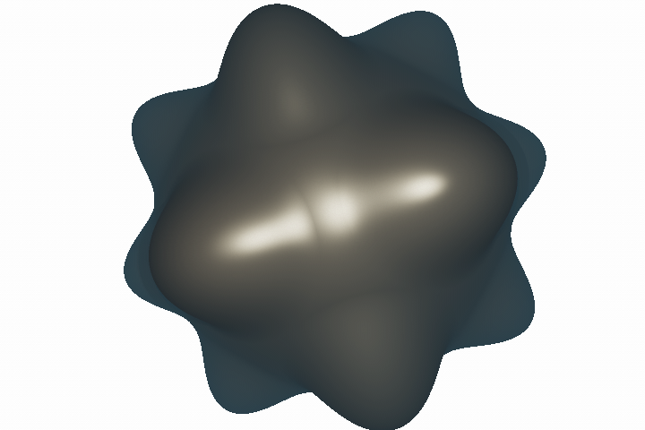

```glsl
float de(vec3 p) {
    p = abs(p);
    if (p.x < max(p.y, p.z)) p = p.yzx;
    if (p.x < max(p.y, p.z)) p = p.yzx;
    float b = max(max(max(
      dot(p, normalize(vec3(1, 1, 1))),
      dot(p.xz, normalize(vec2(PHI+1, 1)))),
      dot(p.yx, normalize(vec2(1, PHI)))),
      dot(p.xz, normalize(vec2(1, PHI))));
    float l = length(p);
    return l - 1.5 - 0.2 * (1.5 / 2)* cos(min(sqrt(1.01 - b / l)*(PI / 0.25), PI));
  }
```

### Box — Cupe / Mercury

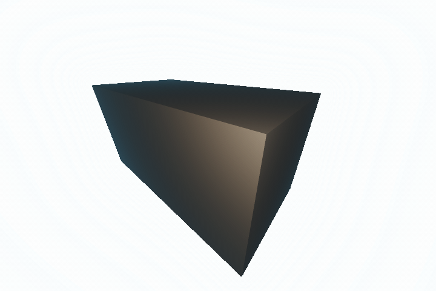

```glsl
float de(vec3 p){ // cheap version
    vec3 size = vec3(1.); //dimensions on each axis
    vec3 d = abs(p) - size;

    return max(max(d.x, d.y), d.z);
  }

  float de(vec3 p){
    vec3 size = vec3(1.) // dimensions on each axis
    vec3 d = abs(p) - size;
    float md = min(d, vec3(0));

    return length(max(d, vec3(0))) + max(max(md.x, md.y), md.z);
  }
```

### Box Frame — iq

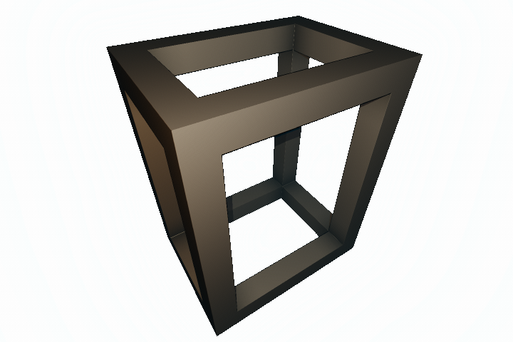

```glsl
float de( vec3 p){
    float e = 0.05;          // edge thickness
    vec3 b = vec3(.3,.5,.4); // box dimensions
    p = abs(p)-b;
    vec3 q = abs(p+e)-e;

    return min(min(
      length(max(vec3(p.x,q.y,q.z),0.0))+min(max(p.x,max(q.y,q.z)),0.0),
      length(max(vec3(q.x,p.y,q.z),0.0))+min(max(q.x,max(p.y,q.z)),0.0)),
      length(max(vec3(q.x,q.y,p.z),0.0))+min(max(q.x,max(q.y,p.z)),0.0));
  }
```

### Capped Cone — iq

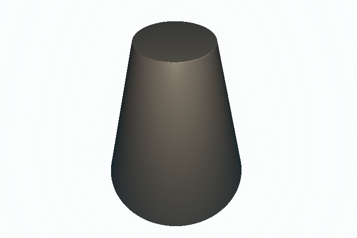

```glsl
float de(vec3 p){   // located at origin
      float h = 1.;   // height
      float r1 = 0.5; // radius at bottom
      float r2 = 0.2; // radius at top

      vec2 q = vec2( length(p.xz), p.y );

      vec2 k1 = vec2(r2,h);
      vec2 k2 = vec2(r2-r1,2.0*h);
      vec2 ca = vec2(q.x-min(q.x,(q.y < 0.0)?r1:r2), abs(q.y)-h);
      vec2 cb = q - k1 + k2*clamp( dot(k1-q,k2)/dot(k2,k2), 0.0, 1.0 );
      float s = (cb.x < 0.0 && ca.y < 0.0) ? -1.0 : 1.0;
      return s*sqrt( min(dot(ca,ca),dot(cb,cb)) );
  }


  float de(vec3 p){   // between two points a and b
      vec3 a = vec3(0,0,0); // point a
      vec3 b = vec3(0,1,0); // point b
      float ra = .5; // radius at a
      float rb = .2; // radius at b

      float rba  = rb-ra;
      float baba = dot(b-a,b-a);
      float papa = dot(p-a,p-a);
      float paba = dot(p-a,b-a)/baba;

      float x = sqrt( papa - paba*paba*baba );

      float cax = max(0.0,x-((paba<0.5)?ra:rb));
      float cay = abs(paba-0.5)-0.5;

      float k = rba*rba + baba;
      float f = clamp( (rba*(x-ra)+paba*baba)/k, 0.0, 1.0 );

      float cbx = x-ra - f*rba;
      float cby = paba - f;

      float s = (cbx < 0.0 && cay < 0.0) ? -1.0 : 1.0;

      return s*sqrt( min(cax*cax + cay*cay*baba,
                         cbx*cbx + cby*cby*baba) );
  }
```

### Capped Torus — iq

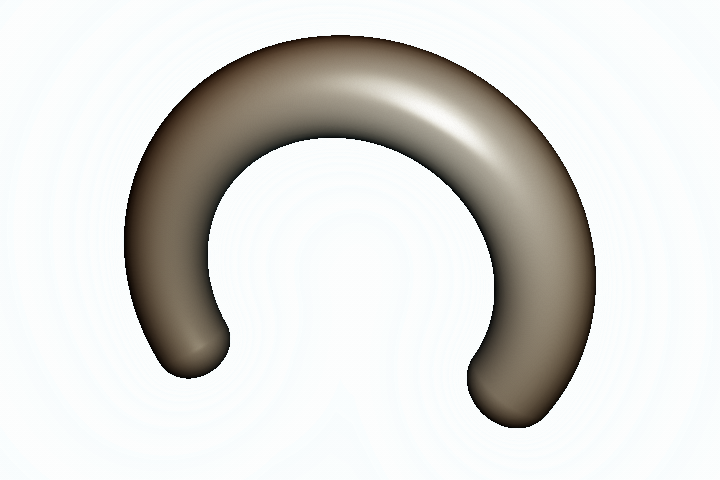

```glsl
float de(vec3 p){
    float angle = 2.0; // angle spanned
    float ra = 0.25;   // major radius
    float rb = 0.05;   // minor radius

    vec2 sc = vec2(sin(angle), cos(angle));
    p.x = abs(p.x);
    float k = (sc.y*p.x>sc.x*p.y) ? dot(p.xy,sc) : length(p.xy);
    return sqrt( dot(p,p) + ra*ra - 2.0*ra*k ) - rb;
  }
```

### Capsule - cylinder with round caps — Cupe / Mercury

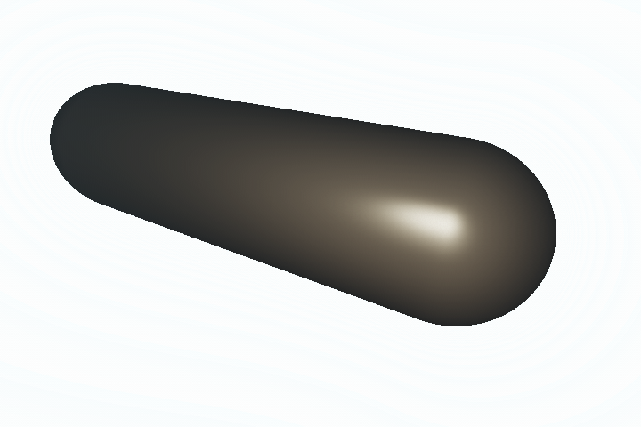

```glsl
float de(vec3 p)
    float r = 1.; // radius
    float c = 1.; // length
    return mix(length(p.xz) - r, length(vec3(p.x, abs(p.y) - c, p.z)) - r, step(c, abs(p.y)));
  }

Alternate method

  float de_line_segment(vec3 p, vec3 a, vec3 b) {
    vec3 ab = b - a;
    float t = clamp(dot(p - a, ab) / dot(ab, ab), 0., 1.);

    return length((ab*t + a) - p);
  }

  float de(vec3 p){
    vec3 a = vec3(0., -1., 0.); // location of top
    vec3 b = vec3(0.,  1., 0.); // location of bottom
    float r = 1.; // radius

    return de_line_segment(p, a, b) - r;
  }
```

### ChamferBox - generalizes sphere, cuboid, and octahedron — TLC123

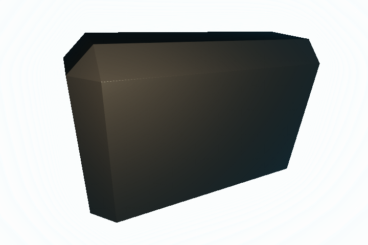

```glsl
float sdOctahedron( in vec3 p, in float s)// by Iq 2019{
      p = abs(p);
      float m = p.x+p.y+p.z-s;
      vec3 q;
           if( 3.0*p.x < m ) q = p.xyz;
      else if( 3.0*p.y < m ) q = p.yzx;
      else if( 3.0*p.z < m ) q = p.zxy;
      else return m*0.57735027;

      float k = clamp(0.5*(q.z-q.y+s),0.0,s);
      return length(vec3(q.x,q.y-s+k,q.z-k));
  }

  float de(vec3 op){
    vec3 b = vec3(1,2,3); // size
    float ch = 0.25;      // chamfer amount
    float r = 0.05;       // rounding

    vec3 p = abs(op)+vec3(ch)+vec3(r);
    p = max(vec3(0),p-b);
    float d =fOctahedron(p,ch);
    return d-r ;
  }
```

### Cone - pointing up the y axis — Cupe / Mercury

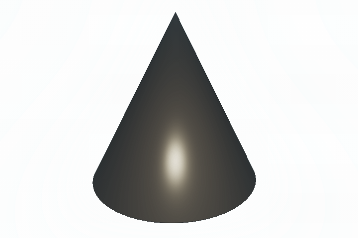

```glsl
float de(vec3 p){
    float radius = 1.;
    float height = 3.;
    vec2 q = vec2(length(p.xz), p.y);
    vec2 tip = q - vec2(0, height);
    vec2 mantleDir = normalize(vec2(height, radius));
    float mantle = dot(tip, mantleDir);
    float d = max(mantle, -q.y);
    float projected = dot(tip, vec2(mantleDir.y, -mantleDir.x));

    // distance to tip
    if ((q.y > height) && (projected < 0)) {
      d = max(d, length(tip));
    }

    // distance to base ring
    if ((q.x > radius) && (projected > length(vec2(height, radius)))) {
      d = max(d, length(q - vec2(radius, 0)));
    }
    return d;
  }
```

### Cylinder in the XZ plane — Cupe / Mercury

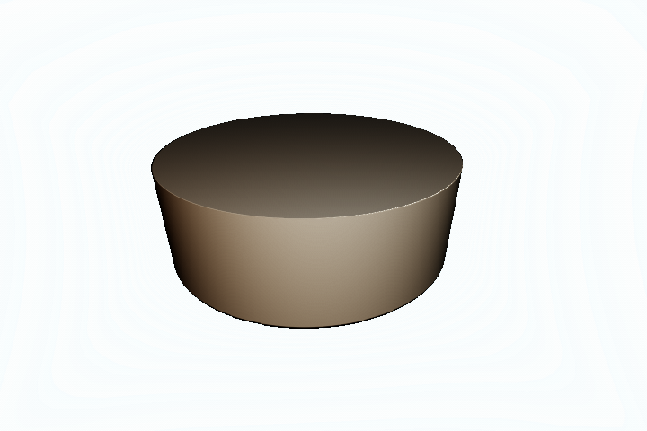

```glsl
float de(vec3 p){
    float r = 1.;
    float height = 1.;

    float d = length(p.xz) - r;
    d = max(d, abs(p.y) - height);

    return d;
  }
```

### Cylinder with rounded edges, also in XZ plane — iq

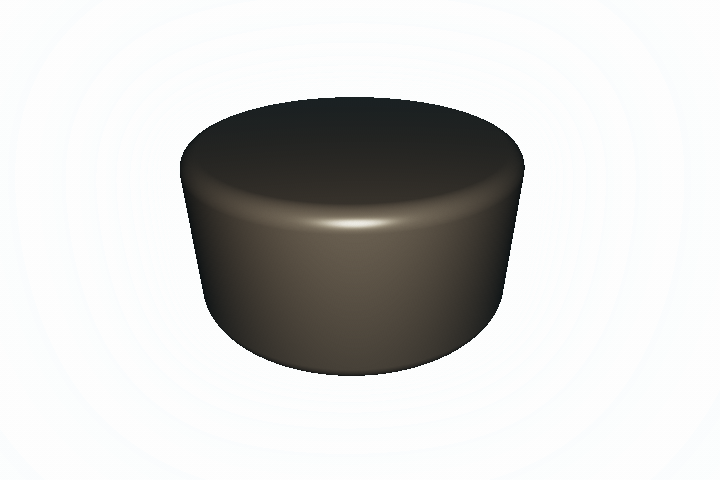

```glsl
float de( vec3 p){
    float ra = 0.5;  // radius of cylinder
    float rb = 0.1;  // radius of rounding
    float h  = 0.4;  // height of cylinder

    vec2 d = vec2( length(p.xz)-2.0*ra+rb, abs(p.y) - h );
    return min(max(d.x,d.y),0.0) + length(max(d,0.0)) - rb;
  }
```

### Cylinder6 using iq's change of distance metric — iq

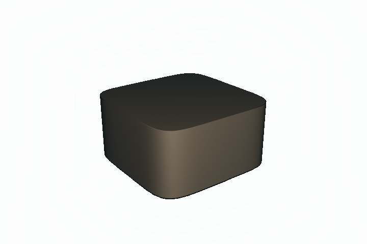

```glsl
float de(vec3 p){
    float diameter = 0.2;
    float height = 0.1;
    return max( length6(p.xz) - diameter, abs(p.y) - height );
  }
```

### Cylinder8 using iq's change of distance metric — iq

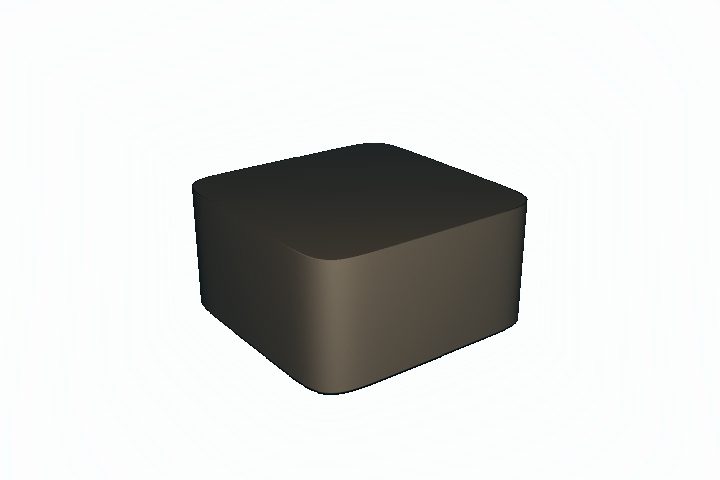

```glsl
float de(vec3 p){
    float diameter = 0.2;
    float height = 0.1;
    return max( length8(p.xz) - diameter, abs(p.y) - height );
  }
```

### Dodecahedron — Unknown

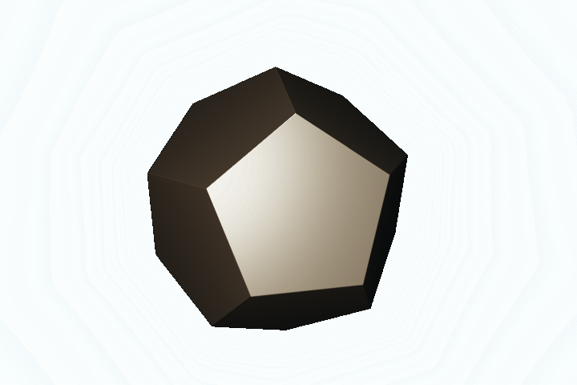

```glsl
float de(vec3 p){
    float r = 1.; // radius

    return fGDF(p, r, 13, 18);
  }

With Exponent

  float de(vec3 p){
    float r = 1.; // radius
    float e = 1.; // exponent

    return fGDF(p, r, e, 13, 18);
  }
```

### Dodecahedron (Alternative) — tholzer


```glsl
float de(vec3 p){
    float radius = 1.;
    const float phi = 1.61803398875;  // Golden Ratio = (sqrt(5)+1)/2;
    const vec3 n = normalize(vec3(phi,1,0));

    p = abs(p / radius);
    float a = dot(p, n.xyz);
    float b = dot(p, n.zxy);
    float c = dot(p, n.yzx);
    return (max(max(a,b),c)-n.x) * radius;
  }
```

### Ellipsoid — iq


```glsl
float de(vec3 p) {
    vec3 r = vec3(0.2, 0.25, 0.05); // the radii on each axis
    float k0 = length(p/r);
    float k1 = length(p/(r*r));
    return k0*(k0-1.0)/k1;
  }
```

### Endless Corner/Shelf — Cupe / Mercury

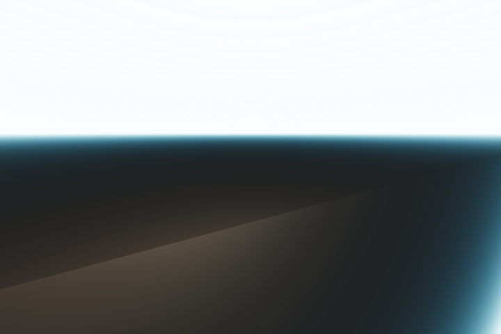

```glsl
float de(vec3 p){
    vec2 p0 = p.xy; // the plane the section lies in
    vec2 md = min(p, vec2(0));

    return length(max(p0, vec2(0))) + max(max(md.x, md.y), md.z);
  }
```

### Equilateral Triangular Prism — iq

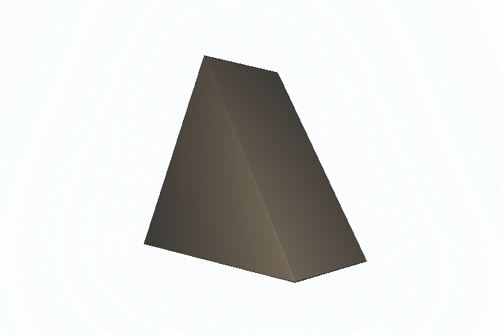

```glsl
float de(vec3 p){
    vec2 h = vec2(0.5, 0.2); // height, thickness
    const float k = sqrt(3.0);
    h.x *= 0.5*k;
    p.xy /= h.x;
    p.x = abs(p.x) - 1.0;
    p.y = p.y + 1.0/k;
    if( p.x+k*p.y>0.0 ) p.xy=vec2(p.x-k*p.y,-k*p.x-p.y)/2.0;
    p.x -= clamp( p.x, -2.0, 0.0 );
    float d1 = length(p.xy)*sign(-p.y)*h.x;
    float d2 = abs(p.z)-h.y;
    return length(max(vec2(d1,d2),0.0)) + min(max(d1,d2), 0.);
  }
```

### float de( vec3 p ) { — blackle

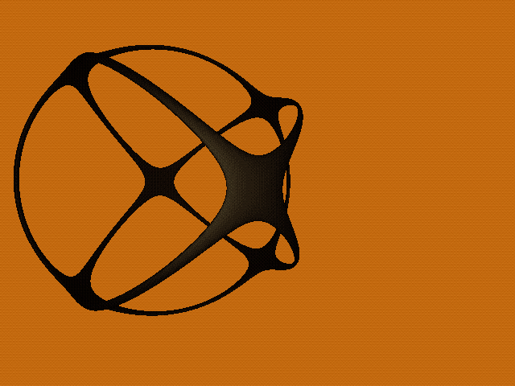

```glsl
float w = 1.0f;
  float t = 0.01f;
  return length(vec2(p.x * p.y * p.z, length(p) - w)) - t;
}
```

### Generalized Distance Functions - Support for the following Polyhedra — Akleman and Chen via Cupe / Mercury

```glsl
const vec3 GDFVectors[19] = vec3[](
    normalize(vec3(1, 0, 0)),
    normalize(vec3(0, 1, 0)),
    normalize(vec3(0, 0, 1)),

    normalize(vec3(1, 1, 1 )),
    normalize(vec3(-1, 1, 1)),
    normalize(vec3(1, -1, 1)),
    normalize(vec3(1, 1, -1)),

    normalize(vec3(0, 1, PHI+1)),
    normalize(vec3(0, -1, PHI+1)),
    normalize(vec3(PHI+1, 0, 1)),
    normalize(vec3(-PHI-1, 0, 1)),
    normalize(vec3(1, PHI+1, 0)),
    normalize(vec3(-1, PHI+1, 0)),

    normalize(vec3(0, PHI, 1)),
    normalize(vec3(0, -PHI, 1)),
    normalize(vec3(1, 0, PHI)),
    normalize(vec3(-1, 0, PHI)),
    normalize(vec3(PHI, 1, 0)),
    normalize(vec3(-PHI, 1, 0))
  );

  // Version with variable exponent.
  // This is slow and does not produce correct distances, but allows for bulging of objects.
  float fGDF(vec3 p, float r, float e, int begin, int end) {
  	float d = 0;
  	for (int i = begin; i <= end; ++i)
  		d += pow(abs(dot(p, GDFVectors[i])), e);
  	return pow(d, 1/e) - r;
  }

  // Version with without exponent, creates objects with sharp edges and flat faces
  float fGDF(vec3 p, float r, int begin, int end) {
  	float d = 0;
  	for (int i = begin; i <= end; ++i)
  		d = max(d, abs(dot(p, GDFVectors[i])));
  	return d - r;
  }
```

### Gyroid - Here constrained to a sphere of radius 4 — FabriceNeyret2

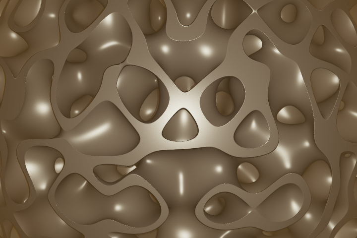

```glsl
float de(vec3 p) {
    float scale = 7.;
    float thickness = 0.05;
    float bias = 0.1;

    p *= scale;
    return (abs(dot(sin(p*.5), cos(p.zxy * 1.23)) - bias) / scale - thickness)*0.55;
  }
```

### Gyroid Torus — dr2

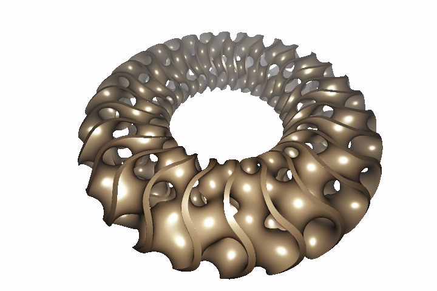

```glsl
float de(vec3 p){
    float rt = 15.;
    float rg = 4.;
    float ws = 0.3;

    p.xz = vec2 (rt * atan (p.z, - p.x), length (p.xz) - rt);
    p.yz = vec2 (rg * atan (p.z, - p.y), length (p.yz) - rg);
    return .6* max(abs(dot(sin(p), cos(p).yzx)) - ws, abs(p.z) - .5*PI);
  }
```

### Hexagonal Prism — Cupe / Mercury

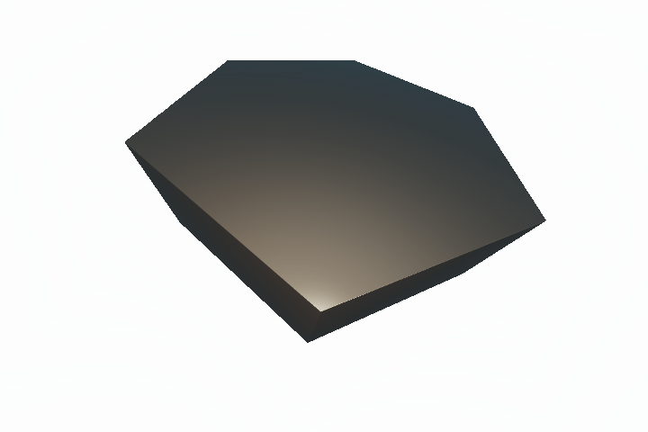

```glsl
Circumcircle Variant

  float de(vec3 p){
    float width = 1.;
    float height = 1.;

    return max(q.y - height, max(q.x*sqrt(3)*0.5 + q.z*0.5, q.z) - width);
  }

Incircle Variant

  float de(vec3 p){
    float width = 1.;
    float height = 1.;
    vec3 q = abs(p);

    return max(q.y - height, max(q.x*sqrt(3)*0.5 + q.z*0.5, q.z) - (width*sqrt(3)*0.5));
  }
```

### Icosahedron — Unknown

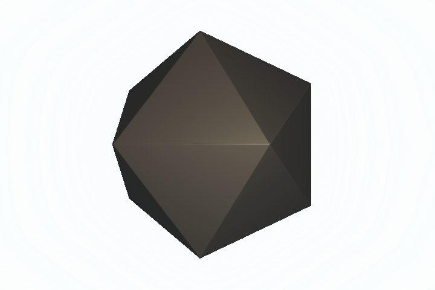

```glsl
float de(vec3 p){
    float r = 1.; // radius

    return fGDF(p, r, 3, 12);
  }

With Exponent

  float de(vec3 p){
    float r = 1.; // radius
    float e = 1.; // exponent

    return fGDF(p, r, e, 3, 12);
  }
```

### Icosahedron (Alternative) — tholzer


```glsl
float de(vec3 p){
    float radius = 1.;
    const float q = 2.61803398875;  // Golden Ratio + 1 = (sqrt(5)+3)/2;
    const vec3 n1 = normalize(vec3(q,1,0));
    const vec3 n2 = vec3(0.57735026919);  // = sqrt(3)/3);

    p = abs(p / radius);
    float a = dot(p, n1.xyz);
    float b = dot(p, n1.zxy);
    float c = dot(p, n1.yzx);
    float d = dot(p, n2) - n1.x;
    return max(max(max(a,b),c)-n1.x,d) * radius;
  }
```

### Infinite cross shape — tholzer

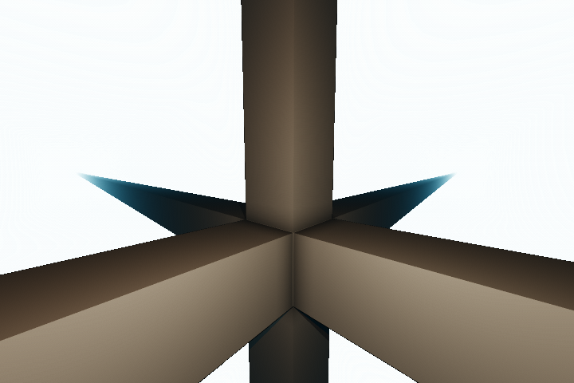

```glsl
float de(vec3 p){
    float s = 0.2; // size of the cross members
    float da = max (abs(p.x), abs(p.y));
    float db = max (abs(p.y), abs(p.z));
    float dc = max (abs(p.z), abs(p.x));
    return min(da,min(db,dc)) - s;
  }
```

### Infinite Cylinder - perpendicular to xz plane — iq

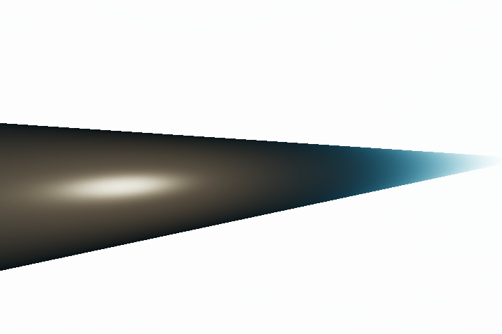

```glsl
float de(vec3 p){
    float radius = 1.;
    return length(p.xz)-radius; // xy, yz for other directions
  }
```

### Link - elongated torus — iq

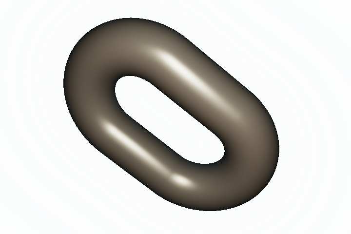

```glsl
float de(vec3 p){
    float le = 0.13;  // length
    float r1 = 0.20;  // major radius
    float r2 = 0.09;  // minor radius

    vec3 q = vec3( p.x, max(abs(p.y)-le,0.0), p.z );
    return length(vec2(length(q.xy)-r1,q.z)) - r2;
  }
```

### Octagonal Prism — iq

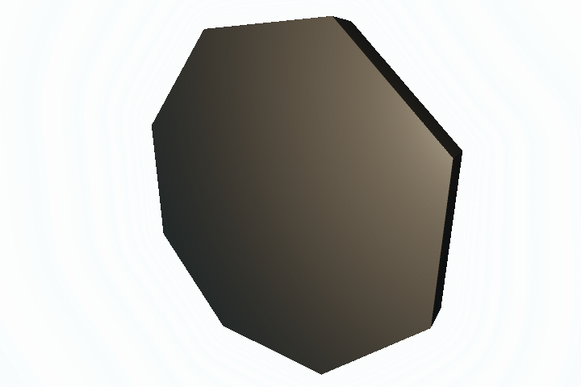

```glsl
float de(vec3 p){
    float r = 2.;   // diameter
    float h = 0.2;  // thickness

    const vec3 k = vec3(-0.9238795325,   // sqrt(2+sqrt(2))/2
                         0.3826834323,   // sqrt(2-sqrt(2))/2
                         0.4142135623 ); // sqrt(2)-1
    // reflections
    p = abs(p);
    p.xy -= 2.0*min(dot(vec2( k.x,k.y),p.xy),0.0)*vec2( k.x,k.y);
    p.xy -= 2.0*min(dot(vec2(-k.x,k.y),p.xy),0.0)*vec2(-k.x,k.y);
    // polygon side
    p.xy -= vec2(clamp(p.x, -k.z*r, k.z*r), r);
    vec2 d = vec2( length(p.xy)*sign(p.y), p.z-h );
    return min(max(d.x,d.y),0.0) + length(max(d,0.0));
  }
```

### Octahedron — Unknown

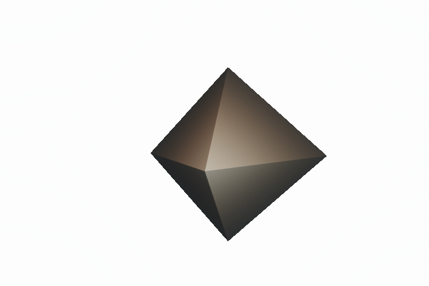

```glsl
float de(vec3 p){
    float r = 1.; // radius

    return fGDF(p, r, 3, 6);
  }

With Exponent

  float de(vec3 p){
    float r = 1.; // radius
    float e = 1.; // exponent

    return fGDF(p, r, e, 3, 6);
  }
```

### Octahedron (Alternative) — iq


```glsl
float de(vec3 p){
    float s = 1.; // size
    p = abs(p);
    float m = p.x+p.y+p.z-s;
    vec3 q;
         if( 3.0*p.x < m ) q = p.xyz;
    else if( 3.0*p.y < m ) q = p.yzx;
    else if( 3.0*p.z < m ) q = p.zxy;
    else return m*0.57735027;

    float k = clamp(0.5*(q.z-q.y+s),0.0,s);
    return length(vec3(q.x,q.y-s+k,q.z-k));
  }

Approximate (cheaper)

  float de( vec3 p){
    float s = 1.;
    p = abs(p);
    return (p.x+p.y+p.z-s)*0.57735027;
  }
```

### Plane — Cupe / Mercury

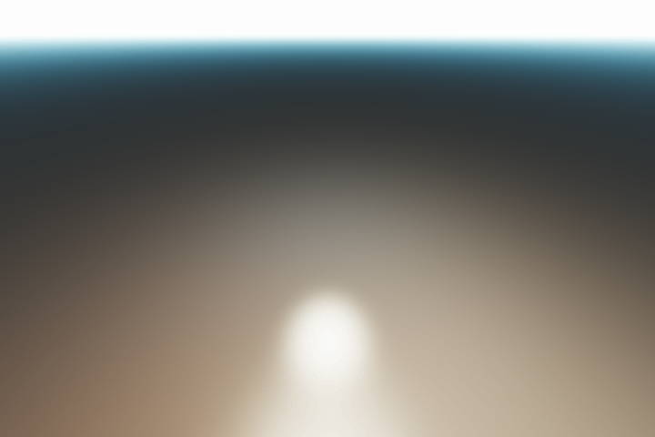

```glsl
float de(vec3 p){
    vec3 n = vec3(0.,1.,0.);       // plane's normal vector
    float distanceFromOrigin = 0.; // position along normal

    return dot(p, n) + distanceFromOrigin;
  }
```

### Rhomboid Prism — iq

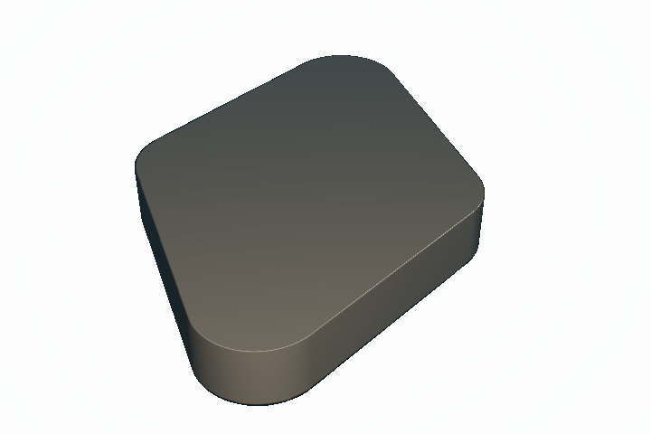

```glsl
float de(vec3 p){
    float la = 0.15; // first axis
    float lb = 0.25; // second axis
    float h  = 0.04; // thickness
    float ra = 0.08; // corner radius

    p = abs(p);
    vec2 b = vec2(la,lb);
    vec2 bb = b-2.0*p.xz;

    float f = clamp((b.x*bb.x-b.y*bb.y)/dot(b,b), -1.0, 1.0 );
    vec2 q = vec2(length(p.xz-0.5*b*vec2(1.0-f,1.0+f))*sign(p.x*b.y+p.z*b.x-b.x*b.y)-ra, p.y-h);
    return min(max(q.x,q.y),0.0) + length(max(q,0.0));
  }
```

### Rounded box - unsigned — iq

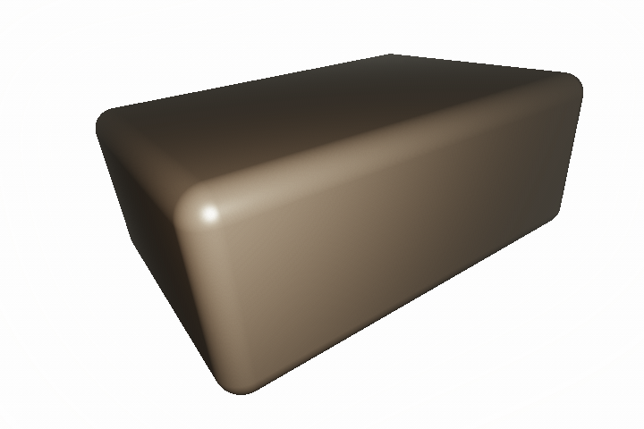

```glsl
float de(vec3 p){
    vec3 b = vec3(1,2,3); // box dimensions
    float r = 0.1;      // rounding radius
    return length(max(abs(p)-b, 0.0))-r;
  }
```

### Rounded Cone - two spheres with convex connection — iq

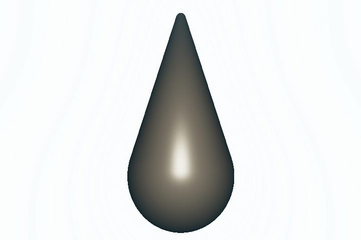

```glsl
Located at origin
  float de(vec3 p){
    float r1 = 1.0;
    float r2 = 0.1;
    float h = 3.; // height
    vec2 q = vec2( length(p.xz), p.y );

    float b = (r1-r2)/h;
    float a = sqrt(1.0-b*b);
    float k = dot(q,vec2(-b,a));

    if( k < 0.0 ) return length(q) - r1;
    if( k > a*h ) return length(q-vec2(0.0,h)) - r2;

    return dot(q, vec2(a,b) ) - r1;
  }

Between two points
  float de(vec3 p){
    vec3 a = vec3(0,0,0);
    vec3 b = vec3(0,3,0);
    float r1 = 1.0; // radius at b
    float r2 = 0.1; // radius at a

    vec3  ba = b - a;
    float l2 = dot(ba,ba);
    float rr = r1 - r2;
    float a2 = l2 - rr*rr;
    float il2 = 1.0/l2;

    vec3 pa = p - a;
    float y = dot(pa,ba);
    float z = y - l2;
    vec3 d2 =  pa*l2 - ba*y;
    float x2 = dot(d2, d2);
    float y2 = y*y*l2;
    float z2 = z*z*l2;

    float k = sign(rr)*rr*rr*x2;
    if( sign(z)*a2*z2 > k ) return  sqrt(x2 + z2)        *il2 - r2;
    if( sign(y)*a2*y2 < k ) return  sqrt(x2 + y2)        *il2 - r1;
                            return (sqrt(x2*a2*il2)+y*rr)*il2 - r1;
  }
```

### Solid Angle — iq

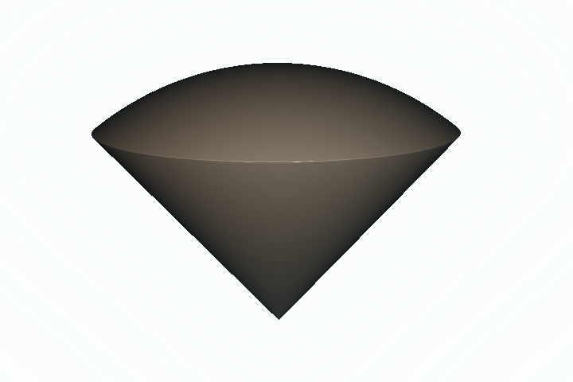

```glsl
float de(vec3 p){
    float angle = 1.; // desired cone angle
    float ra = 1.; // radius of the sphere from which it is cut

    vec2 c = vec2(sin(angle),cos(angle));
    vec2 p0 = vec2( length(p.xz), p.y );
    float l = length(p0) - ra;
    float m = length(p0 - c*clamp(dot(p0,c),0.0,ra) );
    return max(l,m*sign(c.y*p0.x-c.x*p0.y));
  }
```

### Sphere — Cupe / Mercury

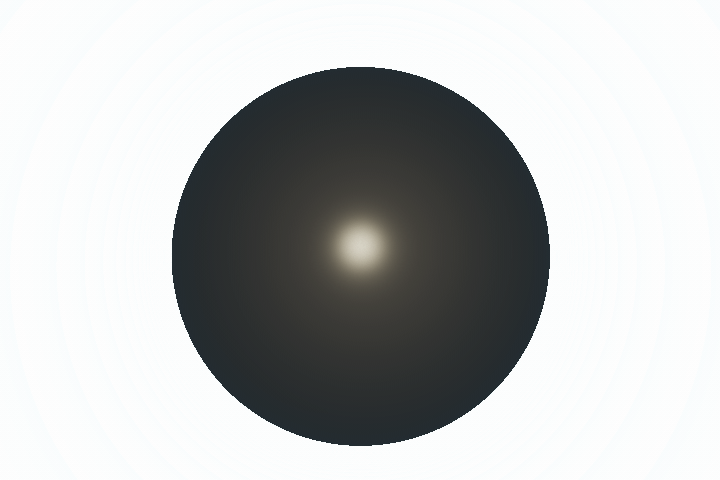

```glsl
float de(vec3 p){
    float r = 1; // the radius
    return length(p) - r;
  }
```

### Square Pyramid — iq

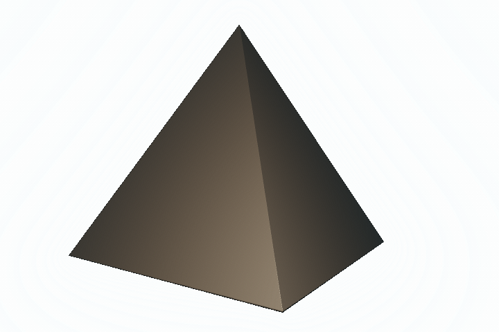

```glsl
float de(vec3 p){
    float h = 1.; // height
    float m2 = h*h + 0.25;

    // symmetry
    p.xz = abs(p.xz);
    p.xz = (p.z>p.x) ? p.zx : p.xz;
    p.xz -= 0.5;

    // project into face plane (2D)
    vec3 q = vec3( p.z, h*p.y - 0.5*p.x, h*p.x + 0.5*p.y);

    float s = max(-q.x,0.0);
    float t = clamp( (q.y-0.5*p.z)/(m2+0.25), 0.0, 1.0 );

    float a = m2*(q.x+s)*(q.x+s) + q.y*q.y;
    float b = m2*(q.x+0.5*t)*(q.x+0.5*t) + (q.y-m2*t)*(q.y-m2*t);

    float d2 = min(q.y,-q.x*m2-q.y*0.5) > 0.0 ? 0.0 : min(a,b);

    // recover 3D and scale, and add sign
    return sqrt( (d2+q.z*q.z)/m2 ) * sign(max(q.z,-p.y));;
  }
```

### Star — kamoshika

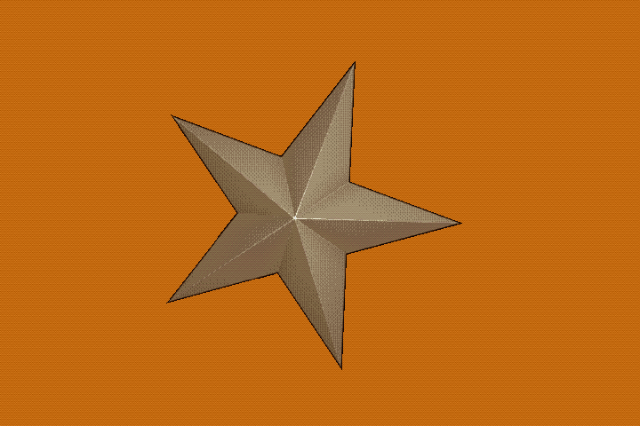

```glsl
float de(vec3 p){
    vec3 Q;
    float i,d=1.;
    Q=p;
    d=.4*M_PI;
    Q.yx*=rotate2D(floor(atan(Q.x,Q.y)/d+.5)*d);
    Q.zx=abs(Q.zx);
    return d=max(Q.z-.06,(Q.y*.325+Q.x+Q.z*1.5)/1.83-.05);
  }
```

### Torus — Cupe / Mercury

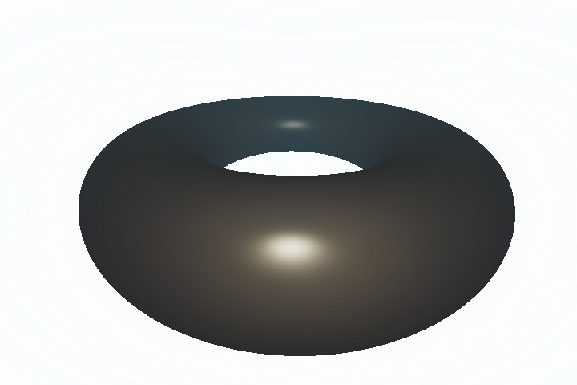

```glsl
float de(vec3 p){
    float smallRadius = 1.; // minor radius
    float largeRadius = 2.; // major radius

    return length(vec2(length(p.xz) - largeRadius, p.y)) - smallRadius;
  }

Alternate method using circular line SDF - subtract minor radius from result

  float de(vec3 p){
    float r = 1.; // major radius
    float l = length(p.xz) - r;

    return length(vec2(p.y, l));
  }
```

### Torus8-2 using iq's change of distance metric (see operator section) — iq

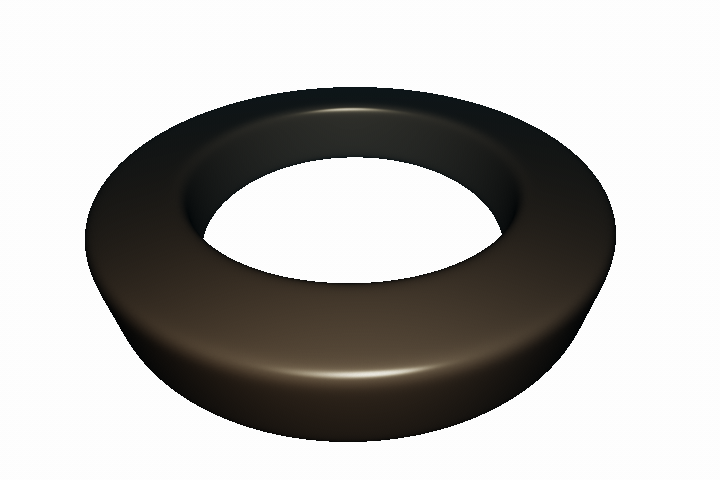

```glsl
float de( vec3 p){
    vec2 t = vec2(1,0.2); // major and minor
    vec2 q = vec2(length2(p.xz)-t.x, p.y);
    return length8(q) - t.y;
  }
```

### Torus8-8 using iq's change of distance metric — iq

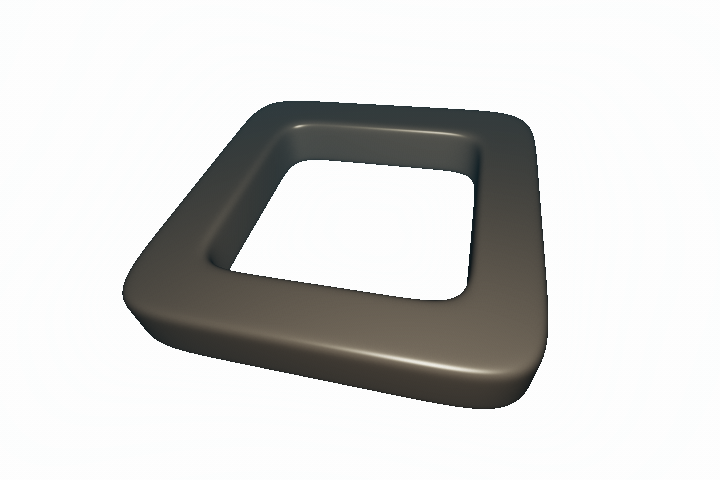

```glsl
float de( vec3 p){
    vec2 t = vec2(1,0.2); // major and minor
    vec2 q = vec2(length2(p.xz)-t.x, p.y);
    return length8(q) - t.y;
  }
```

### Truncated Icosahedron — Unknown

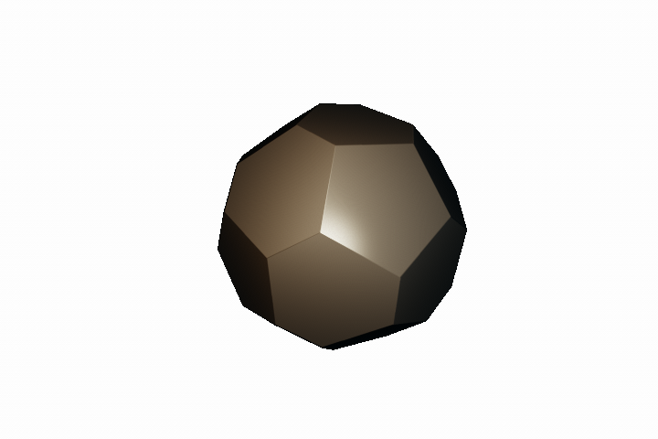

```glsl
float de(vec3 p){
    float r = 1.; // radius

    return fGDF(p, r, 3, 18);
  }

With Exponent

  float de(vec3 p){
    float r = 1.; // radius
    float e = 1.; // exponent

    return fGDF(p, r, e, 3, 18);
  }
```

### Truncated Octahedron — Unknown

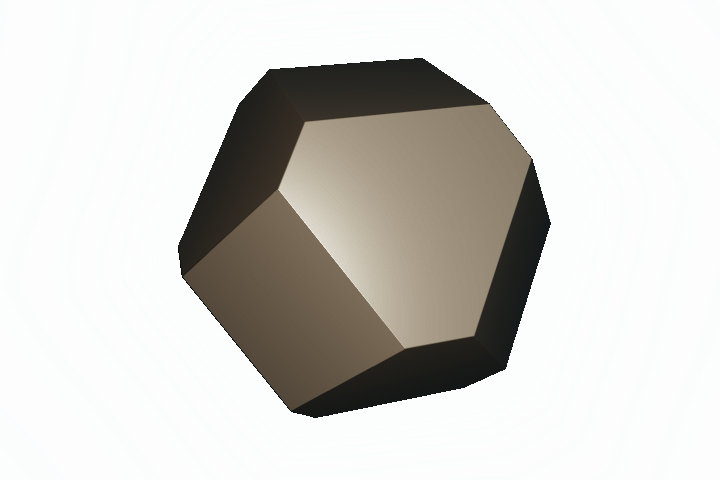

```glsl
float de(vec3 p){
    float r = 1.; // radius

    return fGDF(p, r, 0, 6);
  }

With Exponent

  float de(vec3 p){
    float r = 1.; // radius
    float e = 1.; // exponent

    return fGDF(p, r, e, 0, 6);
  }
```

### Unsigned distance to quad — iq

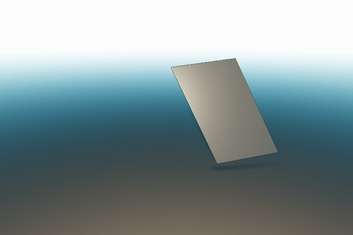

```glsl
float dot2( in vec3 v ) { return dot(v,v); }
  float udQuad( in vec3 v1, in vec3 v2, in vec3 v3, in vec3 v4, in vec3 p )
  {
    // handle ill formed quads
    if( dot( cross( v2-v1, v4-v1 ), cross( v4-v3, v2-v3 )) < 0.0 )
    {
        vec3 tmp = v3;
        v3 = v4;
        v4 = tmp;
    }

    vec3 v21 = v2 - v1; vec3 p1 = p - v1;
    vec3 v32 = v3 - v2; vec3 p2 = p - v2;
    vec3 v43 = v4 - v3; vec3 p3 = p - v3;
    vec3 v14 = v1 - v4; vec3 p4 = p - v4;
    vec3 nor = cross( v21, v14 );

    return sqrt( (sign(dot(cross(v21,nor),p1)) +
                  sign(dot(cross(v32,nor),p2)) +
                  sign(dot(cross(v43,nor),p3)) +
                  sign(dot(cross(v14,nor),p4))<3.0)
                  ?
                  min( min( dot2(v21*clamp(dot(v21,p1)/dot2(v21),0.0,1.0)-p1),
                            dot2(v32*clamp(dot(v32,p2)/dot2(v32),0.0,1.0)-p2) ),
                       min( dot2(v43*clamp(dot(v43,p3)/dot2(v43),0.0,1.0)-p3),
                            dot2(v14*clamp(dot(v14,p4)/dot2(v14),0.0,1.0)-p4) ))
                  :
                  dot(nor,p1)*dot(nor,p1)/dot2(nor) );
  }
```

### Unsigned distance to triangle — iq

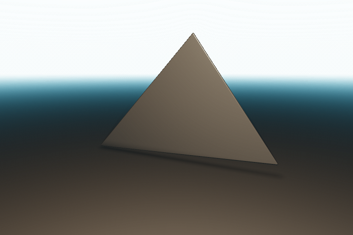

```glsl
float dot2( in vec3 v ) { return dot(v,v); }
  float de( in vec3 v1, in vec3 v2, in vec3 v3, in vec3 p )
  {
    // prepare data
    vec3 v21 = v2 - v1; vec3 p1 = p - v1;
    vec3 v32 = v3 - v2; vec3 p2 = p - v2;
    vec3 v13 = v1 - v3; vec3 p3 = p - v3;
    vec3 nor = cross( v21, v13 );

    return sqrt( // inside/outside test
                 (sign(dot(cross(v21,nor),p1)) +
                  sign(dot(cross(v32,nor),p2)) +
                  sign(dot(cross(v13,nor),p3))<2.0)
                  ?
                  // 3 edges
                  min( min(
                  dot2(v21*clamp(dot(v21,p1)/dot2(v21),0.0,1.0)-p1),
                  dot2(v32*clamp(dot(v32,p2)/dot2(v32),0.0,1.0)-p2) ),
                  dot2(v13*clamp(dot(v13,p3)/dot2(v13),0.0,1.0)-p3) )
                  :
                  // 1 face
                  dot(nor,p1)*dot(nor,p1)/dot2(nor) );
  }
```

### Wavy sphere — tholzer

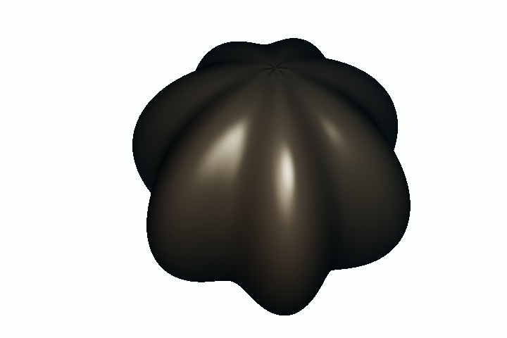

```glsl
float de(vec3 p){
    float radius = .3;    // radius of sphere
    int waves = 7;        // number of waves
    float waveSize = 0.4; // displacement of waves

    //bounding Sphere
    float d = length(p) - radius*2.2;
    if(d > 0.0) return 0.2;

    // deformation of radius
    d = waveSize * (radius*radius-(p.y*p.y));
    radius += d * cos(atan(p.x,p.z) * float(waves));
    return 0.5*(length(p) - radius);
  }
```

## Operators (1 entries)

### WIP — WIP

## Fractals (339 entries)

### #define D (dot(sin(Q),cos(Q.yzx))+1.3) — kamoshika

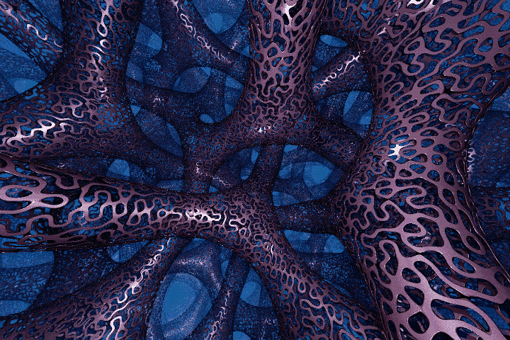

```glsl
float de(vec3 p){
  	vec3 Q;
  	float i,d=1.;
  	Q=p, d=D, Q.x+=M_PI, d=min(d,D);
  	Q.y+=M_PI;
    d=min(d,D);
  	Q*=30.;
  	d=max(abs(d),(abs(D-1.3)-.5)/30.);
  	return d*.6;
  }
```

### #define D d=min(d,length(vec2(length(Q.zx)-.3,Q.y))-.02) — kamoshika

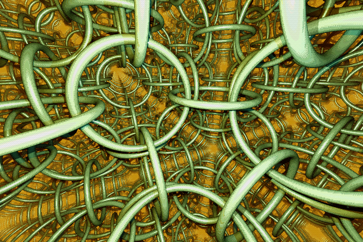

```glsl
float de(vec3 p){
    vec3 Q;
    float i,d=1.;
    Q=abs(fract(p)-.5),
    Q=Q.x>Q.z?Q.zyx:Q,
    d=9.,    D,
    Q-=.5,   D,
    Q.x+=.5,
    Q=Q.xzy, D,
    Q.z+=.5,
    Q=Q.zxy, D;
    return d;
  }
```

### #define D dot(sin(Q),cos(Q.yzx))+1.35 — kamoshika

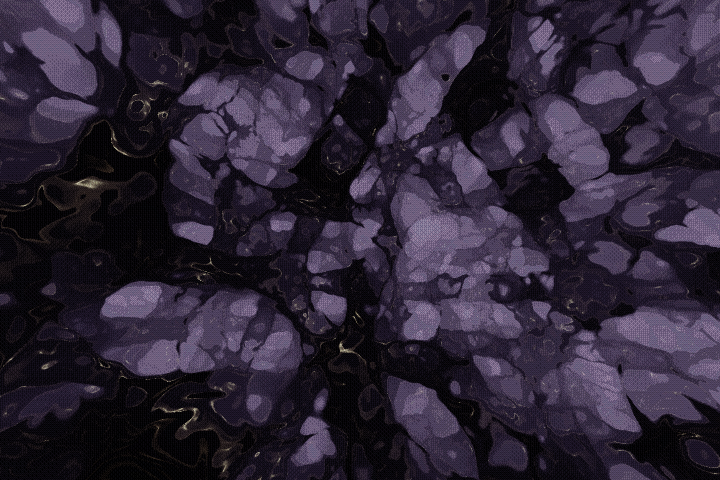

```glsl
float de(vec3 p){
    vec3 Q;
    float d = 0.;
    Q=p,  d=D,  Q.x+=M_PI;
    d=min(d,D), Q.y+=M_PI;
    d=max(abs(min(d,D)+snoise3D(Q*2.)*.05),.01);
    return d*.5;
  }
```

### #define D(p) abs(dot(sin(p), cos(p.yzx))) — kamoshika

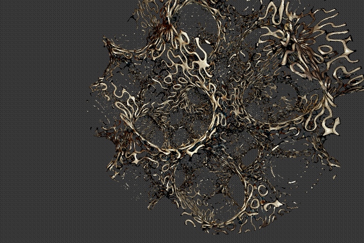

```glsl
float map(vec3 p) {
    float d = length(p) - .8;
    p *= 10.;
    d = max(d, (D(p) - .03) / 10.);
    p *= 10.;
    d = max(d, (D(p) - .3) / 100.);
    return d;
  }
```

### #define fold45(p)(p.y>p.x)?p.yx:p — gaziya5 aka gaz

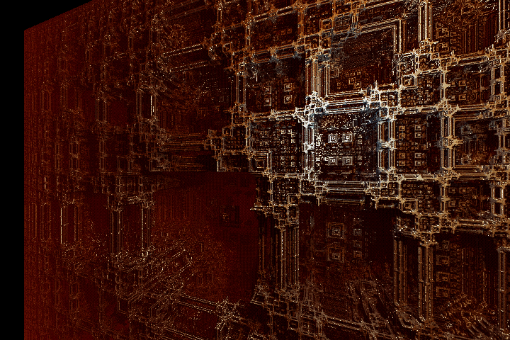

```glsl
float de(vec3 p) {
    float scale = 2.1, off0 = .8, off1 = .3, off2 = .83;
    vec3 off =vec3(2.,.2,.1);
    float s=1.0;
    for(int i = 0;++i<20;) {
      p.xy = abs(p.xy);
      p.xy = fold45(p.xy);
      p.y -= off0;
      p.y = -abs(p.y);
      p.y += off0;
      p.x += off1;
      p.xz = fold45(p.xz);
      p.x -= off2;
      p.xz = fold45(p.xz);
      p.x += off1;
      p -= off;
      p *= scale;
      p += off;
      s *= scale;
    }
    return length(p)/s;
  }
```

### #define pmod(p,n)length(p)*sin(vec2(0.,M_PI/2.)\ — gaziya5 aka gaz

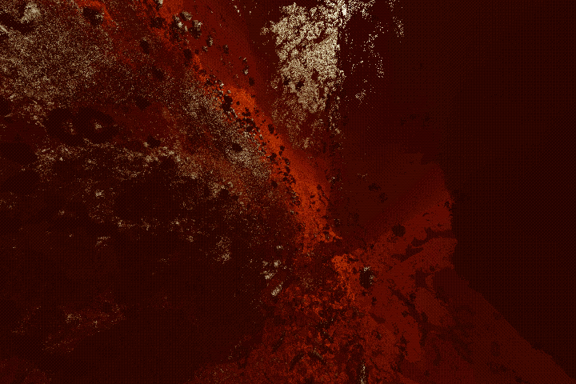

```glsl
+mod(atan(p.y,p.x),2.*M_PI/n)-M_PI/n)
  #define fold(p,v)p-2.*min(0.,dot(p,v))*v;

  float de( vec3 p ){
    float s = 1.0;
    p.z=fract(p.z)-.5;
    for(int i=0;i<20;i++){ // expensive
      p.y += .15;
      p.xz = abs(p.xz);
      for(int j=0;j<2;j++){
        p.xy = pmod(p.xy,8.);
        p.y -= .18;
      }
      p.xy = fold(p.xy,normalize(vec2(1,-.8)));
      p.y = -abs(p.y);
      p.y += .4;
      p.yz = fold(p.yz,normalize(vec2(3,-1)));
      p.x -= .47;
      p.yz = fold(p.yz,normalize(vec2(2,-7)));
      p -= vec3(1.7,.4,0);
      float r2= 3.58/dot(p,p);
      p *= r2;
      p += vec3(1.8,.7,.0);
      s *= r2;
    }
    return length(p)/s;
  }
```

### #define R(p,a,r)mix(a*dot(p,a),p,cos(r))+sin(r)*cross(p,a) — gaziya5 aka gaz

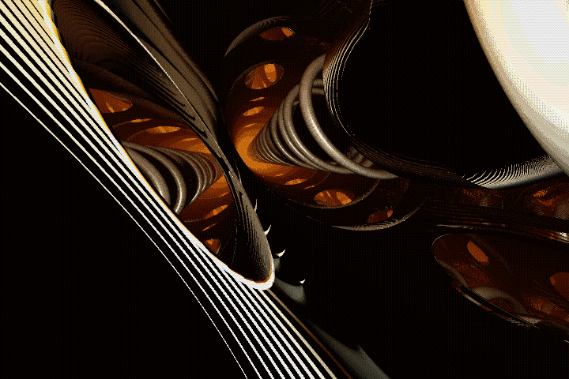

```glsl
#define H(h)cos((h)*6.3+vec3(0,23,21))*.5+.5
  float deee(vec3 p){
    float i=0.,g=0.,e,s,a;
    p=R(p,vec3(1),1.2);
    p=mod(p,2.)-1.;
    p.xy=vec2(dot(p.xy,p.xy),length(p.xy)-1.); // interesting
    s=3.;
    for(int i=0;i++<5;){
        p=vec3(10,2,1)-abs(p-vec3(10,5,1));
        s*=e=12./clamp(dot(p,p),.2,8.);
        p=abs(p)*e;
    }
    return min(length(p.xz),p.y)/s+.001;
  }
```

### #define rot(a) mat2(cos(a),sin(a),-sin(a),cos(a)) — gaziya5 aka gaz

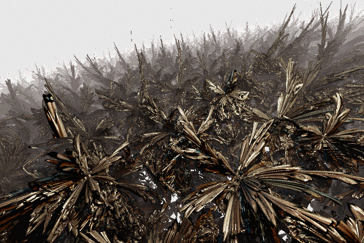

```glsl
float hash(float x){
    return fract(sin(x*234.123+156.2));
  }
  float lpNorm(vec3 p, float n){
    p = pow(abs(p), vec3(n));
    return pow(p.x+p.y+p.z, 1.0/n);
  }
  float de(vec3 p){
    vec2 id=floor(p.xz);
    p.xz=mod(p.xz,1.)-.5;
    p.y=abs(p.y)-.5;
    p.y=abs(p.y)-.5;
    p.xy*=rot(hash(dot(id,vec2(12.3,46.7))));
    p.yz*=rot(hash(dot(id,vec2(32.9,76.2))));
    float s = 1.;
    for(int i = 0; i < 6; i++) {
      float r2=1.2/pow(lpNorm(p.xyz, 5.0),1.5);
      p-=.1; p*=r2; s*=r2; p=p-2.*round(p/2.);
    }
    return .6*dot(abs(p),normalize(vec3(1,2,3)))/s-.002;
  }
```

### #define rot(a) mat2(cos(a),sin(a),-sin(a),cos(a)) — gaziya5 aka gaz

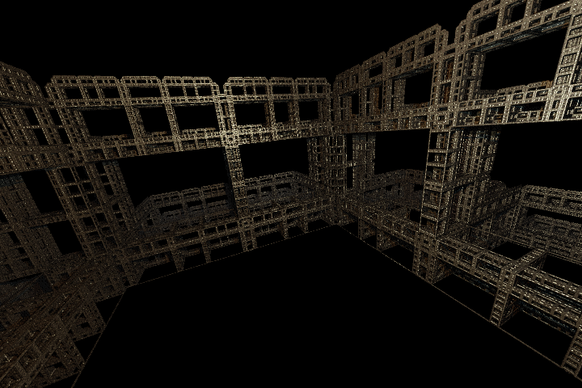

```glsl
float de(vec3 p){
    for(int j=0;++j<8;)
      p.z-=.3,
      p.xz=abs(p.xz),
      p.xz=(p.z>p.x)?p.zx:p.xz,
      p.xy=(p.y>p.x)?p.yx:p.xy,
      p.z=1.-abs(p.z-1.),
      p=p*3.-vec3(10,4,2);

    return length(p)/6e3-.001;
  }
```

### #define rot(a) mat2(cos(a),sin(a),-sin(a),cos(a)) — gaziya5 aka gaz

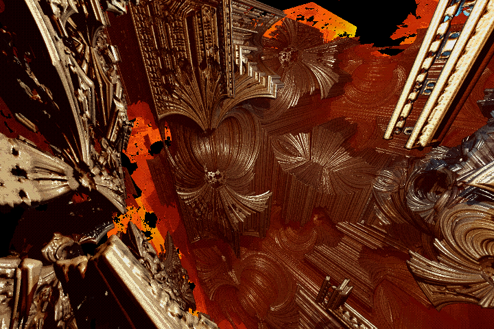

```glsl
float de(vec3 p){
    p=abs(p)-3.;
    if(p.x < p.z)p.xz=p.zx;
    if(p.y < p.z)p.yz=p.zy;
    if(p.x < p.y)p.xy=p.yx;
    float s=2.; vec3 off=p*.5;
    for(int i=0;i<12;i++){
      p=1.-abs(p-1.);
      float k=-1.1*max(1.5/dot(p,p),1.5);
      s*=abs(k); p*=k; p+=off;
      p.zx*=rot(-1.2);
    }
    float a=2.5;
    p-=clamp(p,-a,a);
    return length(p)/s;
  }
```

### #define rot(a)mat2(cos(a),sin(a),-sin(a),cos(a)) — gaziya5 aka gaz

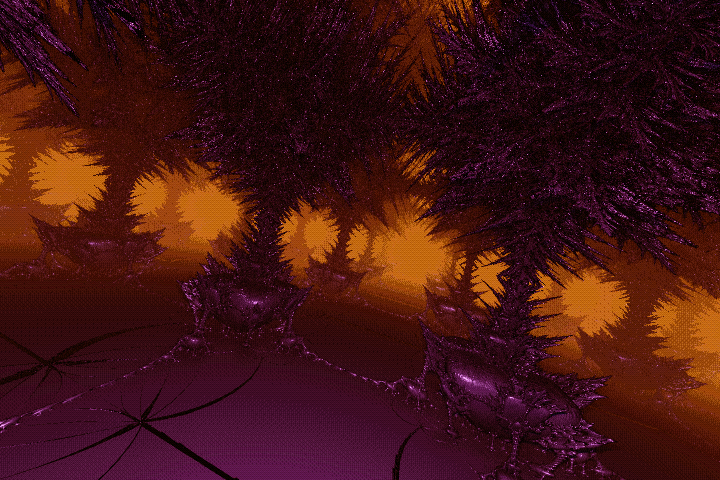

```glsl
float lpNorm(vec3 p, float n){
  	p = pow(abs(p), vec3(n));
  	return pow(p.x+p.y+p.z, 1.0/max(n,0.001));
  }
  float map(vec3 p){
    vec3 q=p;
  	float s = 2.5;
  	for(int i = 0; i < 10; i++) {
      p=mod(p-1.,2.)-1.;
  	float r2=1.1/max(pow(lpNorm(abs(p),2.+q.y*10.),1.75), 0.001);
    	p*=r2;
    	s*=r2;
      p.xy*=rot(.001);
    }
    return q.y>1.3?length(p)/max(s,0.001):abs(p.y)/max(s,0.001);
  }
```

### #define sabs1(p)sqrt((p)*(p)+1e-1) — gaziya5 aka gaz

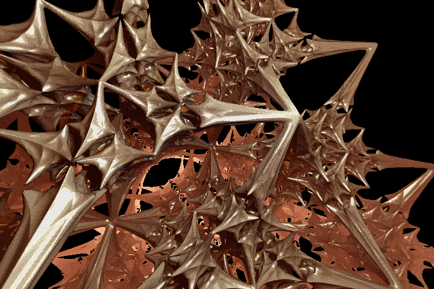

```glsl
#define sabs2(p)sqrt((p)*(p)+1e-3)
  float de( vec3 p ){
    float s=2.; p=abs(p);
    for (int i=0; i<4; i++){
      p=1.-sabs2(p-1.);
      float r=-9.*clamp(max(.2/pow(min(min(sabs1(p.x),
        sabs1(p.y)),sabs1(p.z)),.5), .1), 0., .5);
      s*=r; p*=r; p+=1.;
    }
    s=abs(s); float a=2.;
    p-=clamp(p,-a,a);
    return length(p)/s-.01;
  }
```

### #define TAUg atan(1.)*8. — gaziya5 aka gaz

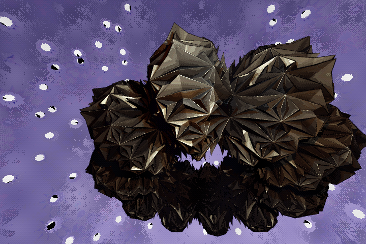

```glsl
vec2 pmodg(vec2 p, float n){
    float a=mod(atan(p.y, p.x),TAUg/n)-.5 *TAUg/n;
    return length(p)*vec2(sin(a),cos(a));
  }

  float de( vec3 p ){
    for(int i=0;i<4;i++){
      p.xy = pmodg(p.xy,10.);  p.y-=2.;
      p.yz = pmodg(p.yz, 12.); p.z-=10.;
    }
    return dot(abs(p),normalize(vec3(13,1,7)))-.7;
  }
```

### #define X(V)d=min(d,length(V)-.13), — kamoshika

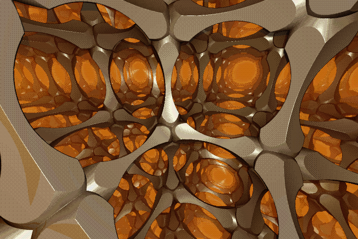

```glsl
float deee(vec3 p){
    vec3 R=p,Q;
    float d = 1.;
    Q=fract(R)-.5,
    X(Q.xy)
    X(Q.yz)
    X(Q.zx)
    d=max(d,.68-length(fract(R-.5)-.5));
    return d;
  }
```

### // highly varied domain - take a look around — unknown

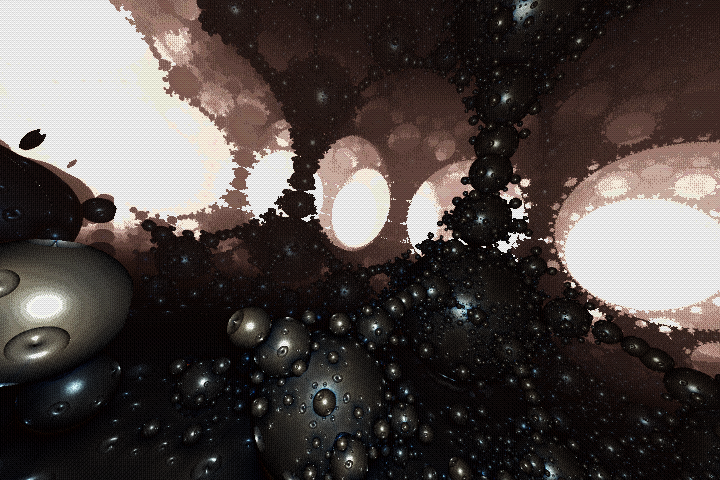

```glsl
float de( vec3 p ){
    p = p.xzy;
    vec3 cSize = vec3(1., 1., 1.3);
    float scale = 1.;
    for( int i=0; i < 12; i++ ){
      p = 2.0*clamp(p, -cSize, cSize) - p;
      float r2 = dot(p,p);
      float k = max((2.)/(r2), .027);
      p *= k; scale *= k;
    }
    float l = length(p.xy);
    float rxy = l - 4.0;
    float n = l * p.z;
    rxy = max(rxy, -(n) / 4.);
    return (rxy) / abs(scale);
  }
```

### // highly varied domain - take a look around — unknown

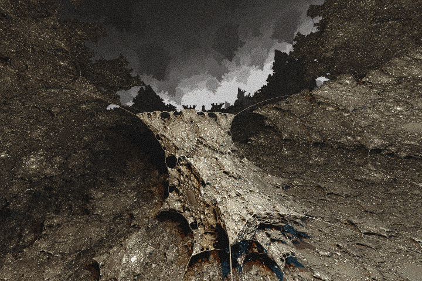

```glsl
float de( vec3 p ){
    p = p.xzy;
    vec3 cSize = vec3(1., 1., 1.3);
    float scale = 1.;
    for( int i=0; i < 12; i++ ){
      p = 2.0*clamp(p, -cSize, cSize) - p;
      float r2 = dot(p,p+sin(p.z*.3));
      float k = max((2.)/(r2), .027);
      p *= k;  scale *= k;
    }
    float l = length(p.xy);
    float rxy = l - 4.0;
    float n = l * p.z;
    rxy = max(rxy, -(n) / 4.);
    return (rxy) / abs(scale);
  }
```

### // highly varied domain - take a look around — unknown

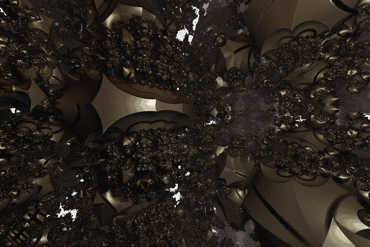

```glsl
float de( vec3 p ){
    vec3 CSize = vec3(1., 1.7, 1.);
    p = p.xzy;
    float scale = 1.1;
    for( int i=0; i < 8;i++ ){
      p = 2.0*clamp(p, -CSize, CSize) - p;
      float r2 = dot(p,p);
      float k = max((2.)/(r2), .5);
      p *= k; scale *= k;
    }
    float l = length(p.xy);
    float rxy = l - 1.0;
    float n = l * p.z;
    rxy = max(rxy, (n) / 8.);
    return (rxy) / abs(scale);
  }
```

### // highly varied domain - take a look around — unknown

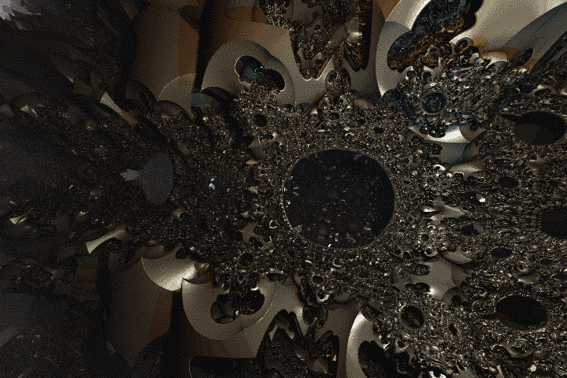

```glsl
float de( vec3 p ){
    vec3 CSize = vec3(1., 1.7, 1.);
    p = p.xzy;
    float scale = 1.1;
    for( int i=0; i < 8;i++ ){
      p = 2.0*clamp(p, -CSize, CSize) - p;
      float r2 = dot(p,p+sin(p.z*.3));
      float k = max((2.)/(r2), .5);
      p *= k; scale *= k;
    }
    float l = length(p.xy);
    float rxy = l - 1.0;
    float n = l * p.z;
    rxy = max(rxy, (n) / 8.);
    return (rxy) / abs(scale);
  }
```

### // very compact menger sponge expression — kamoshika

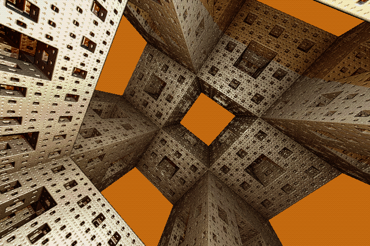

```glsl
float de(vec3 p){
    float a=1.;
    for(int i=0;i<5;i++){ // adjust iteration count here
      p=abs(p)-1./3.;
      if(p.y>p.x)p.xy=p.yx;
      if(p.z>p.y)p.yz=p.zy;
      p.z=abs(p.z);
      p*=3.;
      p-=1.;
      a*=3.;
    }
    return length(max(abs(p)-1.,0.))/a;
  }
```

### float  de(vec3 p){ — gaziya5 aka gaz

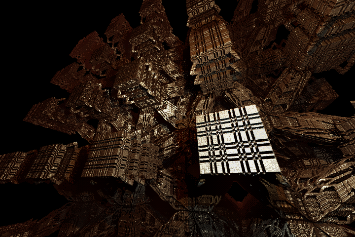

```glsl
float i,g,e=1.,s,l;
    p.z-=9.; s=2.;
    p=abs(p);
    for(int j=0;j++<6;)
      p=-sign(p)*(abs(abs(abs(p)-2.)-1.)-1.),
      p*=l=-2./max(.3,sqrt(min(min(p.x,p.y),p.z))),
      p-=2., s*=l;
    return length(p)/s;
  }
```

### float de( vec3 p ) { — gaziya5 aka gaz

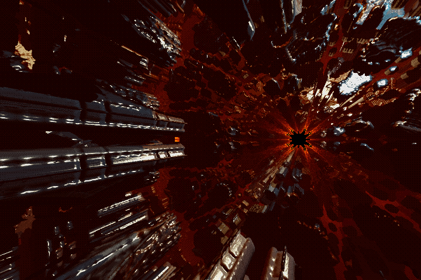

```glsl
#define rot(a) mat2(cos(a),sin(a),-sin(a),cos(a))
    p=abs(p)-2.;
    if(p.x < p.z)p.xz=p.zx;
    if(p.y < p.z)p.yz=p.zy;
    if(p.x < p.y)p.xy=p.yx;
    float s=2.5;
    vec3 off=p*2.8;
    for (float i=0.;i<6.;i++) {
      p=-sign(p)*(abs(abs(abs(p)-2.)-1.)-1.);
      float r=-11.*clamp(.8*max(2.5/dot(p,p),.2),.3,.6);
      s*=r; p*=r; p+=off;
      p.yz*=rot(2.1);
    }
    s=abs(s);
    float a=30.;
    p-=clamp(p,-a,a);
    return length(p)/s;
  }
```

### float de( vec3 p ) { — gaziya5 aka gaz

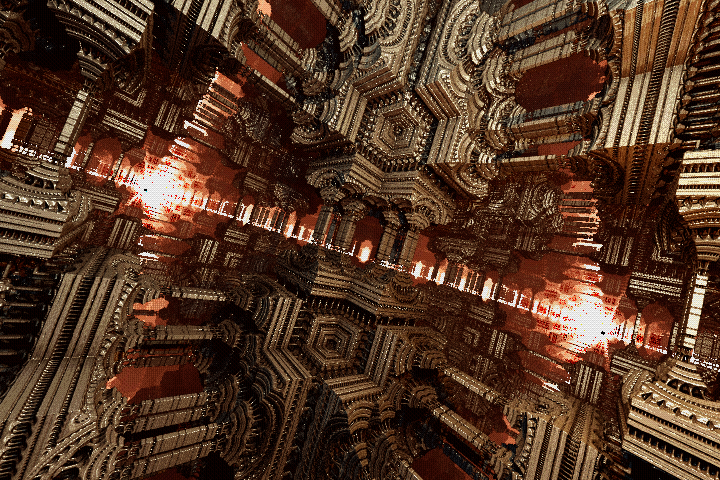

```glsl
float itr=10.,r=0.1;
    p=mod(p-1.5,3.)-1.5;
    p=abs(p)-1.3;
    if(p.x < p.z)p.xz=p.zx;
    if(p.y < p.z)p.yz=p.zy;
    if(p.x < p.y)p.xy=p.yx;
    float s=1.;
    p-=vec3(.5,-.3,1.5);
  	for(float i=0.;i++ < itr;) {
  		float r2=2./clamp(dot(p,p),.1,1.);
  		p=abs(p)*r2;
  		p-=vec3(.7,.3,5.5);
  		s*=r2;
  	}
    return length(p.xy)/(s-r);
  }
```

### float de( vec3 p ) { — gaziya5 aka gaz

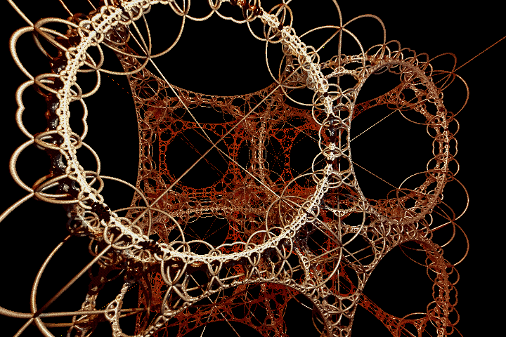

```glsl
float s=2.,r2;
    p=abs(p);
    for(int i=0; i<12;i++) {
      p=1.-abs(p-1.);
      r2=1.2/dot(p,p);
      p*=r2; s*=r2;
    }
    return length(cross(p,normalize(vec3(1))))/s-0.003;
  }
```

### float de( vec3 p ) { — Adapted from code by Kali

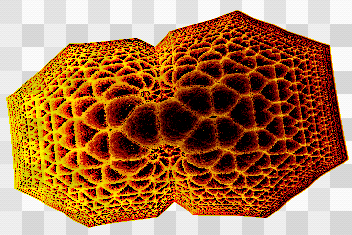

```glsl
float t = 160.0; // designed as a time varying term
    p = p.zxy;
    float a = 1.5 + sin( t * 0.3578 ) * 0.5;
    p.xy = p.xy * mat2( cos( a ), sin( a ), -sin( a ), cos( a ) );
    p.x *= 0.75;
    vec3 ani;
    ani = vec3( sin( t ), sin( t ), cos( t ) ) * 0.6;
    p += sin( p * 3.0 + t * 6.0 ) * 0.04;
    vec3 pp = p;
    float l;
    vec3 rv = vec3( 0.5, -0.05, -1.0 );
    for ( int i = 0; i < 20; i++ ) {
      p.xy = abs( p.xy );
      p = p * 1.25 + vec3( -3.0, -1.5, -0.5 );
      vec3 axis = normalize( rv + ani );
      float angle = ( 40.0 + sin( t ) * 10.0 ) * 0.017;
      p = mix( dot( axis, p ) * axis, p, cos( angle ) ) + cross( axis, p ) * sin( angle ); 
      l = length( p );
    }
    return l * pow( 1.25, -20.0 ) - 0.1;
  }
```

### float de( vec3 p ) { — gaziya5 aka gaz

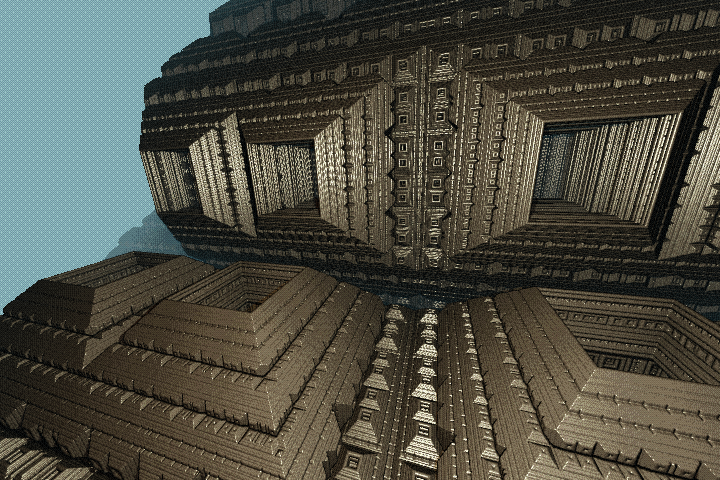

```glsl
#define L(p) p.y>p.x?p=p.yx:p
    vec3 k=vec3(5,2,1);
    p.y+=5.4;
    for(int j=0;++j<8;)
      p.xz=abs(p.xz),
      L(p.xz),
      p.z=1.-abs(p.z-.9),
      L(p.xy),
      p.x-=2.,
      L(p.xy),
      p.y+=1.,
      p=k+(p-k)*3.;
    return length(p)/1e4;
  }
```

### float de( vec3 p ) { — nimitz/yonatan

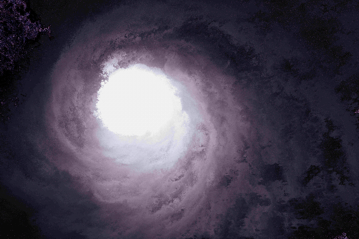

```glsl
float i, e, s, g, k = 0.01;
    p.xy *= mat2( cos( p.z ), sin( p.z ), -sin( p.z ), cos( p.z ) );
    e = 0.3 - dot( p.xy, p.xy );
    for( s = 2.0; s < 2e2; s /= 0.6 ) {
      p.yz *= mat2( cos( s ), sin( s ), -sin( s ), cos( s ) );
      e += abs( dot( sin( p * s * s * 0.2 ) / s, vec3( 1.0 ) ) );
    }
    return e;
  }
```

### float de( vec3 p ){ — adapted from code by jorge2017a1

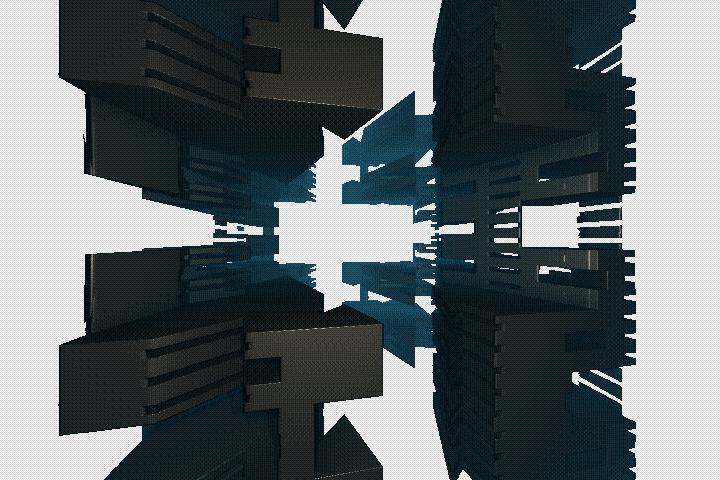

```glsl
vec3  di = abs(p) - vec3(1.);
    float mc = max(di.x, max(di.y, di.z));
    float d =  min(mc,length(max(di,0.0)));
    vec4 res = vec4( d, 1.0, 0.0, 0.0 );

    const mat3 ma = mat3( 0.60, 0.00,  0.80,
                          0.00, 1.00,  0.00,
                          -0.20, 0.00,  0.30 );
    float off = 0.0005;
    float s = 1.0;
    for( int m=0; m<4; m++ ){
      p = ma*(p+off);
      vec3 a = mod( p*s, 2.0 )-1.0;
      s *= 3.0;
      vec3 r = abs(1.0 - 3.0*abs(a));
      float da = max(r.x,r.y);
      float db = max(r.y,r.z);
      float dc = max(r.z,r.x);
      float c = (min(da,min(db,dc))-1.0)/s;
      if( c > d )
        d = c;
    }
    return d;
  }
```

### float de( vec3 p ){ — gaziya5 aka gaz

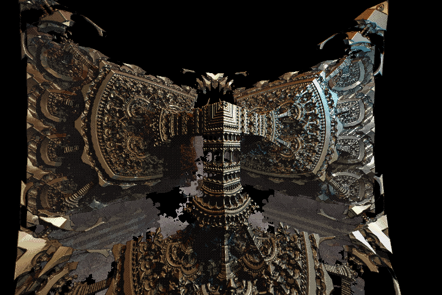

```glsl
p=abs(p)-1.2;
    if(p.x < p.z)p.xz=p.zx;
    if(p.y < p.z)p.yz=p.zy;
    if(p.x < p.y)p.xy=p.yx;
    float s=1.;
    for(int i=0;i<6;i++){
      p=abs(p);
      float r=2./clamp(dot(p,p),.1,1.);
      s*=r; p*=r; p-=vec3(.6,.6,3.5);
    }
    float a=1.5;
    p-=clamp(p,-a,a);
    return length(p)/s;
  }
```

### float de( vec3 p ){ — gaziya5 aka gaz

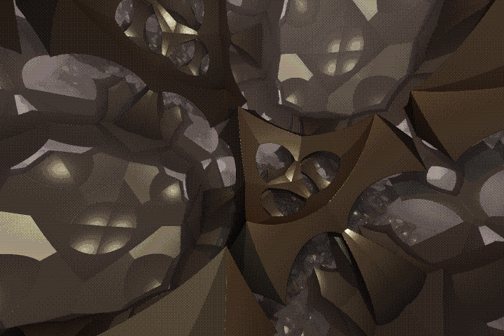

```glsl
// box fold
    p=abs(p)-15.;
    if(p.x < p.z)p.xz=p.zx;
    if(p.y < p.z)p.yz=p.zy;
    if(p.x < p.y)p.xy=p.yx;
    float s=2.;
    for (int i=0; i<8; i++){
      p=-sign(p)*(abs(abs(abs(p)-2.)-1.)-1.);
      float r=-1.55/max(.41,dot(p,p));
      s*=r; p*=r; p-=.5;
    }
    s=abs(s);
    return dot(p,normalize(vec3(1,2,3)))/s;
  }
```

### float de( vec3 p ){ — gaziya5 aka gaz

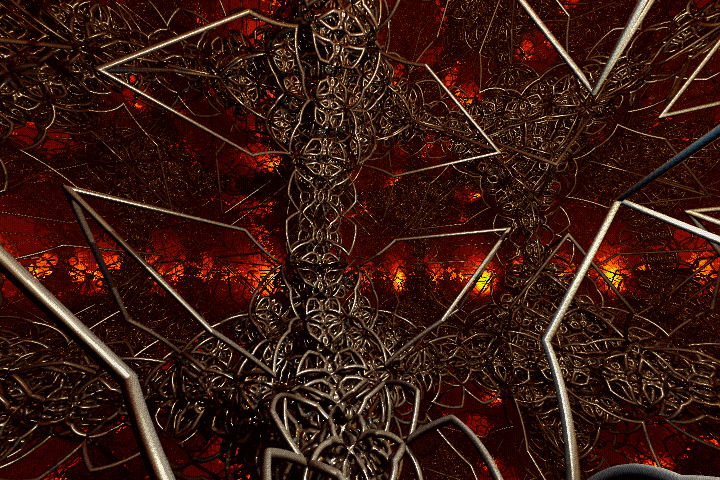

```glsl
float s=3.;
    for(int i = 0; i < 4; i++) {
      p=mod(p-1.,2.)-1.;
      float r=1.2/dot(p,p);
      p*=r; s*=r;
    }
    p = abs(p)-0.8;
    if (p.x < p.z) p.xz = p.zx;
    if (p.y < p.z) p.yz = p.zy;
    if (p.x < p.y) p.xy = p.yx;
    return length(cross(p,normalize(vec3(0,1,1))))/s-.001;
  }
```

### float de( vec3 p ){ — gaziya5 aka gaz

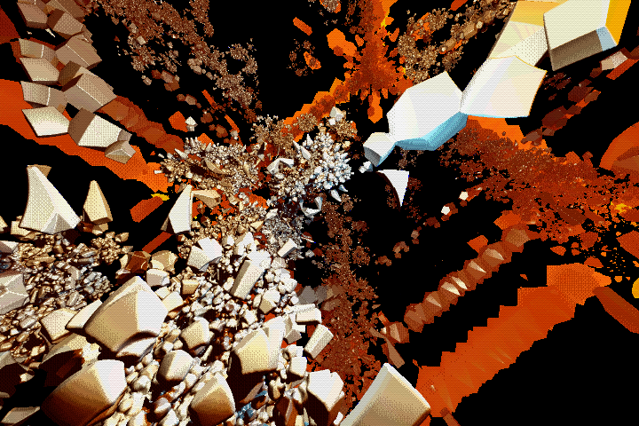

```glsl
float s=3.; p=abs(p);
    for (float i=0.; i<9.; i++){
      p-=clamp(p,-1.,1.)*2.;
      float r=6.62*clamp(.12/min(dot(p,p),1.),0.,1.);
      s*=r; p*=r; p+=1.5;
    }
    s=abs(s); float a=.8;
    p-=clamp(p,-a,a);
    return length(p)/s;
  }
```

### float de( vec3 p ){ — gaziya5 aka gaz

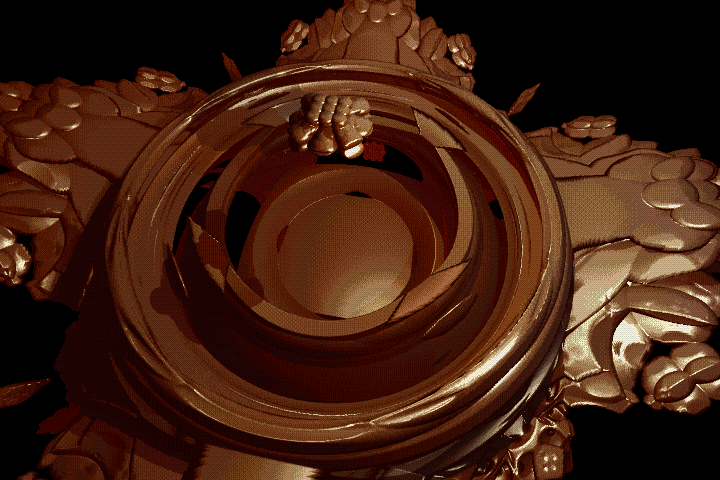

```glsl
float s=12.; p=abs(p);
    vec3 offset=p*3.;
    for (float i=0.; i<5.; i++){
      p=1.-abs(p-1.);
      float r=-5.5*clamp(.3*max(2.5/dot(p,p),.8),0.,1.5);
      p*=r; p+=offset; s*=r;
    }
    s=abs(s); p=abs(p)-3.;
    if(p.x < p.z)p.xz=p.zx;
    if(p.y < p.z)p.yz=p.zy;
    if(p.x < p.y)p.xy=p.yx;
    float a=3.;
    p-=clamp(p,-a,a);
    return length(p.xz)/s;
  }
```

### float de( vec3 p ){ — gaziya5 aka gaz

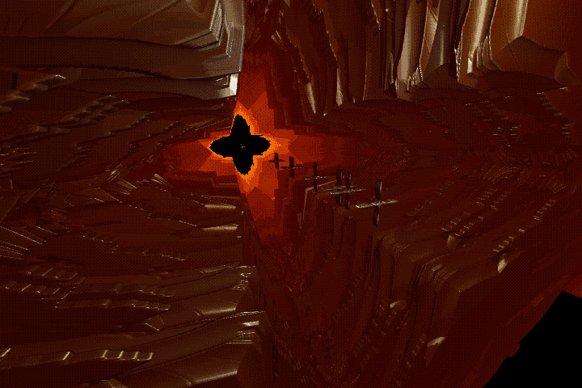

```glsl
#define rot(a) mat2(cos(a),sin(a),-sin(a),cos(a))
    p=abs(p)-3.;
    if(p.x < p.z)p.xz=p.zx;
    if(p.y < p.z)p.yz=p.zy;
    if(p.x < p.y)p.xy=p.yx;
    float s=3.;
    vec3  offset=p*1.2;
    for (float i=0.;i<8.;i++){
      p=1.-abs(p-1.);
      float r=-6.5*clamp(.41*max(1.1/dot(p,p),.8),.0,1.8);
      s*=r; p*=r; p+=offset;
      p.yz*=rot(-1.2);
    }
    s=abs(s);
    float a=20.;
    p-=clamp(p,-a,a);
    return length(p)/s;
  }
```

### float de( vec3 p ){ — gaziya5 aka gaz

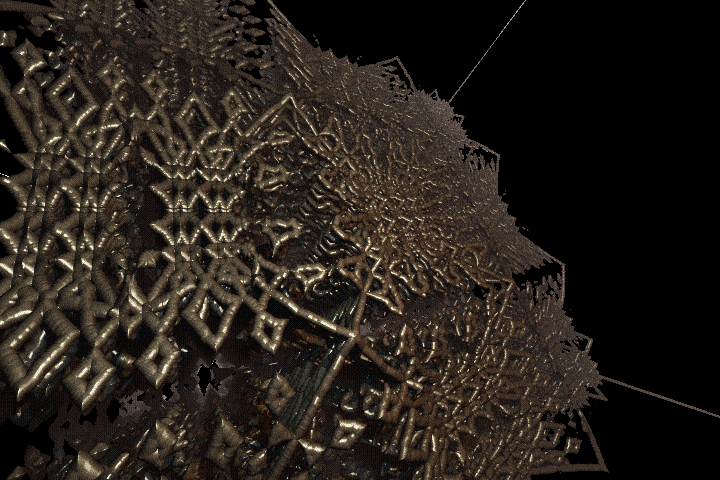

```glsl
p=abs(p);
    float s=3.;
    vec3  offset = p*.5;
    for (float i=0.; i<5.; i++){
      p=1.-abs(p-1.);
      float r=-3.*clamp(.57*max(3./dot(p,p),.9),0.,1.);
      s*=r; p*=r; p+=offset;
    }
    s=abs(s);
    return length(cross(p,normalize(vec3(1))))/s-.008;
  }
```

### float de( vec3 p ){ — gaziya5 aka gaz

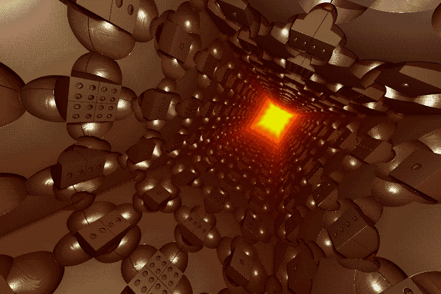

```glsl
p.xy=abs(p.xy)-2.;
    if(p.x < p.y)p.xy=p.yx;
    p.z=mod(p.z,4.)-2.;
    p.x-=3.2; p=abs(p);
    float s=2.;
    vec3 offset= p*1.5;
    for (float i=0.; i<5.; i++){
      p=1.-abs(p-1.);
      float r=-7.5*clamp(.38*max(1.2/dot(p,p),1.),0.,1.);
      s*=r; p*=r; p+=offset;
    }
    s=abs(s);
    float a=100.;
    p-=clamp(p,-a,a);
    return length(p)/s;
  }
```

### float de( vec3 p ){ — gaziya5 aka gaz

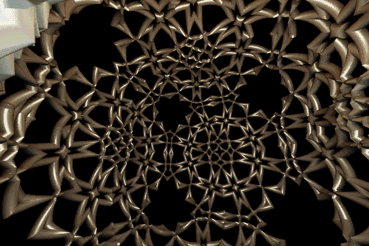

```glsl
#define rot(a) mat2(cos(a),sin(a),-sin(a),cos(a))
    float s=1.;
    for(int i=0;i<3;i++){
      p=abs(p)-.3;
      if(p.x < p.y)p.xy=p.yx;
      if(p.x < p.z)p.xz=p.zx;
      if(p.y < p.z)p.yz=p.zy;
      p.xy=abs(p.xy)-.2;
      p.xy*=rot(.3);
      p.yz*=rot(.3);
      p*=2.; s*=2.;
    }
    p/=s;
    float h=.5;
    p.x-=clamp(p.x,-h,h);
    return length(vec2(length(p.xy)-.5,p.z))-.05;
  }
```

### float de( vec3 p ){ — gaziya5 aka gaz

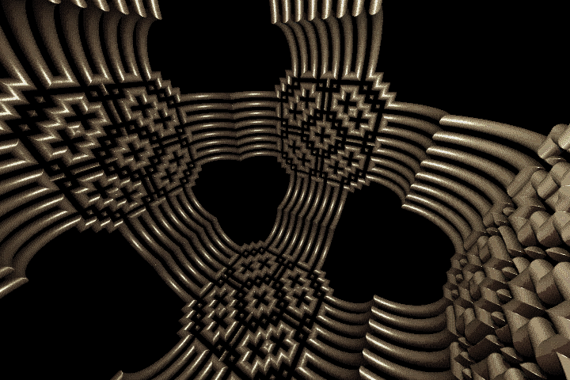

```glsl
float s=1.;
    for(int i=0;i<3;i++){
      p=abs(p)-.3;
      if(p.x < p.y)p.xy=p.yx;
      if(p.x < p.z)p.xz=p.zx;
      if(p.y < p.z)p.yz=p.zy;
      p.xy-=.2; p*=2.; s*=2.;
    }
    p/=s;
    float h=.5;
    p.x-=clamp(p.x,-h,h);
    return length(vec2(length(p.xy)-.5,p.z))-.05;
  }
```

### float de( vec3 p ){ — gaziya5 aka gaz

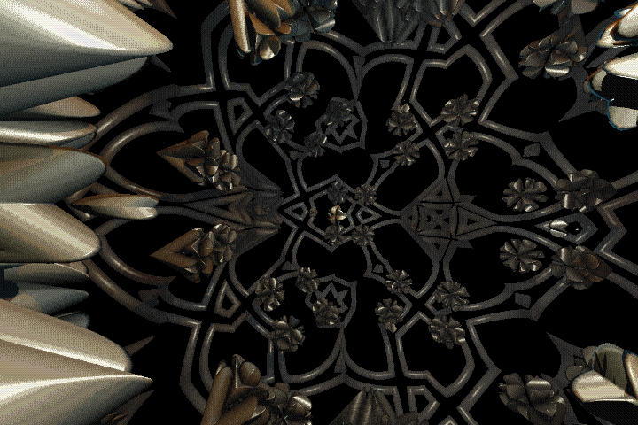

```glsl
#define rot(a) mat2(cos(a),sin(a),-sin(a),cos(a))
    for(int i=0;i<3;i++){
      p=abs(p)-.3;
      if(p.x < p.y)p.xy=p.yx;
      if(p.x < p.z)p.xz=p.zx;
      if(p.y < p.z)p.yz=p.zy;
      p.xy-=.2; p.xy*=rot(.5); p.yz*=rot(.5);
    }
    float h=.5;
    p.x-=clamp(p.x,-h,h);
    return length(vec2(length(p.xy)-.5,p.z))-.05;
  }
```

### float de( vec3 p ){ — gaziya5 aka gaz

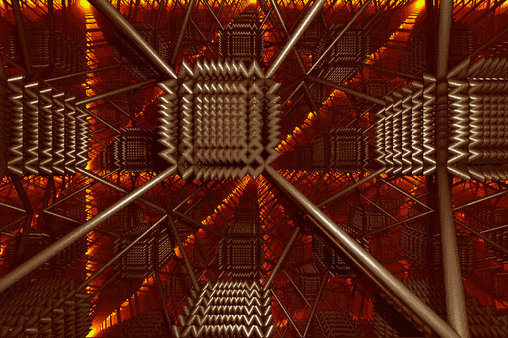

```glsl
p.x-=4.;
    p=mod(p,8.)-4.;
    for(int j=0;j<3;j++){
      p.xy=abs(p.xy)-.3;
      p.yz=abs(p.yz)+.7,
      p.xz=abs(p.xz)-.2;
    }
    return length(cross(p,vec3(.5)))-.1;
  }
```

### float de( vec3 p ){ — gaziya5 aka gaz

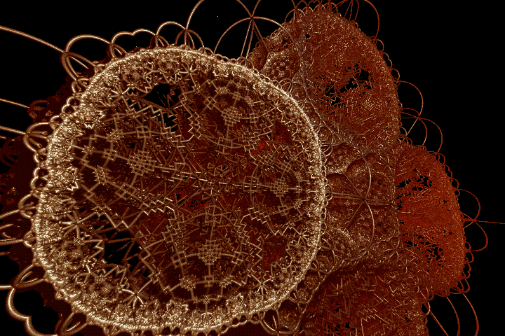

```glsl
float s=2.,r2;
    p=abs(p);
    for(int i=0; i<12;i++) {
      p=1.-abs(p-1.);
      r2=(i%3==1)?1.3:1.3/dot(p,p);
      p*=r2; s*=r2;
    }
    return length(cross(p,normalize(vec3(1))))/s-0.003;
  }
```

### float de( vec3 p ){ — gaziya5 aka gaz

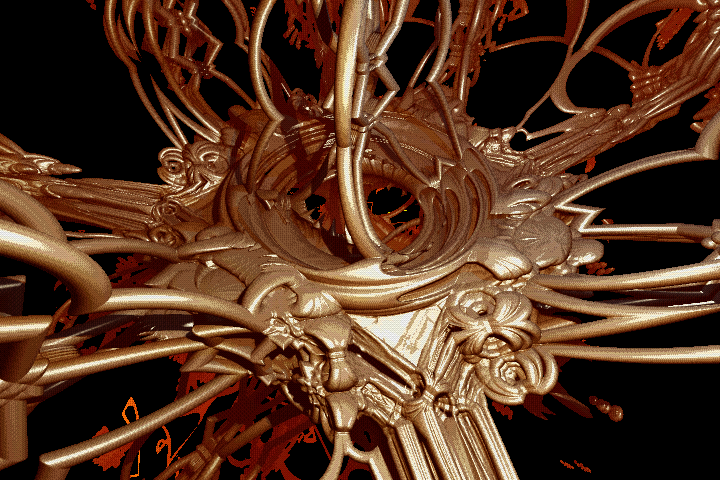

```glsl
float s=4.;
    p=abs(p);
    vec3 off=p*4.6;
    for (float i=0.; i<8.; i++){
      p=1.-abs(abs(p-2.)-1.);
      float r=-13.*clamp(.38*max(1.3/dot(p,p),.7),0.,3.3);
      s*=r; p*=r; p+=off;
    }
    return length(cross(p,normalize(vec3(1,3,3))))/s-.006;
  }
```

### float de( vec3 p ){ — gaziya5 aka gaz

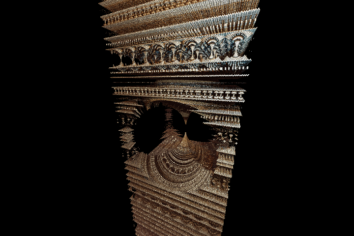

```glsl
p.z-=2.5;
    float s = 3.;
    float e = 0.;
    for(int j=0;j++<8;)
      s*=e=3.8/clamp(dot(p,p),0.,2.),
      p=abs(p)*e-vec3(1,15,1);
    return length(cross(p,vec3(1,1,-1)*.577))/s;
  }
```

### float de( vec3 p ){ — gaziya5 aka gaz

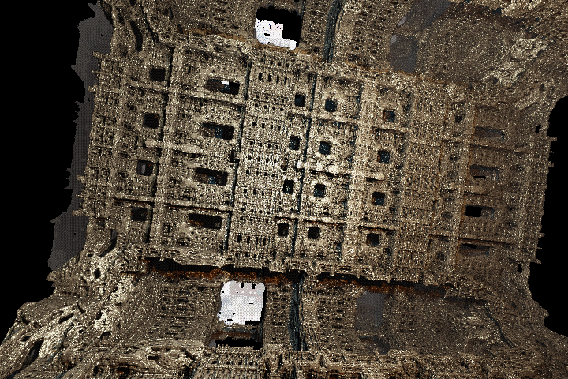

```glsl
float s = 2.;
    float e = 0.;
    for(int j=0;++j<7;)
      p.xz=abs(p.xz)-2.3,
      p.z>p.x?p=p.zyx:p,
      p.z=1.5-abs(p.z-1.3+sin(p.z)*.2),
      p.y>p.x?p=p.yxz:p,
      p.x=3.-abs(p.x-5.+sin(p.x*3.)*.2),
      p.y>p.x?p=p.yxz:p,
      p.y=.9-abs(p.y-.4),
      e=12.*clamp(.3/min(dot(p,p),1.),.0,1.)+
      2.*clamp(.1/min(dot(p,p),1.),.0,1.),
      p=e*p-vec3(7,1,1),
      s*=e;
    return length(p)/s;
  }
```

### float de( vec3 p ){ — gaziya5 aka gaz

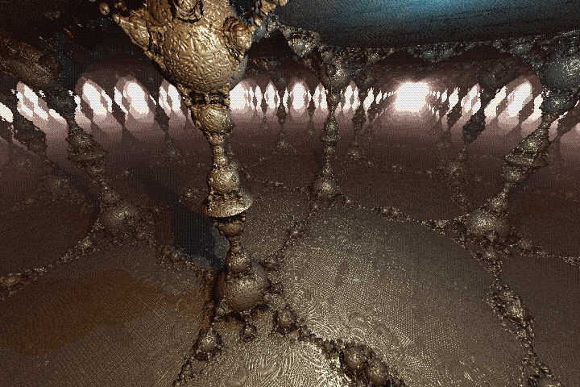

```glsl
float s = 4.;
    for(int i = 0; i < 8; i++) {
      p=mod(p-1.,2.)-1.;
      float r2=(i%3==0)?1.5:1.2/dot(p,p);
      p*=r2; s*=r2;
    }
    vec3 q=p/s;
    q.xz=mod(q.xz-.002,.004)-.002;
    return min(length(q.yx)-.0003,length(q.yz)-.0003);
  }
```

### float de( vec3 p ){ — gaziya5 aka gaz

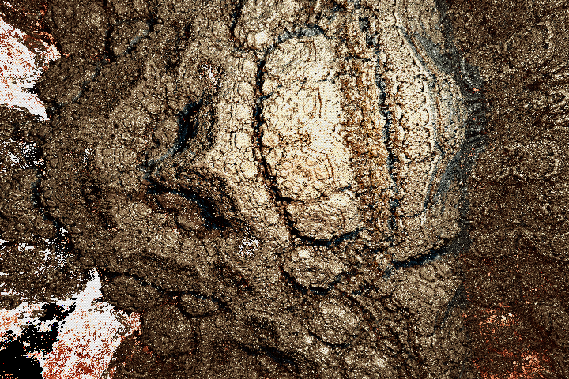

```glsl
p.z-=-1.;
    #define fold(p,v)p-2.*min(0.,dot(p,v))*v;
    float s=3., l=0.;
    for(int i = 0;++i<15;){
      p.xy=fold(p.xy,normalize(vec2(1,-1.3)));
      p.y=-abs(p.y);
      p.y+=.5;
      p.xz=abs(p.xz);
      p.yz=fold(p.yz,normalize(vec2(8,-1)));
      p.x-=.5;
      p.yz=fold(p.yz,normalize(vec2(1,-2)));
      p-=vec3(1.8,.4,.1);
      l = 2.6/dot(p,p);    p*=l;
      p+=vec3(1.8,.7,.2);  s*=l;
    }
    return length(p.xy)/s;
  }
```

### float de( vec3 p ){ — iq

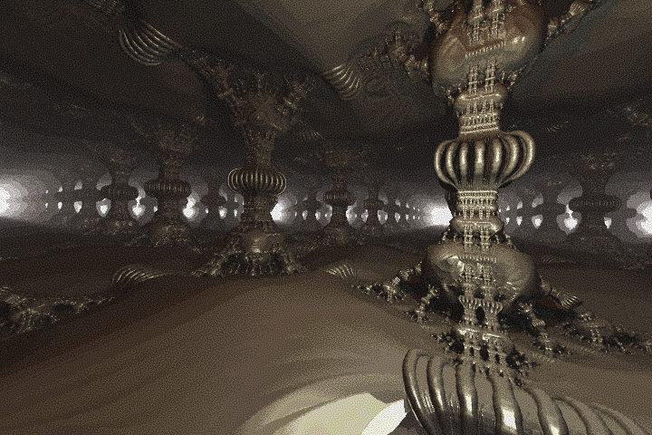

```glsl
float scale = 1.0;
    float orb = 10000.0;
    for( int i=0; i<6; i++ ){
      p = -1.0 + 2.0*fract(0.5*p+0.5);
      p -= sign(p)*0.04; // trick
      float r2 = dot(p,p);
      float k = 0.95/r2;
      p  *= k;  scale *= k;
      orb = min( orb, r2);
    }

    float d1 = sqrt( min( min( dot(p.xy,p.xy),
      dot(p.yz,p.yz) ), dot(p.zx,p.zx) ) ) - 0.02;
    float d2 = abs(p.y);
    float dmi = d2;
    if( d1 < d2 ) dmi = d1;
    return 0.5*dmi/scale;
  }
```

### float de( vec3 p ){ — kamoshika

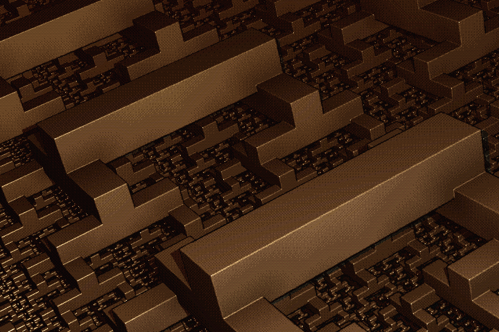

```glsl
vec3 P=p, Q, b=vec3( 4, 2.8, 15 );
    float i, d=1., a;
    Q = mod( P, b ) - b * 0.5;
    d = P.z - 6.0;
    a = 1.3;
    for( int j = 0; j++ < 11; )
      d = min( d, length( max( abs( Q ) - b.zyy / 13.0, 0.0 ) ) / a ),
      Q = vec3( Q.y, abs( Q.x ) - 1.0, Q.z + 0.3 ) * 1.4,
      a *= 1.4;
    return d;
  }
```

### float de( vec3 p0 ){ — unknown

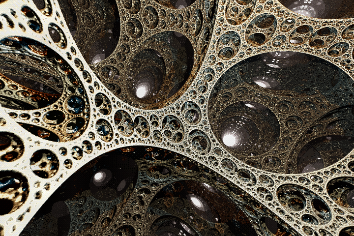

```glsl
vec4 p = vec4(p0, 1.);
    for(int i = 0; i < 8; i++){
      p.xyz = mod(p.xyz-1.,2.)-1.;
      p*=1.4/dot(p.xyz,p.xyz);
    }
    return (length(p.xz/p.w)*0.25);
  }
```

### float de( vec3 p0 ){ — unknown

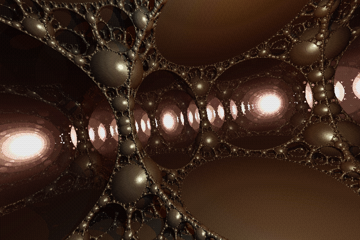

```glsl
vec4 p = vec4(p0, 1.);
    for(int i = 0; i < 8; i++){
      p.xyz = mod(p.xyz-1., 2.)-1.;
      p*=(1.2/dot(p.xyz,p.xyz));
    }
    p/=p.w;
    return abs(p.x)*0.25;
  }
```

### float de( vec3 p0 ){ — unknown

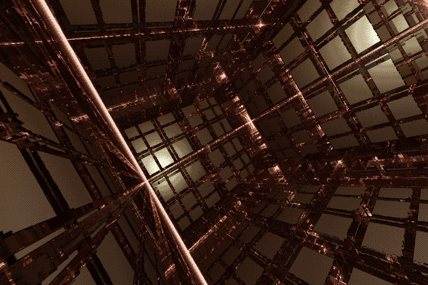

```glsl
vec4 p = vec4(p0, 1.);
    for(int i = 0; i < 8; i++){
      if(p.x > p.z)p.xz = p.zx;
      if(p.z > p.y)p.zy = p.yz;
      p = abs(p);
      p.xyz = mod(p.xyz-1., 2.)-1.;
      p*=1.23;
    }
    p/=p.w;
    return abs(p.y)*0.25;
  }
```

### float de( vec3 pos ) { — unknown

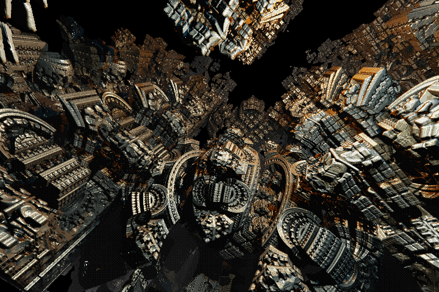

```glsl
#define SCALE 2.8
    #define MINRAD2 .25
    #define scale (vec4(SCALE, SCALE, SCALE, abs(SCALE)) / minRad2)
    float minRad2 = clamp(MINRAD2, 1.0e-9, 1.0);
    float absScalem1 = abs(SCALE - 1.0);
    float AbsScale = pow(abs(SCALE), float(1-10));
    vec4 p = vec4(pos,1);
    vec4 p0 = p;
    for (int i = 0; i < 9; i++)
    {
      p.xyz = clamp(p.xyz, -1.0, 1.0) * 2.0 - p.xyz;
      float r2 = dot(p.xyz, p.xyz);
      p *= clamp(max(minRad2/r2, minRad2), 0.0, 1.0);
      p = p*scale + p0;
    }
    return ((length(p.xyz) - absScalem1) / p.w - AbsScale);
  }
```

### float de(vec3 p) { — avi

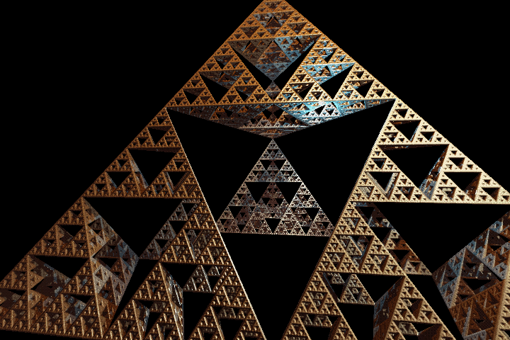

```glsl
const vec3 va = vec3(  0.0,  0.57735,  0.0 );
    const vec3 vb = vec3(  0.0, -1.0,  1.15470 );
    const vec3 vc = vec3(  1.0, -1.0, -0.57735 );
    const vec3 vd = vec3( -1.0, -1.0, -0.57735 );
    float a = 0.0;
    float s = 1.0;
    float r = 1.0;
    float dm;
    vec3 v;
    for(int i=0; i<16; i++) {
      float d, t;
      d = dot(p-va,p-va);              v=va; dm=d; t=0.0;
      d = dot(p-vb,p-vb); if( d < dm ) { v=vb; dm=d; t=1.0; }
      d = dot(p-vc,p-vc); if( d < dm ) { v=vc; dm=d; t=2.0; }
      d = dot(p-vd,p-vd); if( d < dm ) { v=vd; dm=d; t=3.0; }
      p = v + 2.0*(p - v); r*= 2.0;
      a = t + 4.0*a; s*= 4.0;
    }
    return (sqrt(dm)-1.0)/r;
  }
```

### float de(vec3 p) { — Kali

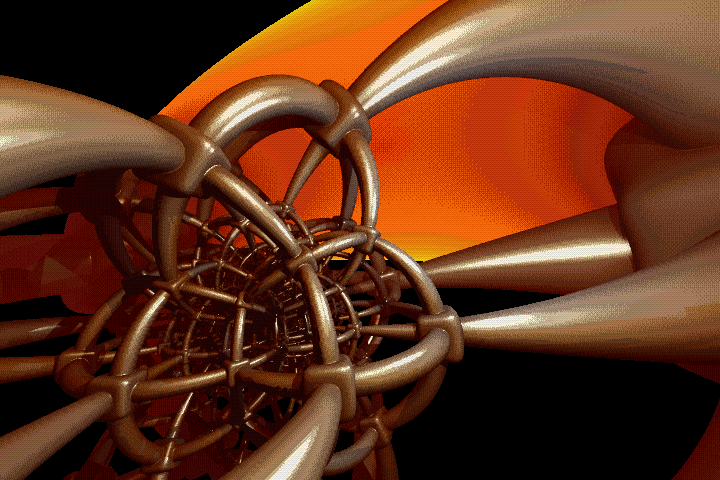

```glsl
const float width=.22;
    const float scale=4.;
    float t=0.2;
    float dotp=dot(p,p);
    p.x+=sin(t*40.)*.007;
    p=p/dotp*scale;
    p=sin(p+vec3(sin(1.+t)*2.,-t,-t*2.));
    float d=length(p.yz)-width;
    d=min(d,length(p.xz)-width);
    d=min(d,length(p.xy)-width);
    d=min(d,length(p*p*p)-width*.3);
    return d*dotp/scale;
  }
```

### float de(vec3 p) { — unknown

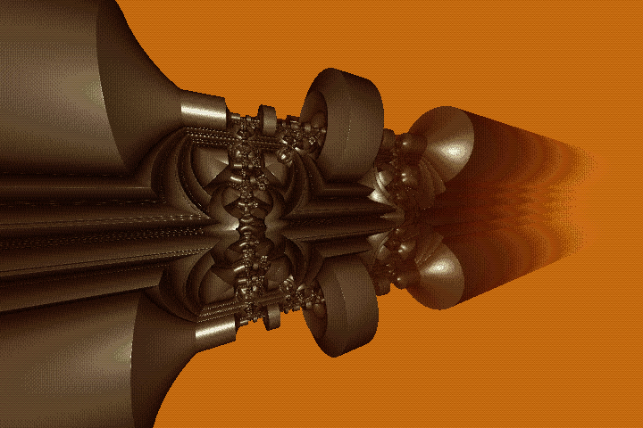

```glsl
vec4 q = vec4(p - 1.0, 1);
    for(int i = 0; i < 5; i++) {
      q.xyz = abs(q.xyz + 1.0) - 1.0;
      q /= clamp(dot(q.xyz, q.xyz), 0.25, 1.0);
      q *= 1.15;
    }
    return (length(q.zy) - 1.2)/q.w;
  }
```

### float de(vec3 p){ — Unknown

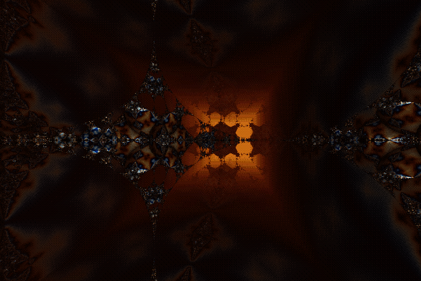

```glsl
float s = 1.;
    escape = 0.;
    float t = 999.;
    for(int i = 0; i < 12; i++){
      p=abs(p);
      p.yz = (p.y > p.z)?p.zy:p.yz;
      p.xz = (p.x > p.z)?p.zx:p.xz;
      p.yx = (p.y > p.x)?p.xy:p.yx;
      s *= 4.0/clamp(dot(p,p),0., 11.);
      p *= 4.0/clamp(dot(p,p), 0., 11.);
      p = vec3(2.,4.,2.)-abs(p-vec3(2.,4.,2.));
      t = min(t, (abs(p.x)/s)*0.76);
      escape += exp(-0.4*dot(p,p));
    }
    return t;
  }
```

### float de(vec3 p){ — adapted from code by alia

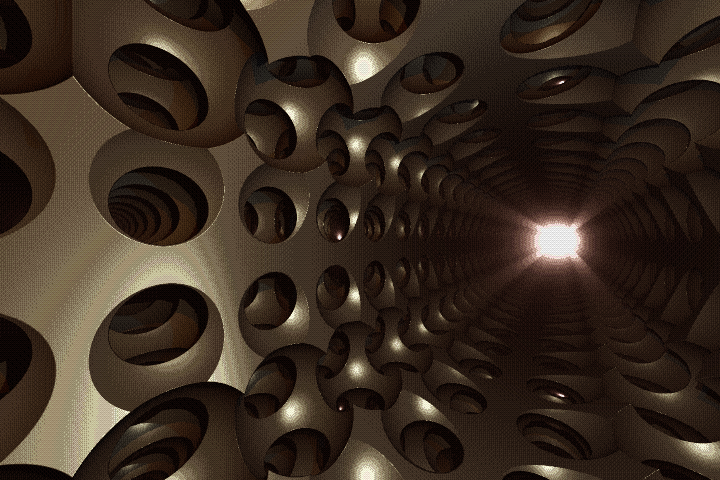

```glsl
vec3 q=fract(p)-.5;
    float f=-length(p.xy)+2., g=length(q)-.6;
    return max(f,-g);
  }
```

### float de(vec3 p){ — adapted from code by catzpaw

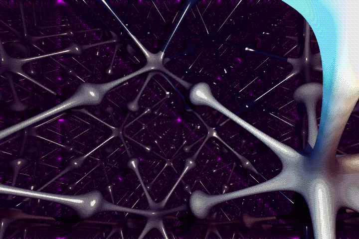

```glsl
float k = M_PI*2.;
    vec3 v = vec3(0.,3.,fract(k));
    return (length(cross(p=cos(p+v),p.zxy))-0.1)*0.4;
  }
```

### float de(vec3 p){ — adapted from code by catzpaw

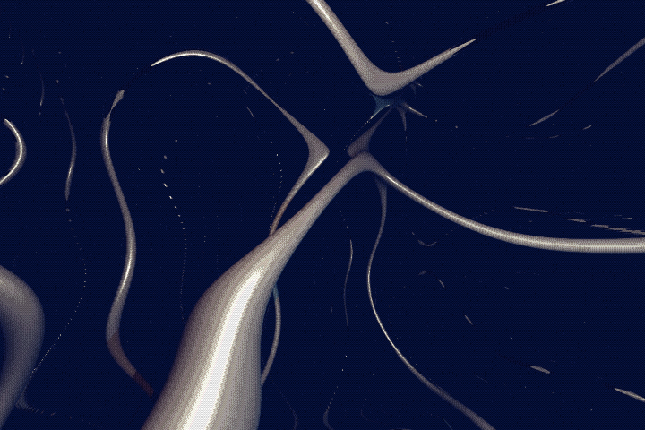

```glsl
float k = M_PI*2.;
    vec3 v = vec3(0.,3.,fract(k));
    return (length(cross(cos(p+v),p.zxy))-0.4)*0.2;
  }
```

### float de(vec3 p){ — adapted from code by kamoshika

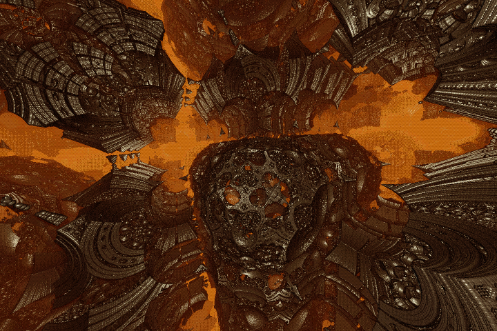

```glsl
vec3 Q,S;
    float d=1., a;
    Q=S=mod(p,10.)-5.;
    a=1.;
    for(int j=0;j++<9;) // max(_, 0.001) added to deal with divide by zero
      Q=2.*clamp(Q,-1.,1.)-Q,
      d=max(3./max(dot(Q,Q),0.001),1.),
      Q=2.*Q*d+S,
      a=2.*a*d+1.;
    return d=(length(Q)-9.)/max(a,0.001);
  }
```

### float de(vec3 p){ — adapted from code by marvelousbilly

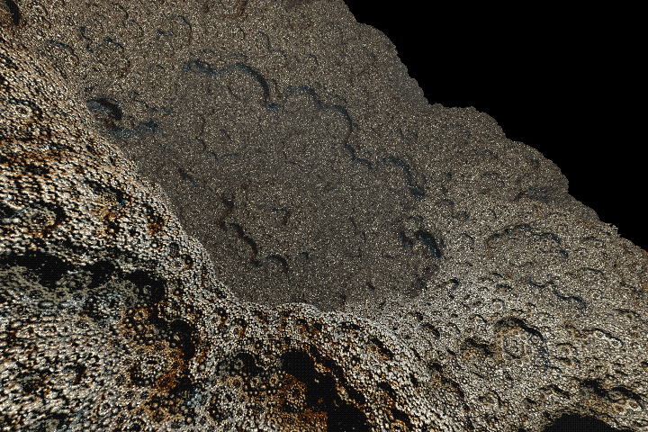

```glsl
mat3 r = rotate3D(3.14159, vec3(0.,1.,0.));
    float scale= 2.;
    int Iterations = 10;
    int i;
    vec3 C = vec3(1.,5.4,10.+10.*sin(0.5));
    for(i = 0; i < Iterations; i++){
      p = r * (p);
      float x = p.x; float y = p.y; float z = p.z; float x1 = x; float y1 = y;

      x=abs(x);y = abs(y);
      if(x-y<0.){x1=y;y=x;x=x1;}
      if(x-z<0.){x1=z;z=x;x=x1;}
      if(y-z<0.){y1=z;z=y;y=y1;}

      z-=0.5*C.z*(scale-1.)/scale;
      z=-abs(-z);
      z+=0.5*C.z*(scale-1.)/scale;

      p = vec3(x,y,z);
      r = rotate3D(31.4159/4.+5.60,vec3(1.,0.5,0.6));
      p = r * (p);
      x = p.x; y = p.y; z = p.z;

      x=scale*x-C.y*(scale-1.);
      y=scale*y-C.y*(scale-1.);
      z=scale*z;

      p = vec3(x,y,z);
    }
    return (length(p) - 2.) * pow(scale,float(-i));
  }
```

### float de(vec3 p){ — adapted from code by notargs

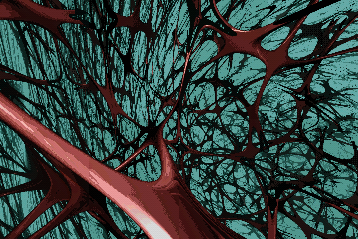

```glsl
float a=p.z*.1;
    p.xy *= mat2(cos(a),sin(a),-sin(a),cos(a));
    return abs(.1-length(cos(p.xy)+sin(p.yz)));
  }
```

### float de(vec3 p){ — adapted from gaziya5 aka gaz

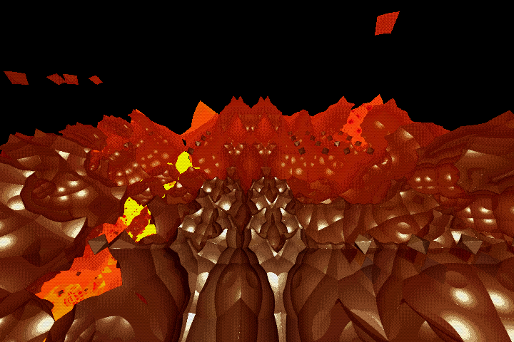

```glsl
vec3 a=vec3(.5);
    p.z-=55.;
    float s=2., l=0.;
    for(int j=0;j++<8;)
      p=-sign(p)*(abs(abs(abs(p)-2.)-1.)-1.),
      s*=l=-2.12/max(.2,dot(p,p)),
      p=p*l-.55;
    return dot(p,a)/s;
  }
```

### float de(vec3 p){ — adapted from gaziya5 aka gaz

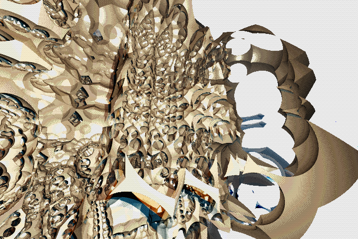

```glsl
vec3 a=vec3(.5, 0.1, 0.2);
    p.z-=55.;
    float s=2., l=0.;
    for(int j=0;j++<8;)
      p=-sign(p)*(abs(abs(abs(p)-2.)-1.)-1.),
      s*=l=-2.12/max(.2,dot(p,p)),
      p=p*l-.55;
    return dot(p,a)/s;
  }
```

### float de(vec3 p){ — amini

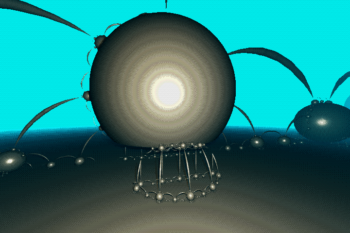

```glsl
float s=3., e;
    s*=e=3./min(dot(p,p),50.);
    p=abs(p)*e;
    for(int i=0;i++<5;)
      p=vec3(8,4,2)-abs(p-vec3(8,4,2)),
      s*=e=8./min(dot(p,p),9.),
      p=abs(p)*e;
    return min(length(p.xz)-.1,p.y)/s;
  }
```

### float de(vec3 p){ — eiffie

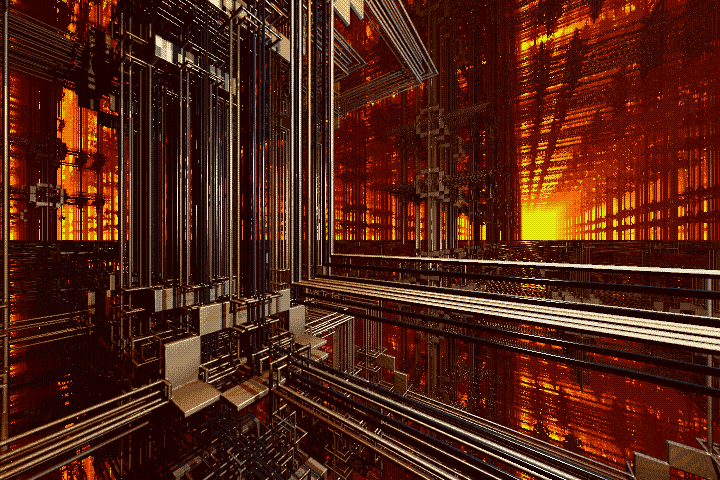

```glsl
const int iters=5;
    const int iter2=3;
    const float scale=3.48;
    const vec3 offset=vec3(1.9,0.0,2.56);
    const float psni=pow(scale,-float(iters));
    const float psni2=pow(scale,-float(iter2));
    p = abs(mod(p+3., 12.)-6.)-3.;
    vec3 p2;
    for (int n = 0; n < iters; n++) {
      if(n==iter2)p2=p;
      p = abs(p);
      if (p.x < p.y)p.xy = p.yx;
      p.xz = p.zx;
      p = p*scale - offset*(scale-1.0);
      if(p.z<-0.5*offset.z*(scale-1.0))
      p.z+=offset.z*(scale-1.0);
    }
    float d1=(length(p.xy)-1.0)*psni;
    float d2=length(max(abs(p2)-vec3(0.2,5.1,1.3),0.0))*psni2;
    escape=(d1 < d2)?0.:1.;
    return min(d1,d2);
  }
```

### float de(vec3 p){ — gaziya5 aka gaz

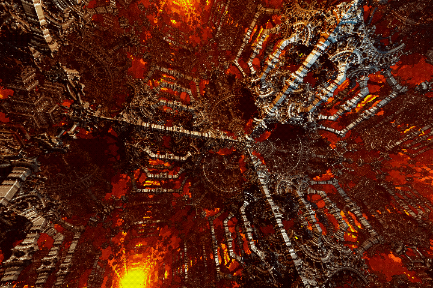

```glsl
p=mod(p,2.)-1.;
    p=abs(p)-1.;
    if(p.x < p.z)p.xz=p.zx;
    if(p.y < p.z)p.yz=p.zy;
    if(p.x < p.y)p.xy=p.yx;
    float s=1.;
    for(int i=0;i<10;i++){
      float r2=2./clamp(dot(p,p),.1,1.);
      p=abs(p)*r2-vec3(.6,.6,3.5);
      s*=r2;
    }
    return length(p)/s;
  }
```

### float de(vec3 p){ — gaziya5 aka gaz

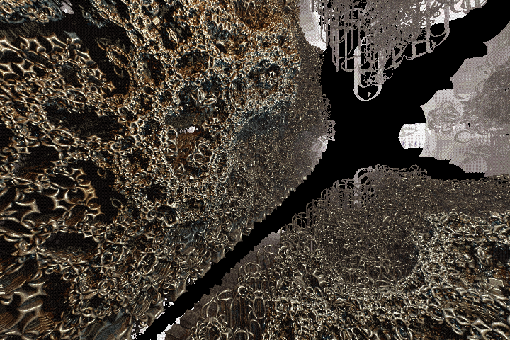

```glsl
float s=2.;
    float e=0.;
    vec3 q=vec3(3,3,.0);
    for(int i=0; i++<7; p=q-abs(p-q*.4))
      s*=e=15./min(dot(p,p),15.),
      p=abs(p)*e-2.;
    return (length(p.xz)-.5)/s;
  }
```

### float de(vec3 p){ — gaziya5 aka gaz

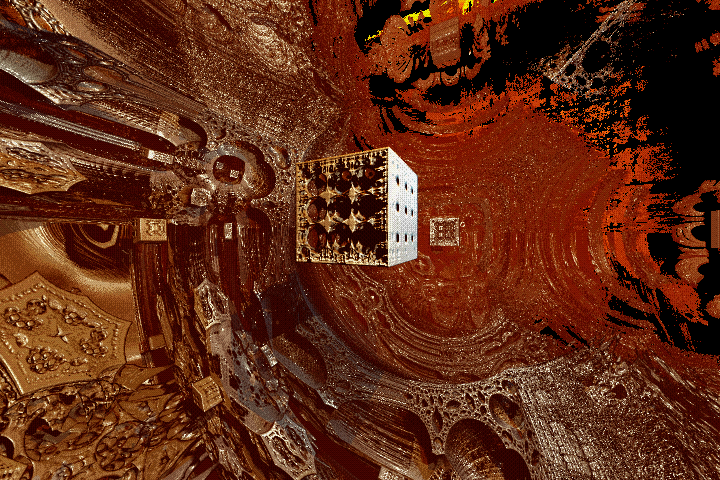

```glsl
vec3 q;
    p-=vec3(1.,.1,.1);
    q=p;
    float s=1.5;
    float e=0.;
    for(int j=0;j++<15;s*=e)
      p=sign(p)*(1.2-abs(p-1.2)),
      p=p*(e=8./clamp(dot(p,p),.3,5.5))+q*2.;
    return length(p)/s;
  }
```

### float de(vec3 p){ — gaziya5 aka gaz

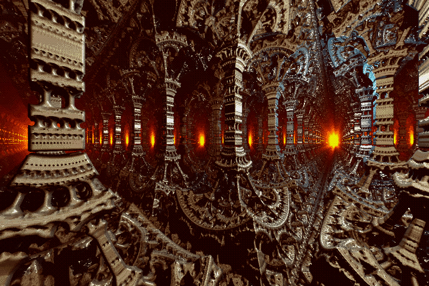

```glsl
p.xz=fract(p.xz)-.5;
    float k=1.;
    float s=0.;
    for(int i=0;i++<9;)
      s=2./clamp(dot(p,p),.1,1.),
      p=abs(p)*s-vec3(.5,3,.5),
      k*=s;
    return length(p)/k-.001;
  }
```

### float de(vec3 p){ — gaziya5 aka gaz

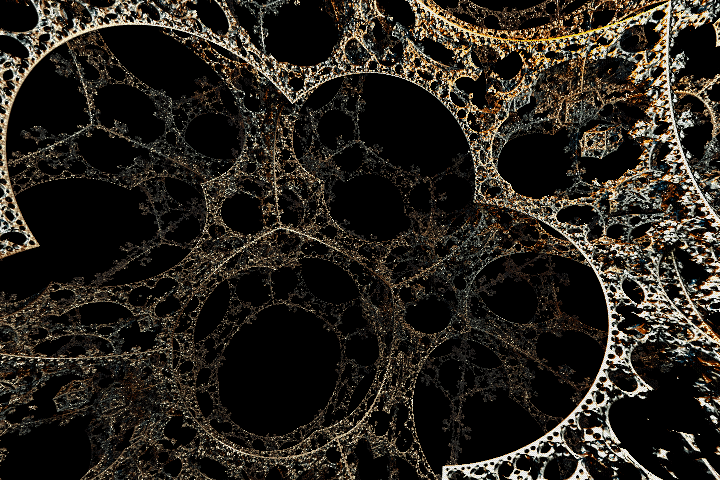

```glsl
p.xz=fract(p.xz)-.5;
    float k=1.;
    float s=0.;
    for(int i=0;i++<9;)
      s=2./clamp(dot(p,p),.1,1.),
      p=abs(p)*s-vec3(.5,3,.5),
      k*=s;
    return length(p)/k-.001;
  }
```

### float de(vec3 p){ — gaziya5 aka gaz

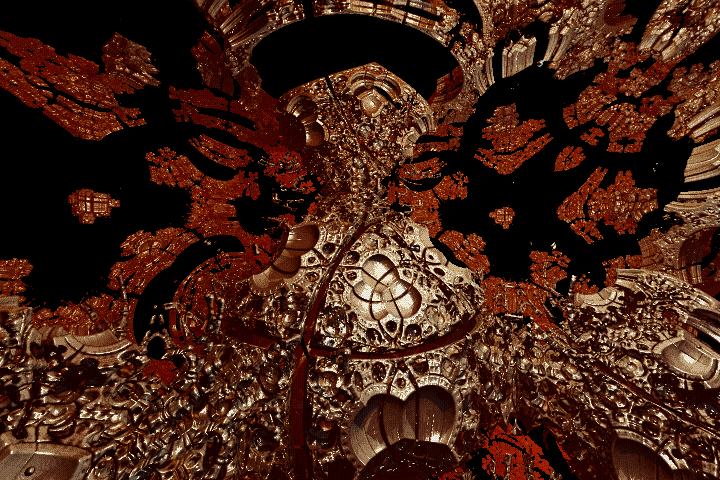

```glsl
float g=1.;
    float e=0.;
    vec3 q=vec3(0);
    p.z-=1.;
    q=p;
    float s=2.;
    for(int j=0;j++<8;)
      p-=clamp(p,-.9,.9)*2.,
      p=p*(e=3./min(dot(p,p),1.))+q,
      s*=e;
    return length(p)/s;
  }
```

### float de(vec3 p){ — gaziya5 aka gaz

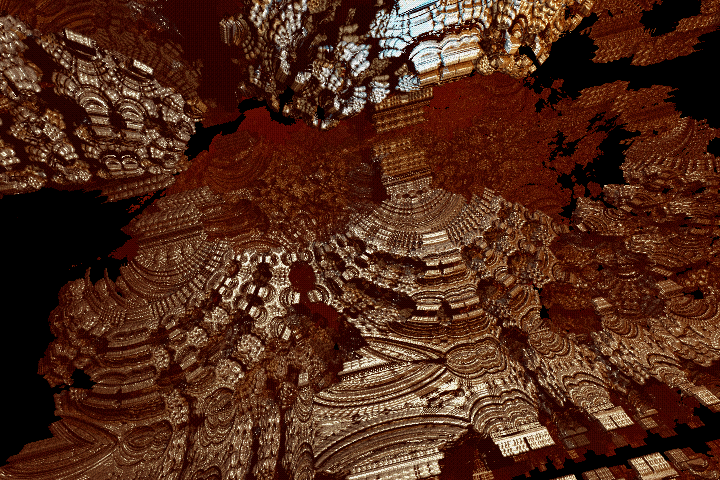

```glsl
vec3 q;
    p.z-=1.5;
    q=p;
    float e=0.;
    float s=3.;
    for(int j=0;j++<8;s*=e)
      p=sign(p)*(1.-abs(abs(p-2.)-1.)),
      p=p*(e=6./clamp(dot(p,p),.3,3.))+q-vec3(8,.2,8);
    return length(p)/s;
  }
```

### float de(vec3 p){ — gaziya5 aka gaz

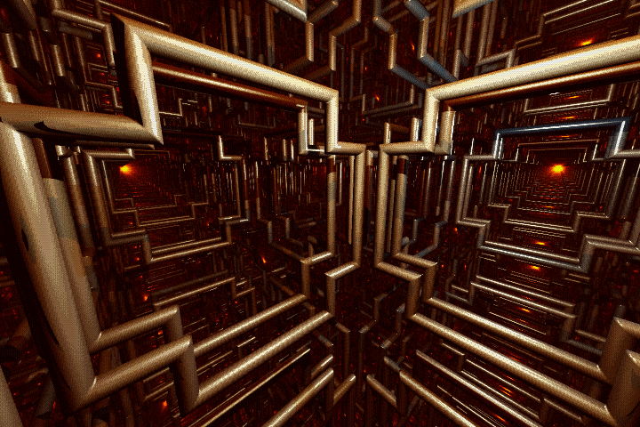

```glsl
#define R(a)a=vec2(a.x+a.y,a.x-a.y)*.7
    #define G(a,n)R(a);a=abs(a)-n;R(a)
      p=fract(p)-.5;
      G(p.xz,.3);
      G(p.zy,.1);
      G(p.yz,.15);
      return .6*length(p.xy)-.01;
    #undef R
    #undef G
  }
```

### float de(vec3 p){ — gaziya5 aka gaz

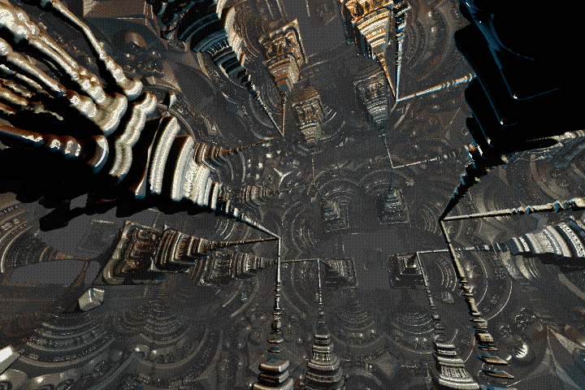

```glsl
float s=2.;
    float l=dot(p,p);
    float e=0.;
    escape=0.;
    p=abs(abs(p)-.7)-.5;
    p.x < p.y?p=p.yxz:p;
    p.y < p.z?p=p.xzy:p;
    for(int i=0;i++<8;){
      s*=e=2./clamp(dot(p,p),.004+tan(12.)*.002,1.35);
      p=abs(p)*e-vec2(.5*l,12.).xxy;
    }
    return length(p-clamp(p,-1.,1.))/s;
  }
```

### float de(vec3 p){ — gaziya5 aka gaz

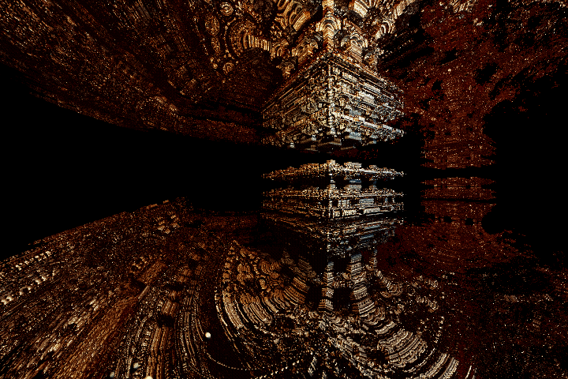

```glsl
p.z-=1.5;
    vec3 q=p;
    float s=1.5;
    float e=0.;
    for(int j=0;j++<8;s*=e)
      p=sign(p)*(1.2-abs(p-1.2)),
      p=p*(e=8./clamp(dot(p,p),.6,5.5))+q-vec3(.3,8,.3);
    return length(p)/s;
  }
```

### float de(vec3 p){ — gaziya5 aka gaz

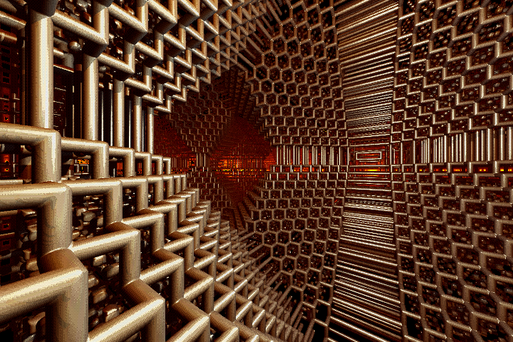

```glsl
float e=1.,B=2.95,H=.9, s=2.;
    p.z=mod(p.z-2.,4.)-2.;
    for(int j=0;j++<8;)
    {
      p=abs(p);
      p.x < p.z?p=p.zyx:p;
      p.x=H-abs(p.x-H);
      p.y < p.z?p=p.xzy:p;
      p.xz+=.1;
      p.y < p.x?p=p.yxz:p;
      p.y-=.1;
    }
    p*=B; p-=2.5; s*=B;
    return length(p.xy)/s-.007;
  }
```

### float de(vec3 p){ — gaziya5 aka gaz

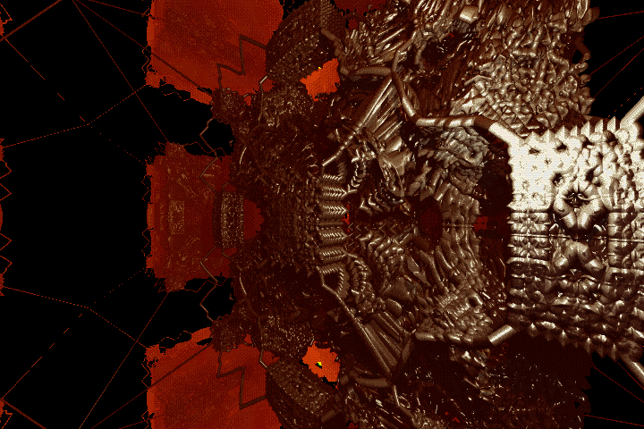

```glsl
#define hash(n) fract(sin(n*234.567+123.34))
    float seed=dot(floor((p+3.5)/7.)+3.,vec3(123.12,234.56,678.22));
    p-=clamp(p,-3.5,3.5)*2.;
    float scale=-5.;
    float mr2=.38;
    float off=1.2;
    float s=3.;
    p=abs(p);
    vec3  p0 = p;
    for (float i=0.; i<4.+hash(seed)*6.; i++){
      p=1.-abs(p-1.);
      float g=clamp(mr2*max(1.2/dot(p,p),1.),0.,1.);
      p=p*scale*g+p0*off;
      s=s*abs(scale)*g+off;
    }
    return length(cross(p,normalize(vec3(1))))/s-.005;
  }
```

### float de(vec3 p){ — gaziya5 aka gaz

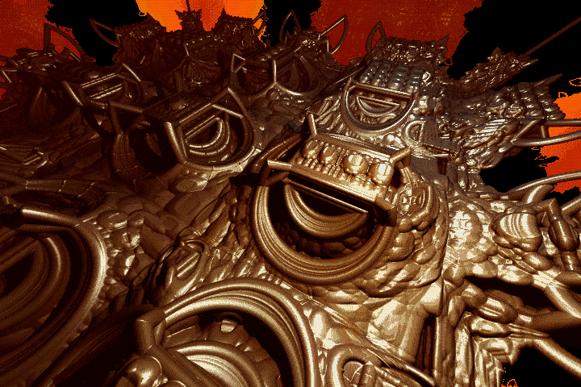

```glsl
#define hash(n) fract(sin(n*234.567+123.34))
    float zoom=2.1;
    p*=zoom;
    float seed=dot(floor((p+3.5)/7.)+3.,vec3(123.12,234.56,678.22));
    p-=clamp(p,-8.,8.)*2.;
    float s=3.*zoom;
    p=abs(p);
    vec3  p0 = p*1.6;
    for (float i=0.; i<10.; i++){
      p=1.-abs(abs(p-2.)-1.);
      float g=-8.*clamp(.43*max(1.2/dot(p,p),.8),0.,1.3);
      s*=abs(g); p*=g; p+=p0;
    }
    return length(cross(p,normalize(vec3(1))))/s-.005;
  }
```

### float de(vec3 p){ — gaziya5 aka gaz

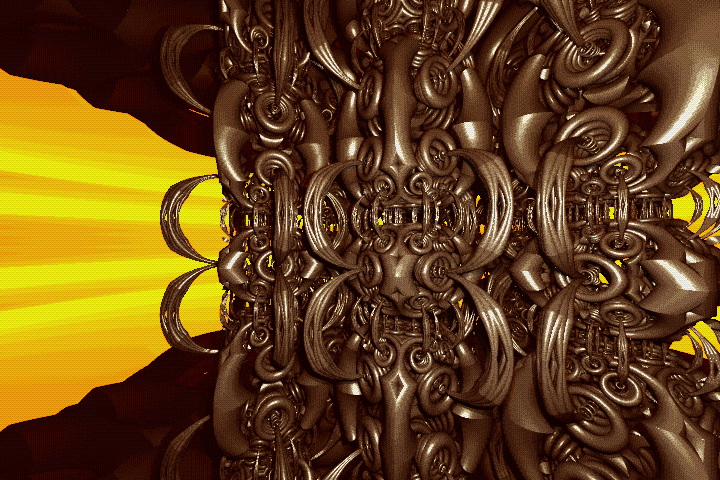

```glsl
p.z-=16.; float s=3.; float e=0.;
    p.y=abs(p.y)-1.8;
    p=clamp(p,-3.,3.)*2.-p;
    s*=e=6./clamp(dot(p,p),1.5,50.);
    p=abs(p)*e-vec3(0,1.8,0);
    p.xz =.8-abs(p.xz-2.);
    p.y =1.7-abs(p.y-2.);
    s*=e=12./clamp(dot(p,p),1.0,50.);
    p=abs(p)*e-vec2(.2,1).xyx;
    p.y =1.5-abs(p.y-2.);
    s*=e=16./clamp(dot(p,p),.1,9.);
    p=abs(p)*e-vec2(.3,-.7).xyx;
    return min(
            length(p.xz)-.5,
            length(vec2(length(p.xz)-12.,p.y))-3.
            )/s;
  }
```

### float de(vec3 p){ — gaziya5 aka gaz

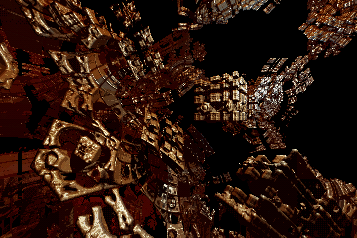

```glsl
float s=4.;
    float l=0;
    p.z-=.9;
    vec3 q=p;
    s=2.;
    for(int j=0;j++<9;)
      p-=clamp(p,-1.,1.)*2.,
      p=p*(l=8.8*clamp(.72/min(dot(p,p),2.),0.,1.))+q,
      s*=l;
    return length(p)/s;
  }
```

### float de(vec3 p){ — gaziya5 aka gaz


```glsl
float s=3., l=0.;
    vec3 q=p;
    p=mod(p,4.)-2.;
    p=abs(p);
    for(int j=0;j++<8;)
      p=1.-abs(p-1.),
      p=p*(l=-1.*max(1./dot(p,p),1.))+.5,
      s*=l;
    return max(.2-length(q.xy),length(p)/s);
  }
```

### float de(vec3 p){ — gaziya5 aka gaz

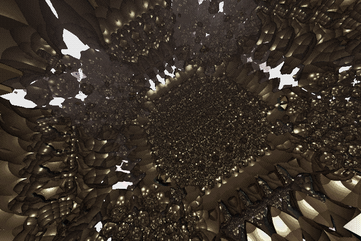

```glsl
vec3 a=vec3(.5);
    p.z-=55.; p = abs(p);
    float s=2., l=0.;
    for(int j=0;j++<8;)
      p=-sign(p)*(abs(abs(abs(p)-2.)-1.)-1.),
      s*=l=-2.12/max(.2,dot(p,p)),
      p=p*l-.55;
    return dot(p,a)/s;
  }
```

### float de(vec3 p){ — gaziya5 aka gaz

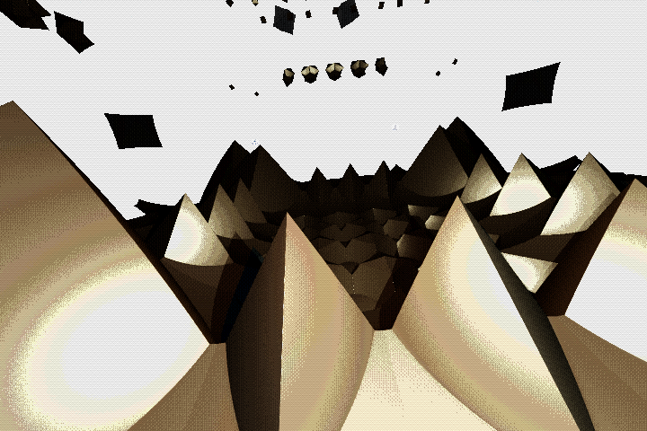

```glsl
float i,g,e=1.,s=2.,l;
    vec3 a=vec3(.5);
    p.z-=55.; p=abs(p);
    for(int j=0;j++<8;)
      p=-sign(p)*(abs(abs(abs(p)-2.)-1.)-1.),
      s*=l=-1.55/max(.4,dot(p,p)),
      p=p*l-.535;
    return dot(p,a)/s;
  }
```

### float de(vec3 p){ — gaziya5 aka gaz

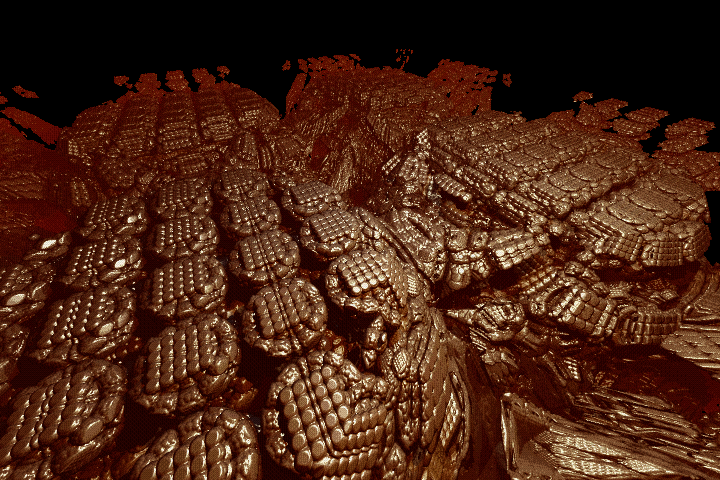

```glsl
float i,g,e,R,S;vec3 q;
    q=p*2.;
    R=7.;
    for(int j=0;j++<9;){
      p=-sign(p)*(abs(abs(abs(p)-2.)-1.)-1.);
      S=-9.*clamp(.7/min(dot(p,p),3.),0.,1.);
      p=p*S+q; R=R*abs(S);
    }
    return length(p)/R;
  }
```

### float de(vec3 p){ — gaziya5 aka gaz

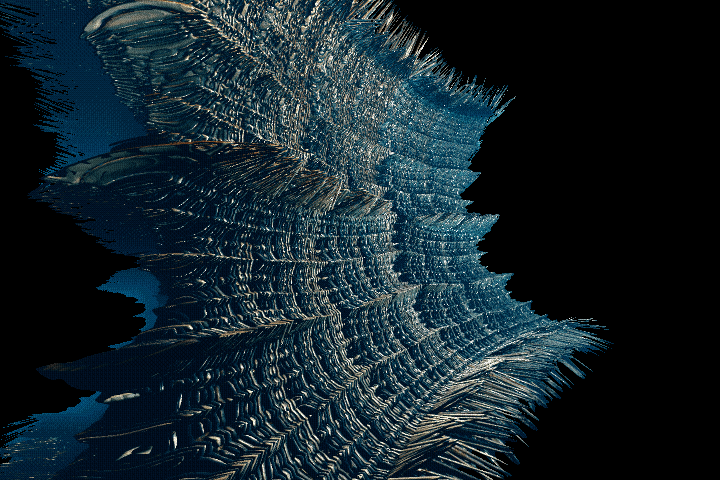

```glsl
#define V vec2(.7,-.7)
    #define G(p)dot(p,V)
    float i=0.,g=0.,e=1.;
    float t = 0.34; // change to see different behavior
    for(int j=0;j++<8;){
      p=abs(rotate3D(0.34,vec3(1,-3,5))*p*2.)-1.,
      p.xz-=(G(p.xz)-sqrt(G(p.xz)*G(p.xz)+.05))*V;
    }
    return length(p.xz)/3e2;
  }
```

### float de(vec3 p){ — gaziya5 aka gaz

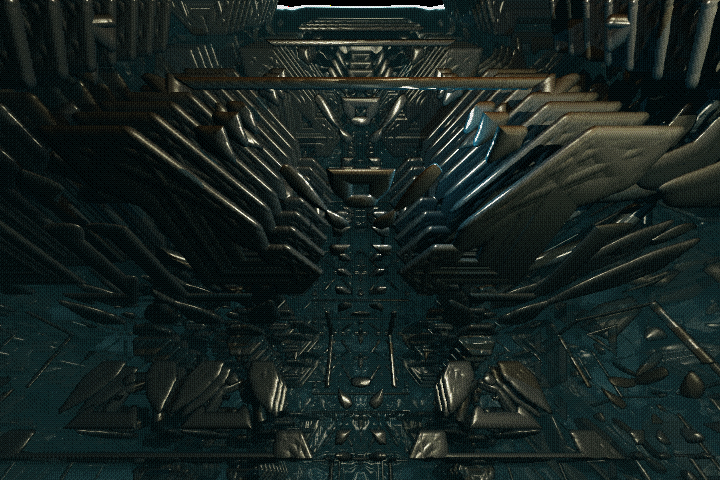

```glsl
float i,g,d=1.,s,h;
    vec3 e,q;
    s=2.;h=.3;
    for(int j=0;j++<8;){
      p=abs(p)-1.; q=p;
      for(int k=0;++k<3;)
        p-=clamp(dot(q,e=vec3(9>>k&1,k>>1&1,k&1)-.5),-h,h)*e*2.;
      p*=1.4;s*=1.4;
    }
    return length(p)/(4.*s);
  }
```

### float de(vec3 p){ — gaziya5 aka gaz

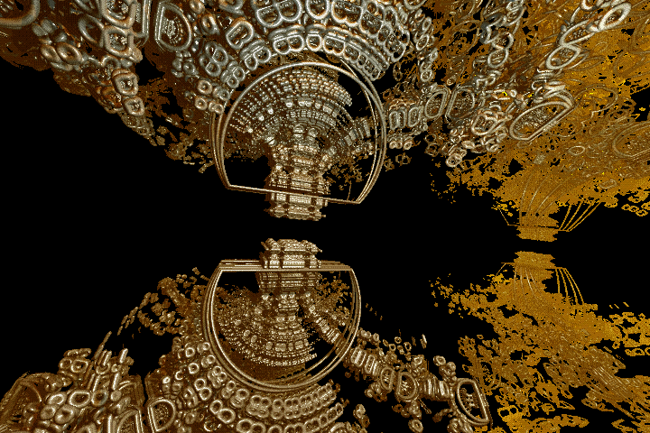

```glsl
float i,g,e,s;
    vec3 q=p; s=5.;
    for(int j=0;j++<6;s*=e)
      p=sign(p)*(1.7-abs(p-1.7)),
      p=p*(e=8./clamp(dot(p,p),.3,5.))+q-vec3(.8,12,.8);
    return length(p.yz)/s;
  }
```

### float de(vec3 p){ — gaziya5 aka gaz

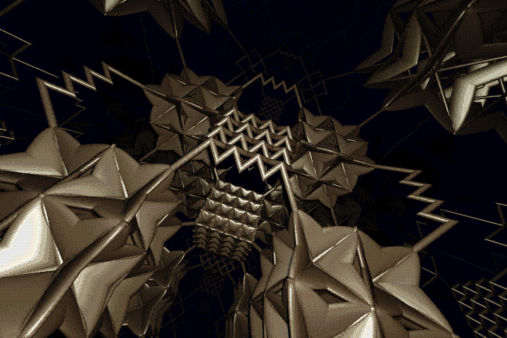

```glsl
p.z-=80.; p=abs(p);
    float s=3., l=0.;
    for(int j=0;j++<8;)
      p=-sign(p)*(abs(abs(abs(p)-2.)-1.)-1.),
      p*=l=-.8/min(2.,length(p)),
      p-=.5, s*=l;
    return (length(p)/s)-0.1;
  }
```

### float de(vec3 p){ — gaziya5 aka gaz

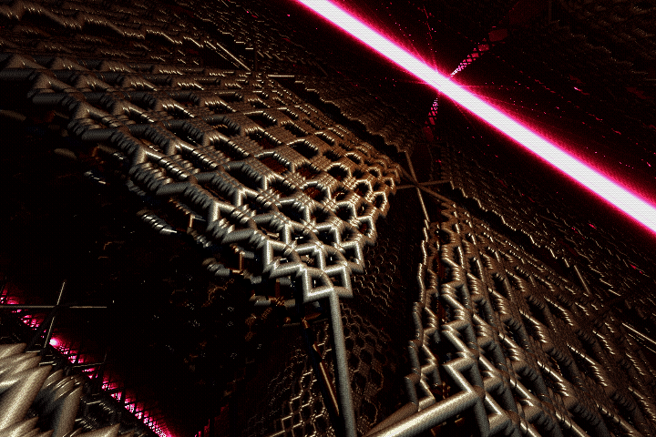

```glsl
float s = 1.;
    for(int j=0;j<7;j++)
      p=mod(p-1.,2.)-1.,
      p*=1.2, s*=1.2,
      p=abs(abs(p)-1.)-1.;
    return (length(cross(p,normalize(vec3(2,2.03,1))))/s)-0.02;
  }
```

### float de(vec3 p){ — gaziya5 aka gaz

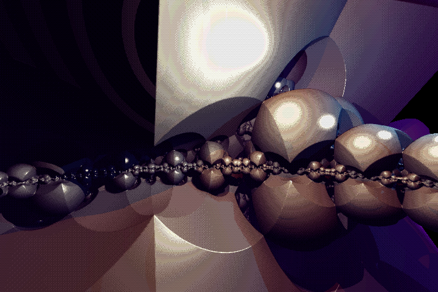

```glsl
float s=2., l=0.;
    p=abs(p);
    for(int j=0;j++<8;)
      p=1.-abs(abs(p-2.)-1.),
      p*=l=1.2/dot(p,p), s*=l;
    return dot(p,normalize(vec3(3,-2,-1)))/s;
  }
```

### float de(vec3 p){ — gaziya5 aka gaz

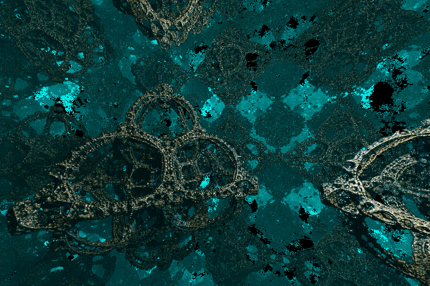

```glsl
float s=2., l=0.;
    p=abs(p);
    for(int j=0;j++<8;)
      p=-sign(p)*(abs(abs(abs(p)-2.)-1.)-1.),
      p*=l=-1.3/dot(p,p),
      p-=.15, s*=l;
    return length(p)/s;
  }
```

### float de(vec3 p){ — gaziya5 aka gaz

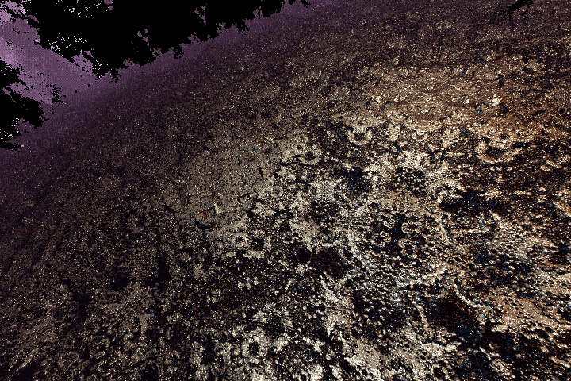

```glsl
p.z-=20;
    float s=3., l=0.;
    p=abs(p);
    for(int j=0;j++<10;)
      p=-sign(p)*(abs(abs(abs(p)-2.)-1.)-1.),
      p*=l=-1./max(.19,dot(p,p)),
      p-=.24, s*=l;
    return (length(p)/s);
  }
```

### float de(vec3 p){ — gaziya5 aka gaz

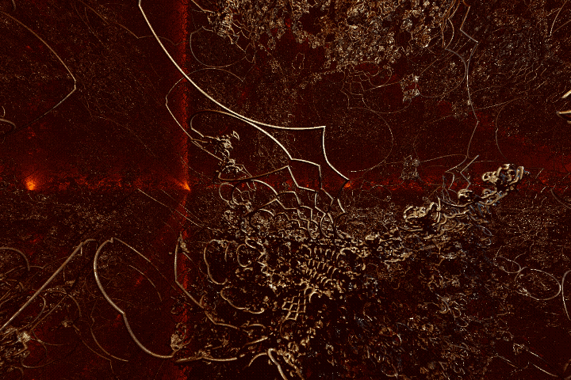

```glsl
float s=2., l=0.;
    p=abs(mod(p-1.,2.)-1.);
    for(int j=0;j++<8;)
      p=1.-abs(abs(abs(p-5.)-2.)-2.),
      p*=l=-1.3/dot(p,p),
      p-=vec3(.3,.3,.4), s*=l;
    return length(p.yz)/s;
  }
```

### float de(vec3 p){ — gaziya5 aka gaz

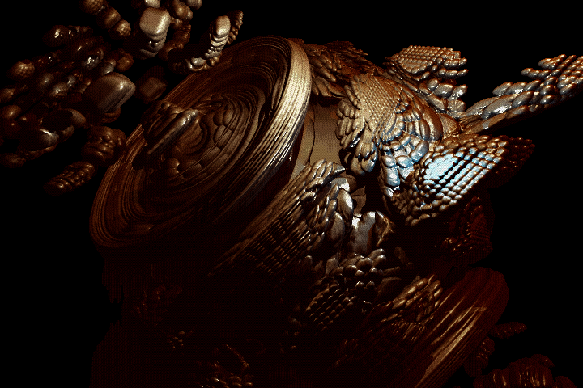

```glsl
float i,g,e=1.,R,S;
    vec3 q=p*8.; R=8.;
    for(int j=0;j++<6;)
      p=-sign(p)*(abs(abs(abs(p)-2.)-1.)-1.),
      S=-5.*clamp(1.5/dot(p,p),.8,5.),
      p=p*S+q, R*=S;
    return length(p)/R;
  }
```

### float de(vec3 p){ — gaziya5 aka gaz

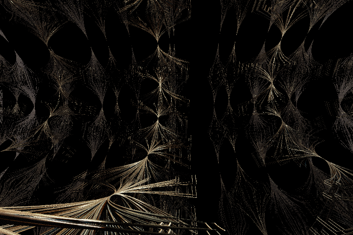

```glsl
float i,g,e,s=2.,k;
    vec3 q;
    p=vec3(length(p.xy)-PI,atan(p.y,p.x)*PI,p.z);
    p.yz=mod(p.yz,4.)-2.;
    p=abs(p); q=p;
    for(int j=0;++j<5;)
      p=1.-abs(p-1.),
      p=-p*(k=max(3./dot(p,p),3.))+q, s*=k;
    return length(p.xz)/s;
  }
```

### float de(vec3 p){ — gaziya5 aka gaz

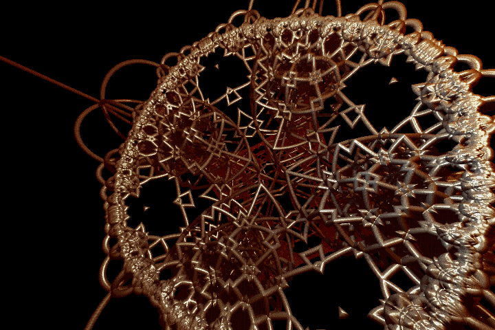

```glsl
float i,g,e,R=2.,S;
    for(int j=0;j++<9;)
      p=1.-abs(p-1.),
      p*=S=(j%3>1)?1.3:1.2/dot(p,p),
      R*=S;
    return length(cross(p,vec3(.5)))/R-5e-3;
  }
```

### float de(vec3 p){ — gaziya5 aka gaz

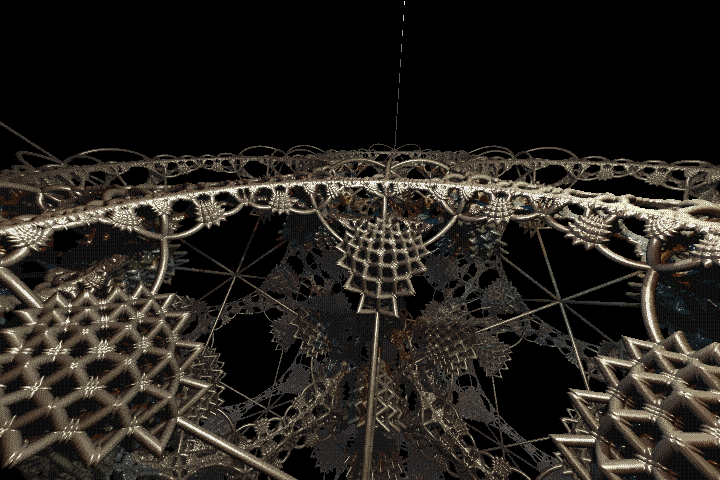

```glsl
float s=2.,r2;
    p=abs(p);
    for(int i=0; i<12;i++){
      p=1.-abs(p-1.);
      r2=(i%3==1)?1.1:1.2/dot(p,p);
      p*=r2; s*=r2;
    }
    return length(cross(p,normalize(vec3(1))))/s-0.005;
  }
```

### float de(vec3 p){ — gaziya5 aka gaz

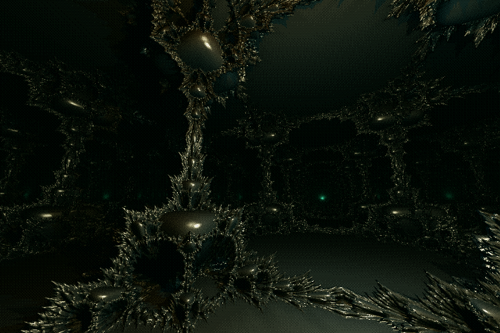

```glsl
float i,g,e,s=3.,l;
    vec3 q=p;
    for(int j=0;j++<9;)
      p=mod(p-1.,2.)-1.,
      l=1.2/pow(pow(dot(pow(abs(p),vec3(5)),vec3(1)),.2),1.6),
      p*=l, s*=l;
    return abs(p.y)/s;
  }
```

### float de(vec3 p){ — gaziya5 aka gaz

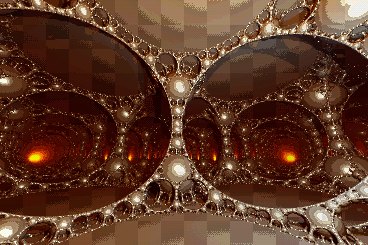

```glsl
float i,g,e,s=4.,l;
    vec3 q=p;
    for(int j=0;j++<9;)
      p=mod(p-1.,2.)-1.,
      l=1.2/dot(p,p),
      p*=l, s*=l;
    return abs(p.y)/s;
  }
```

### float de(vec3 p){ — gaziya5 aka gaz

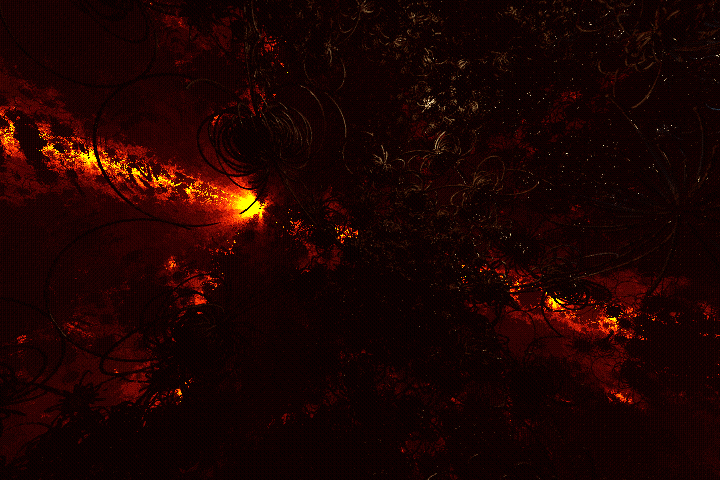

```glsl
float i,g,e,s=1.,l;
    vec3 q=p;
    for(int j=0;j++<4;)
      p=mod(p-1.,2.)-1.,
      l=2./dot(p,p),
      p*=l, s*=l;
    return length(p.xy)/s;
  }
```

### float de(vec3 p){ — gaziya5 aka gaz

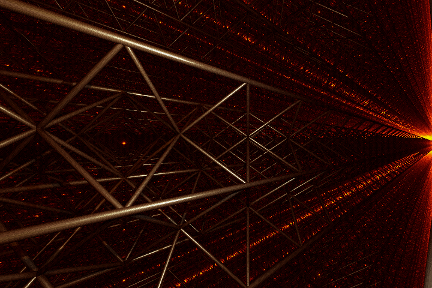

```glsl
#define F1(s)p.s=abs(p.s)-1.
    p+=vec3(0,3.8,5.);
    vec3 q=p;
    p=mod(p,vec3(8,8,2))-vec3(4,4,1);
    F1(yx); F1(yx); F1(xz);
    return min(length(cross(p,vec3(.5)))-.03,length(p.xy)-.05);
  }
```

### float de(vec3 p){ — gaziya5 aka gaz

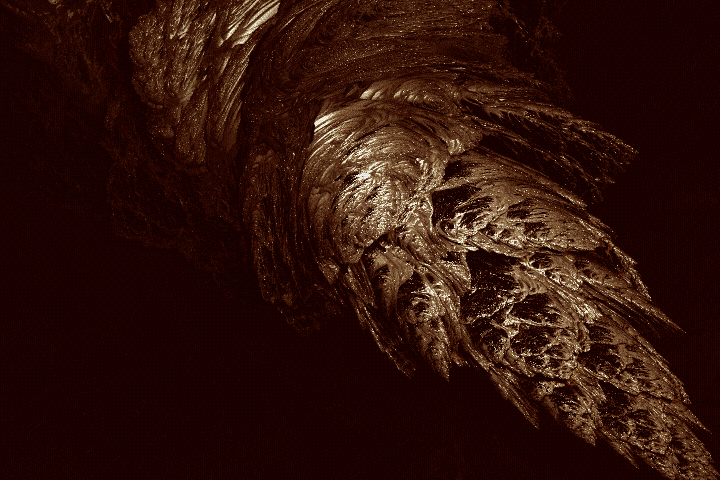

```glsl
float l,s=3.;
    float t = 4.5;
    for(int j=0;j++<5;p.xy=fract(p.xy+p.x)-.5)
      p=vec3(log(l=length(p.xy)),atan(p.y,p.x)/PI*2.,p.z/l+1.),
      s*=.5*l;
    return abs(p.z)*s;
  }
```

### float de(vec3 p){ — gaziya5 aka gaz

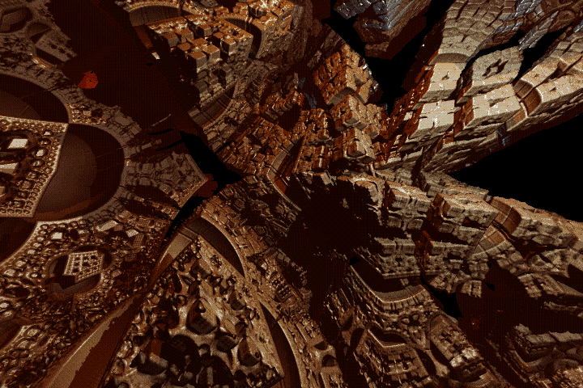

```glsl
float i,g,e,R,S;
    vec3 q=p; R=2.;
    for(int j=0;j++<9;)
      p-=clamp(p,-1.,1.)*2.,
      S=9.*clamp(.7/min(dot(p,p),3.),0.,1.),
      p=p*S+q,
      R=R*abs(S)+1.,
      p=p.yzx;
    return length(p)/R;
  }
```

### float de(vec3 p){ — gaziya5 aka gaz

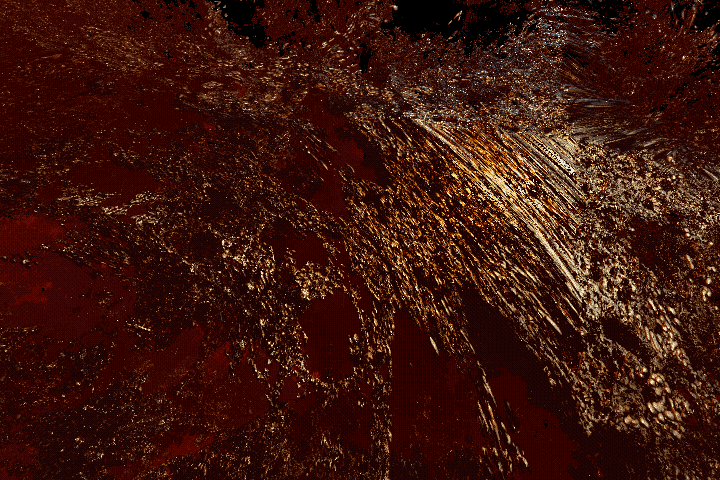

```glsl
float i,g,e,R=1.,S;
    vec3 q=p;
    for(int j=0;j++<9;)
      p-=clamp(p,-1.,1.)*2.,
      S=6.*clamp(.2/min(dot(p,p),7.),0.,1.),
      p=p*S+q*.7,  R=R*abs(S)+.7;
    return length(p)/R;
  }
```

### float de(vec3 p){ — gaziya5 aka gaz

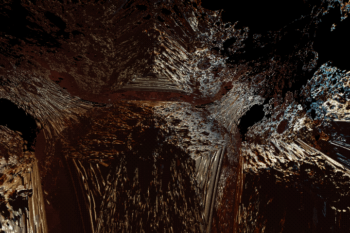

```glsl
float i,g,e,R,S;
    vec3 q;
    p.z-=3.;
    q=p; R=1.;
    for(int j=0;j++<9;)
      p-=clamp(p,-.9,.9)*2.,
      S=9.*clamp(.1/min(dot(p,p),1.),0.,1.),
      p=p*S+q, R=R*S+1.;
    return .7*length(p)/R;
  }
```

### float de(vec3 p){ — gaziya5 aka gaz

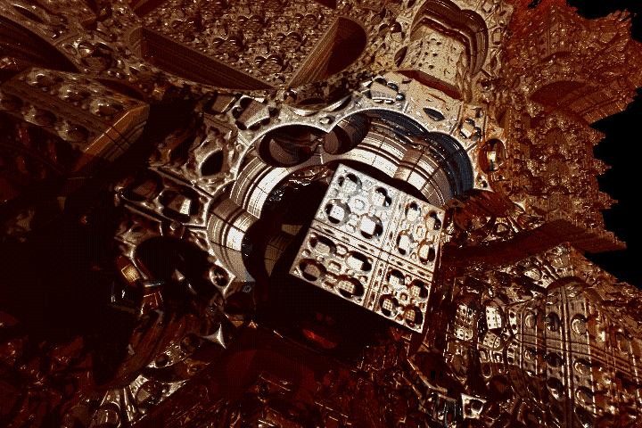

```glsl
float i,g,e,R,S;
    vec3 q;
    p.z-=4.;
    q=p; R=1.;
    for(int j=0;j++<9;)
      p-=clamp(p,-1.,1.)*2.,
      S=9.*clamp(.3/min(dot(p,p),1.),0.,1.),
      p=p*S+q*.5,
      R=R*abs(S)+.5;
    return .6*length(p)/R-1e-3;
  }
```

### float de(vec3 p){ — gaziya5 aka gaz

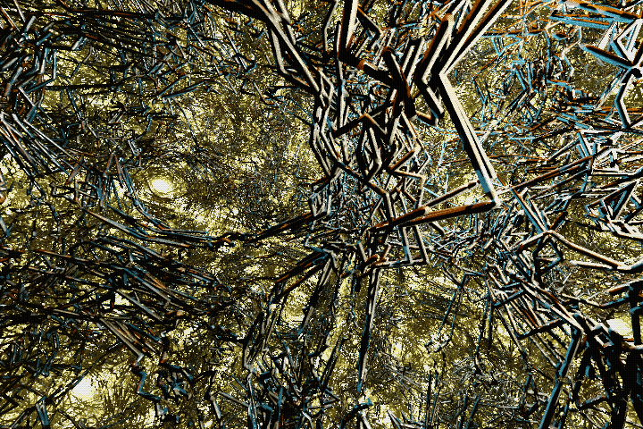

```glsl
#define F1(a,n)a=abs(a)-n,a=vec2(a.x*.5+a.y,a.x-a.y*.5)
    p=fract(p)-.5;
    for(int j=0;j++<8;)
      F1(p.zy,.0),
      F1(p.xz,.55);
    return .4*length(p.yz)-2e-3;
  }
```

### float de(vec3 p){ — gaziya5 aka gaz

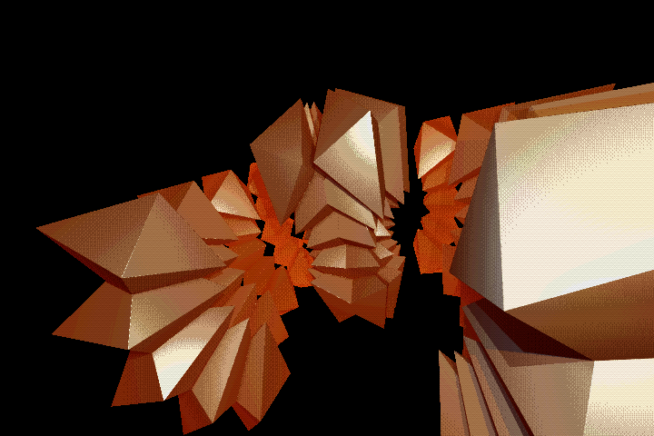

```glsl
#define M(a)mat2(cos(a+vec4(0,2,5,0)))
    #define F1(a)for(int j=0;j<5;j++)p.a=abs(p.a*M(3.));(p.a).y-=3.
    float t = 0.96;
    p.z-=9.;
    p.xz*=M(t);
    F1(xy);
    F1(zy);
    return dot(abs(p),vec3(.3))-.5;
  }
```

### float de(vec3 p){ — gaziya5 aka gaz

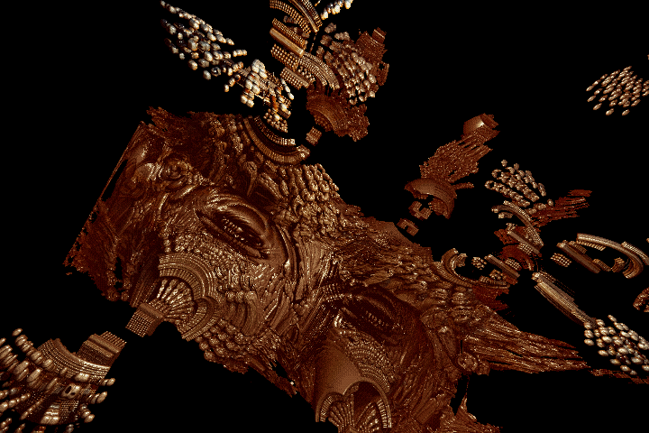

```glsl
vec3 q=p;
    float s=5., e=0.;
    for(int j=0;j++<8;s*=e)
      p=sign(p)*(1.-abs(abs(p-2.)-1.)),
      p=p*(e=6./clamp(dot(p,p),.1,3.))-q*vec3(2,8,5);
    return length(p)/s;
  }
```

### float de(vec3 p){ — gaziya5 aka gaz

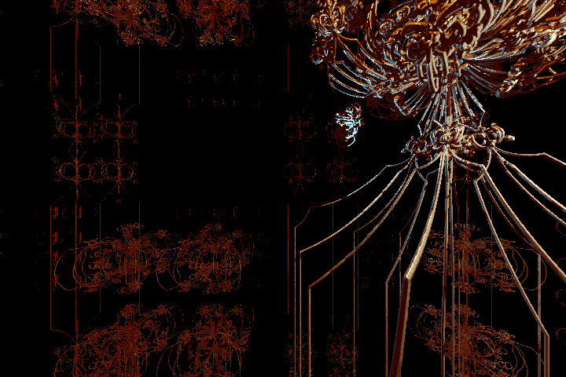

```glsl
float e=2., s=0., z=0.;
    for(int j=0;++j<6;p=abs(p)-1.5,e/=s=min(dot(p,p),.75),p/=s);
    z+=length(p.xz)/e;
    return z;
  }
```

### float de(vec3 p){ — gaziya5 aka gaz

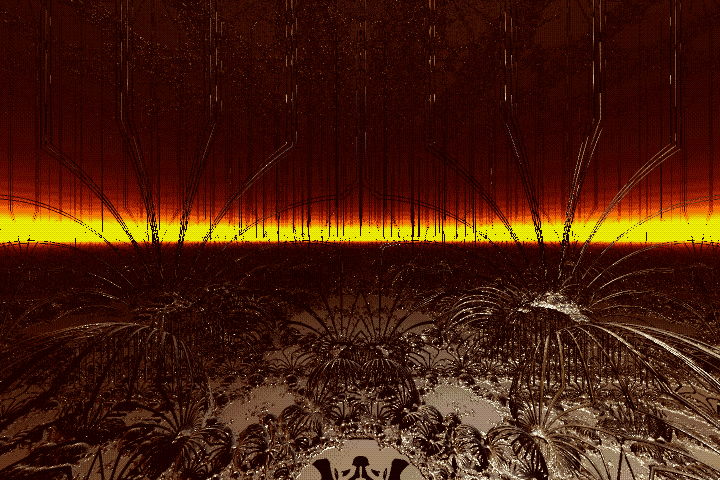

```glsl
float s=2., e=0.;
    for(int i=0;i++<8;p=abs(p)*e)
      p=vec3(.8,2,1)-abs(p-vec3(1,2,1)),
      s*=e=1.3/clamp(dot(p,p),.1,1.2);
    return min(length(p.xz),p.y)/s+.001;
  }
```

### float de(vec3 p){ — gaziya5 aka gaz

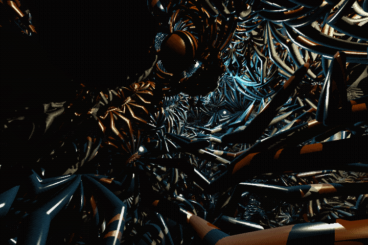

```glsl
float i,g=.3,e,s=2.,q;
    for(int i=0;i++<7;p=vec3(2,5,1)-abs(abs(abs(p)*e-3.)-vec3(2,5,1)))
      s*=e=12./min(dot(p,p),12.);
    return min(1.,length(p.xz)-.2)/s;
  }
```

### float de(vec3 p){ — gaziya5 aka gaz

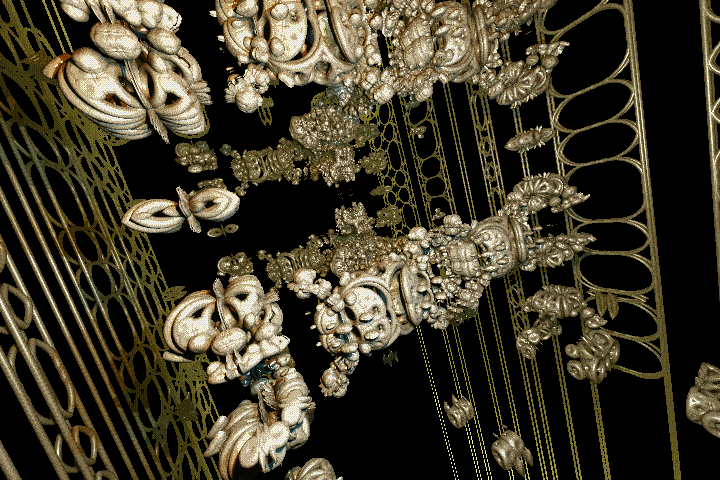

```glsl
p.yz*=rotate2D(-.3);
    float ss=3., s=1.;
    for(int j=0; j++<7;){
      p=abs(p); p.y-=.5;
      s = 1./clamp(dot(p,p),.0,1.);
      p*=s; ss*=s;
      p-=vec2(1,.1).xxy;
      p.xyz=p.zxy;
    }
    return length(p.xy)/ss-.01;
  }
```

### float de(vec3 p){ — gaziya5 aka gaz

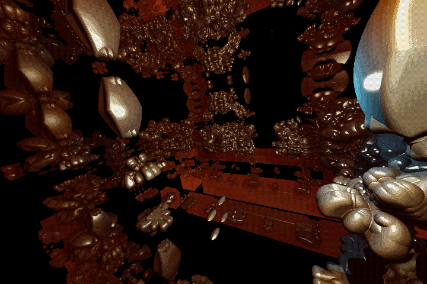

```glsl
p.yz*=rotate2D(-.3);
    float ss=3., s=1.;
    for(int j=0; j++<7;){
      p=abs(p); p.y-=.5;
      s = 1./clamp(dot(p,p),.0,1.);
      p*=s; ss*=s;
      p-=vec2(1,.1).xxy;
      p.xyz=p.zxy;
    }
    return length(max(abs(p)-.6,0.))/ss-.01;
  }
```

### float de(vec3 p){ — gaziya5 aka gaz

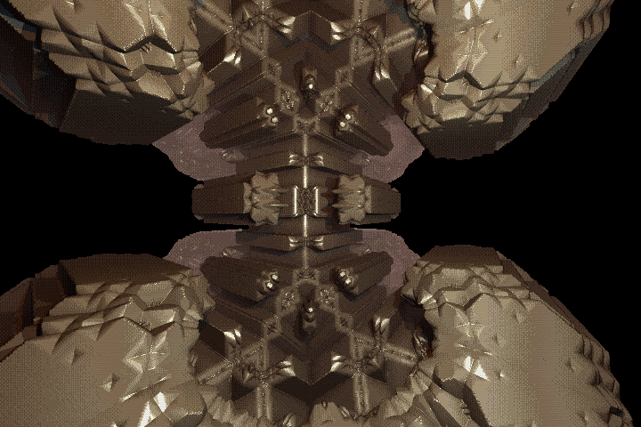

```glsl
float s=2., e;
    for(int j=0;j++<8;){
      p=.1-abs(p-.2);
      p.x < p.z?p=p.zyx:p;
      s*=e=1.6;
      p=abs(p)*e-vec3(.1,3,1);
      p.yz*=rotate2D(.8);
    }
    return length(p.yx)/s-.04;
  }
```

### float de(vec3 p){ — gaziya5 aka gaz

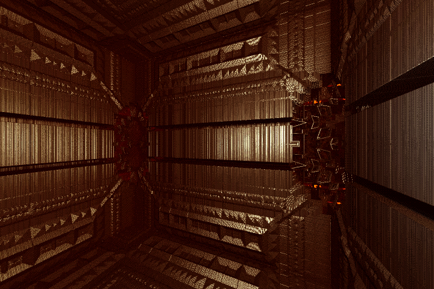

```glsl
float s=2., e;
    for(int i=0;i++<8;){
      p=.5-abs(p);
      p.x < p.z?p=p.zyx:p;
      p.z < p.y?p=p.xzy:p;
      s*=e=1.6;
      p=abs(p)*e-vec3(.5,30,5);
      p.yz*=rotate2D(.3);
    }
    return length(p.xy)/s-.005;
  }
```

### float de(vec3 p){ — gaziya5 aka gaz

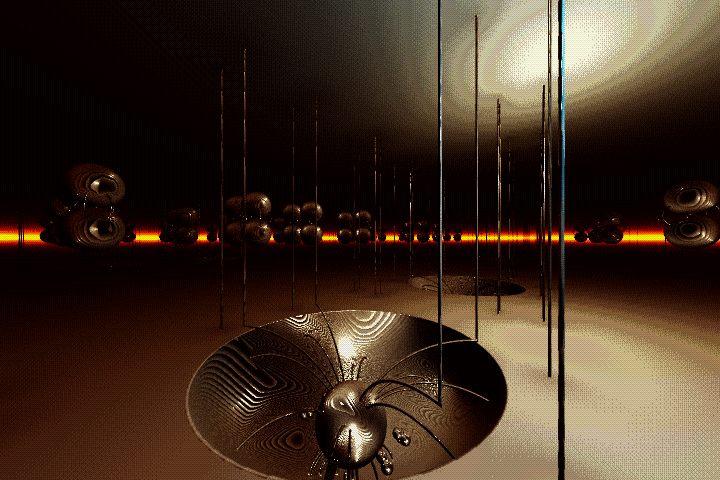

```glsl
float s=3.,e;
    for(int i=0;i++<3;p=vec3(2,4,2)-abs(abs(p)*e-vec3(3,6,1)))
      s*=e=1./min(dot(p,p),.6);
    return min(length(p.xz),abs(p.y))/s+.001;
  }
```

### float de(vec3 p){ — gaziya5 aka gaz

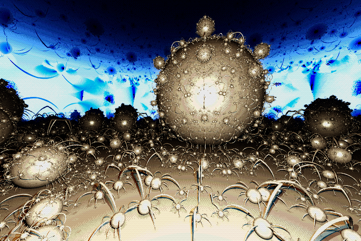

```glsl
float s=3., e;
    s*=e=3./min(dot(p,p),50.);
    p=abs(p)*e;
    for(int i=0;i++<5;)
      p=vec3(2,4,2)-abs(p-vec3(4,4,2)),
      s*=e=8./min(dot(p,p),9.),
      p=abs(p)*e;
    return min(length(p.xz)-.1,p.y)/s;
  }
```

### float de(vec3 p){ — gaziya5 aka gaz

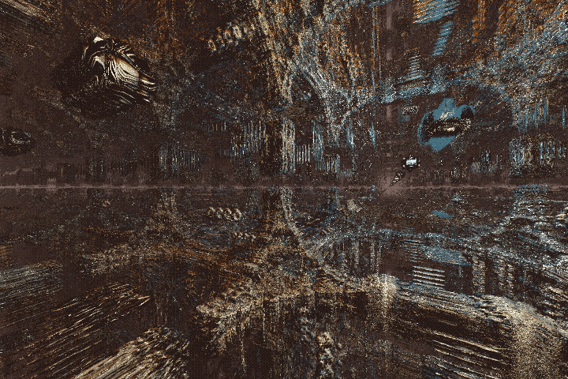

```glsl
p=sin(2.8*p+5.*sin(p*.3));
    float s=2., e;
    for(int i=0;i++<6;)
      p=abs(p-1.7)-1.5,
      s*=e=2.3/clamp(dot(p,p),.3,1.2),
      p=abs(p)*e;
    return length(p.zy)/s;
  }
```

### float de(vec3 p){ — gaziya5 aka gaz

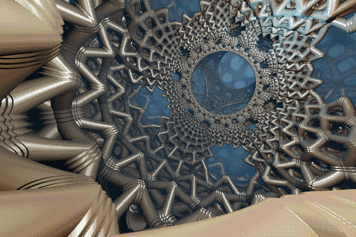

```glsl
float s=5., e;
    p=p/dot(p,p)+1.;
    for(int i=0;i++<8;p*=e)
      p=1.-abs(p-1.),
      s*=e=1.6/min(dot(p,p),1.5);
    return length(cross(p,normalize(vec3(1))))/s-5e-4;
  }
```

### float de(vec3 p){ — gaziya5 aka gaz

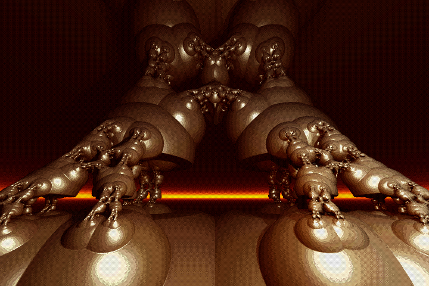

```glsl
float s=3., e, offset = 1.; //offset can be adjusted
    for(int i=0;i++<8;p*=e)
      p=abs(p-vec3(1,3,1.5+offset*.3))-vec3(1,3.+offset*.3,2),
      p*=-1., s*=e=7./clamp(dot(p,p),.7,7.);
    return (p.z)/s+1e-3;
  }
```

### float de(vec3 p){ — gaziya5 aka gaz

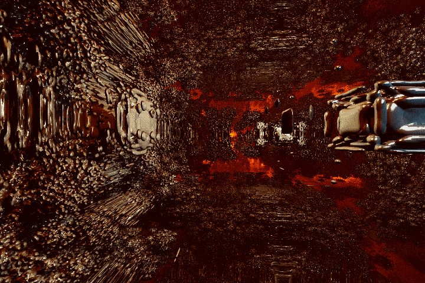

```glsl
p=sin(p+3.*sin(p*.5));
    float s=2., e;
    for(int i=0;i++<5;)
      p=abs(p-1.7)-1.3,
      s*=e=2./min(dot(p,p),1.5),
      p=abs(p)*e-1.;
    return length(p)/s;
  }
```

### float de(vec3 p){ — gaziya5 aka gaz

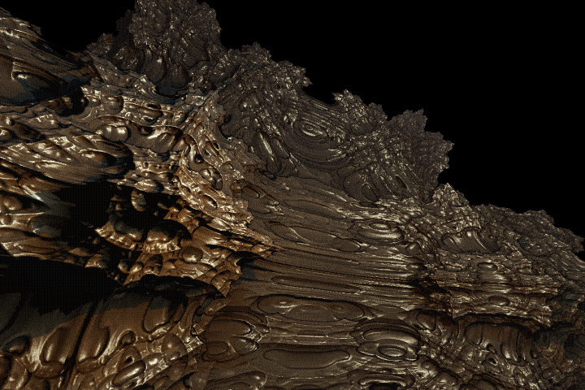

```glsl
#define M(p)p=vec2(sin(atan(p.x,p.y)*4.)/3.,1)*length(p),p.y-=2.
    float i,g,e,s;
    for(s=3.;s<4e4;s*=3.)
      M(p.xy),
      M(p.zy),
      p*=3.;
    return length(p.xy)/s-.001;
  }
```

### float de(vec3 p){ — gaziya5 aka gaz

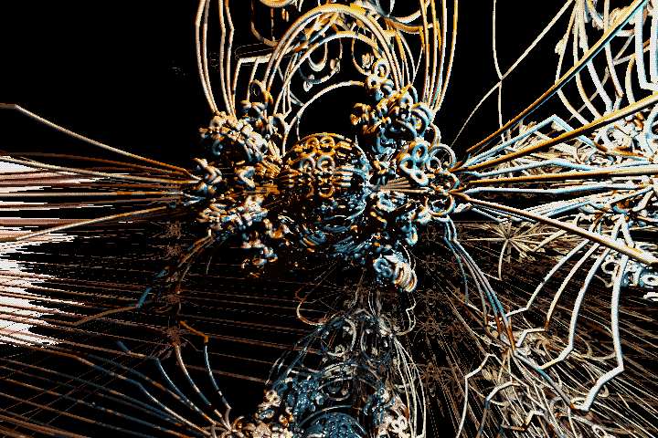

```glsl
p=1.-abs(abs(p+sin(p))-1.);
    p=p.x < p.y?p.zxy:p.zyx;
    float s=5., l;
    for(int j=0;j++<4;)
      s*=l=2./min(dot(p,p),1.5),
      p=abs(p)*l-vec3(2,1,3);
    return length(p.yz)/s;
  }
```

### float de(vec3 p){ — gaziya5 aka gaz

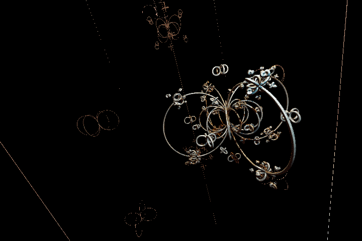

```glsl
float s=3., e;
    for(int j=0;++j<5;)
      s*=e=1./min(dot(p,p),1.),
      p=abs(p)*e-1.5;
    return length(p.yz)/s;
  }
```

### float de(vec3 p){ — gaziya5 aka gaz

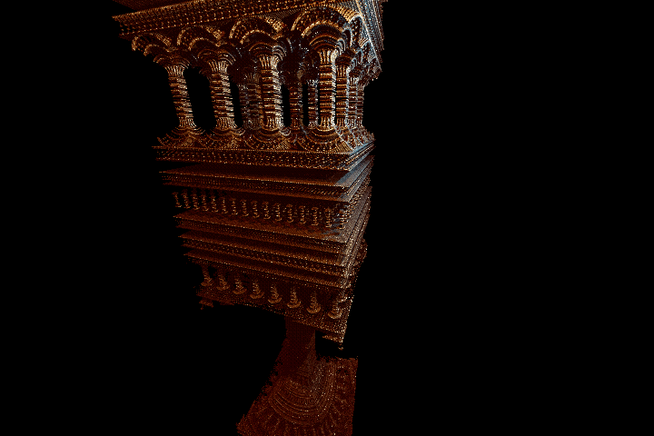

```glsl
float s=2., e;
    for(int j=0;j++<8;)
      s*=e=2./clamp(dot(p,p),.2,1.),
      p=abs(p)*e-vec3(.5,8,.5);
    return length(cross(p,vec3(1,1,-1)))/s;
  }
```

### float de(vec3 p){ — gaziya5 aka gaz

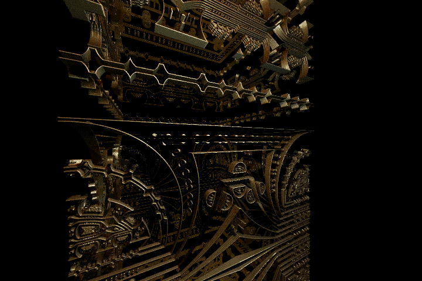

```glsl
p.xz=abs(p.xz)-1.;
    p.x>p.z?p=p.zyx:p;
    float s=2., e;
    for(int j=0;j++<7;)
      s*=e=2.2/clamp(dot(p,p),.3,1.2),
      p=abs(p)*e-vec3(1,8,.03);
    return length(p.yz)/s;
  }
```

### float de(vec3 p){ — gaziya5 aka gaz

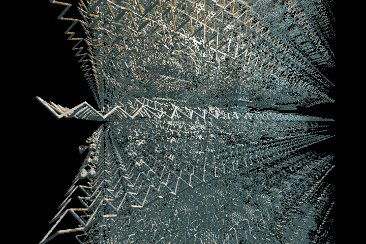

```glsl
float s=2., e;
    for(int j=0;j++<7;)
      s*=e=2.2/clamp(dot(p,p),.3,1.2),
      p=abs(p)*e-vec3(1,8,1);
    return length(cross(p,vec3(1,1,-1)))/s;
  }
```

### float de(vec3 p){ — gaziya5 aka gaz

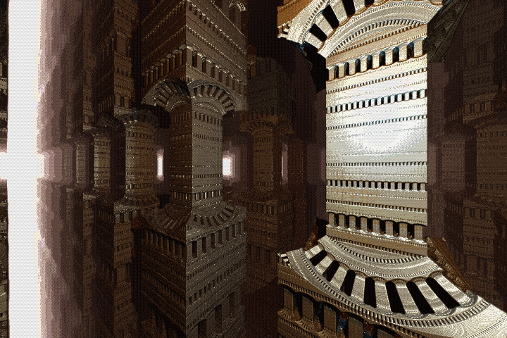

```glsl
p.xz=mod(p.xz,2.)-1.;
    float s=2., e;
    for(int j=0;j++<8;)
      s*=e=2./clamp(dot(p,p),.5,1.),
      p=abs(p)*e-vec3(.5,8,.5);
    return length(p.xz)/s;
  }
```

### float de(vec3 p){ — gaziya5 aka gaz

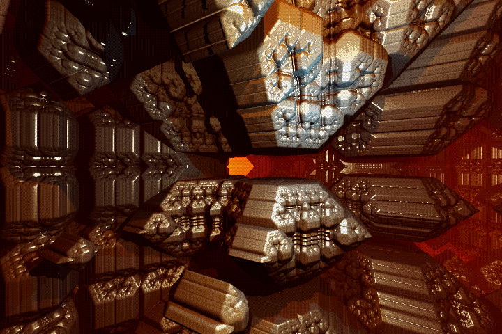

```glsl
float s=2.,e;
    for(int i=0;i<9;i++){
      p=.5-abs(p-.5);
      p.x < p.z?p=p.zyx:p;
      p.z < p.y?p=p.xzy:p;
      s*=e=2.4;
      p=abs(p)*e-vec3(.1,13,5);
    }
    return length(p)/s-0.01;
  }
```

### float de(vec3 p){ — gaziya5 aka gaz

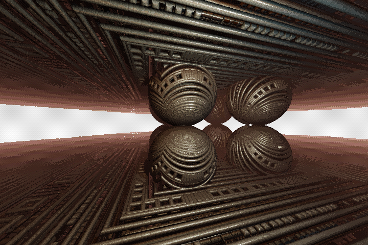

```glsl
float s=2., e;
    for(int i=0;i++<7;){
      p.xz=.8-abs(p.xz);
      p.x < p.z?p=p.zyx:p;
      s*=e=2.1/min(dot(p,p),1.);
      p=abs(p)*e-vec3(1,18,9);
    }
    return length(p)/s-0.01;
  }
```

### float de(vec3 p){ — gaziya5 aka gaz

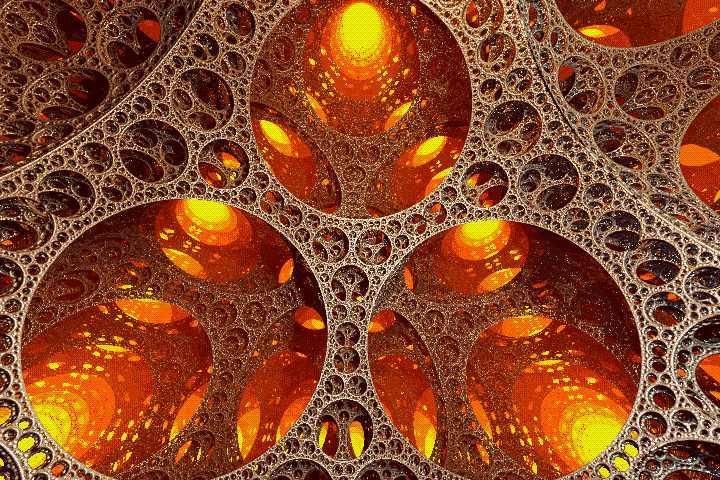

```glsl
float s=3., e;
    for(int i=0;i++<8;)
      p=mod(p-1.,2.)-1.,
      s*=e=1.4/dot(p,p),
      p*=e;
    return length(p.yz)/s;
  }
```

### float de(vec3 p){ — gaziya5 aka gaz

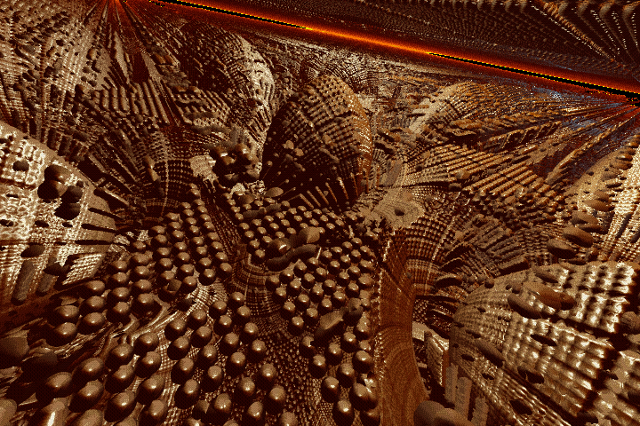

```glsl
float s=4., e;
    for(int i=0;i++<7;p.y-=10.)
      p.xz=.8-abs(p.xz),
      p.x < p.z?p=p.zyx:p,
      s*=e=2.5/clamp(dot(p,p),.1,1.2),
      p=abs(p)*e-1.;
    return length(p)/s+.001;
  }
```

### float de(vec3 p){ — gaziya5 aka gaz

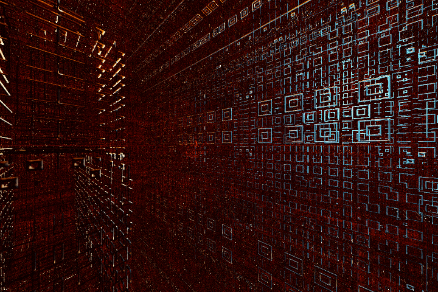

```glsl
float s=2., e;
    for(int i=0;i++<10;){
      p=.3-abs(p-.8);
      p.x < p.z?p=p.zyx:p;
      p.z < p.y?p=p.xzy:p;
      s*=e=1.7;
      p=abs(p)*e-vec3(1,50,5);
    }
    return length(p.xy)/s+.001;
  }
```

### float de(vec3 p){ — gaziya5 aka gaz

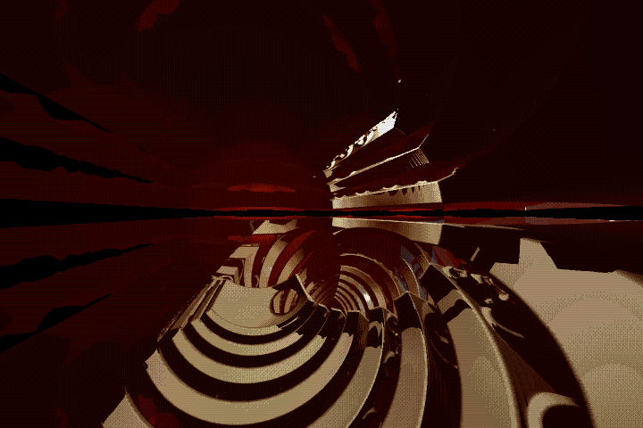

```glsl
float s=1., e, offset=0.26; // vary between 0 and 1
    for(int i=0;i++<5;){
      s*=e=2./min(dot(p,p),1.);
      p=abs(p)*e-vec3(1,10.*offset,1);
    }
    return length(max(abs(p)-1.,0.))/s;
  }
```

### float de(vec3 p){ — gaziya5 aka gaz

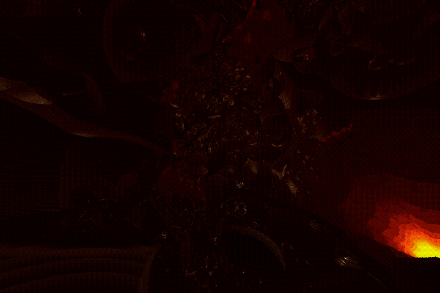

```glsl
float s=2.5, e;
    p=abs(mod(p-1.,2.)-1.)-1.;
    for(int j=0;j++<10;)
      p=1.-abs(p-1.),
      s*=e=-1.8/dot(p,p),
      p=p*e-.7;
    return abs(p.z)/s+.001;
  }
```

### float de(vec3 p){ — gaziya5 aka gaz

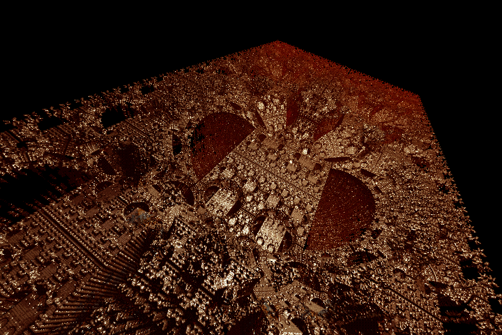

```glsl
float s=2., e;
    for(int j=0;++j<8;s*=e=2./clamp(dot(p,p),.4,1.),p=abs(p)*e-vec3(2,1,.7));
    return length(p)/s;
  }
```

### float de(vec3 p){ — gaziya5 aka gaz

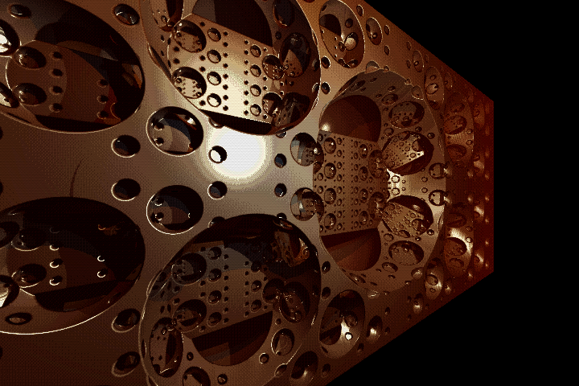

```glsl
float s=2., e;
    for(int j=0;++j<8;s*=e=2./clamp(dot(p,p),.4,1.),p=abs(p)*e-vec3(2,1,.7));
    return length(p-clamp(p,-2.,2.))/s;
  }
```

### float de(vec3 p){ — gaziya5 aka gaz

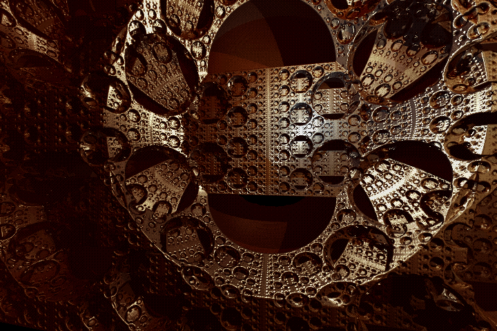

```glsl
float s=2., e;
    for(int j=0;++j<18;s*=e=2./clamp(dot(p,p),.4,1.),p=abs(p)*e-vec3(2,1,.7));
    return length(p)/s;
  }
```

### float de(vec3 p){ — gaziya5 aka gaz

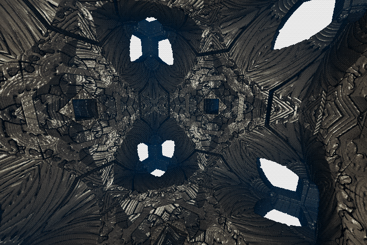

```glsl
float a=2.,s=3.,e,l=dot(p,p);
    p=abs(p)-1.;
    p.x < p.y?p=p.yxz:p;
    p.x < p.z?p=p.zyx:p;
    p.y < p.z?p=p.xzy:p;
    for(int i=0;i<8;i++){
      s*=e=2.1/clamp(dot(p,p),.1,1.);
      p=abs(p)*e-vec3(.3*l,1,5.*l);
    }
    p-=clamp(p,-a,a);
    return length(p)/s-0.;
  }
```

### float de(vec3 p){ — gaziya5 aka gaz

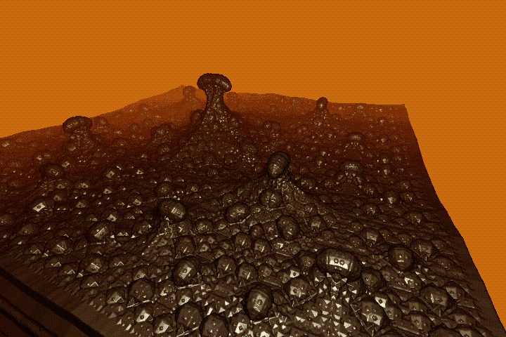

```glsl
p.y+=1.4;
    //p.xz*=rotate2D(t*.5+.5);
    for(int j=0;++j<9;)
      p=abs(p),
      p.xy*=rotate2D(-9.78),
      p.x<p.y?p=p.yxz:p,
      p.x<p.z?p=p.zyx:p,
      p.y<p.z?p=p.xzy:p,
      p.yz*=rotate2D(-1.16),
      p=1.9*p-vec3(1,1,-1);
    return length(p-clamp(p,-5.,5.))/500.;
  }
```

### float de(vec3 p){ — gaziya5 aka gaz

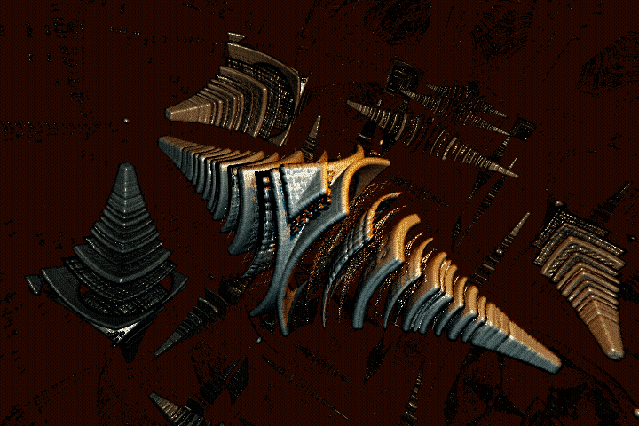

```glsl
float s=2.;
    float e = 0;
    float l=dot(p,p);
    p=abs(abs(p)-.4)-.2;
    p.x<p.y?p=p.yxz:p;
    p.y<p.z?p=p.xzy:p;
    for(int i=0;i++<8;){
      s*=e=2./min(dot(p,p),1.3);
      p=abs(p)*e-vec2(l,16.).xxy;
    }
    return length(p)/s;
  }
```

### float de(vec3 p){ — gaziya5 aka gaz

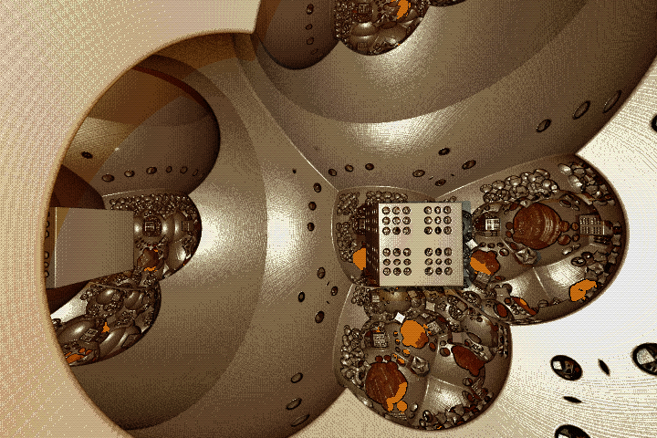

```glsl
vec3 Q,S;
    Q=S=p;
    float a=1.,d;
    for(int j=0;j++<9;a=a/d+1.)
      Q=2.*clamp(Q,-.6,.6)-Q,
      d=clamp(dot(Q,Q),.1,1.)*.5,
      Q=Q/d+S;
    return d=(length(Q)-9.)/a;
  }
```

### float de(vec3 p){ — gaziya5 aka gaz

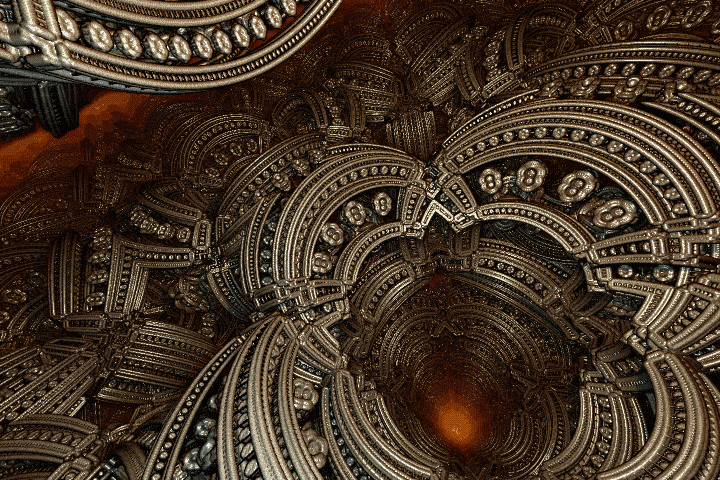

```glsl
p=fract(p)-.5;
    float s=3., l;
    for(int j=0;j++<8;)
      p=abs(p),
      p=p.x<p.y?p.zxy:p.zyx,
      s*=l=2./min(dot(p,p),1.),
      p=p*l-vec3(.2,1,4);
    return length(p)/s;
  }
```

### float de(vec3 p){ — Ivan Dianov

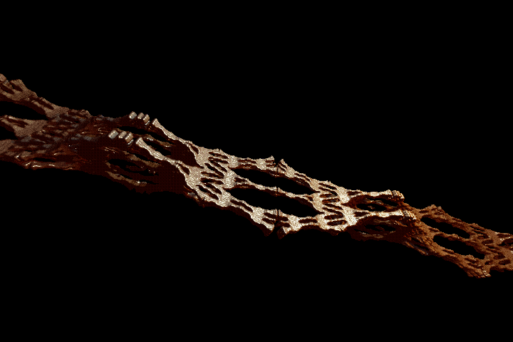

```glsl
#define rot(a) mat2(cos(a),sin(a),-sin(a),cos(a))
    p.z-=.25;
    float j=0.,c=0.,s=1.;
    p.y = fract(p.y)-.5;
    for(;j<10.;j++){
      p=abs(p);
      p-=vec2(.05,.5).xyx;
      p.xz*=rot(1.6);
      p.yx*=rot(.24);
      p*=2.; s*=2.;
    }
    return (length(p)-1.)/s*.5;
  }
```

### float de(vec3 p){ — Kali

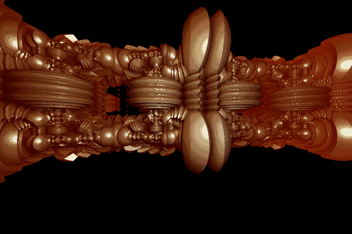

```glsl
p.x = abs(p.x) - 3.3;
    p.z = mod(p.z + 2.0, 4.0) -  2.0;
    vec4 q = vec4(p, 1);
    q.xyz -= 1.0;
    q.xyz = q.zxy;
    for(int i = 0; i < 6; i++) {
      q.xyz = abs(q.xyz + 1.0) - 1.0;
      q /= clamp(dot(q.xyz, q.xyz), 0.25, 1.0);
      q *= 1.1;
      float s = sin(-0.35);
      float c = cos(-0.35);
      q.xy = mat2(c,s,-s,c)*q.xy;
    }
    return (length(q.xyz) - 1.5)/q.w;
  }
```

### float de(vec3 p){ — Kali

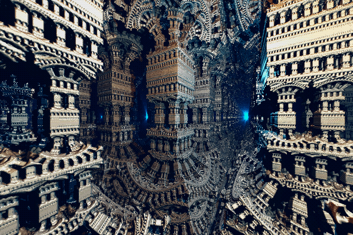

```glsl
p.xz=abs(.5-mod(p.xz,1.))+.01;
    float DEfactor=1.;
    for (int i=0; i<14; i++) {
      p = abs(p)-vec3(0.,2.,0.);
      float r2 = dot(p, p);
      float sc=2./clamp(r2,0.4,1.);
      p*=sc;
      DEfactor*=sc;
      p = p - vec3(0.5,1.,0.5);
    }
    return length(p)/DEfactor-.0005;
  }
```

### float de(vec3 p){ — kamoshika

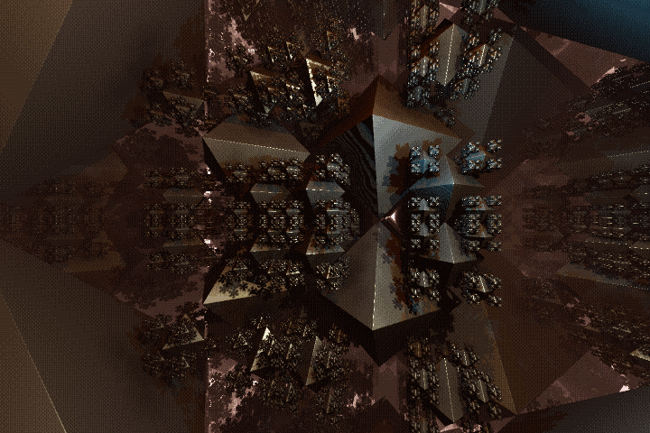

```glsl
vec3 Q;
    float i,d=1.,a,b=sqrt(3.);
    Q=mod(p,b*2.)-b;
    a=1.; d=9.;
    for(int j=0;j++<7;){
      Q=abs(Q);
      d=min(d,(dot(Q,vec3(1)/b)-1.)/a);
      Q=Q*3.-6./b;a*=3.;
    }
    return d;
  }
```

### float de(vec3 p){ — kamoshika

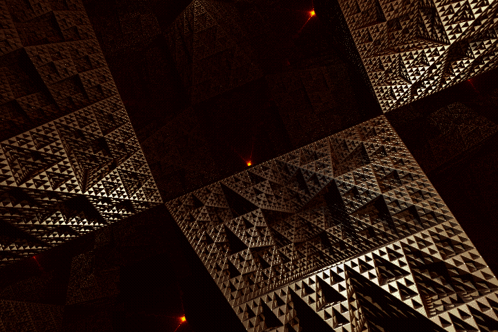

```glsl
float i,d=1.,b=1.73;
    vec3 Q=mod(p,b*2.)-b;
    for(int j=0;j++<6;){
      Q=abs(Q);
      if(Q.y>Q.x)Q.xy=Q.yx;
      if(Q.z>Q.x)Q.zx=Q.xz;
      Q*=2.;
      Q.x-=b;
    }
    return (dot(abs(Q),vec3(1)/b)-1.)/64.;
  }
```

### float de(vec3 p){ — kamoshika

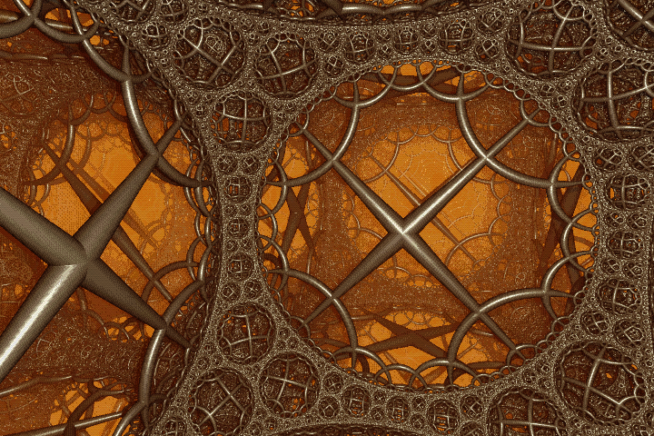

```glsl
vec3 Q = abs(mod(p,1.8)-.9);
    float a=3.;
    float d = 1.;
    for(int j=0;j++<9;)
      Q=2.*clamp(Q,-.9,.9)-Q,
      d=dot(Q,Q),
      Q/=d,a/=d;
    if(Q.z>Q.x)
      Q.xz=Q.zx;
    if(Q.z>Q.y)
      Q.yz=Q.zy;
    Q.yx*=rotate2D(3.1415/4.);
    return (length(Q.zx)-.03)/a;
  }
```

### float de(vec3 p){ — kamoshika

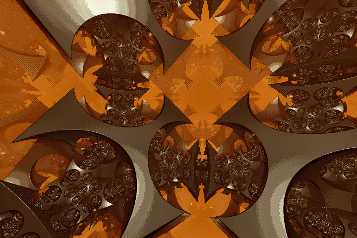

```glsl
vec3 Q=abs(mod(p,1.8)-.9);
    float a=1.;
    float d=1.;
    for(int j=0;j++<8;)
      Q=2.*clamp(Q,-.9,.9)-Q,
      d=dot(Q,Q),
      Q/=d,
      a/=d;
    return (Q.x+Q.y+Q.z-1.3)/a/3.;
  }
```

### float de(vec3 p){ — kamoshika

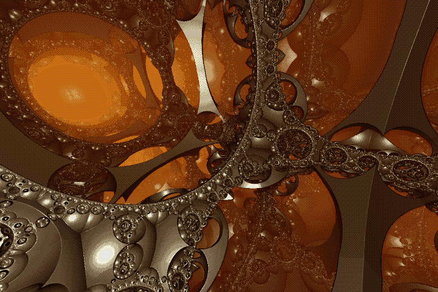

```glsl
vec3 Q=abs(p);
    float a=1., d=1.;
    for(int j=0;j++<9;)
      Q=2.*clamp(Q,-.9,.9)-Q,
      d=dot(Q,Q),
      Q/=d,
      a/=d;
    return (Q.x+Q.z-.6)/a/3.;
  }
```

### float de(vec3 p){ — kamoshika

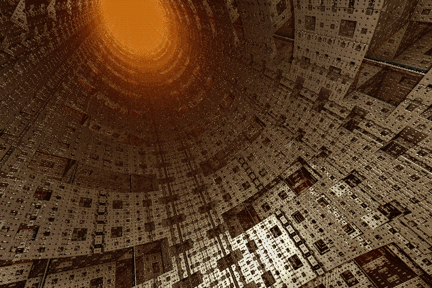

```glsl
vec3 Q = fract(p)-.5;
    for(int j=0;j++<5;){
      Q=abs(Q)-.17;
      if(Q.y>Q.x)
        Q.xy=Q.yx;
      if(Q.z>Q.y)
        Q.yz=Q.zy;
      Q.z=abs(Q.z);
      Q-=.17;
      Q*=3.;
    }
    return max((length(Q)-.9)/3e2,1.37-length(p.xy));
  }
```

### float de(vec3 p){ — kamoshika

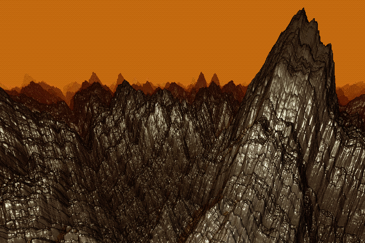

```glsl
float i,j,d=1.,a;
    vec3 Q;
    a=1.;
    d=p.y+1.;
    for(j=0.;j++<9.;)
      Q=(p+fract(sin(j)*1e4)*3.141592)*a,
      Q+=sin(Q)*2.,
      d+=sin(Q.x)*sin(Q.z)/a,
      a*=2.;
    return d*.15;
  }
```

### float de(vec3 p){ — kamoshika

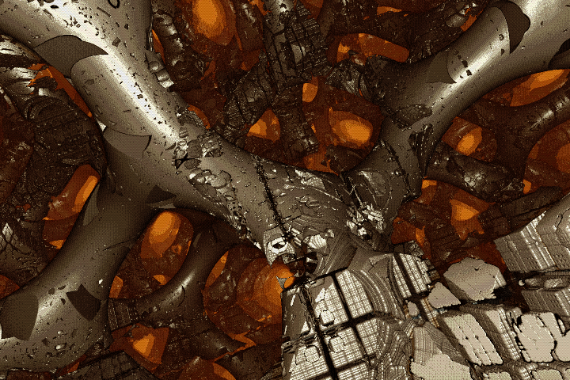

```glsl
vec3 Q,S;
    float i,d=1.,a;
    Q=S=mod(p,8.)-4.;
    a=1.;
    for(int j=0;j++<9;a=a/d+1.)
      Q=2.*clamp(Q,-.7,.7)-Q,
      d=clamp(dot(Q,Q),.5,1.)*.5,
      Q=Q/d+S;
    return max((length(Q)-6.)/a,dot(sin(p),cos(p.yzx))+1.2)*0.6;
  }
```

### float de(vec3 p){ — kamoshika

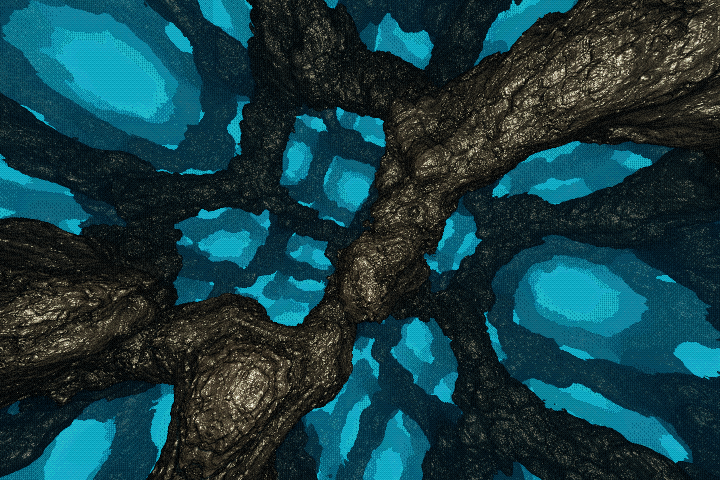

```glsl
vec3 Q;
    float i,j,d=1.,a;
    d=dot(sin(p),cos(p.yzx))+1.2;
    a=1.;
    for(j=0.;j++<9.;)
      Q=(p+fract(sin(j)*3e3)*9.)*a,
      Q+=sin(Q*1.05)*2.,
      Q=sin(Q),
      d+=Q.x*Q.y*Q.z/a*.4,
      a*=2.;
    return d*.4;
  }
```

### float de(vec3 p){ — kamoshika

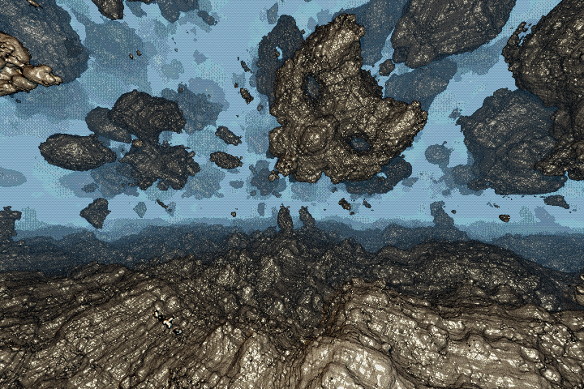

```glsl
vec3 Q;
    float i,j,d=1.,a;
    d=min(p.y,0.)+.3;
    a=1.;
    for(j=0.;j++<9.;)
      Q=(p+vec3(9,0,0)+fract(sin(j)*1e3)*6.283)*a,
      Q+=sin(Q)*2.,
      Q=sin(Q),
      d+=Q.x*Q.y*Q.z/a,
      a*=2.;
    return d*.3;
  }
```

### float de(vec3 p){ — kamoshika

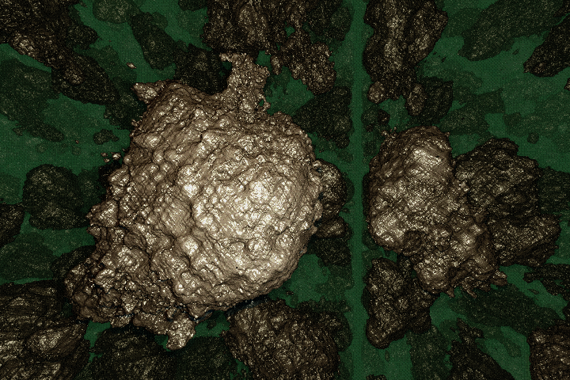

```glsl
vec3 Q;
    float i,j,d=1.,a;
    d=.6; a=1.;
    for(j=0.;j++<9.;)
      Q=(p+fract(sin(j*vec3(7,8,9))*1e3)*9.)*a,
      Q+=sin(Q*.5),
      Q=sin(Q),
      d+=Q.x*Q.y*Q.z/a,
      a*=2.;
    return d*.3;
  }
```

### float de(vec3 p){ — kamoshika

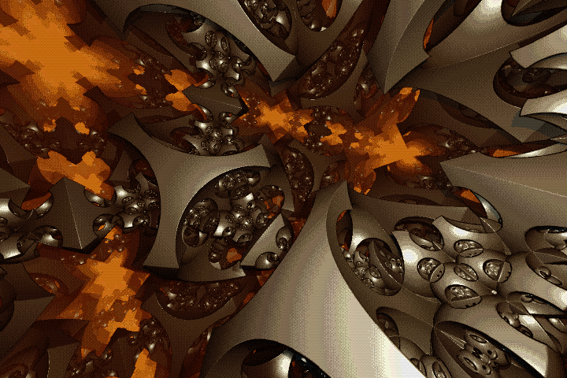

```glsl
vec3 Q;
    float i,d=1.,a;
    Q=abs(mod(p,1.8)-.9);
    a=3.;
    for(int j=0;j++<8;)
      Q=2.*clamp(Q,-.9,.9)-Q,
      d=dot(Q,Q),
      Q/=d,
      a/=d,
      Q+=.05;
    return d=(Q.x+Q.y+Q.z-1.6)/a;
  }
```

### float de(vec3 p){ — kamoshika

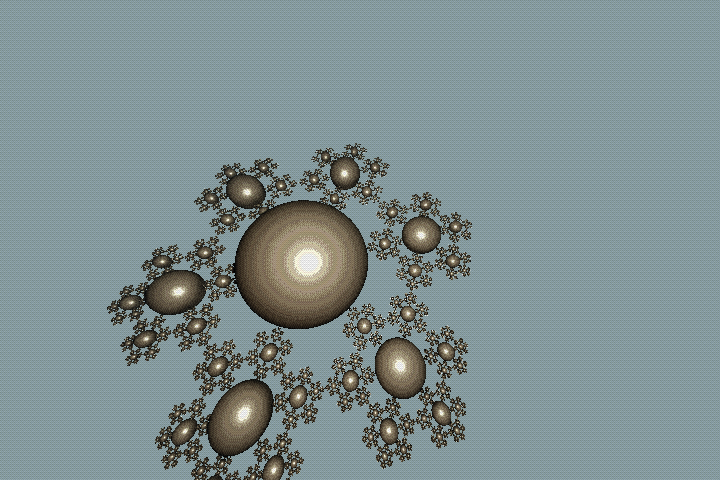

```glsl
vec3 Q;
    float d=1.,a;
    Q=p; d=a=1.;
    for(int j=0;j++<8;)
      d=min(d,(length(Q)-.5)/a),
      Q.xz*=rotate2D(ceil(atan(Q.z,Q.x)/1.05-.5)*1.05),
      Q.x-=1., a*=3., Q*=3.;
    return d;
  }
```

### float de(vec3 p){ — kamoshika

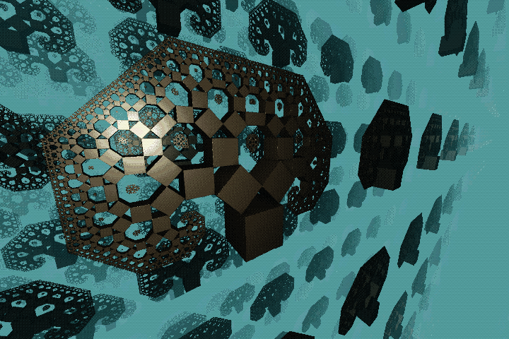

```glsl
vec3 Q;
    float d=1.,a;
    Q=mod(p,8.)-4.;
    Q.y+=1.5;
    d=a=2.;
    for(int j=0;j++<15;)
      Q.x=abs(Q.x),
      d=min(d,length(max(abs(Q)-.5,0.))/a),
      Q.xy=(Q.xy-vec2(.5,1))*rotate2D(-.785),
      Q*=1.41,
      a*=1.41;
    return d;
  }
```

### float de(vec3 p){ — kamoshika

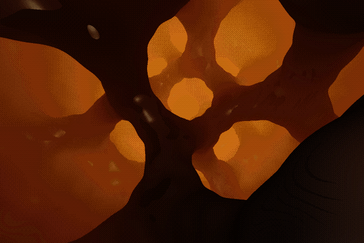

```glsl
vec3 Q=p;
    float i,d=1.,c;
    Q.x+=M_PI/2.;
    c=dot(sin(Q),cos(Q.yzx))+1.;
    d=7.-length(p.xy);
    return d=(c+d-sqrt((c-d)*(c-d)+.2))*.5+snoise3D(p)*.1;
  }
```

### float de(vec3 p){ — Nameless

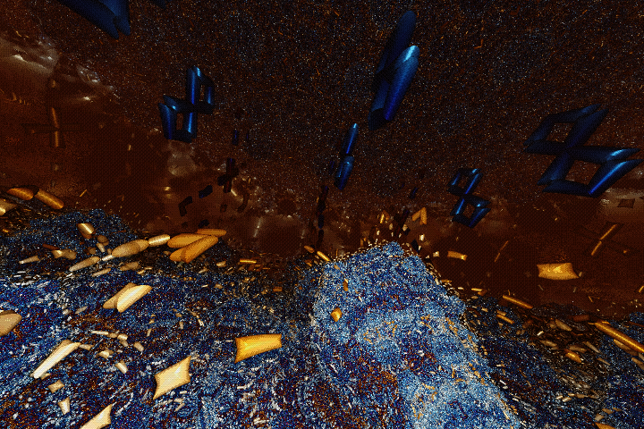

```glsl
float s=3., e;
    s*=e=3./min(dot(p,p),20.);
    p=abs(p)*e;
    escape = 0.;
    for(int i=0;i++<12;){
      p=vec3(1,4,2)-abs(p-vec3(2,4,2)),
      s*=e=8./min(dot(p,p),12.),
      p=abs(p)*e;
      escape += exp(-0.2*dot(p,p));
    }
    return min(length(p.xz)-.1,p.y)/s;
  }
```

### float de(vec3 p){ — Nameless

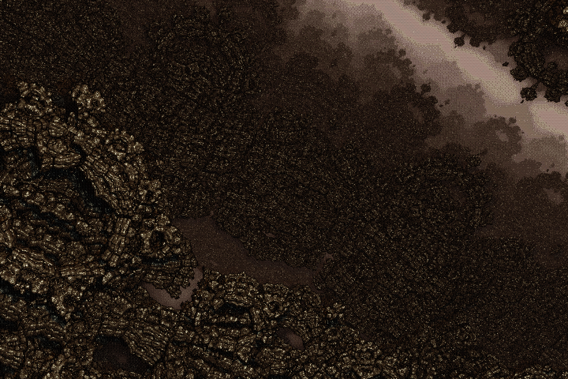

```glsl
float s = 1.;
    float t = 999.;
    for(int i = 0; i < 12; i++){
      float k =  1.3/clamp(dot(p,p),0.1,1.);
      p *= k; s *= k;
      p=abs(p)-vec3(6.2,2.,1.7);
      p=mod(p-1.,2.)-1.;
      t = min(t, length(p)/s);
    }
    return t;
  }
```

### float de(vec3 p){ — Nameless

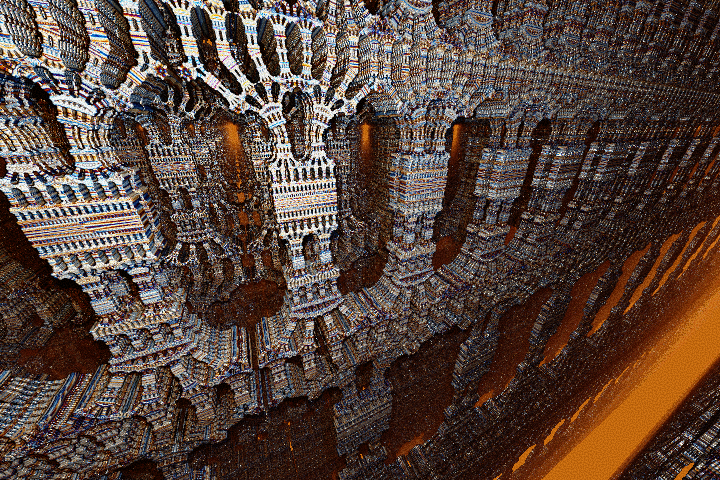

```glsl
p.xz=abs(.5-mod(p.xz,1.))+.01;
    float DEfactor=1.;
    escape = 0.;
    for (int i=0; i<14; i++) {
      p = abs(p)-vec3(0.,2.,0.);  
      float r2 = dot(p, p);
      float sc=2./clamp(r2,0.4,1.);
      p*=sc; 
      DEfactor*=sc;
      p = p - vec3(0.1,1.2,0.5);
      escape += exp(-0.2*dot(p,p));
    }
    return length(p)/DEfactor-.0005;
  }
```

### float de(vec3 p){ — phi16

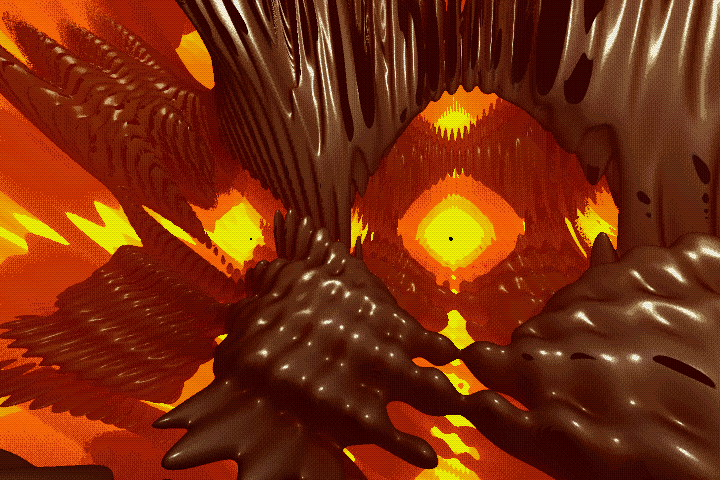

```glsl
return length(.05*cos(9.*p.y*p.x)+cos(p)-.1*cos(9.*(p.z+.3*p.x-p.y)))-1.;
  }
```

### float de(vec3 p){ — shane

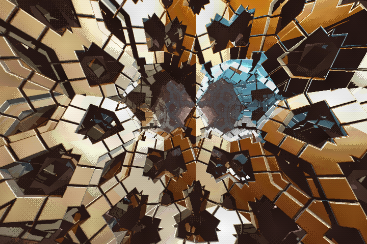

```glsl
const vec3 offs = vec3(1, .75, .5); // Offset point.
    const vec2 a = sin(vec2(0, 1.57079632) + 1.57/2.);
    const mat2 m = mat2(a.y, -a.x, a);
    const vec2 a2 = sin(vec2(0, 1.57079632) + 1.57/4.);
    const mat2 m2 = mat2(a2.y, -a2.x, a2);
    const float s = 5.; // Scale factor.
    float d = 1e5; // Distance.
    p  = abs(fract(p*.5)*2. - 1.);
    float amp = 1./s;
    for(int i=0; i<2; i++){
      p.xy = m*p.xy;
      p.yz = m2*p.yz;
      p = abs(p);
      p.xy += step(p.x, p.y)*(p.yx - p.xy);
      p.xz += step(p.x, p.z)*(p.zx - p.xz);
      p.yz += step(p.y, p.z)*(p.zy - p.yz);
      p = p*s + offs*(1. - s);
      p.z -= step(p.z, offs.z*(1. - s)*.5)*offs.z*(1. - s);
      p=abs(p);
      d = min(d, max(max(p.x, p.y), p.z)*amp);
      amp /= s;
    }
    return d - .035;
  }
```

### float de(vec3 p){ — takusakuw

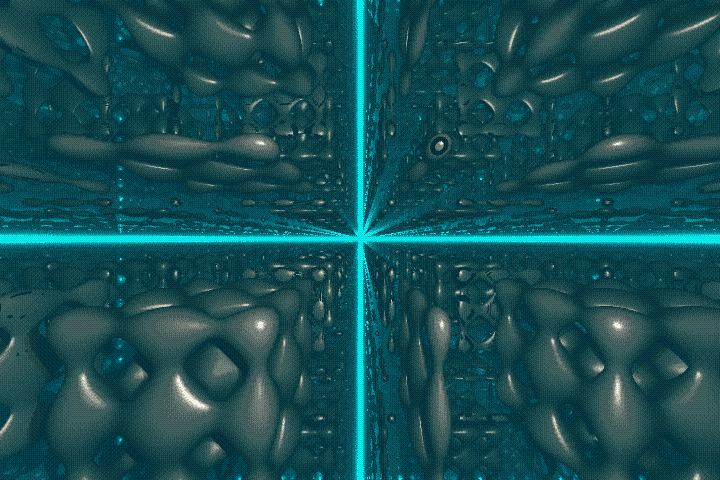

```glsl
return length(sin(p)+cos(p*.5))-.4;
  }
```

### float de(vec3 p){ — takusakuw

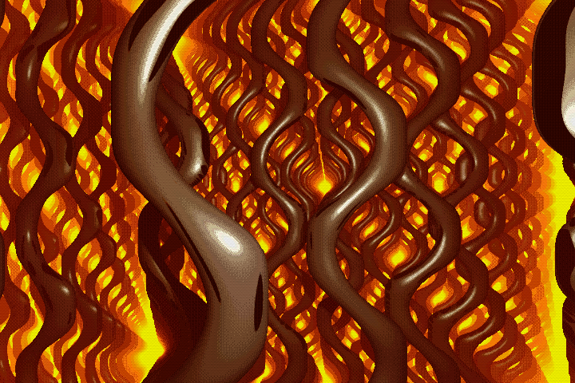

```glsl
return (length(sin(p.zxy)-cos(p.zzx))-.5);
  }
```

### float de(vec3 p){ — unknown

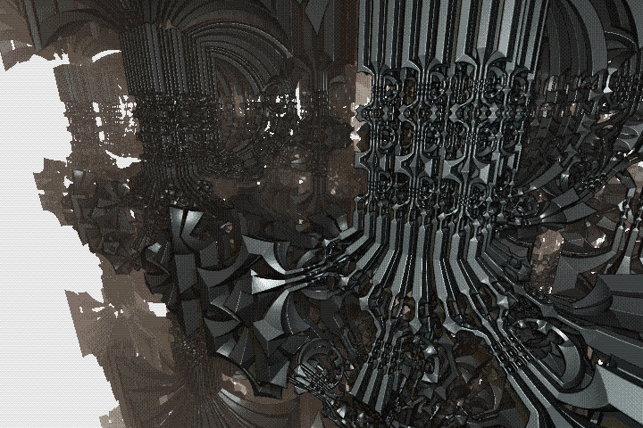

```glsl
const float mr=0.25, mxr=1.0;
    const vec4 scale=vec4(-3.12,-3.12,-3.12,3.12),p0=vec4(0.0,1.59,-1.0,0.0);
    vec4 z = vec4(p,1.0);
    for (int n = 0; n < 3; n++) {
      z.xyz=clamp(z.xyz, -0.94, 0.94)*2.0-z.xyz;
      z*=scale/clamp(dot(z.xyz,z.xyz),mr,mxr);
      z+=p0;
    }
    z.y-=3.0*sin(3.0+floor(p.x+0.5)+floor(p.z+0.5));
    float dS=(length(max(abs(z.xyz)-vec3(1.2,49.0,1.4),0.0))-0.06)/z.w;
    return dS;
  }
```

### float de(vec3 p){ — xem

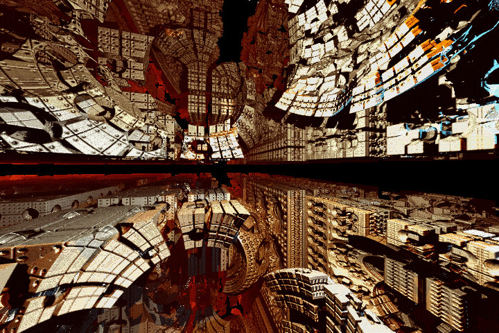

```glsl
vec4 o=vec4(p,1);
    vec4 q=o;
    for(float i=0.;i<9.;i++){
      o.xyz=clamp(o.xyz,-1.,1.)*2.-o.xyz;
      o=o*clamp(max(.25/dot(o.xyz,o.xyz),.25),0.,1.)*vec4(11.2)+q;
    }
    return (length(o.xyz)-1.)/o.w-5e-4;
  }
```

### float de(vec3 p){ — yonatan

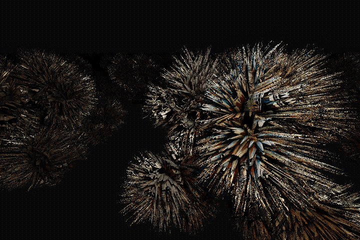

```glsl
float j = 0.5;
    for(p.xz=mod(p.xz,6.)-3.;++j<9.;p=3.*p-.9)
      p.xz=abs(p.xz),
      p.z>p.x?p=p.zyx:p,
      p.y>p.z?p=p.xzy:p,
      p.z--,
      p.x-=++p.y*.5;
    return min(.2,p.x/4e3-.2);
  }
```

### float de(vec3 p){ — yonatan

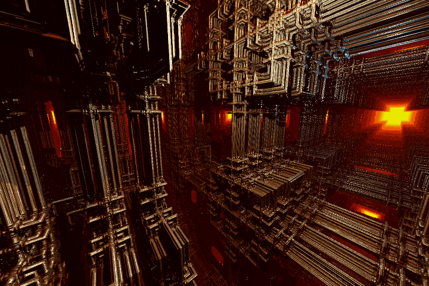

```glsl
p=fract(p)-.5;
    vec3 O=vec3(2.,0,3.);
    for(int j=0;j++<7;){
      p=abs(p);
      p=(p.x < p.y?p.zxy:p.zyx)*3.-O;
      if(p.z < -.5*O.z)
      p.z+=O.z;
    }
    return length(p.xy)/3e3;
  }
```

### float de(vec3 p){ — yonatan

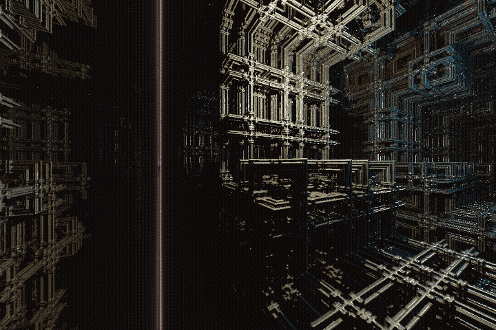

```glsl
p=fract(p)-.5;
    vec3 O=vec3(2.,0,5.);
    for(int j=0;j++<7;){
      p=abs(p);
      p=(p.x < p.y?p.zxy:p.zyx)*3.-O;
      if(p.z < -.5*O.z)
      p.z+=O.z;
    }
    return length(p.xy)/3e3;
  }
```

### float de(vec3 p){ — yonatan

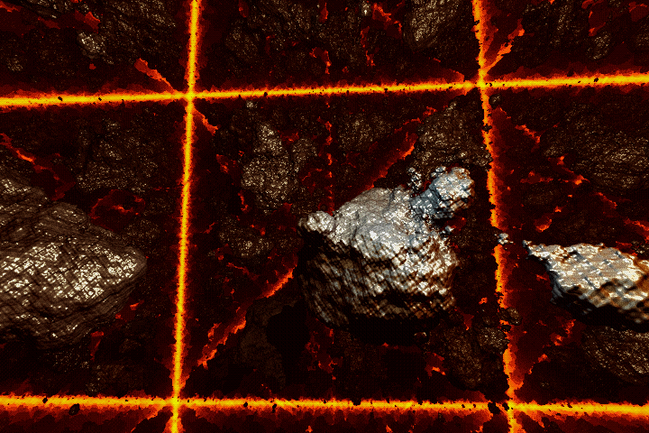

```glsl
float i,a,n,h,d=1.,t=0.3; // change t for different behavior
    vec3 q;
    n=.4;
    for(a=1.;a<2e2;n+=q.x*q.y*q.z/a)
      p.xy*=rotate2D(a+=a),
      q=cos(p*a+t);
    return n*.3;
  }
```

### float de(vec3 p){ — yonatan

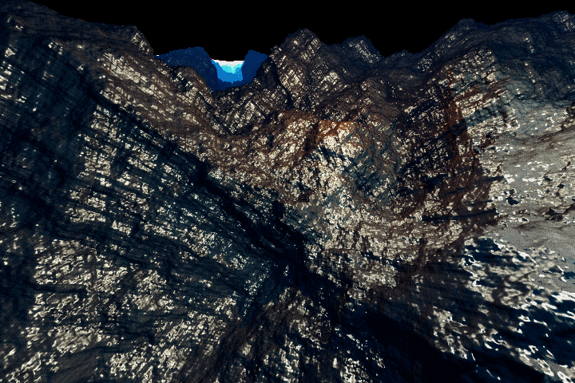

```glsl
vec3 z,q;
    p.z -= 9.; z=p;
    float a=1.,n=.9;
    for(int j=0;j++<15;){
      p.xy*=rotate2D(float(j*j));
      a*=.66;
      q=sin(p*=1.5);
      n+=q.x*q.y*q.z*a;
    }
    return (n*.2-z.z*.2);
  }
```

### float de(vec3 p){ — yonatan

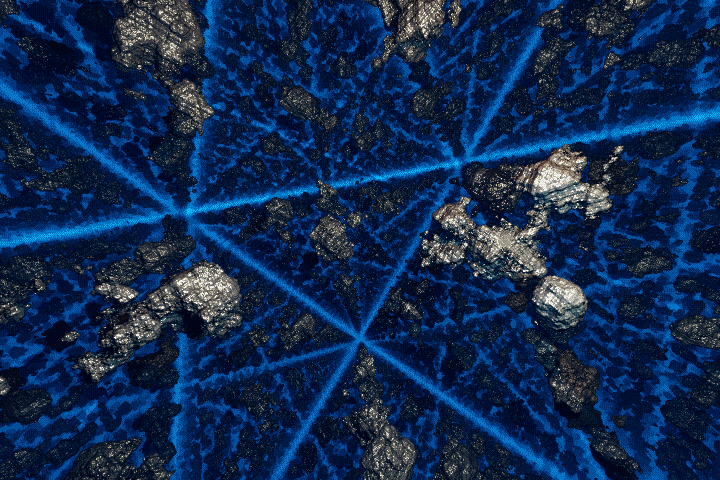

```glsl
vec3 q;
    float s=1., a=1., n=.5;
    for(int j=0;j++<9;){
      p.xy*=rotate2D(float(j*j));
      a*=.5; q=sin(p+=p);
      n+=q.x*q.y*q.z*a;
    }
    return n*.2;
  }
```

### float de(vec3 p){ — yonatan

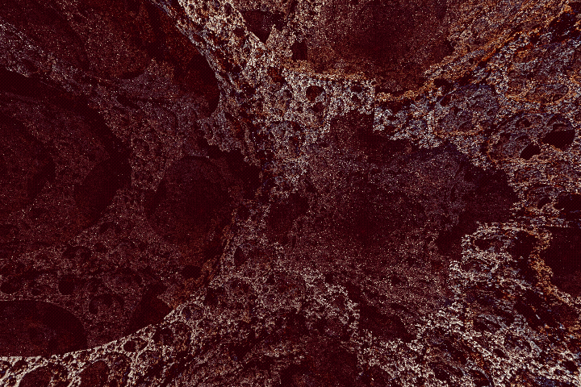

```glsl
float h,d=1.,i,u,s, t = 0.8; // vary t for different behavior
    p+=vec3(1,1,sin(t/4.)*3.);
    s=2.;
    for(int j=0;j<9;j++){
      p.xy*=rotate2D(t/4.);
      u=4./3./dot(p,p);
      s*=u;
      p=mod(1.-p*u,2.)-1.;
    }
    return (length(p)/s);
  }
```

### float de(vec3 p){ — yonatan

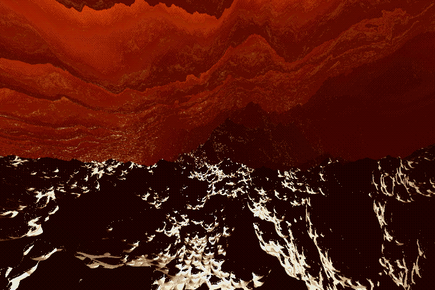

```glsl
float i,j,e,g,h,s;
    p.y-=p.z*.5;
    for(j=s=h=.01;j++<9.;s+=s)
      p.xz*=rotate2D(2.),
      h+=abs(sin(p.x*s)*sin(p.z*s))/s;
    return max(0.,p.y+h);
  }
```

### float de(vec3 p){ — yonatan

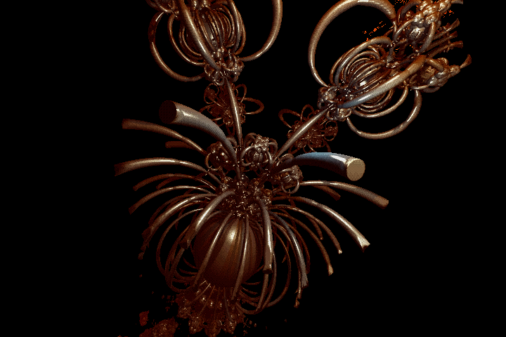

```glsl
float i,g,e,s,q;
    q=length(p)-1.;
    p.y++;
    s=3.;
    for(int i=0;i++<7;p=vec3(0,5,0)-abs(abs(p)*e-3.))
      s*=e=max(1.,14./dot(p,p));
    return max(q,min(1.,length(p.xz)-.3))/s;
  }
```

### float de(vec3 p){ — yonatan

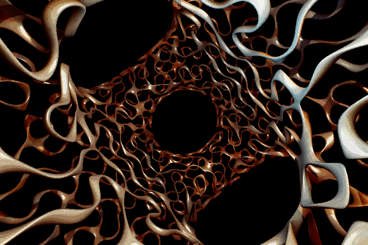

```glsl
return (length(vec2((length(vec2(length(p.xy)-1.3,
      length(p.zy)-1.3))-.5), dot(cos(p*12.),sin(p.zxy*12.))*.1))-.02)*.3;
  }
```

### float de(vec3 p){ — yonatan

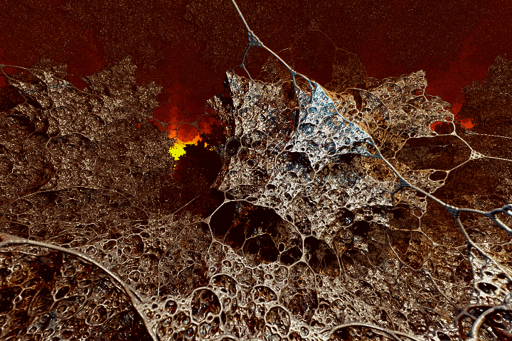

```glsl
float s=3., offset=8., e;
    for(int i=0;i++<9;p=vec3(2,4,2)-abs(abs(p)*e-vec3(4,4,2)))
      s*=e=max(1.,(8.+offset)/dot(p,p));
    return min(length(p.xz),p.y)/s;
  }
```

### float de(vec3 p){ — yonatan

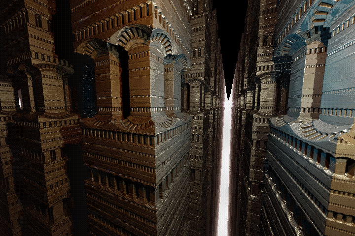

```glsl
p.xz=mod(p.xz,2.)-1.;
    vec3 q=p;
    float s=2., e;
    for(int j=0;j++<8;)
      s*=e=2./clamp(dot(p,p),.5,1.),
      p=abs(p)*e-vec3(.5,8,.5);
    return max(q.y,length(p.xz)/s);
  }
```

### float de(vec3 p){ — yonatan

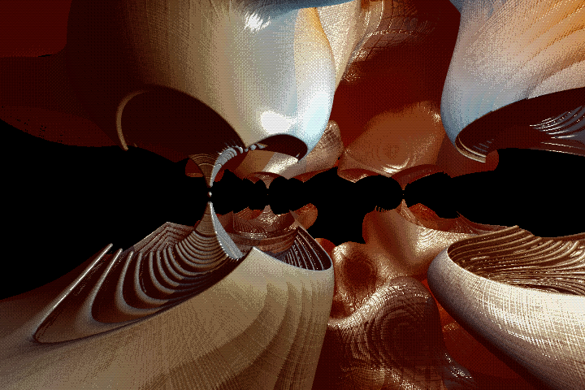

```glsl
float n=1.+snoise3D(p), s=4., e;
    for(int i=0;i++<7;p.y-=20.*n)
      p.xz=.8-abs(p.xz),
      p.x < p.z?p=p.zyx:p,
      s*=e=2.1/min(dot(p,p),1.),
      p=abs(p)*e-n;
    return length(p)/s+1e-4;
  }
```

### float de(vec3 p){ — yosshin

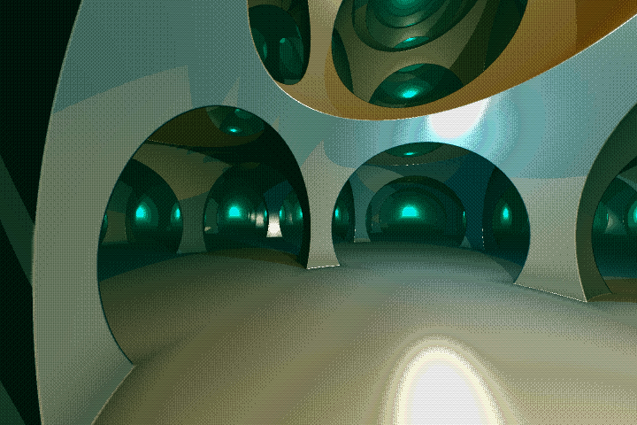

```glsl
return min(.65-length(fract(p+.5)-.5),p.y+.2);
  }
```

### float de(vec3 p){ — yuruyurau

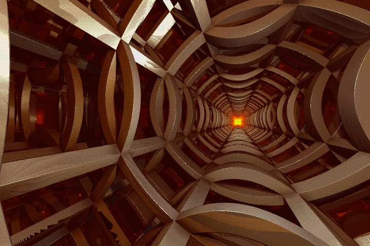

```glsl
#define b(p)length(max(abs(mod(p,.8)-.4)-.05,0.))
    vec3 l;
    p=cos(p)-vec3(.3), p.yx*=mat2(cos(.8+vec4(0,3,5,0)));
    return min(min(b(p.xy),b(p.xz)),b(p.yz));
  }
```

### float de(vec3 p){ — gaziya5 aka gaz

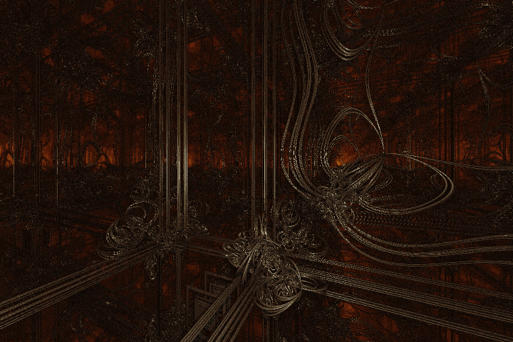

```glsl
p=cos(p);
    float s=2., e;
    for(int j=0;j++<7;)
      p=1.8-abs(p-1.2),
      p=p.x<p.y?p.zxy:p.zyx,
      s*=e=4.5/min(dot(p,p),1.5),
      p=p*e-vec3(.2,3,4);
    return length(p.xz)/s;
  }
```

### float de(vec3 p){  (distance bound doesn't hold) — catzpaw

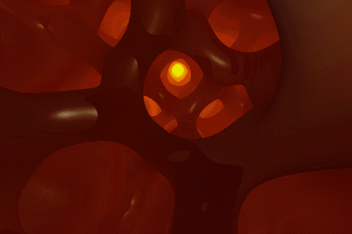

```glsl
vec3 v=vec3(0,1.5,6.3);
    return min(6.-length((p-v).xy+sin(p.yx)),
      dot(cos(p),sin(p.yzx)))+sin(sin(p.z*3.5)+v.z)*.1+1.;
  }
```

### float de(vec3 p){ // has aliasing issues — adapted from code by wrighter

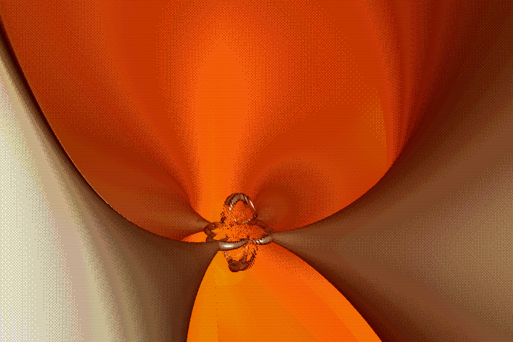

```glsl
vec3 a = sin(p/dot(p,p)*4);
    return 0.95*min(length(a.yx),length(a.yz))-0.52+0.2;
  }
```

### float de(vec3 p0){ — macbooktall

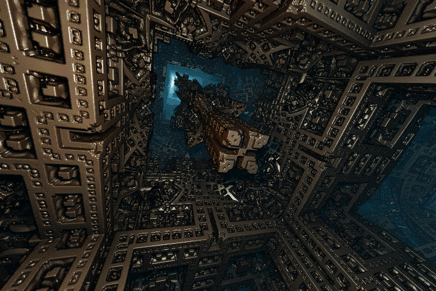

```glsl
p0 = mod(p0, 2.)-1.;
    vec4 p = vec4(p0, 1.);
    p=abs(p);
    if(p.x < p.z)p.xz = p.zx;
    if(p.z < p.y)p.zy = p.yz;
    if(p.y < p.x)p.yx = p.xy;
    for(int i = 0; i < 8; i++){
      if(p.x < p.z)p.xz = p.zx;
      if(p.z < p.y)p.zy = p.yz;
      if(p.y < p.x)p.yx = p.xy;
      p.xyz = abs(p.xyz);
      p*=(1.6/clamp(dot(p.xyz,p.xyz),0.6,1.));
      p.xyz-=vec3(0.7,1.8,0.5);
      p*=1.2;
    }
    float m = 1.5;
    p.xyz-=clamp(p.xyz,-m,m);
    return length(p.xyz)/p.w;
  }
```

### float de(vec3 p0){ — Nameless

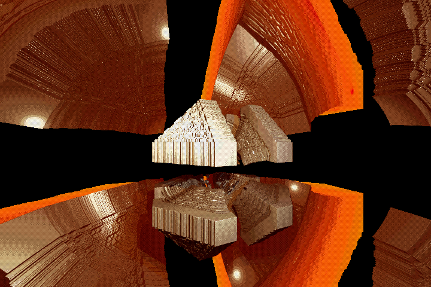

```glsl
vec4 p = vec4(p0/10., 1.);
    escape = 0.; p=abs(p);
    for(int i = 0; i < 8; i++){
      if(p.x > p.z)p.xz = p.zx;
      if(p.z > p.y)p.zy = p.yz;
      if(p.y > p.x)p.yx = p.xy;
      p*=(1.3/clamp(dot(p.xyz,p.xyz),0.1,1.));
      p.xyz-=vec3(.5,0.2,0.2);
    }
    float m = 1.5;
    p.xyz-=clamp(p.xyz,-m,m);
    return (length(p.xyz)/p.w)*10.;
  }
```

### float de(vec3 p0){ — Nameless

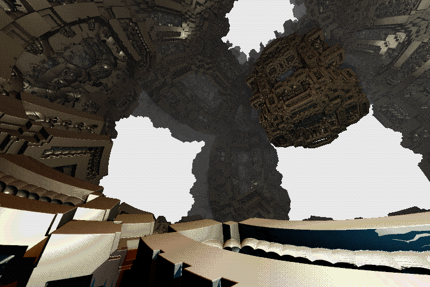

```glsl
vec4 p = vec4(p0/10., 1.);
    escape = 0.; p=abs(p);
    if(p.x < p.z)p.xz = p.zx;
    if(p.z < p.y)p.zy = p.yz;
    if(p.y < p.x)p.yx = p.xy;
    for(int i = 0; i < 6; i++){
      if(p.x < p.z)p.xz = p.zx;
      if(p.z < p.y)p.zy = p.yz;
      if(p.y < p.x)p.yx = p.xy;
      p = abs(p);
      p*=(1.9/clamp(dot(p.xyz,p.xyz),0.1,1.));
      p.xyz-=vec3(0.2,1.9,0.6);
    }
    float m = 1.2;
    p.xyz-=clamp(p.xyz,-m,m);
    return (length(p.xyz)/p.w)*10.;
  }
```

### float de(vec3 p0){ — Nameless

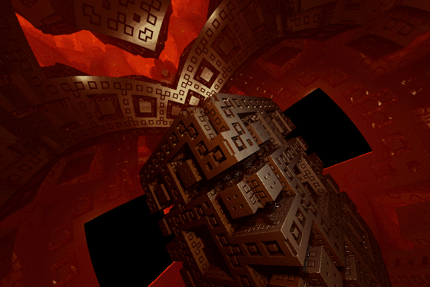

```glsl
vec4 p = vec4(p0/10., 1.);
    escape = 0.; p=abs(p);
    if(p.x < p.z)p.xz = p.zx;
    if(p.z < p.y)p.zy = p.yz;
    if(p.y < p.x)p.yx = p.xy;
    for(int i = 0; i < 6; i++){
      if(p.x < p.z)p.xz = p.zx;
      if(p.z < p.y)p.zy = p.yz;
      if(p.y < p.x)p.yx = p.xy;
      p = abs(p);
      p*=(2./clamp(dot(p.xyz,p.xyz),0.1,1.));
      p.xyz-=vec3(0.9,1.9,0.9);
    }
    float m = 1.5;
    p.xyz-=clamp(p.xyz,-m,m);
    return (length(p.xyz)/p.w)*10.;
  }
```

### float de(vec3 p0){ — Nameless

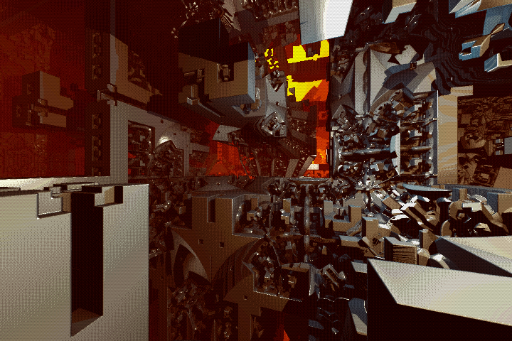

```glsl
p0=p0/10.;
    p0 = mod(p0, 2.)-1.;
    vec4 p = vec4(p0, 1.);
    p=abs(p);
    if(p.x < p.z)p.xz = p.zx;
    if(p.z < p.y)p.zy = p.yz;
    if(p.y < p.x)p.yx = p.xy;
    for(int i = 0; i < 8; i++){
      if(p.x < p.z)p.xz = p.zx;
      if(p.z < p.y)p.zy = p.yz;
      if(p.y < p.x)p.yx = p.xy;
      p.xyz = abs(p.xyz);
      p*=(1.6/clamp(dot(p.xyz,p.xyz),0.6,1.));
      p.xyz-=vec3(0.7,1.8,0.5);
      p*=1.2;
    }
    float m = 1.5;
    p.xyz-=clamp(p.xyz,-m,m);
    return (length(p.xyz)/p.w)*10.;
  }
```

### float de(vec3 p0){ — Nameless

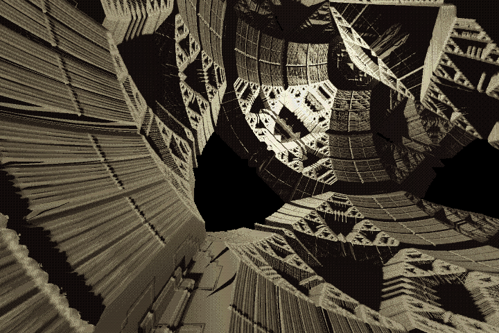

```glsl
vec4 p = vec4(p0, 1.);
    p.xyz=abs(p.xyz);
    if(p.x > p.z)p.xz = p.zx;
    if(p.z < p.y)p.zy = p.yz;
    if(p.y > p.x)p.yx = p.xy;
    for(int i = 0; i < 8; i++){
      if(p.x > p.z)p.xz = p.zx;
      if(p.z < p.y)p.zy = p.yz;
      if(p.y > p.x)p.yx = p.xy;
      p.xyz = abs(p.xyz);
      p*=(2.15/clamp(dot(p.xyz,p.xyz),.4,1.));
      p.xyz-=vec3(0.3,0.2,1.6);
    }
    float m = 1.5;
    p.xyz-=clamp(p.xyz,-m,m);
    return length(p.xyz)/p.w;
  }
```

### float de(vec3 p0){ — Nameless


```glsl
vec4 p = vec4(p0, 1.);
    p.xyz=abs(p.xyz);
    if(p.x < p.z)p.xz = p.zx;
    if(p.z < p.y)p.zy = p.yz;
    if(p.y < p.x)p.yx = p.xy;
    for(int i = 0; i < 8; i++){
      p.xyz = abs(p.xyz);
      uint seed = uint(p.x+p.y+p.z);
      p*=(2./clamp(dot(p.xyz,p.xyz),0.,1.));
      p.xyz-=vec3(.6,.9,2.2);
    }
    float m = 1.0;
    p.xyz-=clamp(p.xyz,-m,m);
  }
```

### float de(vec3 p0){ — Nameless

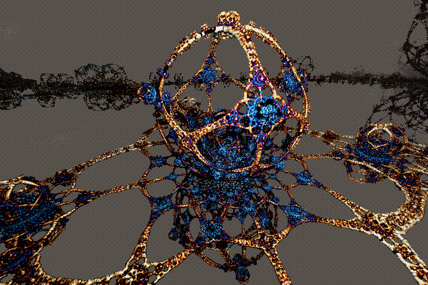

```glsl
vec4 p = vec4(p0,3.);
    escape = 0.;
    p*= 2./min(dot(p.xyz,p.xyz),30.);
    for(int i = 0; i < 14; i++){
      p.xyz = vec3(2.,4.,2.)-(abs(p.xyz)-vec3(2.,4.,2.));
      p.xyz = mod(p.xyz-4., 8.)-4.;
      p *= 9./min(dot(p.xyz,p.xyz),12.);
      escape += exp(-0.2*dot(p.xyz,p.xyz));
    }
    p.xyz -= clamp(p.xyz, -1.2,1.2);
    return length(p.xyz)/p.w;
  }
```

### float de(vec3 p0){ — Nameless

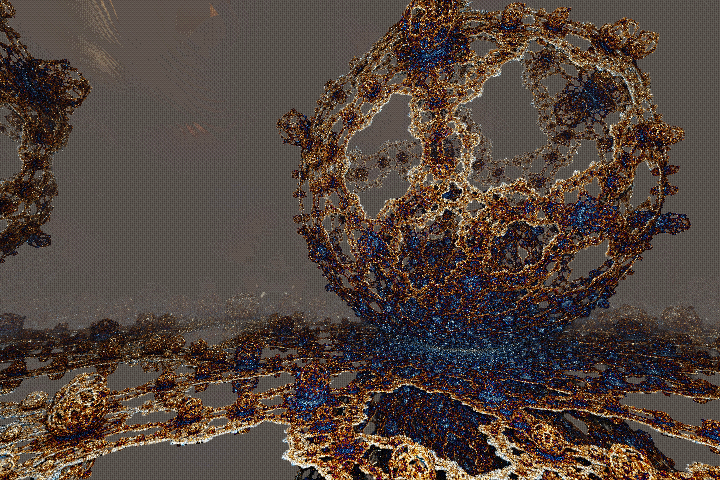

```glsl
vec4 p = vec4(p0,3.);
    escape = 0.;
    p*= 2./min(dot(p.xyz,p.xyz),30.);
    for(int i = 0; i < 14; i++){
      p.xyz = vec3(2.,4.,2.)-(abs(p.xyz)-vec3(1.,4.,2.));
      p.xyz = mod(p.xyz-4., 8.)-4.;
      p *= 9./min(dot(p.xyz,p.xyz),12.);
      escape += exp(-0.2*dot(p.xyz,p.xyz));
    }
    p.xyz -= clamp(p.xyz, -1.2,1.2);
    return length(p.xyz)/p.w;
  }
```

### float de(vec3 p0){ — Nameless

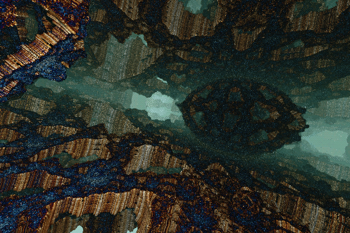

```glsl
vec4 p = vec4(p0,3.);
    escape = 0.;
    p*= 2./min(dot(p.xyz,p.xyz),30.);
    for(int i = 0; i < 16; i++){
      p.xyz = vec3(2.,4.1,1.)-(abs(p.xyz)-vec3(1.,4.1,3.));
      p.xyz = mod(p.xyz-4., 8.)-4.;
      p *= 9./min(dot(p.xyz,p.xyz),12.);
      escape += exp(-0.2*dot(p.xyz,p.xyz));
    }
    p.xyz -= clamp(p.xyz, -1.2,1.2);
    return length(p.xyz)/p.w;
  }
```

### float de(vec3 p0){ — Nameless

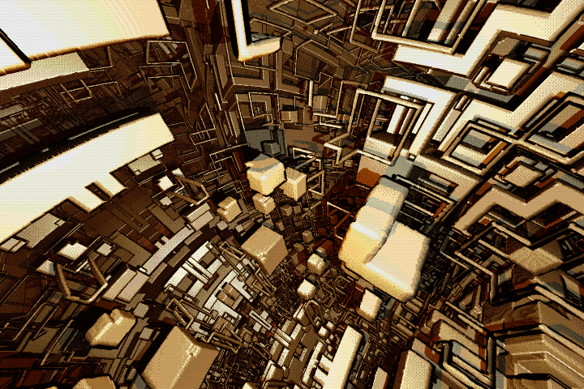

```glsl
p0 = mod(p0, 2.)-1.;
    vec4 p = vec4(p0, 1.);
    //escape = 0.;
    p=abs(p);
    for(int i = 0; i < 8; i++){
      if(p.x > p.z)p.xz = p.zx;
      if(p.z > p.y)p.zy = p.yz;
      if(p.y > p.x)p.yx = p.xy;
      p*=(1.4/clamp(dot(p.xyz,p.xyz),0.1,1.));
      p.xyz = vec3(2.,4.,2.)-(abs(p.xyz - vec3(2.,4.,1.)));
      //escape += exp(-0.2*dot(p.xyz,p.xyz));
    }
    float m = 1.5;
    p.xyz-=clamp(p.xyz,-m,m);
    return length(p.xyz)/p.w;
  }
```

### float de(vec3 p0){ — Nameless

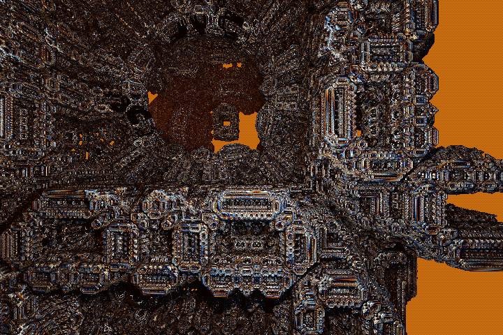

```glsl
vec4 p = vec4(p0, 1.);
    escape = 0.;
    p=abs(p);
    if(p.x < p.z)p.xz = p.zx;
    if(p.z < p.y)p.zy = p.yz;
    if(p.y < p.x)p.yx = p.xy;
    for(int i = 0; i < 12; i++){
      if(p.x < p.z)p.xz = p.zx;
      if(p.z < p.y)p.zy = p.yz;
      if(p.y < p.x)p.yx = p.xy;
      p = abs(p);
      p*=(1.9/clamp(dot(p.xyz,p.xyz),0.1,1.));
      p.xyz-=vec3(0.2,1.9,0.6);
      escape += exp(-0.2*dot(p.xyz,p.xyz)); 
    }
    float m = 1.2;
    p.xyz-=clamp(p.xyz,-m,m);
    return (length(p.xyz)/p.w);
  }
```

### float de(vec3 p0){ — Nameless

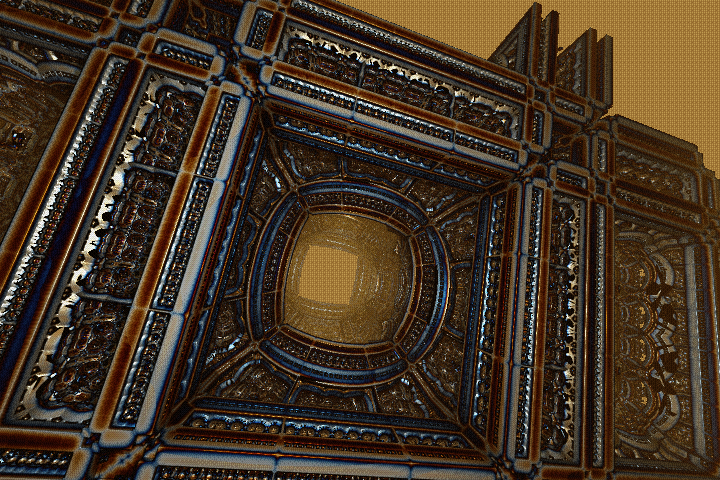

```glsl
vec4 p = vec4(p0, 1.);
    escape = 0.;
    p=abs(p);
    if(p.x < p.z)p.xz = p.zx;
    if(p.z < p.y)p.zy = p.yz;
    if(p.y < p.x)p.yx = p.xy;
    for(int i = 0; i < 8; i++){
      if(p.x < p.z)p.xz = p.zx;
      if(p.z < p.y)p.zy = p.yz;
      if(p.y < p.x)p.yx = p.xy;
      p.xyz = abs(p.xyz);
      p*=(1.8/clamp(dot(p.xyz,p.xyz),-1.0,1.));
      p.xyz-=vec3(0.3,1.9,0.4);
      escape += exp(-0.2*dot(p.xyz,p.xyz));
    }
    float m = 1.5;
    p.xyz-=clamp(p.xyz,-m,m);
    return length(p.xyz)/p.w;
  }
```

### float de(vec3 p0){ — Nameless

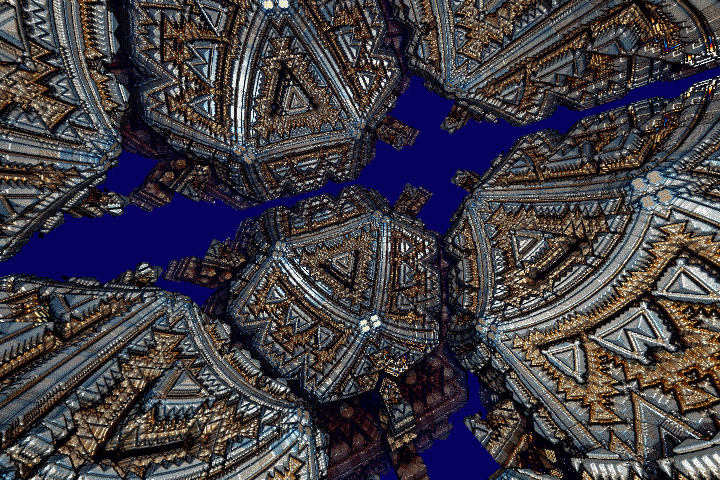

```glsl
vec4 p = vec4(p0, 1.);
    escape = 0.;
    p=abs(p);
    if(p.x > p.z)p.xz = p.zx;
    if(p.z < p.y)p.zy = p.yz;
    if(p.y > p.x)p.yx = p.xy;
    for(int i = 0; i < 12; i++){
      if(p.x > p.z)p.xz = p.zx;
      if(p.z < p.y)p.zy = p.yz;
      if(p.y > p.x)p.yx = p.xy;
      p.xyz = abs(p.xyz);
      p*=(1.4/clamp(dot(p.xyz,p.xyz),0.0,1.));
      p.xyz-=vec3(0.3,4.5,0.7);
      escape += exp(-0.2*dot(p.xyz,p.xyz));
    }
    float m = 1.5;
    p.xyz-=clamp(p.xyz,-m,m);
    return length(p.xyz)/p.w;
  }
```

### float de(vec3 p0){ — unknown

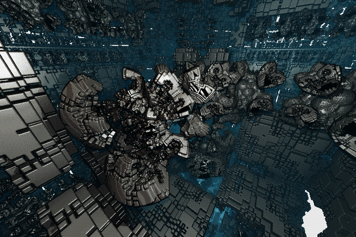

```glsl
vec4 p = vec4(p0, 1.);

    p.xyz=abs(p.xyz);
    if(p.x < p.z)p.xz = p.zx;
    if(p.z < p.y)p.zy = p.yz;
    if(p.y < p.x)p.yx = p.xy;
    for(int i = 0; i < 8; i++){
      if(p.x < p.z)p.xz = p.zx;
      if(p.z < p.y)p.zy = p.yz;
      if(p.y > p.x)p.yx = p.xy;
      p.xyz = abs(p.xyz);
      p*=(1.8/clamp(dot(p.xyz,p.xyz),.0,1.));
      p.xyz-=vec3(3.6,1.9,0.5);
    }
    float m = 1.5;
    p.xyz-=clamp(p.xyz,-m,m);
    return length(p.xyz)/p.w;
  }
```

### float de(vec3 pos){ — Kali

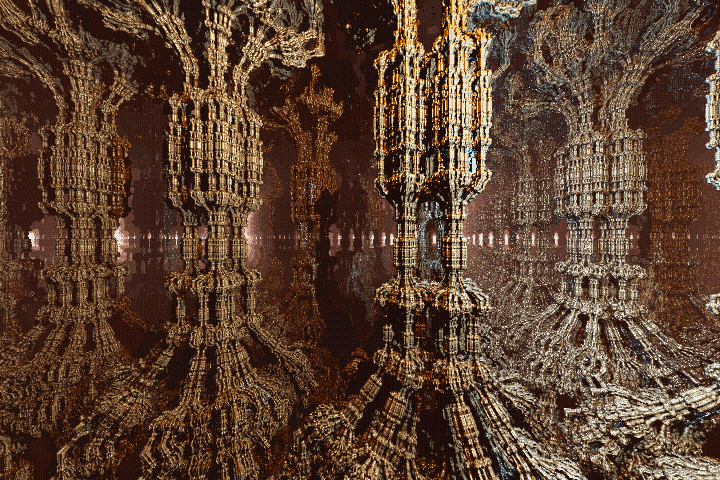

```glsl
vec3 tpos=pos;
    tpos.xz=abs(.5-mod(tpos.xz,1.));
    vec4 p=vec4(tpos,1.);
    float y=max(0.,.35-abs(pos.y-3.35))/.35;
    for (int i=0; i<7; i++) {
      p.xyz = abs(p.xyz)-vec3(-0.02,1.98,-0.02);
      p=p*(2.0+0.*y)/clamp(dot(p.xyz,p.xyz),.4,1.)-vec4(0.5,1.,0.4,0.);
      p.xz*=mat2(-0.416,-0.91,0.91,-0.416);
    }
    return (length(max(abs(p.xyz)-vec3(0.1,5.0,0.1),vec3(0.0)))-0.05)/p.w;
  }
```

### float lpNorm( vec3 p, float n ){ — gaziya5 aka gaz

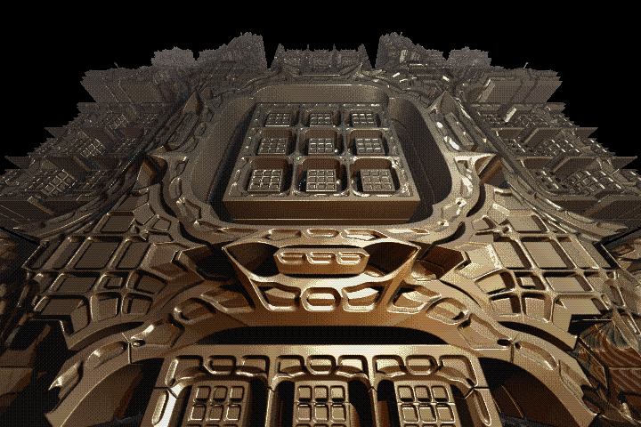

```glsl
p = pow(abs(p), vec3(n));
    return pow(p.x+p.y+p.z, 1.0/n);
  }

  float de( vec3 p ){
    vec3 offset=p*.5;
    float s=2.;
    for (int i=0; i<5; i++){
      p=clamp(p,-1.,1.)*2.-p;
      float r=-10.*clamp(max(.3/pow(
      lpNorm(p,5.),2.),.3),.0,.6);
      s*=r; p*=r; p+=offset;
    }
    s=abs(s); float a=10.;
    p-=clamp(p,-a,a);
    return length(p)/s;
  }
```

### float lpNorm(vec3 p, float n){ — gaziya5 aka gaz

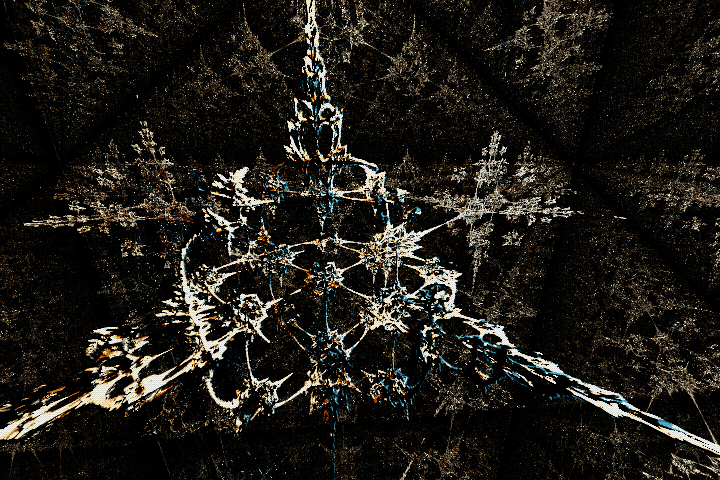

```glsl
p = pow(abs(p), vec3(n));
    return pow(p.x+p.y+p.z, 1.0/n);
  }

  float de(vec3 p){
    float s = 1.;
    for(int i = 0; i < 9; i++) {
      p=p-2.*round(p/2.);
      float r2=1.1/max(pow(lpNorm(p.xyz, 4.5),1.6),.15);
      p*=r2; s*=r2;
    }
    return length(p)/s-.001;
  }
```

### float lpNorm(vec3 p, float n){ — gaziya5 aka gaz

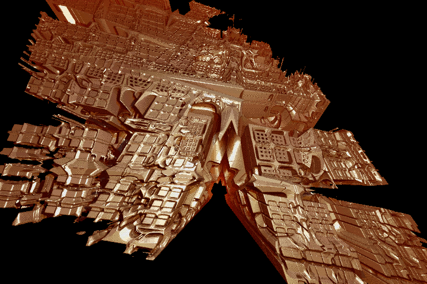

```glsl
p = pow(abs(p),vec3(n));
    return pow(p.x+p.y+p.z,1./n);
  }
  float de( vec3 p ){
    float scale=4.5;
    float mr2=.5;
    float off=.5;
    float s=1.;
    vec3 p0 = p;
    for (int i=0; i<16; i++) {
      if(i%3==0)p=p.yzx;
      if(i%2==1)p=p.yxz;
      p -= clamp(p,-1.,1.)*2.;
      float r2=pow(lpNorm(p.xyz,5.),2.);
      float g=clamp(mr2*max(1./r2,1.),0.,1.);
      p=p*scale*g+p0*off;
      s=s*scale*g+off;
    }
    return length(p)/s-.01;
  }
```

### mat2 rot ( float a ) { return mat2( cos( a ), -sin( a ), sin( a ), cos( a ) ); } — Leon Denise

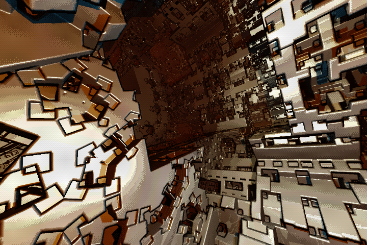

```glsl
float de ( vec3 p ) {
    float scene = 100.;
    float t = 1000; // arbitrary value
    float falloff = 1.0;
    for ( float index = 0.; index < 8.; ++index ) {
      p.xz *= rot( t / falloff );
      p = abs( p ) - 0.5 * falloff;
      scene = min( scene, max( p.x, max( p.y, p.z ) ) );
      falloff /= 1.8;
    }
    return -scene;
  }
```

### mat2 rot( float a ) { return mat2( cos( a ), sin( a ), -sin( a ), cos( a ) ); } — yonatan

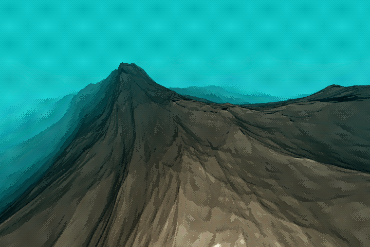

```glsl
float de( vec3 p ) {
    float e, i = 0.0, j, f, a, w;
    p.yz *= rot( 0.7 );
    f = 0.4;
    i < 45.0 ? p : p -= 0.001;
    e = p.y + 5.0;
    for( a = j = 0.9; j++ < 30.0; a *= 0.8 ) {
      vec2 m = vec2( 1. ) * rot( j );
      // float x = dot( p.xz, m ) * f + t + t; // time varying behavior
      float x = dot( p.xz, m ) * f + 0.0;
      w = exp( sin( x ) - 1.0 );
      p.xz -= m * w * cos( x ) * a;
      e -= w * a;
      f *= 1.2;
    }
    return e;
  }
```

### mat2 rot2(in float a){ float c = cos(a), s = sin(a); return mat2(c, s, -s, c); } — shane

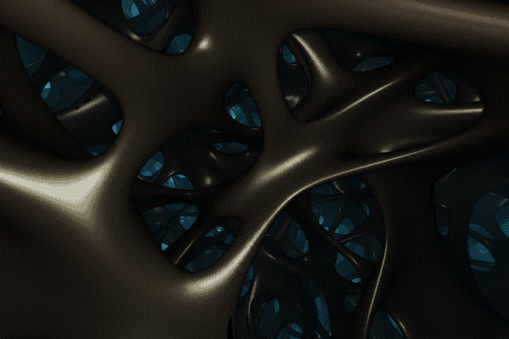

```glsl
float de(vec3 p){
    float d = 1e5;
    const int n = 3;
    const float fn = float(n);
    for(int i = 0; i < n; i++){
      vec3 q = p;
      float a = float(i)*fn*2.422; //*6.283/fn
      a *= a;
      q.z += float(i)*float(i)*1.67; //*3./fn
      q.xy *= rot2(a);
      float b = (length(length(sin(q.xy) + cos(q.yz))) - .15);
      float f = max(0., 1. - abs(b - d));
      d = min(d, b) - .25*f*f;
    }
    return d;
  }
```

### mat2 rotate2D(float r){ — kamoshika

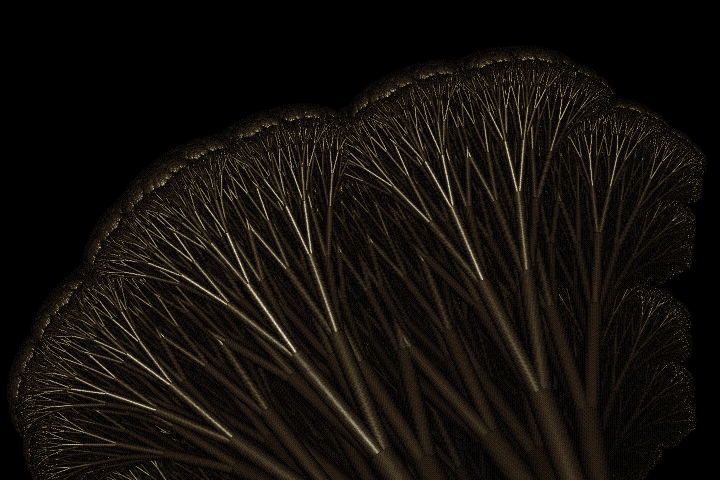

```glsl
return mat2(cos(r), sin(r), -sin(r), cos(r));
  }
  float de(vec3 p){
    float d, a;
    d=a=1.;
    for(int j=0;j++<9;)
      p.xz=abs(p.xz)*rotate2D(PI/4.),
      d=min(d,max(length(p.zx)-.3,p.y-.4)/a),
      p.yx*=rotate2D(.5),
      p.y-=3.,
      p*=1.8,
      a*=1.8;
    return d;
  }
```

### mat2 rotate2D(float r){ — kamoshika

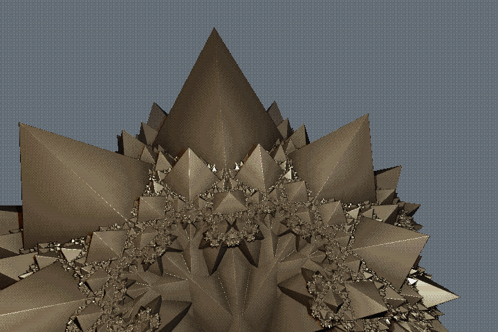

```glsl
return mat2(cos(r), sin(r), -sin(r), cos(r));
  }
  float de(vec3 p){
    vec3 R=p,Q;
    float i,d=1.,a;
    Q=R;
    d=a=1.5;
    for(int j=0;j++<9;)
      Q.xz=abs(Q.xz)*rotate2D(.785),
      d=min(d,(Q.x+Q.y*.5)/1.12/a),
      Q*=2., Q.x-=3., Q.y+=1.5,
      Q.yx*=rotate2D(.3),
      a*=2.;
    return d;
  }
```

### mat3 SetRotQuat ( const in vec4 q ) { — Adapted from code by P_Malin

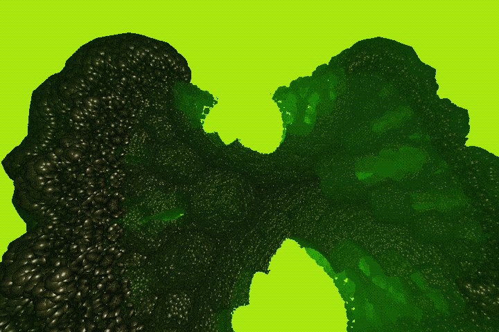

```glsl
vec4 qSq = q * q;
    float xy2 = q.x * q.y * 2.0;
    float xz2 = q.x * q.z * 2.0;
    float yz2 = q.y * q.z * 2.0;
    float wx2 = q.w * q.x * 2.0;
    float wy2 = q.w * q.y * 2.0;
    float wz2 = q.w * q.z * 2.0;
    return mat3 (
      qSq.w + qSq.x - qSq.y - qSq.z, xy2 - wz2, xz2 + wy2,
      xy2 + wz2, qSq.w - qSq.x + qSq.y - qSq.z, yz2 - wx2,
      xz2 - wy2, yz2 + wx2, qSq.w - qSq.x - qSq.y + qSq.z );
  }
  mat3 SetRot ( vec3 vAxis, float fAngle ) {
    return SetRotQuat( vec4( normalize( vAxis ) * sin( fAngle ), cos( fAngle ) ) ); 
  }
  float de( vec3 p ) {
    vec2 ax = vec2( 0.2, 0.7 ); // pick two values in the range 0,1
    vec3 vRotationAxis = vec3( ax.x, 1.0, ax.y );
    float fRotationAngle = length( vRotationAxis );

    mat3 m = SetRot( vRotationAxis, fRotationAngle );
    float fTrap = 30.0;
    float fTotalScale = 1.0;
    const float fScale = 1.25;
    vec3 vOffset = vec3( -1.0, -2.0, -0.2 );
    for( int i = 0; i < 16; i++ ) {
      p.xyz = abs( p.xyz );
      p *= fScale;
      fTotalScale *= fScale;
      p += vOffset;
      p.xyz = ( p.xyz ) * m;
      float fCurrDist = length( p.xyz ) * fTotalScale;
      // float fCurrDist = max(max( p.x,  p.y ),  p.z ) * fTotalScale;
      // float fCurrDist = dot( p.xyz, p.xyz ); // * fTotalScale;
      fTrap = min( fTrap, fCurrDist );
    }
    float l = length( p.xyz ) / fTotalScale;
    float fDist = l - 0.1;
    // return vec2(fDist, fTrap);
    return fDist;
  }
```

### vec3 fold( vec3 p0 ){ — unknown

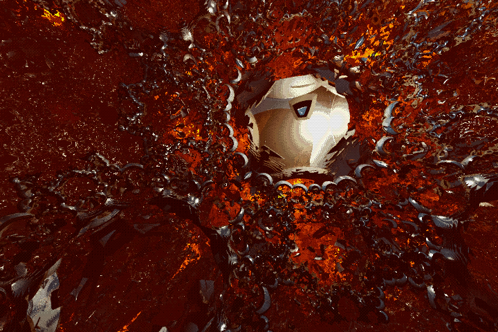

```glsl
vec3 p = p0;
    if(length(p) > 1.2) return p;
    p = mod(p,2.)-1.;
    return p;
  }

  float de( vec3 p0 ){
    vec4 p = vec4(p0, 1.);
    for(int i = 0; i < 12; i++){
      if(p.x > p.z)p.xz = p.zx;
      if(p.z > p.y)p.zy = p.yz;
      p = abs(p);
      p.xyz = fold(p.xyz);
      p.xyz = mod(p.xyz-1., 2.)-1.;
      p*=(1.2/dot(p.xyz,p.xyz));
    }
    p/=p.w;
    return abs(p.x)*0.25;
  }
```

### vec3 fold(vec3 p0){ — gaziya5 aka gaz

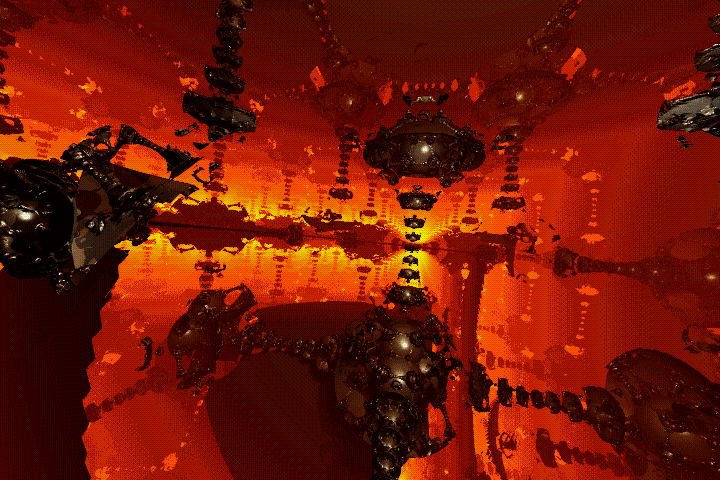

```glsl
vec3 p = p0;
    if(length(p) > 2.)return p;
    p = mod(p,2.)-1.;
    return p;
  }

  float de( vec3 p0 ){
    vec4 p = vec4(p0, 1.);
    escape = 0.;
    if(p.x > p.z)p.xz = p.zx;
    if(p.z > p.y)p.zy = p.yz;
    if(p.y > p.x)p.yx = p.xy;
    p = abs(p);
    for(int i = 0; i < 8; i++){
      p.xyz = fold(p.xyz);
      p.xyz = fract(p.xyz*0.5 - 1.)*2.-1.0;
      p*=(1.1/clamp(dot(p.xyz,p.xyz),-0.1,1.));
    }
    p/=p.w;
    return abs(p.x)*0.25;
  }
```

### vec3 foldY(vec3 P, float c){ — guil

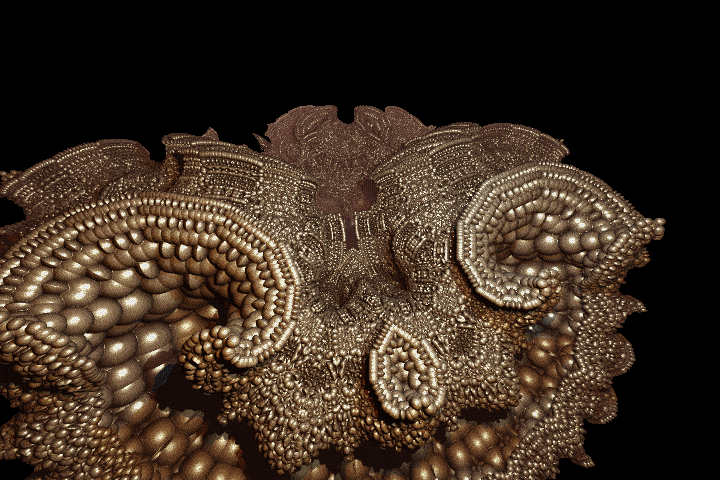

```glsl
float r = length(P.xz);
    float a = atan(P.z, P.x);
    a = mod(a, 2.0 * c) - c;
    P.x = r * cos(a);
    P.z = r * sin(a);
    return P;
  }

  float de(vec3 p){
    float l= length(p)-1.;
    float dr = 1.0, g = 1.25;
    vec4 ot=vec4(.3,.5,0.21,1.);
    ot = vec4(1.);
    mat3 tr = rotate3D(-0.55, normalize(vec3(-1., -1., -0.5)));

    for(int i=0;i<15;i++) {
      if(i-(i/3)*5==0)
      p = foldY(p, .95);
      p.yz = abs(p.yz);
      p = tr * p * g -1.;
      dr *= g;
      ot=min(ot,vec4(abs(p),dot(p,p)));
      l = min (l ,(length(p)-1.) / dr);
    }
    return l;
  }
```

### vec3 rotate(vec3 p,vec3 axis,float theta){ — gaziya5 aka gaz

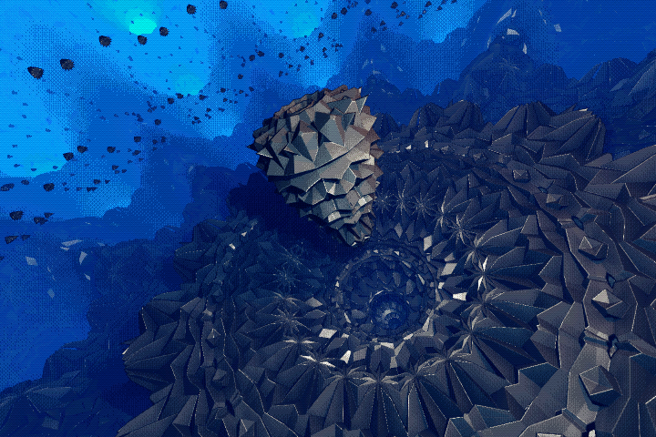

```glsl
vec3 v = cross(axis,p), u = cross(v, axis);
    return u * cos(theta) + v * sin(theta) + axis * dot(p, axis);
  }

  vec2 pmod(vec2 p, float r){
    float a = mod(atan(p.y, p.x), (M_PI*2) / r) - 0.5 * (M_PI*2) / r;
    return length(p) * vec2(-sin(a), cos(a));
  }

  float de(vec3 p){
    for(int i=0;i<5;i++){
      p.xy = pmod43(p.xy,12.0); p.y-=4.0;
      p.yz = pmod43(p.yz,16.0); p.z-=6.8;
    }
    return dot(abs(p),rotate43(normalize(vec3(2,1,3)),
        normalize(vec3(7,1,2)),1.8))-0.3;
  }
```

### void pR(inout vec2 p, float a) { — macbooktall

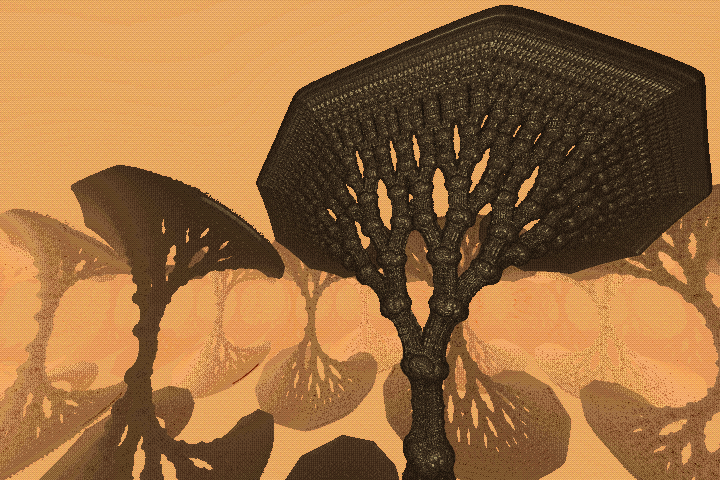

```glsl
p = cos(a)*p + sin(a)*vec2(p.y, -p.x);
  }

  float de(vec3 p){
    const int iterations = 20;
    float d = -2.; // vary this parameter, range is like -20 to 20
    p=p.yxz;
    pR(p.yz, 1.570795);
    p.x += 6.5;
    p.yz = mod(abs(p.yz)-.0, 20.) - 10.;
    float scale = 1.25;
    p.xy /= (1.+d*d*0.0005);

    float l = 0.;
    for (int i=0; i < iterations; i++) {
      p.xy = abs(p.xy);
      p = p*scale + vec3(-3. + d*0.0095,-1.5,-.5);
      pR(p.xy,0.35-d*0.015);
      pR(p.yz,0.5+d*0.02);
      vec3 p6 = p*p*p; p6=p6*p6;
      l =pow(p6.x + p6.y + p6.z, 1./6.);
    }
    return l*pow(scale, -float(iterations))-.15;
  }
```

### void rot101(inout vec3 p,vec3 a,float t){ — gaziya5 aka gaz

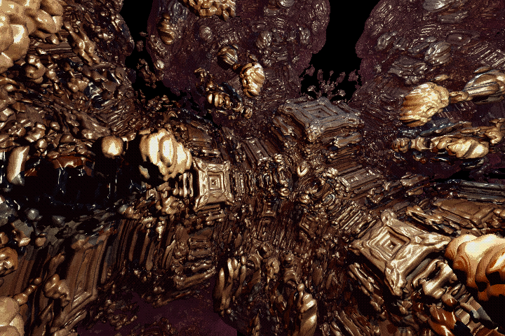

```glsl
a=normalize(a);
  	vec3 u=cross(a,p),v=cross(a,u);
  	p=u*sin(t)+v*cos(t)+a*dot(a,p);
  }
  #define G dot(p,vec2(1,-1)*.707)
  #define V v=vec2(1,-1)*.707
  void sfold101(inout vec2 p){
    vec2 v=vec2(1,-1)*.707;
    float g=dot(p,v);
    p-=(G-sqrt(G*G+.01))*v;
  }
  float de(vec3 p){
    float k=.01;
    for(int i=0;i<8;i++){
      p=abs(p)-1.;
      sfold101(p.xz);
      sfold101(p.yz);
      sfold101(p.xy);
      rot101(p,vec3(1,2,2),.6);
      p*=2.;
    }
    return length(p.xy)/exp2(8.)-.01;
  }
```

### void ry(inout vec3 p, float a){ — evilryu

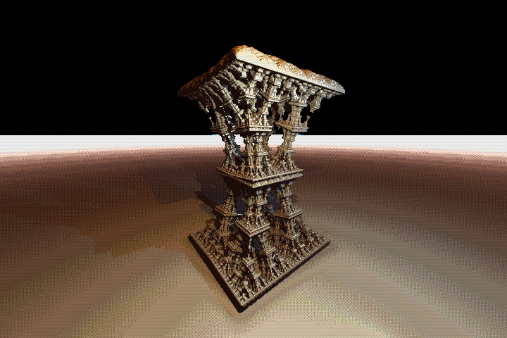

```glsl
float c,s;vec3 q=p;
    c = cos(a); s = sin(a);
    p.x = c * q.x + s * q.z;
    p.z = -s * q.x + c * q.z;
  }
  float plane(vec3 p, float y) {
    return length(vec3(p.x, y, p.z) - p);
  }
  float menger_spone(in vec3 z0){
    z0=z0.yzx;
    vec4 z=vec4(z0,1.0);
    vec3 offset =0.83*normalize(vec3(3.4,2., .2));
    float scale = 2.;
    for (int n = 0; n < 8; n++) {
      z = abs(z);
      ry(z.xyz, 1.5);
      if (z.x < z.y)z.xy = z.yx;
      if (z.x < z.z)z.xz = z.zx;
      if (z.y < z.z)z.yz = z.zy;
      ry(z.xyz, -1.21);
      z = z*scale;
      z.xyz -= offset*(scale-1.0);
    }
    return (length(max(abs(z.xyz)-vec3(1.0),0.0))-0.01)/z.w;
  }
  float de(vec3 p){
    float d1 = plane(p, -0.5);
    float d2 = menger_spone(p+vec3(0.,-0.1,0.));
    float d = d1;
    vec3 res = vec3(d1, 0., 0.);
    if(d > d2){
      d = d2;
      res = vec3(d2, 1., 0.0);
    }
    return res.x;
  }
```

### void sFold90( inout vec2 p ){ — gaziya5 aka gaz

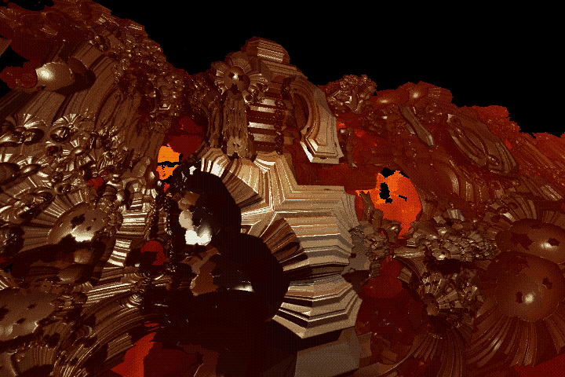

```glsl
vec2 v=normalize(vec2(1,-1));
    float g=dot(p,v);
    p-=(g-sqrt(g*g+1e-1))*v;
  }

  float de( vec3 p ){
  #define rot(a) mat2(cos(a),sin(a),-sin(a),cos(a))
    p=abs(p)-1.8;
    sFold90(p.zy);
    sFold90(p.xy);
    sFold90(p.zx);
    float s=2.;
    vec3  offset=p*.5;
    for(int i=0;i<8;i++){
      p=1.-abs(p-1.);
      float r=-1.3*max(1.5/dot(p,p),1.5);
      s*=r; p*=r; p+=offset;
      p.zx*=rot(-1.2);
    }
    s=abs(s); float a=8.5;
    p-=clamp(p,-a,a);
    return length(p)/s;
  }
```

### void sphere_folds(inout vec3 z, inout float dz) { — Nameless

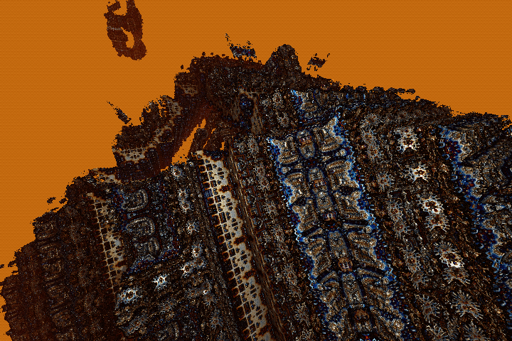

```glsl
float fixed_radius2 = 1.9;
    float min_radius2 = 0.1;
    float r2 = dot(z, z);
    if(r2 < min_radius2) {
      float temp = (fixed_radius2 / min_radius2);
      z *= temp; dz *= temp;
    }else if(r2 < fixed_radius2) {
      float temp = (fixed_radius2 / r2);
      z *= temp; dz *= temp;
    }
  }

  float de(vec3 p0){
    vec4 p = vec4(p0, 1.);
    escape = 0.;
    if(p.x < p.z)p.xz = p.zx;
    if(p.z > p.y)p.zy = p.yz;
    if(p.y > p.x)p.yx = p.xy;

    for(int i = 0; i < 12; i++){
      if(p.z > p.y)p.zy = p.yz;
      if(p.y > p.x)p.yx = p.xy;
      sphere_folds(p.xyz,p.w);
      uint seed = uint(p.x+p.y+p.z);
      p*=(3.1/min(dot(p.xyz,p.xyz),1.9));
      p.xyz=abs(p.xyz)-vec3(0.5,2.7,6.2);
      p.yz -= sin(float(i)*2.)*0.7;
      escape += exp(-0.2*dot(p.xyz,p.xyz));
    }
    float m = 3.5;
    p.xyz-=clamp(p.xyz,-m,m);
    return length(p.xyz)/p.w;
  }
```

### void sphere_folds(inout vec3 z, inout float dz) { — Nameless

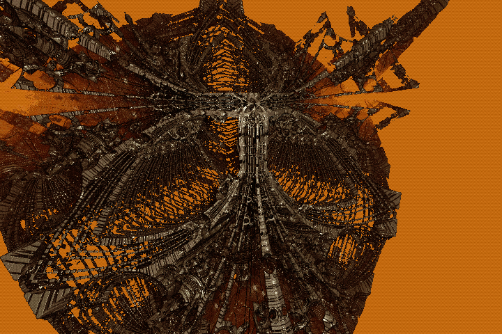

```glsl
float fixed_radius2 = 1.9;
    float min_radius2 = 0.1;
    float r2 = dot(z, z);
    if(r2 < min_radius2) {
      float temp = (fixed_radius2 / min_radius2);
      z *= temp; dz *= temp;
    }else if(r2 < fixed_radius2) {
      float temp = (fixed_radius2 / r2);
      z *= temp; dz *= temp;
    }
  }

  float de(vec3 p0){
    vec4 p = vec4(p0, 1.);
    escape = 999.;

    if(p.x < p.z)p.xz = p.zx;
    if(p.z > p.y)p.zy = p.yz;
    if(p.y > p.x)p.yx = p.xy;

    for(int i = 0; i < 12; i++){
      if(p.y > p.x)p.yx = p.xy;
      p.xyz = abs(p.xyz);

      sphere_folds(p.xyz,p.w);
      uint seed = uint(p.x+p.y+p.z);
      p*=(3.1/min(dot(p.xyz,p.xyz),1.9));
      p.xyz=abs(p.xyz)-vec3(0.5,2.7,6.2);
      p.yz -= sin(float(i)*2.)*0.7;
    }
    float m = 3.5;
    p.xyz-=clamp(p.xyz,-m,m);
    return length(p.xyz)/p.w;
  }
```

### void sphere_folds(inout vec3 z, inout float dz) { — Nameless

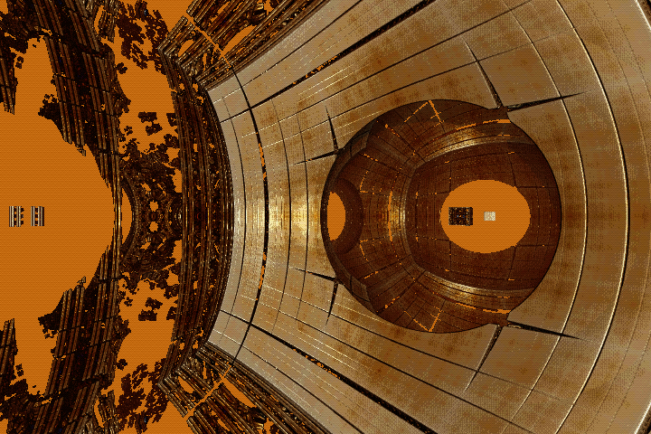

```glsl
float fixed_radius2 = 1.9;
    float min_radius2 = 0.1;
    float r2 = dot(z, z);
    if(r2 < min_radius2) {
      float temp = (fixed_radius2 / min_radius2);
      z *= temp; dz *= temp;
    }else if(r2 < fixed_radius2) {
      float temp = (fixed_radius2 / r2);
      z *= temp; dz *= temp;
    }
  }
  void box_folds(inout vec3 z, inout float dz) {
    float folding_limit = 1.0;
    z = clamp(z, -folding_limit, folding_limit) * 2.0 - z;
  }
  float de(vec3 z) {
    vec3 offset = z;
    float scale = -2.8;
    float dr = 1.0;
    escape = 0.;
    for(int n = 0; n < 15; ++n) {
      box_folds(z, dr);
      sphere_folds(z, dr);
      z = scale * z + offset;
      dr = dr * abs(scale) + 1.0;
      escape += exp(-0.2*dot(z.xyz,z.xyz));
    }
    float r = length(z);
    return r / abs(dr);
  }
```

### #define _(a) mat2(cos(a),sin(a),-sin(a),cos(a)) — gaz

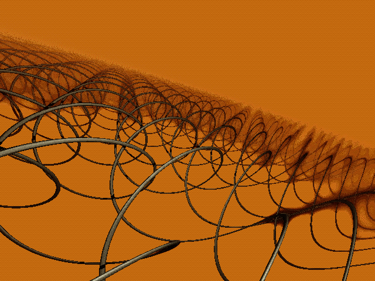

```glsl
#define q(p) length(vec2(mod(p.x,.4)-.2,p.y+sin(t)))
#define R(x) vec2(.3,0)*_((p.z+t)*9.+x)
float de(vec3 p){
  float t=time;
  return min(q((p.xy+R(0.))),q((p.xy+R(3.14))))*.2;
}
```

### #define ei(a) mat2(cos(a),-sin(a),sin(a),cos(a)) — wyatt

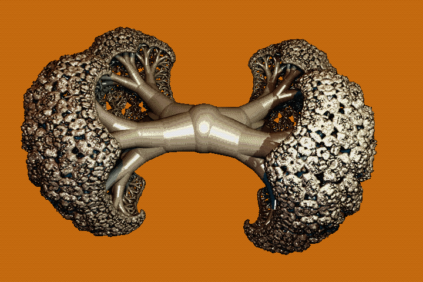

```glsl
float ln ( vec3 p, vec3 a, vec3 b ) {
    float l = clamp( dot( p - a, b - a ) / dot( b - a, b - a ), 0.0, 1.0 );
    return mix( 0.7, 1.0, l ) * length( p - a - ( b - a ) * l );
}
float de( vec3 u ) {
  u.xz *= ei( 0.9 );
  u.xy *= ei( 1.5 );
  float d = 1e9;
  vec4 c = vec4( 0.0 ); // orbit trap term
  float sg = 1e9;
  float l = 0.1;
  u.y = abs( u.y );
  u.y += 0.1;
  mat2 M1 = ei( 2.0 );
  mat2 M2 = ei( 0.4 );
  float w = 0.05;
  for ( float i = 0.0; i < 18.0; i++ ) {
    sg = ln( u, vec3( 0.0 ), vec3( 0.0, l, 0.0 ) ) / l;
    d = min( d, sg * l - w );
    w *= 0.66;
    u.y -= l;
    u.xz *= M1;
    u.xz = abs( u.xz );
    u.xy *= M2;
    l *= 0.75;
    c += exp( -sg * sg ) * ( 0.5 + 0.5 * sin( 3.1 * i / 16.0 + vec4( 1.0, 2.0, 3.0, 4.0 ) ) );
  }
  return d;
}
```

### #define ei(a) mat2(cos(a),-sin(a),sin(a),cos(a)) — wyatt

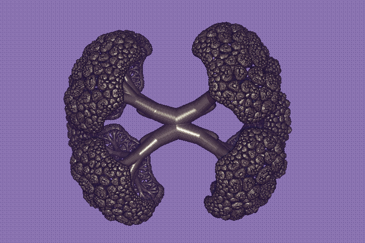

```glsl
float ln (vec3 p, vec3 a, vec3 b) {
  float l = clamp( dot( p - a, b - a ) / dot( b - a, b - a ), 0.0, 1.0 );
  return mix( 0.75, 1.0, l ) * length( p - a - ( b - a ) * l );
}
float de ( vec3 u ) {
  float adjust = 0.0; // branching parameter
  u.xz *= ei( 1.1 + adjust );
  u.xy *= ei( 1.1 );
  float d = 1e9;
  vec4 c = vec4( 0.0 ); // orbit trap term
  float sg = 1e9;
  float l = 0.08;
  u.y = abs( u.y );
  u.y += 0.1;
  mat2 M1 = ei( 1.0 );
  float w = 0.02;
  mat2 M2 = ei( 0.6 );
  mat2 M3 = ei( 0.4 + 0.2 * sin( adjust ) );
  for ( float i = 1.0; i < 20.0; i++ ) {
    sg = ln( u, vec3( 0.0 ), vec3( 0.0, l, 0.0 ) ) / l;
    d = min( d, sg * l - w );
    w *= 0.7;
    u.y -= l;
    u.xz *= M1;
    u.xz = abs( u.xz );
    u.zy *= M3;
    l *= 0.75;
    c += exp( -sg * sg ) * ( 0.7 + 0.5 * sin( 2.0 + 3.0 * i / 16.0 + vec4( 1.0, 2.0, 3.0, 4.0 ) ) );
  }
  return d;
}
```

### #define PI (atan(1.)*4.) — illus0r

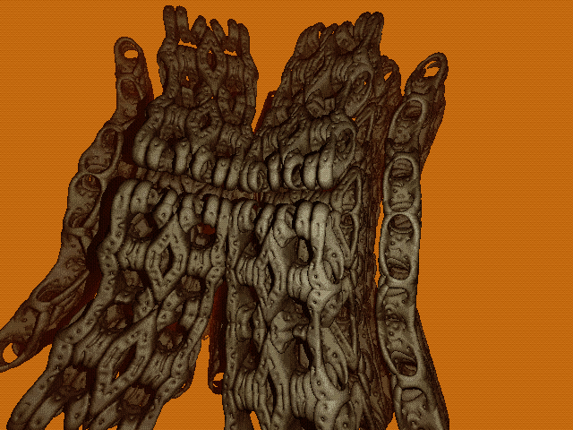

```glsl
#define rot(a) mat2(cos(a),sin(a),-sin(a),cos(a))
float de(vec3 p){
  p.yz *= rot(-time);
  p.xz *= rot(-time);
  float s = 1.;
  float d, dPrev, dPrePrev;
  for(int i = 0; i++ < 5;) {
    dPrePrev = dPrev;
    dPrev = d;
    p.xz *= rot(time-3.14/6. + float(i));
    p.yz *= rot(time+3.14/6. + float(i));
    p = abs(p);
    p -= .4;
    p *= 2.;
    s *= 2.;
    d = (length(vec2(length(p)-.9, p.z))-.4)/s;
  }
  return (length(vec2(d, dPrePrev))-.01)*.5;
}
```

### #define PI 3.14159265 — illus0r

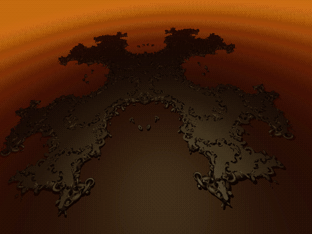

```glsl
#define IVORY 1.
#define BLUE 2.
mat2 Rot(float a) {
    float s = sin(a), c = cos(a);
  return mat2(c, -s, s, c);
}
float sdBox( vec3 p, vec3 b ) { vec3 q = abs(p) - b; return length(max(q,0.0)) + min(max(q.x,max(q.y,q.z)),0.0); }
float sdTorus(vec3 p, float smallRadius, float largeRadius) {
  return length(vec2(length(p.xz) - largeRadius, p.y)) - smallRadius;
}
float de(vec3 p) {
  float t = time;
  vec2 plane = vec2(p.y+0.5, IVORY);
  p.y -= 1.5;
  p.xz *= Rot(t / 4.);
  vec3 pBox = p;
  pBox.xz /= 100.;
  p.y += sin(t);
  float box = sdBox(pBox, vec3(0.05));
  float scale = 0.7;
  vec2 torus = vec2(sdTorus(p, .4, 1.5), BLUE);
  for (int i = 0; i < 9; i++) {
    p.xz = abs(p.xz);
    p.xz -= 1.;
    p /= scale;
    p.yz *= Rot(PI / 2.);
    p.xy *= Rot(PI / 4.);
    vec2 newTorus = vec2(sdTorus(p, .4, 1.5) * pow(scale, float(i+1)), BLUE);
    torus = torus.x < newTorus.x? torus : newTorus;
  }
  torus = box < torus.x ? torus : vec2(box, 0);
  return  torus.x < plane.x? torus.x : plane.x;
}
```

### #define rot(a) mat2(cos(a),sin(a),-sin(a),cos(a)) — gaz

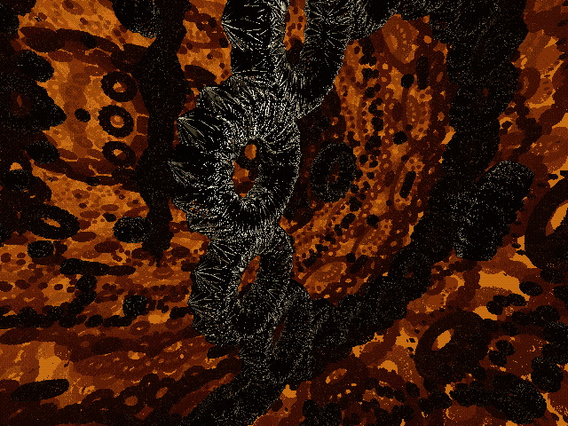

```glsl
#define Q(p) p*=rot(round(atan(p.y,p.x)/a)*a),
float de(vec3 p){
  float a = PI/8.0;
  for(int i=0;i++<5;)
    Q(p.yx)p.y-=1.,
    Q(p.zy)p.z-=1.;
  return.5*abs(length(p+p.zxy)-.05)+1e-3;
}
```

### #define rot(a) mat2(cos(a),sin(a),-sin(a),cos(a)) — gaz

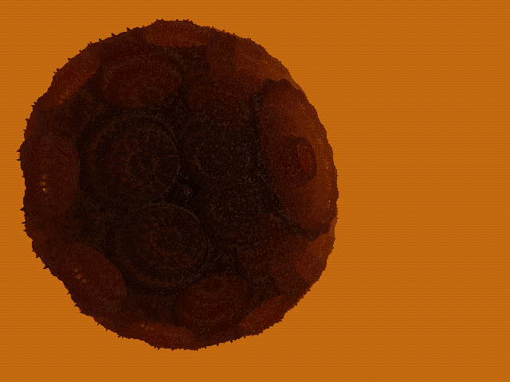

```glsl
#define Q(p) p*=rotate2D(round(atan(p.y,p.x)/a)*a),
float de(vec3 p){
  float a=PI/8.0;
  for(int i=0;i++<3;)
    Q(p.yx)p.y-=.8,
    Q(p.zy)p.z-=.8;
  return .5*abs(length(vec2(length(p.xy)-.1,p.z))-.1)+1e-3;
}
```

### #define rot(a) mat2(cos(a),sin(a),-sin(a),cos(a)) — i_dianov

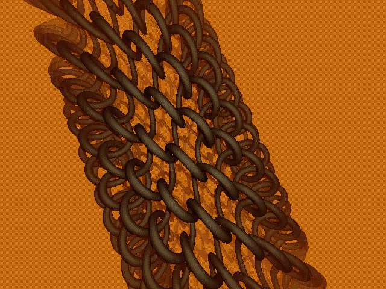

```glsl
#define decartToPolar(d) vec2(atan(d.x,d.y),length(d))
#define PI (atan(1.)*4.)
#define LOOPS 16.
#define LOOP_ANGLE_SPAN (PI/LOOPS)
#define THREAD_R .035
#define LOOP_R .2
#define COHESION (LOOP_R*.6)
#define TUBE_R 1.
float spiral(vec3 p) {
  p.z+=atan(p.y,p.x)/PI*LOOP_ANGLE_SPAN;
  p.z=mod(p.z,LOOP_ANGLE_SPAN*2.)-LOOP_ANGLE_SPAN;
  return length(vec2(length(p.xy)-LOOP_R,p.z))-THREAD_R;
}
float de(vec3 p){
  vec3 pp = p;
  p.y = mod(p.y, 4.*LOOP_R-2.*COHESION)-2.*LOOP_R+COHESION;
  p.xz = decartToPolar(p.xz);
  p.z -= TUBE_R;
  p.xz*=rot(PI/2.);
  float s1 = spiral(p + vec3(0, 0, LOOP_ANGLE_SPAN));
  float s2 = spiral(p + vec3(0, +2.*LOOP_R-COHESION, 0));
  float s3 = spiral(p + vec3(0, -2.*LOOP_R+COHESION, 0));
  return min(s1, min(s2, s3));
}
```

### #define rot(a) mat2(cos(a),sin(a),-sin(a),cos(a)) — i_dianov

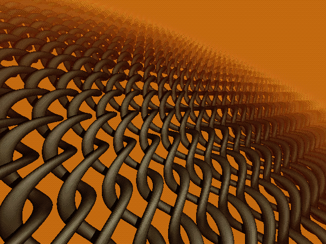

```glsl
#define PI (atan(1.)*4.)
#define THREAD_R .035
#define LOOP_R .1
float coilSlice(vec3 p) {
  p.xy+=vec2(LOOP_R,0)*rot(p.z);
  p.x = mod(p.x, 2.*LOOP_R)-LOOP_R;
  return length(p.xy);
}
float de(vec3 p){
  p.z*=10.;
  float tissue = min(
    coilSlice(vec3(p.xy,p.z)),
    coilSlice(vec3(p.xy+vec2(LOOP_R, 0.),p.z+PI))
  )-THREAD_R;
  return tissue*.9;
}
```

### #define rot(a) mat2(cos(a),sin(a),-sin(a),cos(a)) — illus0r

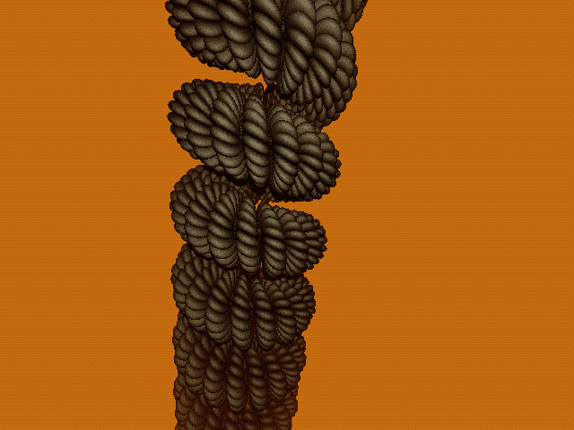

```glsl
#define tn (time/(120.*.017))
#define PI 3.1415
#define STEP PI/8.
vec2 decartToPolar(vec2 decart) {
    float alpha = atan(decart.x, decart.y);
    float R = length(decart);
    return vec2(alpha, R);
}
float c=3.1415/16.;
float r=.1;
#define cohesion r*.2 
float de(vec3 p){
  float i, s=1.;
  vec2 pol;
  p.xy*=rot(PI*.5);
  for(int j=0;j<3;j++){
    p.zx*=rot(time*.05*s*s*s);
    p*=2.5;
    s*=2.5;
    pol = decartToPolar(p.xz);
    i = mod(p.y - pol.x*STEP/PI, STEP*2.)-STEP*1.;
    p.xyz = vec3(i, pol.x, pol.y-.5);
  }
  return (length(p.xz)-.3)/s/3.;
}
```

### #define rot(a) mat2(cos(a),sin(a),-sin(a),cos(a)) — illus0r

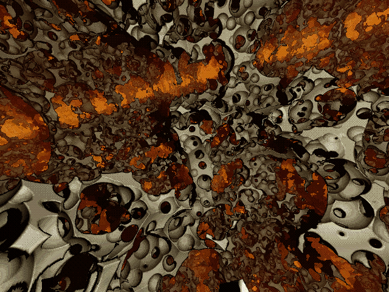

```glsl
float de(vec3 p){
  float t = time;
  float s = 1.;
  p.z += t * .1;
  p+=.5;
  float c = length(mod(p, 1.)-.5)-.7;
  for(int i = 0; i < 12; i++) {
    p.xy*=rot(time * .01);
    p*=1.3;
    s*=1.3;
    c = max(c, -(length(mod(p, 1.)-.5)-.4)/s);
  }
  return c;
}
```

### #define rot(a) mat2(cos(a),sin(a),-sin(a),cos(a)) — illus0r

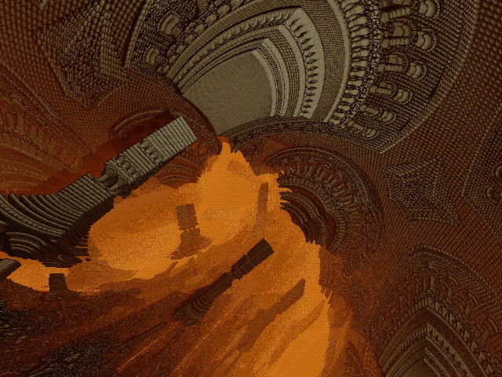

```glsl
float de(vec3 p){
  float t = time, sc;
  p.xy*=rot(p.z*3.14/3.);
  vec3 pos = p;
  p.y -=1.5-sin(p.z+t)*.5;
  p.z = mod(p.z,2.)-1.;
  p.x = mod(p.x,2.)-1.;
  float DEfactor=1.;
  for (float j=0.; j<7.; j++){
    p=abs(p);
    p-=vec3(.5,2.,.5);
    float dist = dot(p,p);
    sc=2./clamp(dist,.1,1.);
    p*=sc;
    DEfactor*=sc;
    p-=vec3(0.,5.,0.);
  }
  float dd=(length(p)/DEfactor-.005);
  return dd*.5;
}
```

### #define rot(a)mat2(cos(a),sin(a),-sin(a),cos(a)) — gaziya5 aka gaz

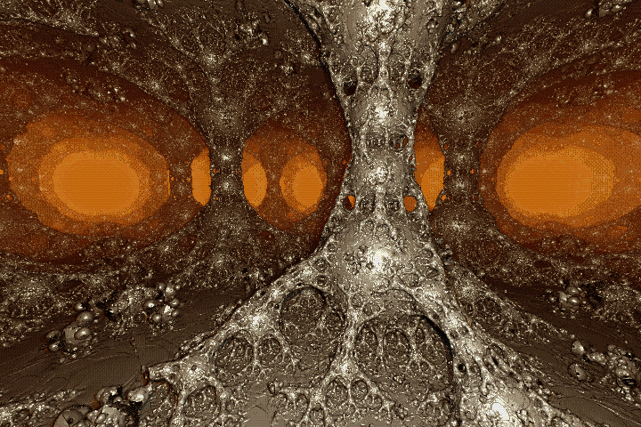

```glsl
float de( vec3 p ) {
  float s = 4.0;
  for( int i = 0; i < 8; i++ ) {
    p.xz *= rot( 3.1415 / 3.0 );
    p = mod( 1.0 - p, 2.0 ) - 1.0;
    float r2 = ( 4.0 / 3.0 ) / dot( p, p );
    p *= r2;
    s *= r2;
  }
  return length( p ) * abs( p.y ) / s;
}
```

### #define rot(a)mat2(cos(a),sin(a),-sin(a),cos(a)) — gaziya5 aka gaz

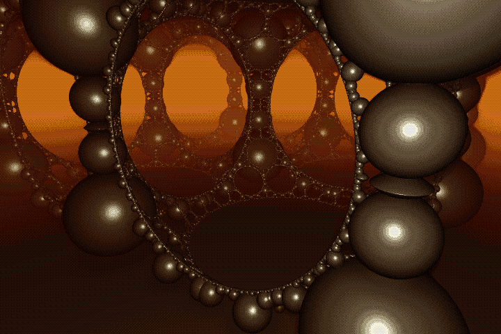

```glsl
float de( vec3 p ) {
  float s = 4.0;
  p = abs( p );
  for( int i = 0; i < 10; i++ ) {
    p = 1.0 - abs( p - 1.0 );
    float r2 = 1.3 / dot( p, p );
    p *= r2;
    s *= r2;
  }
  return abs( p.y ) / s;
}
```

### //  Converge by Lewpen (fractals.com) — Lewpen

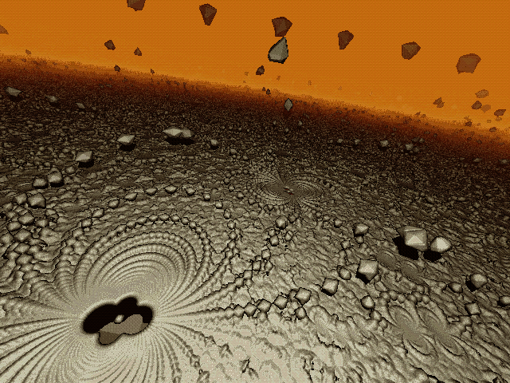

```glsl
float de( in vec3 pos ) {
  float fd = 1.0;
  vec3 cs = vec3( -0.1, 0.3, 0.4 );
  float fs = 1.0;
  vec3 fc = vec3( -0.2, -0.3, -1.1 ) ; 
  vec3 p = pos;
  float dEfactor = 2.0;
  for ( int i = 0; i < 38; i++ ) {
    p = 1.9 * clamp( p, -cs, cs ) - p;
    float k = max( 0.58 * fs / dot( p, p ), 1.0 );
    p *= k;
    dEfactor *= k;
    p += fc;
  }
  return ( abs( length( p.xyz ) - 1.0 ) * 1.0 ) / abs( dEfactor );
}
```

### //  Origin Flowers by Lewpen (fractals.com) — Lewpen

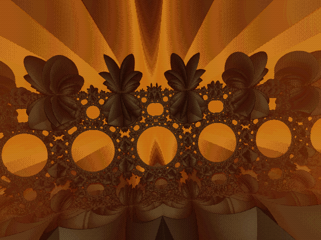

```glsl
float de( in vec3 pos ) {
  float fd = 1.0;
  vec3 cs = vec3( -0.7, 0.0, 0.4 );
  float fs = 1.0;
  vec3 fc = vec3( 0.0 );
  vec3 p = pos;
  float dEfactor = 4.0;
  for ( int i=0; i < 24; i++ ) {
    p = 2.0 * clamp( p, -cs, cs ) - p;  //  box folding
    float k = max( 0.58 * fs / dot( p, p ), 1.0 );  //  inversion
    p *= k;
    dEfactor *= k;
    p += fc;  //  julia seed
  }
  return ( abs( length( p.xz * p.z * p.xz ) - 0.5125 ) * 1.0 ) / abs( dEfactor );
}
```

### //  Snowflake by Lewpen (fractals.com) — Lewpen

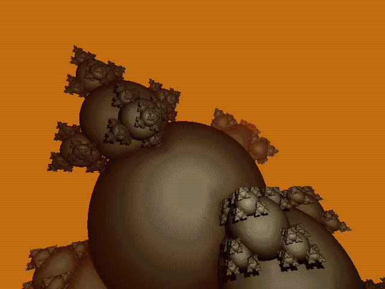

```glsl
float de( in vec3 pos ) {
  //  PARAM: Offset distance for each iteration of spheres
  float Distance = 1.1428;
  //  PARAM: Scale factor for each iteration of spheres
  float Scale = 0.3868138;
  float r = length( pos ) - 1.0;
  float e = 1.0;
  float oScale = 1.0 / Scale;
  for ( int i = 0; i < 20; i++ ) {
    vec3 v;
    if ( abs( pos.x ) > abs( pos.y ) ) {
      if ( abs( pos.x ) > abs( pos.z ) ) {
        v = vec3( 1.0, 0.0, 0.0 );
      } else {
        v = vec3( 0.0, 0.0, 1.0 );
      }
    } else {
      if ( abs( pos.y ) > abs( pos.z ) ) {
        v = vec3( 0.0, 1.0, 0.0 );
      } else {
        v = vec3( 0.0, 0.0, 1.0 );
      }
    }
    pos = abs( abs( pos ) - Distance * v );
    pos *= oScale;
    e *= Scale;
    r = min( r, e * ( length( pos ) - 1.0 ) );
  }
  return r;
}
```

### // "Philosopher Stoned" by stb — stb

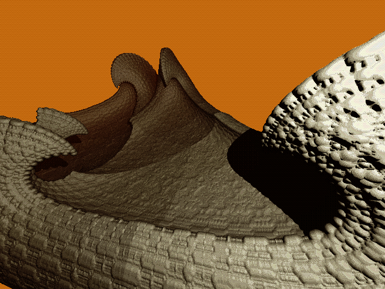

```glsl
float s, c;
#define rotate(p, a) mat2(c=cos(a), s=-sin(a), -s, c) * p
void rotateXY( inout vec3 p, vec2 axy ) {
  p.yz = rotate( p.yz, axy.y );
  p.xz = rotate( p.xz, axy.x );
}
vec3 fold ( in vec3 p, in vec3 n ) {
  n = normalize( n );
  p -= n * max( 0., 2. * dot( p, n ) );
  return p;
}
float de ( in vec3 p ) {
  float f;
  float t = time;
  const float I = 64.;
  for ( float i = 0.; i < I; i++ ) {
    rotateXY( p, vec2( 10. - .024273 * t, .0045 * t ) );
    //p = abs( p );
    p = fold( p, vec3(  1., -1., 0. ) );
    p = fold( p, vec3( -1., 0., -1. ) );
    p -= .125 * .025 / ( ( i + 1. ) / I );
  }
  f = length( p )-.007;
  return f;
}
```

### // Hash based domain repeat snowflakes - Rikka 2 demo — Catzpaw

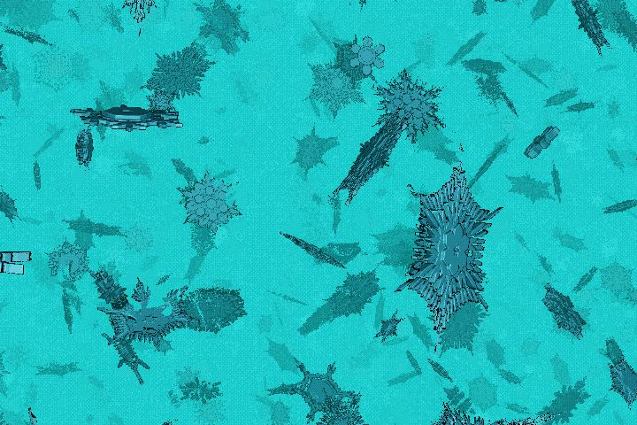

```glsl
float hash(float v){return fract(sin(v*22.9)*67.);}
mat2 rot(float a){float s=sin(a),c=cos(a);return mat2(c,s,-s,c);}
vec2 hexFold(vec2 p){return abs(abs(abs(p)*mat2(.866,.5,-.5,.866))*mat2(.5,-.866,.866,.5));}
float sdHex(vec3 p){p=abs(p);return max(p.z-.02,max((p.x*.5+p.y*.866),p.x)-.015);}
float de(vec3 p){
  float h=hash(floor(p.x)+floor(p.y)*133.3+floor(p.z)*166.6),o=13.0,s=1.+h;
  p=fract(p)-.5;
  p.y+=h*.4-.2;
  p.xz*=rot(time*(h+.8));
  p.yz*=rot(time+h*5.);
  h=hash(h);p.x+=h*.15;
  float l=dot(p,p);
  if(l>.1)return l*2.;
  for(int i=0;i<5;i++){
    p.xy=hexFold(p.xy);
    p.xy*=mat2(.866,-.5,.5,.866);
    p.x*=(s-h);
    h=hash(h);p.y-=h*.065-.015;p.y*=.8;
    p.z*=1.2;
    h=hash(h);p*=1.+h*.3;
    o=min(o,sdHex(p));
    h=hash(h);s=1.+h*2.;
  }
  return o;
}
```

### // minor tweak of above — yonatan

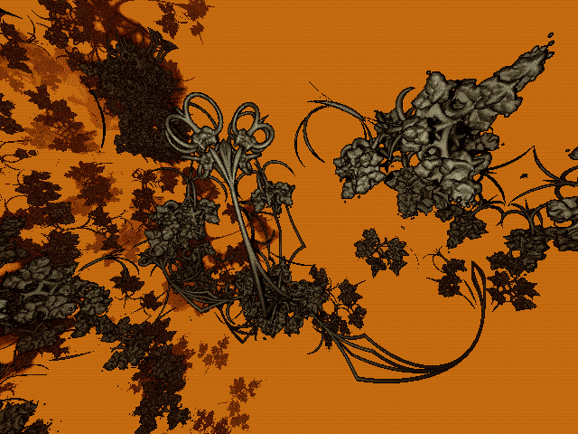

```glsl
float de ( vec3 p ) {
  float e,v,u;
  e=v=2.;
  for(int j=0;j++<12;j>3?e=min(e,length(p.xz+length(p)/u*.557)/v),p.xz=abs(p.xz)-.7,p:p=abs(p)-.9)
    v/=u=dot(p,p),
    p/=u,
    p.y=1.7-p.y;
  return e;
}
```

### // modification of above — illus0r

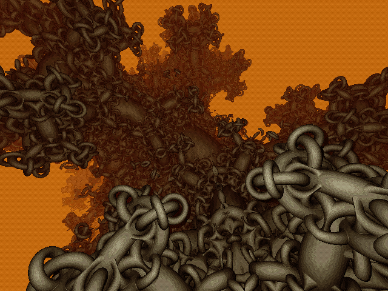

```glsl
#define PI 3.14159265
mat2 Rot(float a) {
  float s = sin(a), c = cos(a);
  return mat2(c, -s, s, c);
}
float sdTorus(vec3 p, float smallRadius, float largeRadius) {
  return length(vec2(length(p.xz) - largeRadius, p.y)) - smallRadius;
}
float de(vec3 p) {
  float t = time;
  p.y -= 1.5;
  float scale = 0.7;
  float torus = sdTorus(p, .4, 1.5);
  for (int i = 0; i < 9; i++) {
    p.xz = abs(p.xz);
    p.xz -= 1.;
    p /= scale;
    p.yz *= Rot(PI / 2.);
    p.xy *= Rot(PI / 4.);
    float newTorus = sdTorus(p, .4, 1.5) * pow(scale, float(i+1));
    torus = min( torus, newTorus );
  }
  return torus;
}
```

### // same as above, without the space transform — yonatan

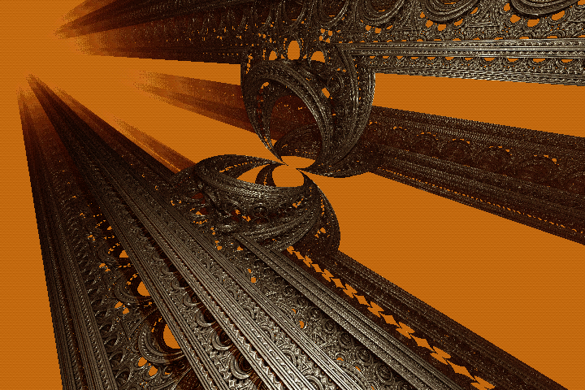

```glsl
float de ( vec3 p ) {
  float e, s, t=0.0; // time adjust term
  vec3 q=p;
  p.z+=7.;
  s=1.;
  for(int j=0;j++<6;)
    s*=e=PI/min(dot(p,p),.8),
    p=abs(p)*e-3.,
    p.y-=round(p.y);
  return e=length(p)/s;
}
```

### // Spherical Inversion Variant of Above — Jos Leys / Knighty

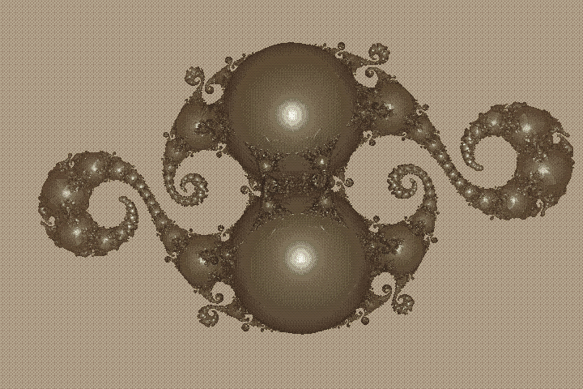

```glsl
vec2 wrap( vec2 x, vec2 a, vec2 s ){
  x -= s; 
  return ( x - a * floor( x / a ) ) + s;
}

void TransA( inout vec3 z, inout float DF, float a, float b ) {
  float iR = 1.0 / dot( z, z );
  z *= -iR;
  z.x = -b - z.x; z.y = a + z.y; 
  DF *= max( 1.0, iR );
}

float de ( vec3 p ) {
  float adjust = 6.28; // use this for time varying behavior
  float box_size_x = 1.0;
  float box_size_z = 1.0;
  float KleinR = 1.94 + 0.05 * abs( sin( -adjust * 0.5 ) ); //1.95859103011179;
  float KleinI = 0.03 * cos( -adjust*0.5 ); //0.0112785606117658;
  vec3 lz = p + vec3( 1.0 ), llz = p + vec3( -1.0 );
  float d = 0.0; float d2 = 0.0;
  vec3 InvCenter = vec3( 1.0, 1.0, 0.0 );
  float rad = 0.8;
  p = p - InvCenter;
  d = length( p );
  d2 = d * d;
  p = ( rad * rad / d2 ) * p + InvCenter;
  float DE = 1e10;
  float DF = 1.0;
  float a = KleinR;
  float b = KleinI;
  float f = sign( b ) * 1.0;
  for ( int i = 0; i < 20 ; i++ ) {
    p.x = p.x + b / a * p.y;
    p.xz = wrap( p.xz, vec2( 2. * box_size_x, 2. * box_size_z ), vec2( -box_size_x, - box_size_z ) );
    p.x = p.x - b / a * p.y;
    if ( p.y >= a * 0.5 + f *( 2.0 * a - 1.95 ) / 4.0 * sign( p.x + b * 0.5 ) * 
     ( 1.0 - exp( -( 7.2 - ( 1.95 - a ) * 15.0 )* abs( p.x + b * 0.5 ) ) ) ) { 
      p = vec3( -b, a, 0.0 ) - p;
    } //If above the separation line, rotate by 180° about (-b/2, a/2)
    TransA( p, DF, a, b ); //Apply transformation a
    if ( dot( p - llz, p - llz ) < 1e-5 ) { 
      break; 
    } //If the iterated points enters a 2-cycle , bail out.
    llz = lz; lz = p; //Store previous iterates
  }

  float y =  min( p.y, a-p.y );
  DE = min( DE, min( y, 0.3 ) / max( DF, 2.0 ) );
  DE = DE * d2 / ( rad + d * DE );
  return DE;
}
```

### // tdhooper variant 1 - spherical inversion — Jos Leys / Knighty / tdhooper

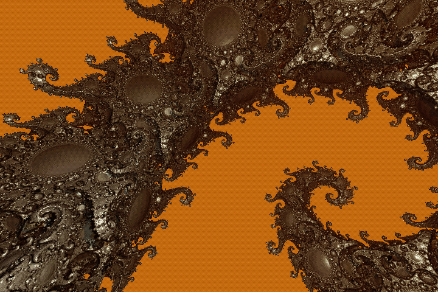

```glsl
vec2 wrap ( vec2 x, vec2 a, vec2 s ) {
  x -= s;
  return (x - a * floor(x / a)) + s;
}

void TransA ( inout vec3 z, inout float DF, float a, float b ) {
  float iR = 1. / dot( z, z );
  z *= -iR;
  z.x = -b - z.x;
  z.y = a + z.y;
  DF *= iR; // max( 1.0, iR );
}

float de( vec3 z ) {
  vec3 InvCenter = vec3( 0.0, 1.0, 1.0 );
  float rad = 0.8;
  float KleinR = 1.5 + 0.39;
  float KleinI = ( 0.55 * 2.0 - 1.0 );
  vec2 box_size = vec2( -0.40445, 0.34 ) * 2.0;
  vec3 lz = z + vec3( 1.0 ), llz = z + vec3( -1.0 );
  float d = 0.0; float d2 = 0.0;
  z = z - InvCenter;
  d = length( z );
  d2 = d * d;
  z = ( rad * rad / d2 ) * z + InvCenter;
  float DE = 1e12;
  float DF = 1.0;
  float a = KleinR;
  float b = KleinI;
  float f = sign( b ) * 0.45;
  for ( int i = 0; i < 80; i++ ) {
    z.x += b / a * z.y;
    z.xz = wrap( z.xz, box_size * 2.0, -box_size );
    z.x -= b / a * z.y;
    if ( z.y >= a * 0.5 + f * ( 2.0 * a - 1.95 ) / 4.0 * sign( z.x + b * 0.5 ) * 
     ( 1.0 - exp( -( 7.2 - ( 1.95 - a ) * 15.0 )* abs(z.x + b * 0.5 ) ) ) ) {
      z = vec3( -b, a, 0.0 ) - z;
    } //If above the separation line, rotate by 180° about (-b/2, a/2)
    TransA( z, DF, a, b ); //Apply transformation a
    if ( dot( z - llz, z - llz ) < 1e-5 ) {
      break;
    } //If the iterated points enters a 2-cycle, bail out
    llz = lz; lz = z; //Store previous iterates
  }
  float y =  min(z.y, a - z.y);
  DE = min( DE, min( y, 0.3 ) / max( DF, 2.0 ) );
  DE = DE * d2 / ( rad + d * DE );
  return DE;
}
```

### // Tdhooper Variant 2 — Jos Leys / Knighty / tdhooper

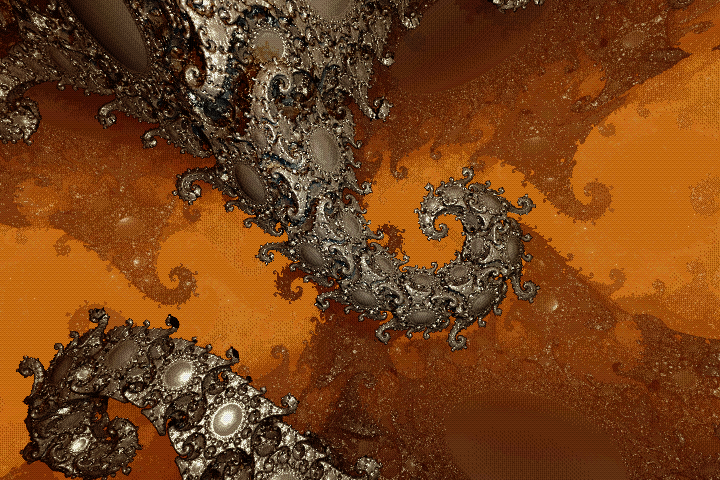

```glsl
vec2 wrap ( vec2 x, vec2 a, vec2 s ) {
  x -= s;
  return ( x - a * floor( x / a ) ) + s;
}

void TransA ( inout vec3 z, inout float DF, float a, float b ) {
  float iR = 1.0 / dot( z, z );
  z *= -iR;
  z.x = -b - z.x; 
  z.y =  a + z.y;
  DF *= iR; //max( 1.0, iR );
}

float de( vec3 z ) {
  float t = 0.0;
  float KleinR = 1.5 + 0.39;
  float KleinI = ( 0.55 * 2.0 - 1.0 );
  vec2 box_size = vec2( -0.40445, 0.34 ) * 2.0;
  vec3 lz = z + vec3( 1.0 ), llz = z + vec3( -1.0 );
  float d = 0.0; float d2 = 0.0;
  float DE = 1e12;
  float DF = 1.0;
  float a = KleinR;
  float b = KleinI;
  float f = sign( b ) * 0.45;
  for ( int i = 0; i < 80 ; i++ ) {
    z.x += b / a * z.y;
    z.xz = wrap( z.xz, box_size * 2.0, -box_size );
    z.x -= b / a * z.y;
    if ( z.y >= a * 0.5 + f * ( 2.0 * a - 1.95 ) / 4.0 * sign( z.x + b * 0.5 ) * 
     ( 1.0 - exp( -( 7.2 - ( 1.95 - a ) * 15.0 )* abs(z.x + b * 0.5 ) ) ) ) {
      z = vec3( -b, a, 0.0 ) - z;
    } //If above the separation line, rotate by 180° about (-b/2, a/2)
    TransA(z, DF, a, b); //Apply transformation a
    if ( dot( z - llz, z - llz ) < 1e-5 ) {
      break;
    } //If the iterated points enters a 2-cycle, bail out
    llz = lz; lz = z; //Store previous iterates
  }
  float y =  min( z.y, a - z.y );
  DE = min( DE, min( y, 0.3 ) / max( DF, 2.0 ) );
  return DE;
}
```

### float box ( vec3 p, vec3 b ) { — zackpudil

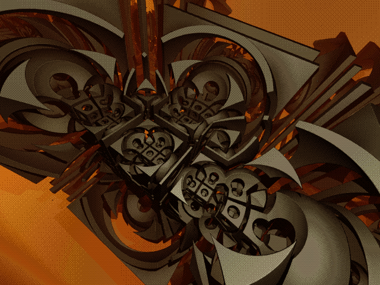

```glsl
vec3 d = abs( p ) - b;
  return min( max( d.x, max( d.y, d.z ) ), 0.0 ) + length( max( d, 0.0 ) );
}
float de ( vec3 p ) {
  vec4 q = vec4( p, 1.0 );
  q.y = mod( q.y + 1.0, 2.0 ) - 1.0;
  q.xyz -= 1.0;
  for ( int i = 0; i < 3; i++ ) {
    q.xyz = abs( q.xyz + 1.0 ) - 1.0;
    q = 1.2 * q / clamp( dot( q.xyz, q.xyz ), 0.25, 1.0 );
  }
  float f = box( q.xyz, vec3( 1.0 ) ) / q.w;
  f = min( f, p.y + 2.0 );
  f = min( f, min( p.x + 3.0, -p.x + 3.0 ) );
  f = min( f, min( p.z + 3.0, -p.z + 3.0 ) );
  return f;
}
```

### float cube(vec3 p){ — Catzpaw

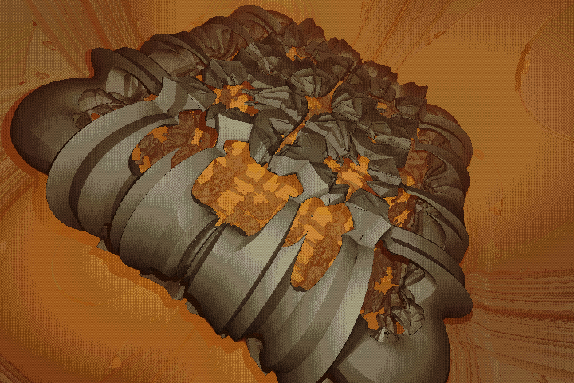

```glsl
p=abs(p)-.1;
  return length(max(p,0.)+min(max(p.x,max(p.y,p.z)),0.));
}
float de(vec3 p){
  float s=2.,r=.7;
  vec3 o=p;
  for(int i=0;i<8;i++){
    p=clamp(p,-1.008,1.008)*2.03-p; //boxfold
    float l=cube(p);
    if(l<.5){p*=2.1;r*=2.1;}else if(l<3.8){p/=l;r/=l;} //ballfold
    p=o+p*s;r=r*abs(s)+1.;
  }
  return .25-length(p)/abs(r);
}
```

### float de ( vec3 p ) { — aiekick

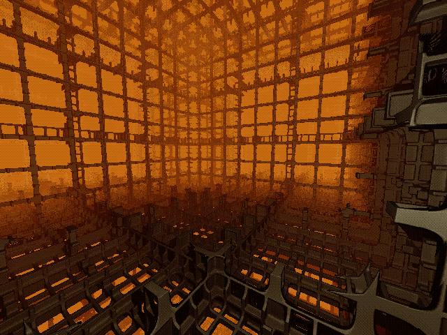

```glsl
float d = 0.0f;
  float t = 0.3f;
  float s = 1.0f;
  vec4 r = vec4( 0.0f );
  vec4 q = vec4( p, 0.0f );
  for ( int j = 0; j < 4 ; j++ )
    r = max( r *= r *= r = mod( q * s + 1.0f, 2.0f ) - 1.0f, r.yzxw ),
    d = max( d, ( 0.27f - length( r ) * 0.3f ) / s ),
    s *= 3.1f;
  return d;
}
```

### float de ( vec3 p ) { — Catzpaw

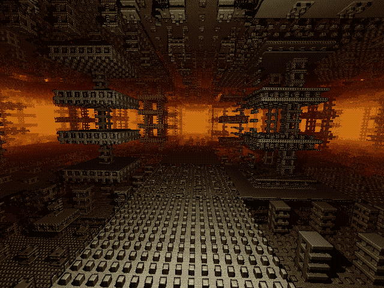

```glsl
float a,e,v,s;
  vec3 q;
  v=3.;

  // parameter originally randomized with twigl fsnoise()
    // a = fsnoise( ceil( p.xz * v + .5 ) ) * v + v;
  a = 10.0; // picked floats work too, but not as cool
  
  e=s;
  for(int j=0;++j<6;v*=a)
    q=abs(mod(p*v,2.)-1.),
    q=max(q,q.zyx),
    e=max(e,(min(q.y,q.z)-.3)/v);
  return e;
}
```

### float de ( vec3 p ) { — catzpaw

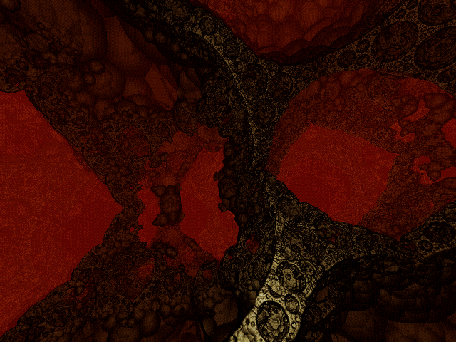

```glsl
float l, e, v;
  l=1.;
  for(int j=0;j++<8;l*=v)
    p=2.*clamp(p,-.8,.9)-p,
    p*=v=max(.9/dot(p,p),.7),
    p+=.13;
  return e=.1*p.y/l;
}
```

### float de ( vec3 p ) { — catzpaw

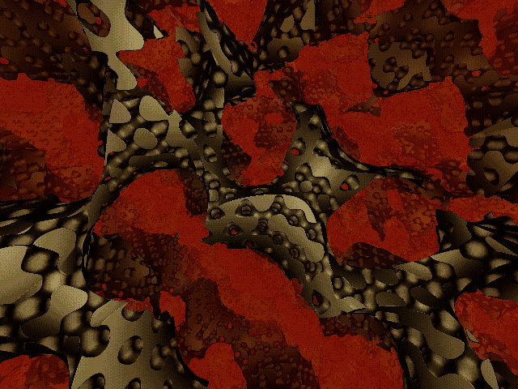

```glsl
#define F d=max(d,(1.2-length(sin(p*s)))/s);p+=s*=1.3
  float l=.1,d=l,s,i;
  d=0.;
  s=1.;
  F;
  F;
  l+=F;
  F*5.;
  F;
  #undef F
  return d;
}
```

### float de ( vec3 p ) { — catzpaw

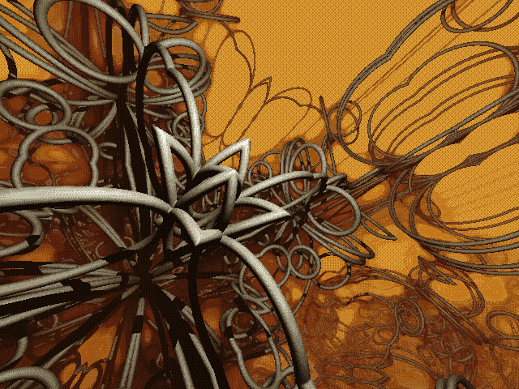

```glsl
float e=4.,s;
  for(int j=0;++j<7;p=abs(p)-.9,e/=s=min(dot(p,p),.9),p/=s);
  return length(p.xz)/e;
}
```

### float de ( vec3 p ) { — catzpaw

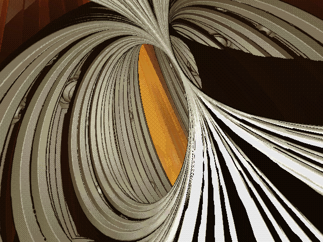

```glsl
float e=2.,s;
  vec3 c=vec3(4,.1,1.5);
  p.y+=1.4;
  for(int j=0;++j<7;p=abs(p)-1.5,e/=s=min(dot(p,p),.4),p/=s);
  return (p.x+p.z)/e;
}
```

### float de ( vec3 p ) { — gaz

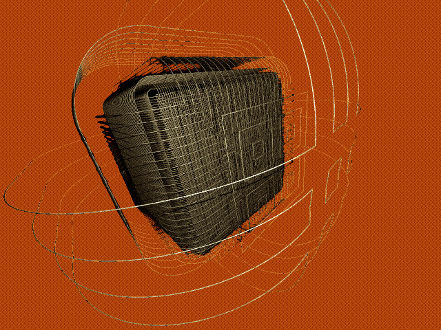

```glsl
float e,s;
  e=s=2.;
  for(int i=0;i++<6;s*=2.,p*=2.)
    p=.1-abs(abs(p)-.2),
    p=p.x<p.y?p.zxy:p.zyx,
    e=min(e,(length(vec2(length(p.xy)-1.,p.z)))/s+5e-4);
  return e;
}
```

### float de ( vec3 p ) { — gaz

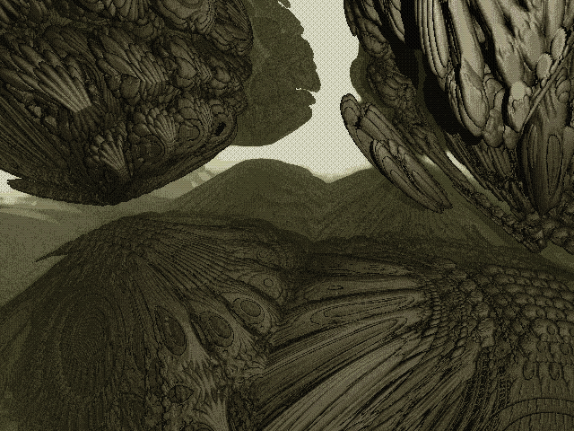

```glsl
float s,e;
  vec3 q=p*2.;
  s=3.;
  for(int j=0;j++<8;s*=e)
    p=sign(p)*(1.-abs(abs(p-2.)-1.)),
    p=p*(e=6./min(dot(p,p)+.3,3.))+q-vec3(3,1,12);
  return length(p)/s;
}
```

### float de ( vec3 p ) { — gaz

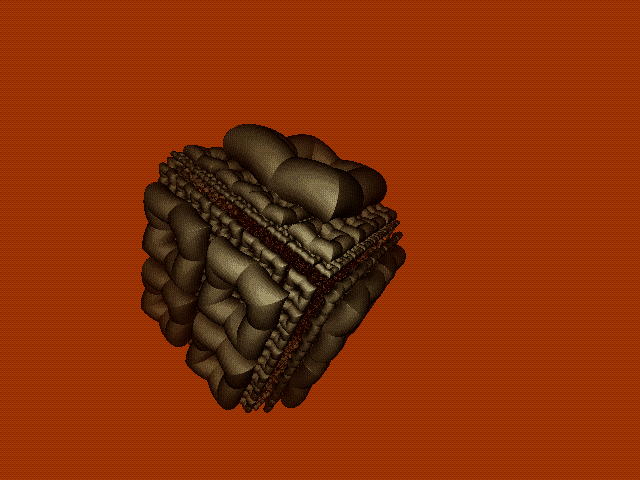

```glsl
float e,s;
  e=s=2.;
  for(int i=0;i++<5;s*=1.8,p*=1.8)
    p=abs(p)-.2,
    p=p.x<p.y?p.zxy:p.zyx,
    e=min(e,(length(vec2(length(p.xy)-.4,p.z))-.1)/s);
  return e;
}
```

### float de ( vec3 p ) { — gaz

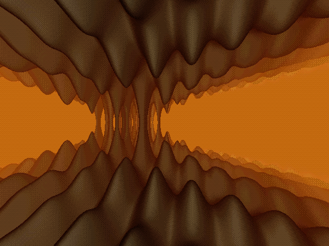

```glsl
float t = 1.0; // time based adjustment
  p.xz+=vec2(cos(p.z*5.+t*2.),sin(p.x*8.));
  p.xz*=rotate2D(.5-atan(p.x,p.z));
  return .1*(p.z-p.y*p.y-.3);
}
```

### float de ( vec3 p ) { — gaz

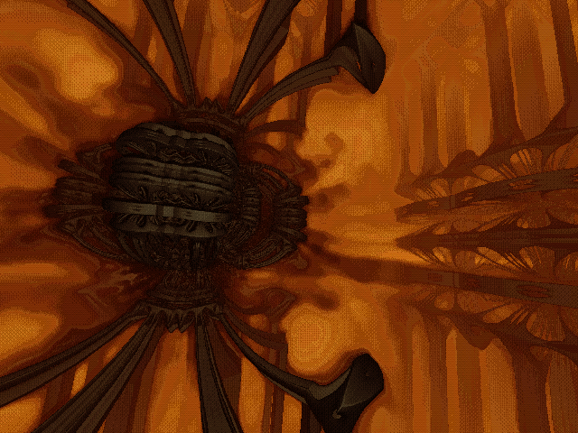

```glsl
#define R(p,a,t) mix(a*dot(p,a),p,cos(t))+sin(t)*cross(p,a)
#define H(h) (cos((h)*6.3+vec3(0,23,21))*.5+.5)
  
  float i=0., s, e, g=0.0;
  float t = time;
  vec4 pp=vec4(p,.07);
  pp.z-=0.5;
  pp.xyz=R(pp.xyz,normalize(H(t*.1)),t*.2);
  s=2.0;
  for(int j=0;j++<6;)
    pp=.02-abs(pp-.1),
    s*=e=max(1./dot(pp,pp),1.3),
    pp=abs(pp.x<pp.y?pp.wzxy:pp.wzyx)*e-1.3;
    g+=e=abs(length(pp.xz*pp.wy)-.02)/s+1e-4;
  return g;
#undef R
#undef H
}
```

### float de ( vec3 p ) { — gaz

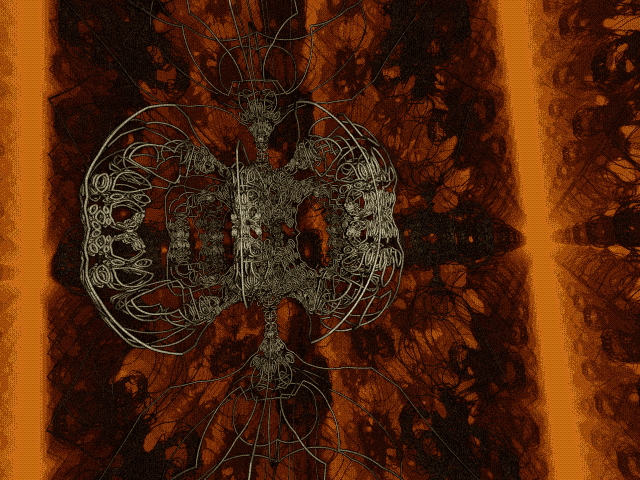

```glsl
float s=2., e, g, l;
  p=abs(mod(p-1.,2.)-1.)-1.;
  for(int j=0;j<8;j++)
    p=1.-abs(p-1.),
    p=p*(l=-1./dot(p,p))-vec3(.1,.3,.1),
    s*=abs(l);
    g+=e=length(p.xz)/s;
  return e;
}
```

### float de ( vec3 p ) { — gaz

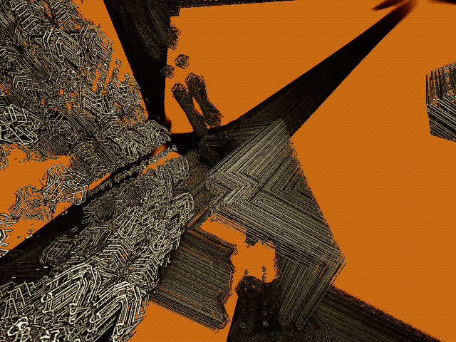

```glsl
float e = 1., g=0;
  for ( int i=0;i++<7;p=abs(p)-vec3(2,1,.2))
    p = 0.22-abs(abs(p)-.06),
    p = p.x>p.y?p.zxy:p.zyx,
    p *= 2.,
    e *= 2.,
    p.xz *= rotate2D(-.6);
    p /= e;
    g += e = length(p.xy);
  return e;
}
```

### float de ( vec3 p ) { — i_dianov

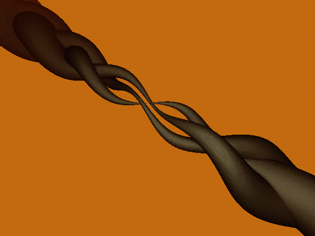

```glsl
vec3 I=p;
  float e=9.0;
  float d=0.0;
  vec2 uv = p.xy / 2.0;
  for(float j=0;j<PI;j+=PI/3.)
    p=I,
    p.x+=j*4.,
    p.y+=sin(p.x*.5),
    p.z+=sin(p.x)*.5,
    e=min(e,(length(p.yz)-length(uv)/4.)*.8);
    d+=e;
  return d;
}
```

### float de ( vec3 P ) { — Kamoshika

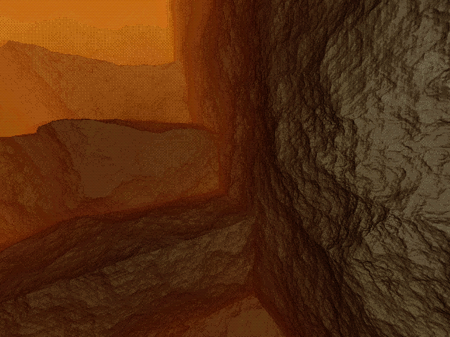

```glsl
vec3 Q;
  float a, d = min( ( P.y - abs( fract( P.z ) - 0.5f ) ) * 0.7f, 1.5f - abs( P.x ) );
  for( a = 2.0f; a < 6e2f; a += a )
    Q = P * a,
    Q.xz *= rotate2D( a ),
    d += abs( dot( sin( Q ), Q - Q + 1.0f ) ) / a / 7.0f;
  return d;
}
```

### float de ( vec3 p ) { — natchinoyuchi ( modified )

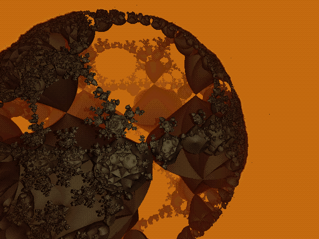

```glsl
p += vec3( 3.0, 3.0, -17.0 );
  float i, d = 3.0, e = 0.0, g, a = 3.0, t = time;
  p += a;
  for( int j = 0; j++ < 7; p *= e )
    p = abs( p - a ) - a,
    a = a * ( -sin( t ) * 0.6 + 0.61 ),
    d *= e = a * a * 2.0 / dot( p, p );
  return min( 0.3, ( p.y + length( p.xz ) ) / d );
}
```

### float de ( vec3 p ) { — snolot

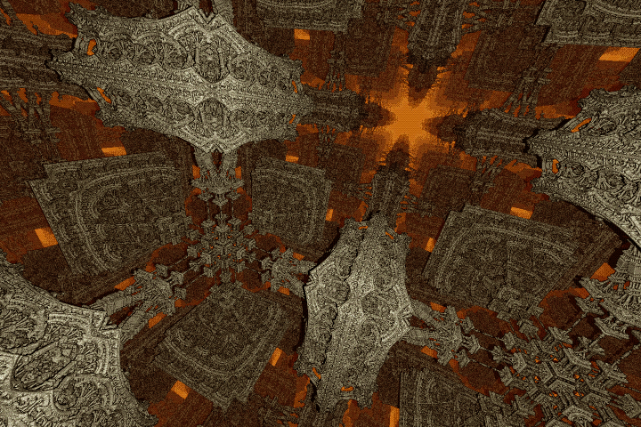

```glsl
float adjust = 62.0; // time based adjustment
  p = mod( p, 2.0 ) - 1.0;
  p = abs( p ) - 1.0;
  if ( p.x < p.z ) p.xz = p.zx;
  if ( p.y < p.z ) p.yz = p.zy;
  if ( p.x < p.y ) p.xy = p.yx;
  if ( p.x > p.y ) p.xy =- p.yx;
  float s = 1.0;
  for( int i = 0;i < 10;i++ ) {
    p.y -= abs( sin( adjust * 0.1 ) );
    float r2 = 2.0 / clamp( dot( p, p ), 0.2, 1.0 );
    p = abs( p ) * r2 - vec3( 0.45, 0.2, clamp( abs( sin( adjust * 0.7 ) * 4.2 ), 3.0, 5.2 ) );
    s *= r2;
  }
  return length( p ) / s;
}
```

### float de ( vec3 p ) { — stduhpf

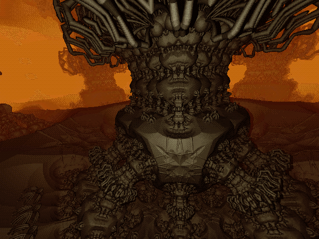

```glsl
float scale = 1.0;
  float orb = 10000.0; // orbit term 1
  for ( int i = 0; i < 6; i++ ) {
    p = -1.0 + 2.0 * fract( 0.5 * p + 0.5 );
    p -= sign( p ) * 0.1;
    float a = float( i ) * acos( -1.0 ) / 4.0;
    p.xz *= mat2( cos( a ), sin( a ), -sin( a ), cos( a ) );
    float r2 = dot( p, p );
    float k = 0.95 / r2;
    p *= k;
    scale *= k;
    orb = min( orb, r2 );
  }
  float d1 = sqrt( min( min( dot( p.xy, p.xy ), dot( p.yz, p.yz ) ), dot( p.zx, p.zx ) ) ) - 0.02;
  float d2 = abs( p.y );
  float dmi = d2;
  float adr = 0.7 * floor( ( 0.5 * p.y + 0.5 ) * 8.0 ); // orbit term 2
  if ( d1 < d2 ) {
    dmi = d1;
    adr = 0.0;
  }
  return 0.5 * dmi / scale;
}
```

### float de ( vec3 p ) { — sxolastikos

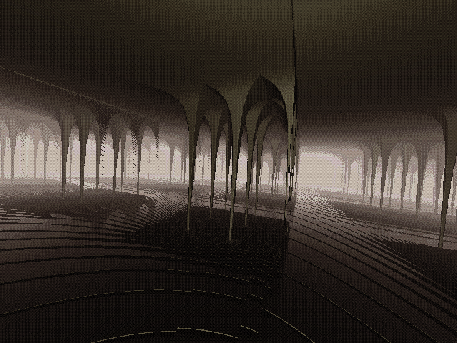

```glsl
float d;
  p.z-=6.;
  p.yz*=rotate2D(1.57);
  for(int j=0;j++<4;)
    p=abs(fract(abs(p))-.1),
    d=dot(p.z,max(p.x,p.y))-.001,
    d-=.8*min(d,dot(p,p-vec3(-1)));
  return d*4.;
}
```

### float de ( vec3 p ) { — tk87

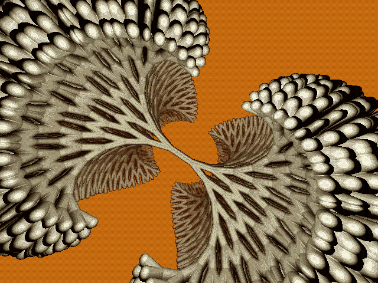

```glsl
float d = 0;
  p.z+=.8;
  for(int i=0;++i<10;)
    p.y-=clamp(p.y,.0,.1),
    p=abs(p),
    p*=rotate3D(.4,vec3(1,.2,-1)),
    p*=1.1;
  d=length(p)-.02;
  d*=.39;
  return d;
}
```

### float de ( vec3 p ) { — yonatan

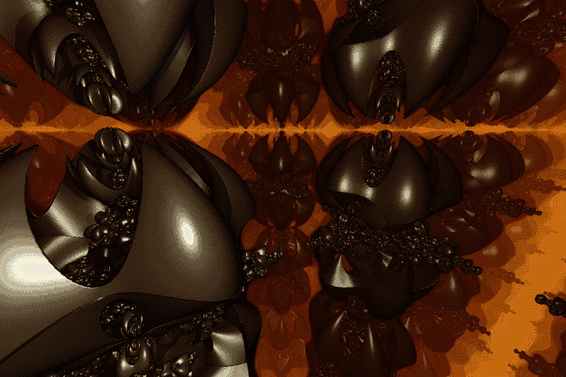

```glsl
float t = 0.0; // adjustment term
  float s = 12.0;
  float e = 0.0;
  for(int j = 0;j++ < 7; p /= e )
    p = mod( p - 1.0, 2.0 ) - 1.0,
    s /= e =dot( p, p );
  e -= abs( p.y ) + sin( atan( p.x, p.z ) * 6.0 + t * 3.0 ) * 0.2 - 0.3;
  return e / s;
}
```

### float de ( vec3 p ) { — yonatan

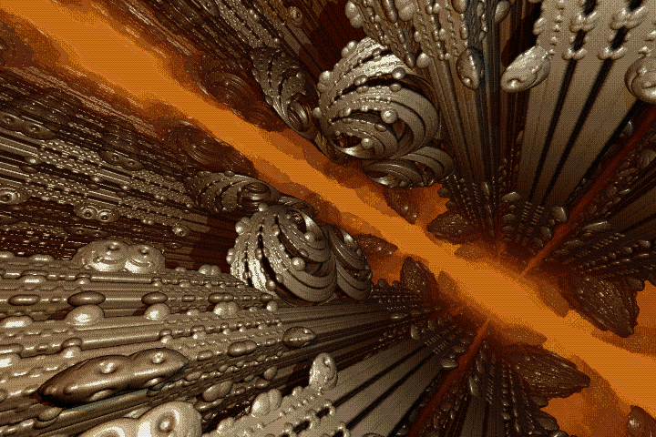

```glsl
p -= round( p );
  float s = 3.0;
  float e = 0.0;
  for( int i=0;i++ < 8; p = p / e + 2.0 )
    p = abs( p ) - 1.5,
    s /= e = min( dot( p, p ), 0.4 );
  return e = length( p.yz ) / s;
}
```

### float de ( vec3 p ) { — yonatan


```glsl
float e, j, s, k;
  e = 0.0;
  float t = 0.0; // time adjust term 
  float n = 9.0;
  k = t / n;
  p = vec3( log( length( p ) ) ,( atan( p.z, p.x ) - k ) / PI, sin( p.y / n + k ) );
  for ( s = j = 1.0; j++ < n; p = 3.0 - abs( p * e ) )
    p.y -= round( p.y ),
    s *= e = 3.0 / min( dot( p, p ), 1.0 );
  return e = length( p ) / s;
}
```

### float de ( vec3 p ) { — yonatan

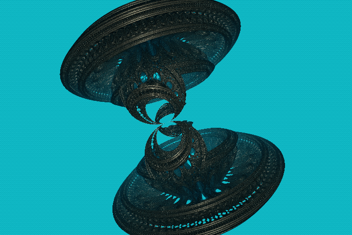

```glsl
float e, s, t=0.0; // time adjust term
  vec3 q=p;
  p.z+=7.;
  p=vec3(log(s=length(p)),atan(p.y,p.x),sin(t/4.+p.z/s));
  s=1.;
  for(int j=0;j++<6;)
    s*=e=PI/min(dot(p,p),.8),
    p=abs(p)*e-3.,
    p.y-=round(p.y);
  return e=length(p)/s;
}
```

### float de ( vec3 p ) { — yonatan

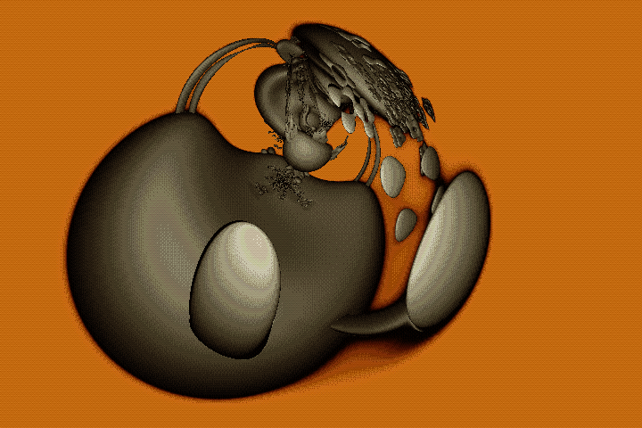

```glsl
vec3 q = vec3( -1.0, -1.0, 5.0 );
  vec3 d = vec3( 0.0 );
  float e = 0.0, s, u;
  e = s = 1.0;
  for( int j = 0; j++ < 6; p = cos( p ) - 0.7)
    s /= u = dot( p, p ),
    p /= -u,
    p.y = 1.72 - p.y,
    p += 0.7,
    e = min( e, p.y / s );
   return e;
}
```

### float de ( vec3 p ) { — yonatan

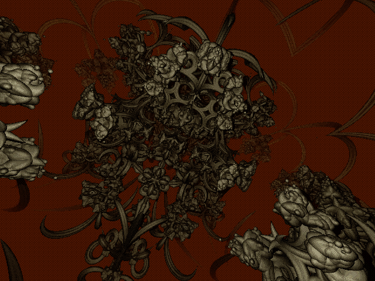

```glsl
float e,v,u;
  e = v = 2;
  for(int j=0;j++<12;j>3?e=min(e,length(p.xz+length(p)/u*.55)/v-.006),p.xz=abs(p.xz)-.7,p:p=abs(p)-.86)
    v /= u = dot( p, p ),
    p /= u,
    p.y = 1.7 - p.y;
  return e;
}
```

### float de ( vec3 p ) { — yonatan

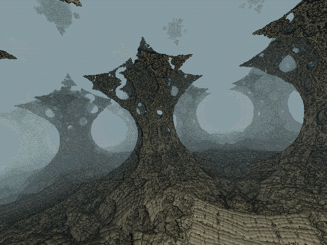

```glsl
// added some clamping to prevent potential div by 0
  float y,s,e;
  p+=vec3(1.0);
  y=p.y*.3-.3;
  s=9.;
  for(int j=0;j++<9;p/=max(e,0.0001))
    p=mod(p-1.,2.)-1.,
    p.zx*=rotate2D(PI/4.0),
    e = dot(p,p)*(0.6+y),
    s /= max(e,0.0001);
  return e=sqrt(e)/s;
}
```

### float de ( vec3 p ) { — yonatan

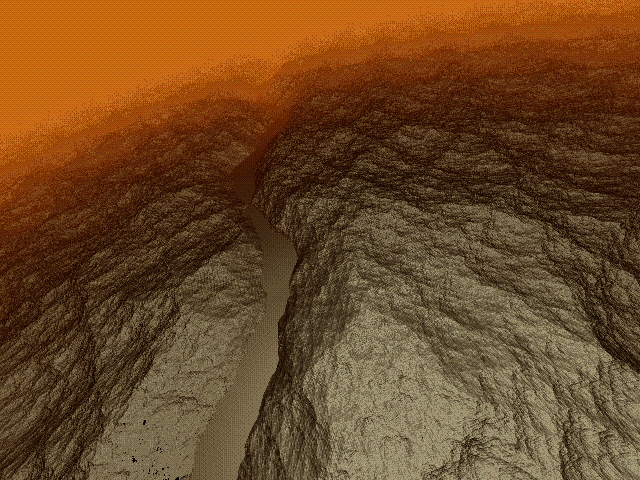

```glsl
float e,s;
  p.y-=p.z*.6;
  e=p.y-tanh(abs(p.x+sin(p.z)*.5));
  for(s=2.;s<1e3;s+=s)
    p.xz*=rotate2D(s),
    e+=abs(dot(sin(p.xz*s),vec2(1.0)/s/4.));
  e=min(e,p.y)-1.3;
  return e;
}
```

### float de ( vec3 p ) { — yonatan

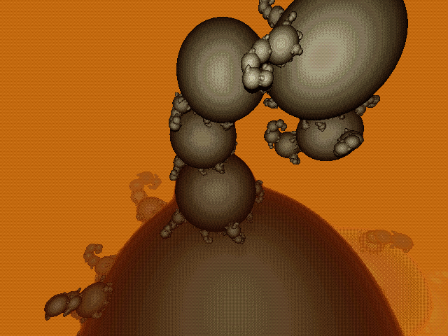

```glsl
float e=0.7;
  float s=5.0;
  float u;
  float t = 65.0; // time varying adjustment term
  for(int j=0;j++<12;p.xz=mod(p.xz-1.,2.)-1.)
    s/=u=dot(p,p),
    p/=-u,
    p.x=sin(t)*.25-p.x,
    p.z=cos(t)*.25-p.z,
    p.y+=1.75,
    e=min(e,p.y/s);
  return e;
}
```

### float de ( vec3 p ) { — yonatan

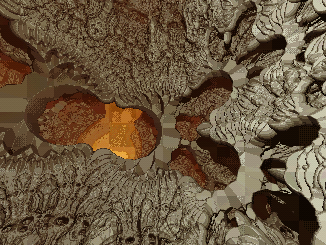

```glsl
p++;
  float s=3.;
  float e=0.;
  for(int j=0;j++<12;p/=e)
    p=mod(p-1.,2.)-1.,
    p.xz*=rotate2D(PI/4.),
    e=dot(p,p)*.5,
    s/=max(e,0.001);
  return length(p.y)/max(s,0.001)-.7/max(s,0.001);
}
```

### float de ( vec3 p ) { — yonatan

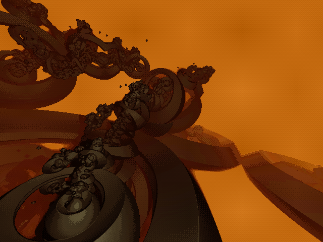

```glsl
float i = 0.0f;
  float u = 0.0f;
  float S = 6.0f;
  p--;
  for ( int j = 0; j++ < 8; p = abs( ++p ) - 1.0f )
    p.z =- p.z,
    u = dot( p, p ) * 0.6f,
    S /= u + 0.001f, // prevent divide-by-zero
    p /= u + 0.001f;
  return ( length( p.xz ) + p.y ) / S;
}
```

### float de ( vec3 p ) { — zackpudil

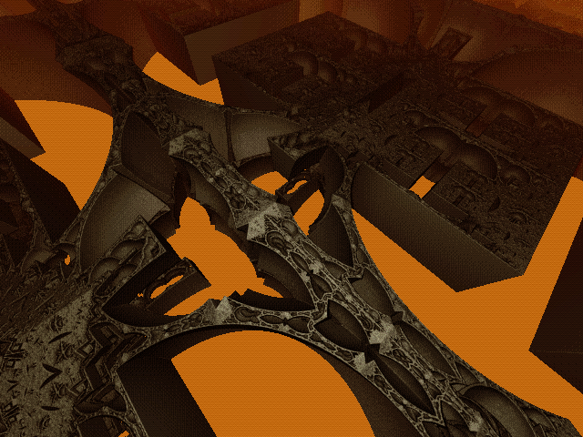

```glsl
p.xy = mod( p.xy + 1.0, 2.0 ) - 1.0;
  p.z = abs( p.z ) - 0.75;
  vec4 q = vec4( p, 1.0 );
  for ( int i = 0; i < 15; i++ ) {
    q.xyz = abs( q.xyz ) - vec3( 0.3, 1.0, -0.0 );
    q = 2.0 * q / clamp( dot( q.xyz, q.xyz ), 0.5, 1.0 ) - vec4( 1.0, 0.0, 0.3, 0.0 );
  }
  return abs(q.x + q.y + q.z)/q.w;
}
```

### float de ( vec3 p ) { — zackpudil

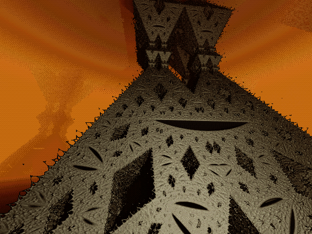

```glsl
vec4 q = vec4( p, 1 );
  q.xz = mod(q.xz + 1.0, 2.0) - 1.0;
  for ( int i = 0; i < 15; i++ ) {
    q.xyz = abs( q.xyz );
    q /= clamp( dot( q.xyz, q.xyz ), 0.4, 1.0 );
    q = 1.7 * q - vec4( 0.5, 1.0, 0.4, 0.0 );
  }
  return min( length( q.xyz ) / q.w, min( p.y + 1.0, -p.y + 1.0 ) );
}
```

### float de ( vec3 p ){ — gaz

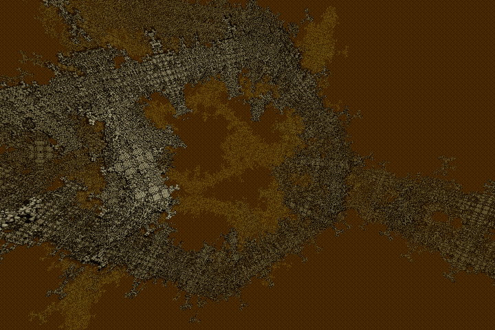

```glsl
float e = 1.;
  for( int i=0;i++<9; ){
    p = abs( p ) - .2;
    p = p.x > p.y ? p.zxy : p.zyx;
    p *= 2.0;
    e *= 2.0;
    p.xz *= rotate2D( 2.6 );
    p.yx = abs( p.yx ) - 4.0;
  }
  p /= e;
  return e = length( p ) * .8 - .01;
}
```

### float de ( vec3 p ){ — yonatan

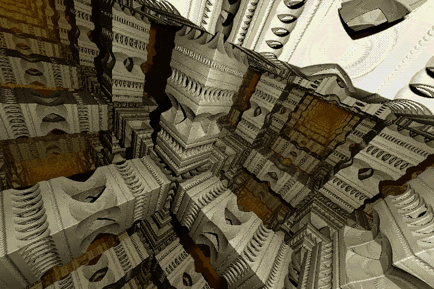

```glsl
float v = 2., e = 0.0, g = 0.0;
  p = abs(fract(p)-.5)+.12;
  
  if( p.x>p.y )
    p.xy=p.yx;
  
  if( p.y<p.z )
    p.yz=p.zy;
  
  for(int j=0;j++<16;p=abs(p)/e-.25)
    p.y-=3.5-g*.4,
    v/=e=min(dot(p,p)+.1,.5);
  return g+=e=length(p)/v;
}
```

### float de ( vec3 p ){ — yonatan

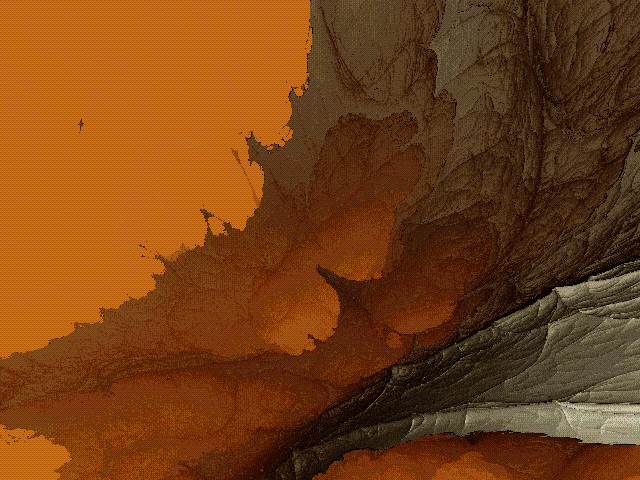

```glsl
float S = 1.0f;
  float R, e;
  p.y += p.z;
  p = vec3( log( R = length( p ) ) - time, asin( -p.z / R ), atan( p.x, p.y ) + time );
  for( e = p.y - 1.5f; S < 6e2; S += S )
    e += sqrt( abs( dot( sin( p.zxy * S ), cos( p * S ) ) ) ) / S;
  return e * R * 0.1f;
}
```

### float de( vec3 p ) { — illus0r

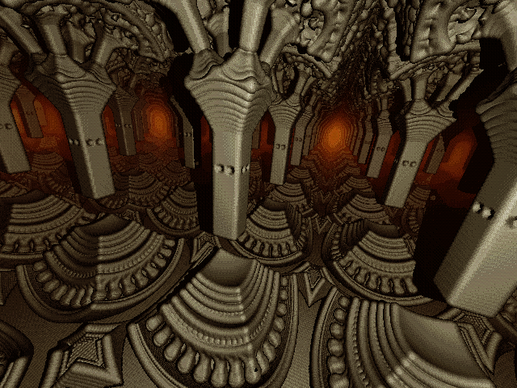

```glsl
p.y+=-1.43;
  p.x+=-.1245;
  vec3 pos = p;
  p.y -=1.5;
  float sc=0.0,d=0.0,s=0.0,e=1.0;
  p.z = mod(p.z,2.)-1.;
  p.x = mod(p.x,2.)-1.;
  float DEfactor=1.;
  for (float j=0.; j<9.; j++){
    p=abs(p);
    p-=vec3(.5,2.,.5);
    float dist = dot(p,p);
    sc=2./clamp(dist,.1,1.);
    p*=sc;
    DEfactor*=sc;
    p-=vec3(0.,5.,0.);
  }
  float dd=(length(p)/DEfactor-.001);
  d+=e=dd*.3;
  return d;
}
```

### float de( vec3 p ){ — gaziya5 aka gaz

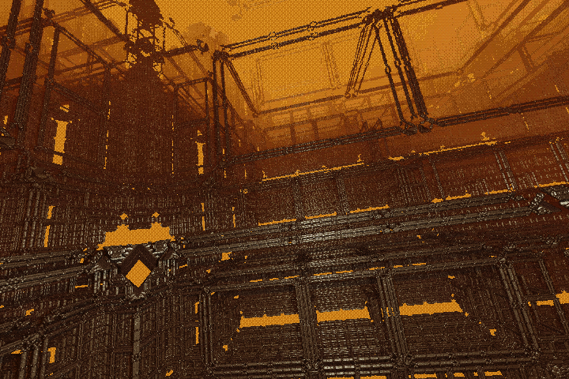

```glsl
vec3 k = vec3( 5.0, 2.0, 1.0 );
  p.y += 5.5;
  for( int j = 0; ++j < 8; ) {
    p.xz = abs( p.xz );
    p.xz = p.z > p.x ? p.zx : p.xz;
    p.z = 0.9 - abs( p.z - 0.9 );
    p.xy = p.y > p.x ? p.yx : p.xy;
    p.x -= 2.3;
    p.xy = p.y > p.x ? p.yx : p.xy;
    p.y += 0.1;
    p = k + ( p - k ) * 3.2;
  }
  return length( p ) / 6e3 - 0.001;
}
```

### float de( vec3 p ){ — Kamoshika

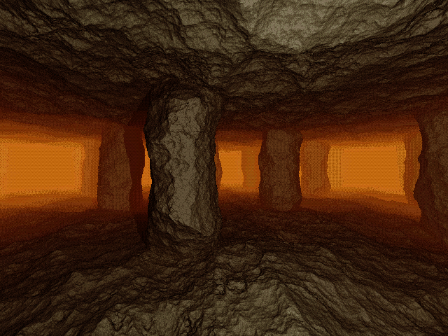

```glsl
vec3 Q, U = vec3( 1.0f );
  float d=1.0, a=1.0f;
  d = min( length( fract( p.xz) -0.5f ) - 0.2f, 0.3f - abs( p.y - 0.2f ) );
  for( int j = 0; j++ < 9; a += a )
    Q = p * a * 9.0f,
    Q.yz *= rotate2D( a ),
    d += abs( dot( sin( Q ), U ) ) / a * 0.02f;
  return d * 0.6f;
}
```

### float de( vec3 p ){ — yonatan

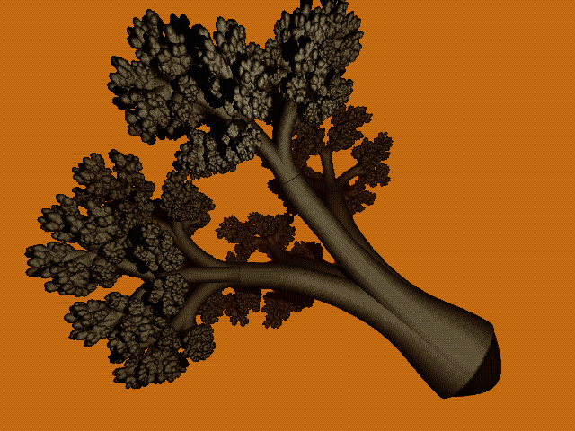

```glsl
vec3 q = vec3(-.1,.65,-.6);
  float j,i,e,v,u;
  for(j=e=v=7.;j++<21.;e=min(e,max(length(p.xz=abs(p.xz*rotate2D(j+sin(1./u)/v))-.53)-.02/u,p.y=1.8-p.y)/v))
    v/=u=dot(p,p),p/=u+.01;
  return e;
}
```

### float de(vec3 p) { — i_dianov

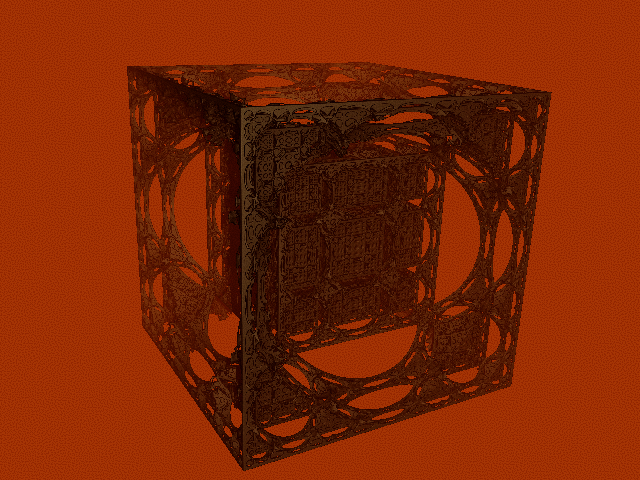

```glsl
float ss=1.;
  for(float j=0.;j++<4.;){
    float scale = 1.0/dot(p,p);
    float r1=.77, r2=1.;
    scale = clamp(scale, 1./(r2*r2), 1./(r1*r1));
    p *= scale;
    ss *= scale;
    p *= 3.;
    ss *= 3.;
    p=p-(1.6)*clamp(p,-1.,1.);
  }
  float si=.9;
  p-=clamp(p,-si,si);
  return abs(length(p)-.001)/ss;
}
```

### float de(vec3 p) { — illus0r (modified)

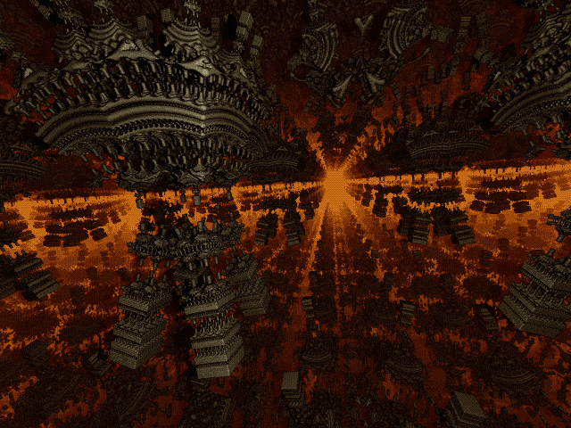

```glsl
p *= 0.1;
  float sc,s,j;
  float z=p.z;
  p.x=mod(p.x+.06,.12)-.06;
  p.z=mod(p.z,.12)-.06-.5;
  p.y+=.613+.175;
  p.x-=.5;
  sc=1.;
  for(j=0.;j++<9.;){
    p=abs(p);
    p-=vec2(.5,.3).xyx;
    float dist = dot(p,p);
    s=2./clamp(dist,.1,1.);
    p*=s;
    sc*=s;
    p-=vec3(0.,5.-pow(1.0,5.)*.08,0.);
  }
  return ((length(p)-4.)/sc)/0.1;
}
```

### float de(vec3 p){ — gaziya5 aka gaz

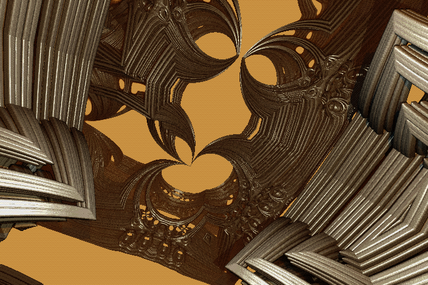

```glsl
float e, s=3.;
  p=.7-abs(p);
  p.x<p.y?p=p.yxz:p;
  for(int i=0;i++<8;)
    p=abs(p)-.9,
    e=dot(p,p),
    s*=e=2./min(e,2.)+6./min(e,.9),
    p=abs(p)*e-vec3(2,7,3);
  return e=length(p.yz)/s;
}
```

### float de(vec3 p){ — gaziya5 aka gaz

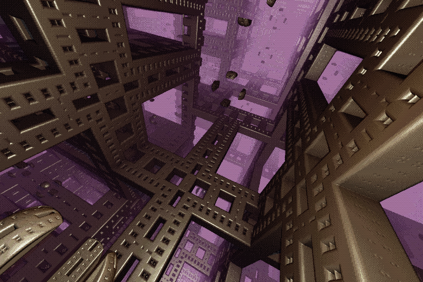

```glsl
p = asin( sin( p ) ) - vec3( 2., -3., 0. );
  float e=0., s=2.;
  for(int i=0;i++<8;p=p*e-vec3(1,3,7))
    p=abs(p),
    p=p.x<p.y?p.zxy:p.zyx,
    s*=e=2./clamp(dot(p,p),.2,1.);
  return e=abs(length(p-clamp(p,-5.,5.))-5.)/s+1e-5;
}
```

### float de(vec3 p){ — illus0r

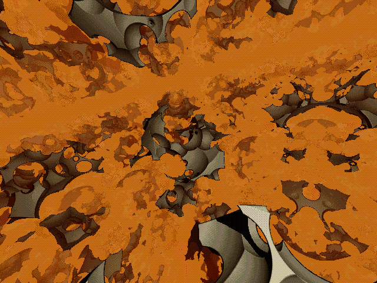

```glsl
float s = 1.;
  p.z += time;
  float c = length(mod(p, 1.)-.5)-.4;
  for(int i = 0; i < 10; i++) {
    p*=1.2;
    s*=1.2;
    c = max(c, -(length(mod(p, 1.)-.5)-.4)/s);
  }
  return c;
}
```

### float de(vec3 p){ — yonatan

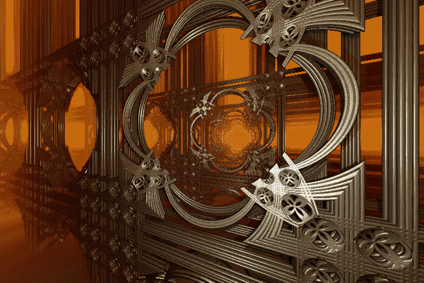

```glsl
float y=p.y+=.2;
  p.z-=round(p.z);
  float e, s=3.;
  p=.7-abs(p);
  for(int i=0;i++<8;p.z+=5.)
    p=abs(p.x>p.y?p:p.yxz)-.8,
    s*=e=5./min(dot(p,p),.5),
    p=abs(p)*e-6.;
  return e=min(y,length(p.yz)/s);
}
```

### float de(vec3 p){ — yonatan

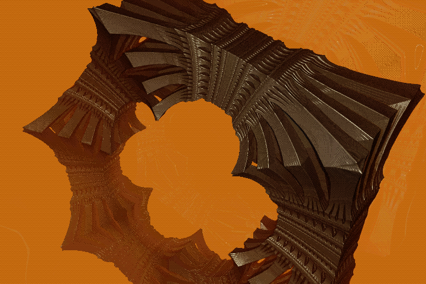

```glsl
float e, r, s=3., t = 0.0;
  p=vec3(log(r=length(p)),asin(p.z/r),atan(p.y,p.x)/PI*s)-t/PI;
  p-=round(p);
  for(int j=0;j++<7;p.z-=2.)
    s/=e=min(.3,dot(p,p))+.2,
    p=abs(p)/e-.2;
  return e=(length(p.xy)-.1)*r/s;
}
```

### float de(vec3 p){ — yonatan

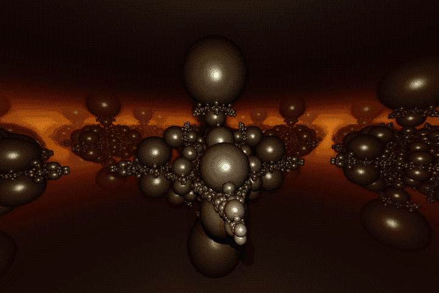

```glsl
float e, s=6., u=0.0;
  for(int j=0;j++<7;p=mod(p+1.,2.)-1.)
    s/=u=dot(p,p),
    p/=u;
  return e=dot(p,p)/s-abs(p.y)/s;
}
```

### float gyroid (vec3 seed) { return dot(sin(seed),cos(seed.yzx)); } — leon

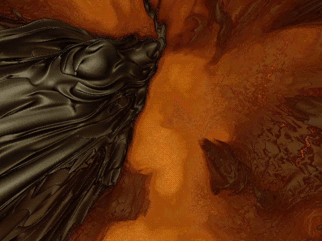

```glsl
float fbm (vec3 seed) {
  float result = 0.;
  float a = .5;
  for (int i = 0; i < 5; ++i) {
    result += gyroid(seed/a+result/a)*a;
    a /= 2.;
  }
  return result;
}
float de(vec3 p){
  // spicy fbm cyclic gyroid noise
  float details = sin(time*.2-fbm(p)+length(p));
  return max(abs(details*.05), p.z+2.);
}
```

### float hash13(vec3 p3){ — noby

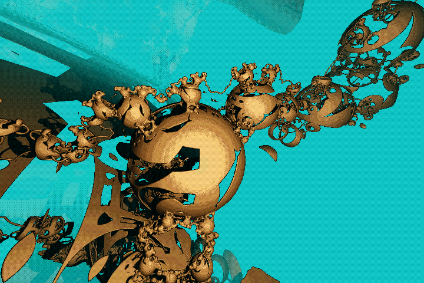

```glsl
p3 = fract((p3)*0.1031);
  p3 += dot(p3, p3.yzx  + 19.19);
  return fract((p3.x + p3.y) * p3.z);
}
float de( vec3 p ){
  vec3 po = p;
  p = -p;
  
  float k=1.;
  for(int i = 0; i < 8; ++i) {
    vec3 ss = vec3(-.54,0.84,1.22);
    p = 2.0*clamp(p,-ss,ss)-p;
    float f = max(0.7/dot(p,p),0.75);
    p *= f;
    k *= f*1.05;
  }

  float res = max(length(p.xz)-.9,length(p.xz)*abs(p.y)/length(p))/k;
  p = -p;

  // crumbly
  res += (-1.0+2.0*hash13( floor(p*10.0) ))*0.005 * (1.0-step(0.01, po.y));

  // blast
  const float ang = 0.04;
  const mat2 rot = mat2(cos(ang),sin(ang),-sin(ang),cos(ang));
  vec3 tpo = po-vec3(0,0.12,-1.5);
  tpo.xy *= rot;
  float blast = pow(smoothstep(-1.6, 0.35,po.x)-smoothstep(0.4,0.48,po.x), 3.0);
  res = min(res, length( (tpo).yz )-0.02*blast);
  return res;
}
```

### float hash13(vec3 p3){ — noby

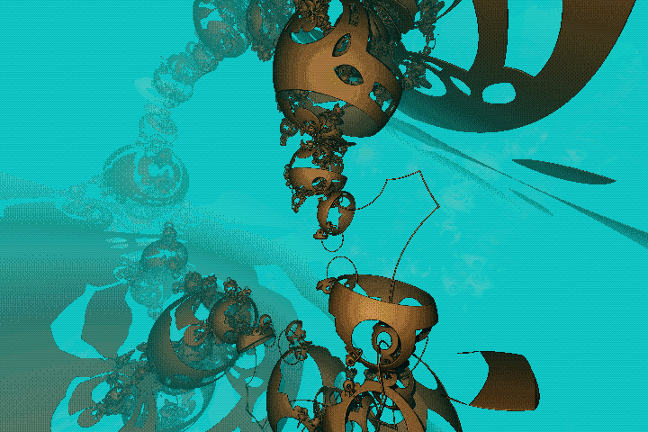

```glsl
p3 = fract((p3)*0.1031);
  p3 += dot(p3, p3.yzx  + 19.19);
  return fract((p3.x + p3.y) * p3.z);
}
float de( vec3 p ){
  vec3 po = p;
  
  float k=1.;
  for(int i = 0; i < 8; ++i) {
    vec3 ss = vec3(-.54,0.84,1.22);
    p = 2.0*clamp(p,-ss,ss)-p;
    float f = max(0.7/dot(p,p),0.75);
    p *= f;
    k *= f*1.05;
  }

  float res = max(length(p.xz)-.9,length(p.xz)*abs(p.y)/length(p))/k;
  res += (-1.0+2.0*hash13( floor(p*10.0) ))*0.005 * (1.0-step(0.01, po.y));
  const float ang = 0.04;
  const mat2 rot = mat2(cos(ang),sin(ang),-sin(ang),cos(ang));
  vec3 tpo = po-vec3(0,0.12,-1.5);
  tpo.xy *= rot;
  float blast = pow(smoothstep(-1.6, 0.35,po.x)-smoothstep(0.4,0.48,po.x), 3.0);
  res = min(res, length( (tpo).yz )-0.02*blast);
  return res;
}
```

### float pi = acos(-1.); — butadiene

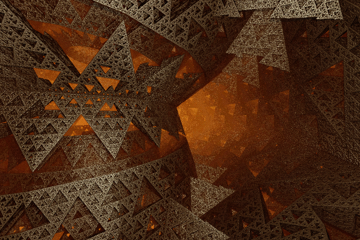

```glsl
mat2 rot(float r){
  vec2 s = vec2(cos(r),sin(r));
  return mat2(s.x,s.y,-s.y,s.x);
}
float cube(vec3 p,vec3 s){
  vec3 q = abs(p);
  vec3 m = max(s-q,0.);
  return length(max(q-s,0.))-min(min(m.x,m.y),m.z);
}
float tet(vec3 p,vec3 offset,float scale){
  vec4 z = vec4(p,1.);
  for(int i = 0;i<12;i++){
    if(z.x+z.y<0.0)z.xy = -z.yx;
    if(z.x+z.z<0.0)z.xz = -z.zx;
    if(z.z+z.y<0.0)z.zy = -z.yz;
    z *= scale;
    z.xyz += offset*(1.0-scale);
  }
  return (cube(z.xyz,vec3(1.5)))/z.w;
}
float de(vec3 p){
  p.xy *= rot(pi);

  float np = 2.*pi/24.;
  float r = atan(p.x,p.z)-0.5*np;
  r = mod(r,np)-0.5*np;
  p.xz = length(p.xz)*vec2(cos(r),sin(r));

  p.x -= 5.1;
  p.xy *= rot(0.3);
  p.xz *= rot(0.25*pi);

  p.yz *= rot(pi*0.5);
  float s =1.;
  p.z = abs(p.z)-3.;
  p = abs(p)-s*8.;
  p = abs(p)-s*4.;
  p = abs(p)-s*2.;
  p = abs(p)-s*1.;
  vec3 col = vec3(0.082,0.647,0.894);
  return tet(p,vec3(1),1.8);
}
```

### float r11 ( float t ) { — Jeyko

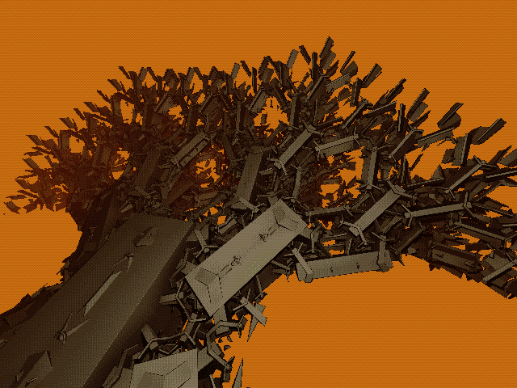

```glsl
return fract( sin( t * 414.125 ) * 114.12521 );
}
float valN ( float t ) {
  return mix( r11( floor( t ) ), r11( floor( t ) + 1.0 ), pow( fract( t ), 2.0 ) );
}
vec3 nois ( float t ) {
  t /= 2.0;
  return vec3( valN( t + 200.0 ), valN( t + 10.0 ), valN( t + 50.0 ) );
}
float sdBox ( vec3 p, vec3 s ) {
  p = abs( p ) - s;
  return max( p.x, max( p.y, p.z ) );
}
#define rot(j) mat2(cos(j),-sin(j),sin(j),cos(j))
float de ( vec3 p ) {
  vec3 n = nois( time );
  float d = 10e7;
  vec3 sz = vec3( 1.0, 0.5, 0.5 ) / 2.0;
  for( int i = 0; i < 8; i++ ){
    float b = sdBox( p, sz );
    sz *= vec3( 0.74, 0.5, 0.74 );
    d = min( b, d );
    p = abs( p );
    p.xy *= rot( -0.9 + n.x );
    p.yz *= rot( 0.6 - n.y * 0.3 );
    p.xz *= rot( -0.2 + n.y * 0.1 );
    p.xy -= sz.xy * 2.0;
  }
  return d;
}
```

### float sdBox(vec3 p, vec3 s) { — Schwarz P

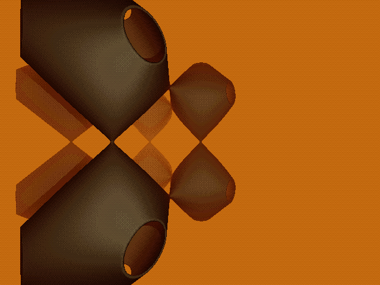

```glsl
p = abs(p)-s;
  return length(max(p, 0.))+min(max(p.x, max(p.y, p.z)), 0.);
}
float de(vec3 p) {
    float t = time;
    float box = sdBox(p, vec3(1));
    float scale = 5.5;
    float surf = cos(p.x * scale) + cos(p.y * scale) + cos(p.z * scale) + 2. * sin(t);
    surf = abs(surf) - 0.01;
    surf *= 0.1;
    return max(box, surf);
}
```

### mat2 rot ( float a ) { — rickiters

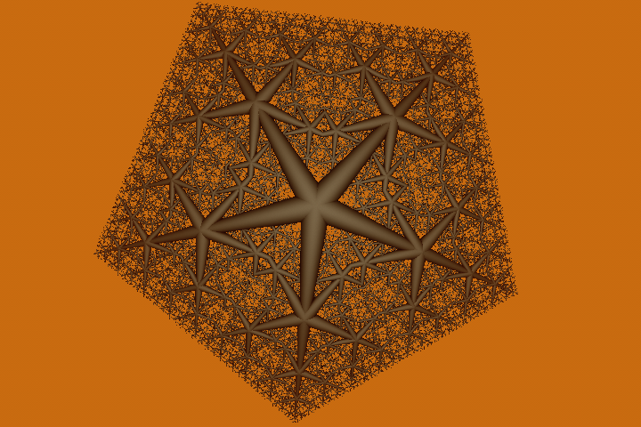

```glsl
return mat2( cos( a ), sin( a ), -sin( a ), cos( a ) );  
}
vec2 Rotate ( vec2 v, float angle ) {
  return v * rot( angle );
}
vec2 Kaleido ( vec2 v, float power ) {
  float TAO = 2.0 * 3.14159;
  return Rotate( v, floor( 0.5 + atan( v.x, -v.y ) * power / tao ) * tao / power );
}
float sdCappedCone ( in vec3 p, in vec3 c ) {
  vec2 q = vec2( length( p.xy ), -p.z );
  float d1 = p.z - c.z;
  float d2 = max( dot( q, c.xy ), -p.z );
  return length( max( vec2( d1, d2 ), 0.0 ) ) + min( max( d1, d2 ), 0.0 );
}
float sceneCone ( vec3 p ) {
  p += vec3( 0.0, 0.0, 7.5 );
  return sdCappedCone( p,vec3( 264.0 / 265.0, 23.0 / 265.0, 7.5 ) );
}
float de ( vec3 p ) {
  vec3 c = vec3( 10.0 );
  float scl = 0.5;
  float sclpow = 1.0;
  float sc;
  float sym = 5.0;
  p.xz = Kaleido( p.xz, sym );
  float d = sceneCone( p );
  for ( int i = 0;i < 6 ; ++i ) {
    p += vec3( 0.0, 0.0, 5.0 );
    p *= 1.0 / scl;
    sclpow *= scl;
    p.xz = Kaleido( p.xz, sym );
    sc = sceneCone( p ) * sclpow;
    d = min( d, sc );
  }
  return d;
}
```

### mat2 rot (float a) { float c=cos(a),s=sin(a); return mat2(c,-s,s,c); } — leon

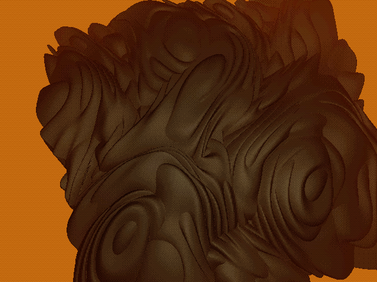

```glsl
float gyroid (vec3 p) { return dot(cos(p),sin(p.yzx)); }
float fbm( vec3 p ) {
  float result = 0.;
  float a = .5;
  for (float i = 0.; i < 3.; ++i)
  {
    p += result;
    p.z += time*.2;
    result += abs(gyroid(p/a)*a);
    a /= 2.;
  }
  return result;
}

float de( vec3 p ) {
  float dist = 100.0f;
  p.xz *= rot(time * .2);
  p.xy *= rot(time * .1);
  vec3 q = p;
  
  p = abs(p)-1.3;
  dist = max(p.x, max(p.y, p.z));
  dist -= fbm(q)*.2;
  dist = abs(dist)-.03;
  
  return dist * .5;
}
```

### mat2 rot( float a ) { — leon

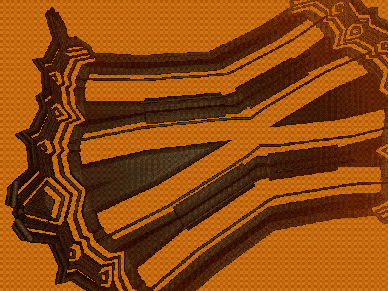

```glsl
float c = cos( a ),s = sin( a );
    return mat2( c, -s, s, c );
}

float de( vec3 p ) {
    float dist = 100.;

    float t = 196. + time;
    float a = 1.;

    for (float i = 0.; i < 8.; ++i) {
        vec3 e = vec3(.2+.2*sin(i+time),.0,0);
        p.xz = abs(p.xz)-.5*a;
        p.xz *= rot(t*a);
        p.yz *= rot(t*a);
        p = p - clamp(p, -e, e);
        dist = min(dist, length(p)-.01);
        a /= 1.8;
    }

    return dist;
}
```

### mat2 rot( float r ){ — i_dianov

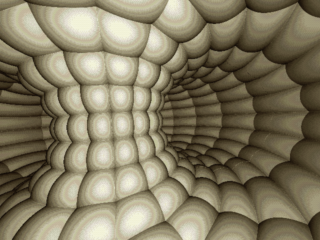

```glsl
return mat2(cos(r), sin(r), -sin(r), cos(r));
}
float de ( vec3 p ) {
  p.z+=.6;
  p.xz*=rot(3.141*2.*time/(19.));
  p*=3.;
  p=vec3(atan(p.x,p.z)*3.025,p.y,length(p.xz)-4.);
  p.yx*=rot(3.141/2.);
  p=vec3(atan(p.x,p.z)*3.025,p.y,length(p.xz)-5.);
  p.z+=2.;
  p.xy = mod(p.xy,1.)-.5;
  return .2*(length(p)-1.);
}
```

### mat2 rotate2D ( float r ) { — gaz

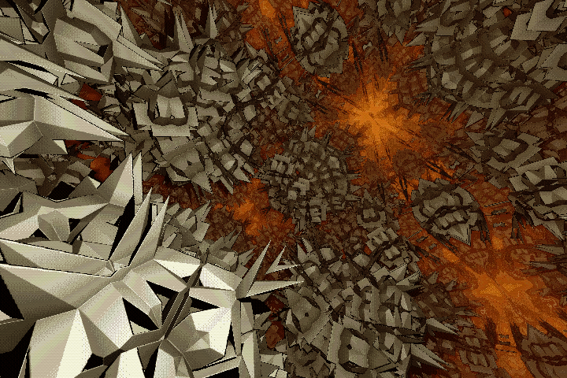

```glsl
return mat2( cos( r ), sin( r ), -sin( r ), cos( r ) );
}

float de ( vec3 p ) {
  float e = 1.0, g;
  p = asin( sin( p ) );
  for( int i = 0; i++ < 7; ){
    p = abs( p ) - 0.1;
    p = p.x > p.y ? p.zxy : p.zyx;
    p *= 2.0;
    e *= 2.0;
    p.xz *= rotate2D( 2.8 );
    p.yx = abs( p.yx ) - 4.0;
  }
  p /= e;
  return e = abs( p.z ) * 0.6 - 0.02;
}
```

### mat2 rotate2D ( float r ) { — kamoshika

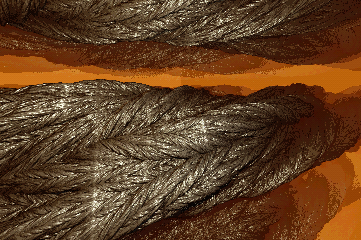

```glsl
return mat2( cos( r ), sin( r ), -sin( r ), cos( r ) );
}
float de ( vec3 p ) {
  vec3 q=p;
  float d, t = 0.0; // t is time adjustment
  q.xy=fract(q.xy)-.5;
  for( int j=0; j++<9; q+=q )
    q.xy=abs(q.xy*rotate2D(q.z + t))-.15;
    d=(length(q.xy)-.2)/1e3;
  return d;
}
```

### mat2 rotate2D ( float r ) { — tk87

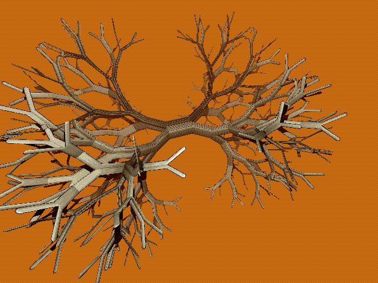

```glsl
return mat2(cos(r), sin(r), -sin(r), cos(r));
}
float de ( vec3 p ) {
  float d = 0;
  p.z+=3.;
  for(int i=0;++i<10;)
    p.y-=clamp(p.y,.0,.3),
    p.xz-=.05,
    p=abs(p),
    p.yx*=rotate2D(.6),
    p.zx*=rotate2D(1.4),
    p*=1.1;
    d=length(p)-.05;
    d*=.39;
  return d;
}
```

### mat2 rotate2D ( float r ) { — yonatan

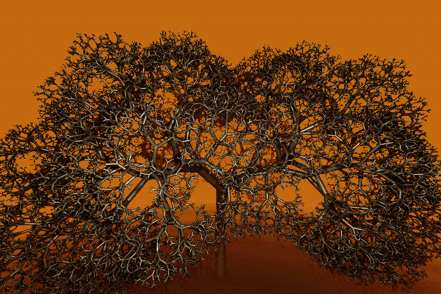

```glsl
return mat2( cos( r ), sin( r ), -sin( r ), cos( r ) );
}
float de(vec3 p){
  float e, s = 1.0;
  for( e = p.y += 2.0; s > 0.01; s *= 0.77 )
    p.x=abs(p.x),
    e=min(e,max(abs(p.y-s*.5)-s*.4,length(p.xz))-s*.1),
    p.y-=s,
    p.xz*=rotate2D(1.6),
    p.zy*=rotate2D(.7);
  return e*.8;
}
```

### mat2 rotate2D ( float r ) { — yonatan

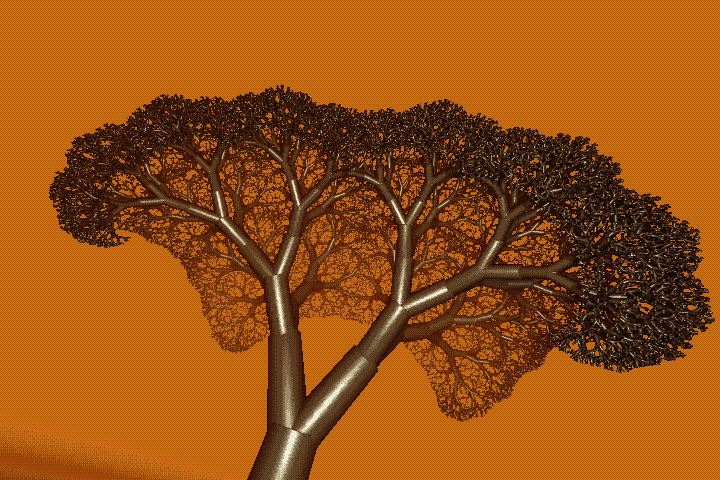

```glsl
return mat2( cos( r ), sin( r ), -sin( r ), cos( r ) );
}
float de(vec3 p){
  float e, s=.5;
  for(e=++p.y;s>.005;s*=.77)
    p.x=abs(p.x),
    e=min(e,max(abs(p.y-s*.5)-s*.4,
    length(p.xz))-s*.2),
    p.y-=s,
    p.xz*=rotate2D(1.57),
    p.zy*=rotate2D(.5);
  return e;
}
```

### mat3 getRotZMat(float a){return mat3(cos(a),-sin(a),0.,sin(a),cos(a),0.,0.,0.,1.);} — aiekick

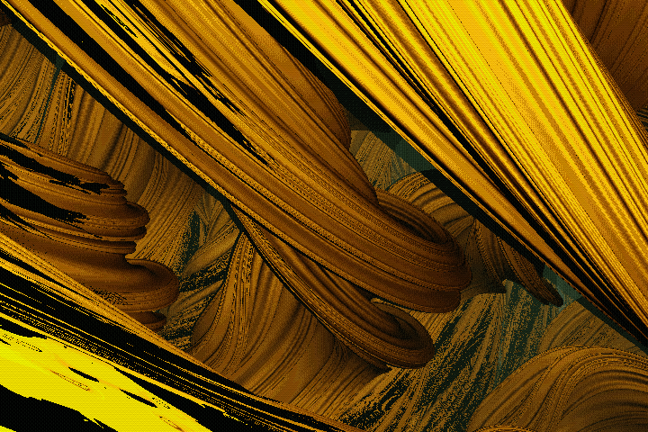

```glsl
float fractus(vec3 p) {
  vec2 z = p.xy;
  vec2 c = vec2(0.28,-0.56) * cos(p.z*0.1);
  float k = 1., h = 1.0;
  for (float i=0.;i<8.;i++) {
    h *= 4.*k;
    k = dot(z,z);
    if(k > 4.) break;
    z = vec2(z.x * z.x - z.y * z.y, 2. * z.x * z.y) + c;
  }
  return sqrt(k/h)*log(k);   
}
float de(vec3 p) {
  p *= getRotZMat(cos(p.z*0.2)*2.);
  p.xy = mod(p.xy, 3.5) - 3.5*0.5;
  p *= getRotZMat(cos(p.z*0.6)*2.);
  return fractus(p);
}
```

### mat3 rotmat(float angle, vec3 axis){ — marvelousbilly

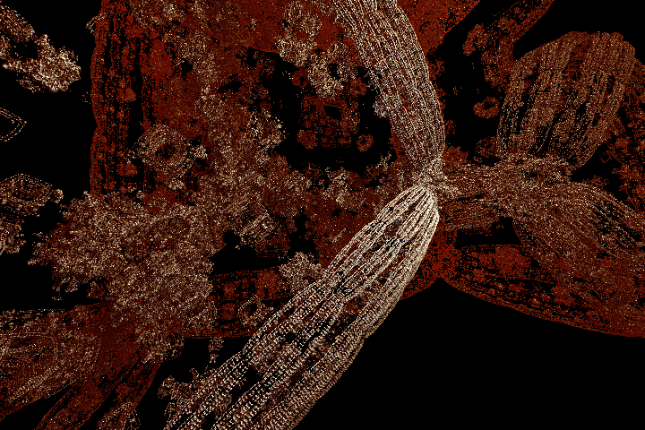

```glsl
axis = normalize(axis);
	float s = sin(angle);
	float c = cos(angle);
	float oc = 1.0 - c;
	return mat3(oc * axis.x * axis.x + c,  oc * axis.x * axis.y - axis.z * s,
	  oc * axis.z * axis.x + axis.y * s,  oc * axis.x * axis.y + axis.z * s,
	  oc * axis.y * axis.y + c, oc * axis.y * axis.z - axis.x * s,
	  oc * axis.z * axis.x - axis.y * s,  oc * axis.y * axis.z + axis.x * s,
	  oc * axis.z * axis.z + c);
}
float de(vec3 p){
  mat3 r = rotmat(3.14159, vec3(0.,1.,0.)); //rotation matrix
  float scale= 2.;
  int Iterations = 10;
  int i;
  vec3 C = vec3(1.,5.4,10.+10.*sin(0.5));
  for(i = 0; i < Iterations; i++){
    p = r * (p);
    float x = p.x; float y = p.y; float z = p.z; float x1 = x; float y1 = y;
    x=abs(x);y = abs(y);
    if(x-y<0.){x1=y;y=x;x=x1;}
    if(x-z<0.){x1=z;z=x;x=x1;}
    if(y-z<0.){y1=z;z=y;y=y1;}

    z-=0.5*C.z*(scale-1.)/scale;
    z=-abs(-z);
    z+=0.5*C.z*(scale-1.)/scale;

    p = vec3(x,y,z);
    r = rotmat(31.4159/4.+5.60,vec3(1.,0.5,0.6));
    p = r * (p);
    x = p.x; y = p.y; z = p.z;

    x=scale*x-C.y*(scale-1.);
    y=scale*y-C.y*(scale-1.);
    z=scale*z;

    p = vec3(x,y,z);
  }
  return (length(p) - 2.) * pow(scale,float(-i));
}
```

### mat3 rotZ ( float t ) { — aiekick

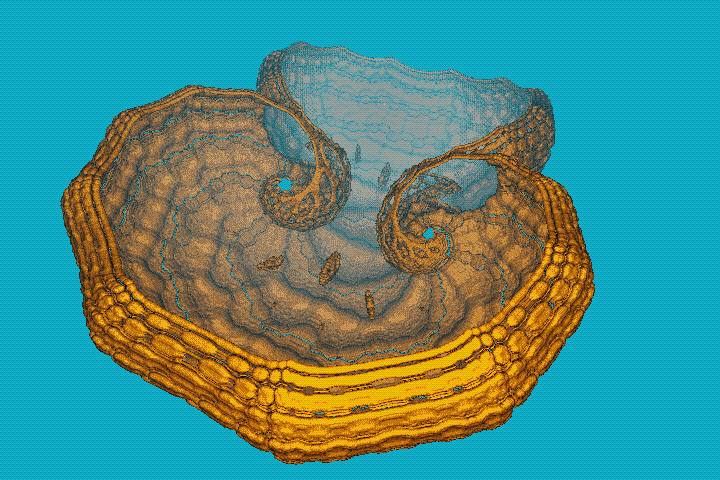

```glsl
float s = sin( t );
  float c = cos( t );
  return mat3( c, s, 0., -s, c, 0., 0., 0., 1. );
}

mat3 rotX ( float t ) {
  float s = sin( t );
  float c = cos( t );
  return mat3( 1., 0., 0., 0., c, s, 0., -s, c );
}

mat3 rotY ( float t ) {
  float s = sin( t );
  float c = cos( t );
  return mat3 (c, 0., -s, 0., 1., 0, s, 0, c);
}

float de ( vec3 p ){
  vec2 rm = radians( 360.0 ) * vec2( 0.468359, 0.95317 ); // vary x,y 0.0 - 1.0
  mat3 scene_mtx = rotX( rm.x ) * rotY( rm.x ) * rotZ( rm.x ) * rotX( rm.y );
  float scaleAccum = 1.;
  for( int i = 0; i < 18; ++i ) {
    p.yz = sqrt( p.yz * p.yz + 0.16406 );
    p *= 1.21;
    scaleAccum *= 1.21;
    p -= vec3( 2.43307, 5.28488, 0.9685 );
    p = scene_mtx * p;
  }
  return length( p ) / scaleAccum - 0.15;
}
```

### vec2 cmul( vec2 a, vec2 b ) { — athibaul

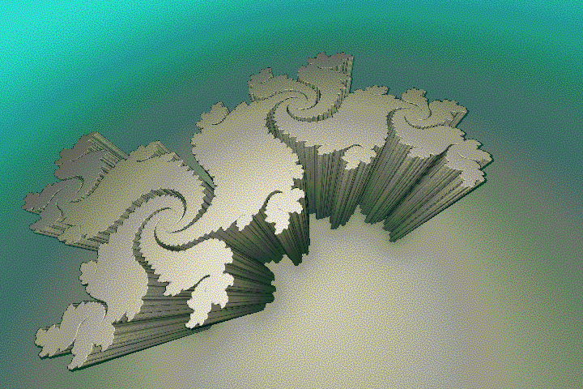

```glsl
return vec2(a.x*b.x-a.y*b.y, a.x*b.y+a.y*b.x);
}

vec2 cpow( vec2 a, float p ) {
  float rho = pow(length(a), p), theta = atan(a.y, a.x)*p;
  return rho * vec2(cos(theta), sin(theta));
}

float juliaDistance( vec2 c, vec2 z ) {
  const int iterations = 200;
  vec2 dz = vec2(1.);
  float m2 = 1.0;
  int i;
  for(i=0;i<iterations;i++) {
    // z = z*z + c except * is complex multiplication
    dz = 2.*cmul(z,dz);
    z = cmul(z,z) + c;
    m2 = dot(z,z);
    if(m2>1e10) break;
  }
  if(i >= iterations) return 0.;
  float lz = sqrt(m2);
  float d = lz*log(lz) / length(dz);
  return d;
}

float de( vec3 p ) {
  vec2 c = vec2(0.28,-0.49); // julia set parameters
  float d = juliaDistance(c, p.xz) * 0.5;
  d = max(d, p.y ); // Cut extruded julia at y = 0
  d = min(d, p.y + 1.); // Back plane at y = -1
  return d;
}
```

### vec2 cmul( vec2 a, vec2 b ) { return vec2( a.x * b.x - a.y * b.y, a.x * b.y + a.y * b.x ); } — guil

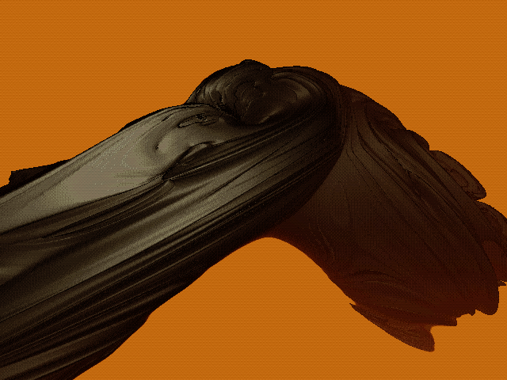

```glsl
vec2 csqr( vec2 a ) { return vec2( a.x * a.x - a.y * a.y, 2.0 * a.x * a.y ); }
vec2 conj( vec2 z ) { return vec2( z.x, -z.y ); }
vec4 dmul( vec4 a, vec4 b ) {
  float r = length( a );
  b.xy = cmul( normalize( a.xy ), b.xy );
  b.xz = cmul( normalize( a.xz ), b.xz );
  b.zw = cmul( normalize( a.zw ), b.zw );
  return r * b;
}

// Green Dragon
float de ( vec3 p) {
  float dr = 1.0;
  p *= dr;
  float r2;
  vec4 z = vec4( -p.yzx, 0.2 );
  dr = dr / length( z );
  if ( z.z > -0.5 )
    z.x += 0.5 * cos( time ) * abs( z.y ) * ( z.z + 0.5 );
  dr = dr * length( z );
  vec4 c = z;
  for ( int i = 0; i < 16; i++ ) {
    r2 = dot( z, z );
    if( r2 > 100.0 )
      continue;
    dr = 2.0 * sqrt( r2 ) * dr + 1.0;
    z = dmul( z, z ) + c;
  }
  return 0.5 * length( z ) * log( length( z ) ) / dr;
}
```

### vec2 wrap ( vec2 x, vec2 a, vec2 s ) { — Jos Leys / Knighty

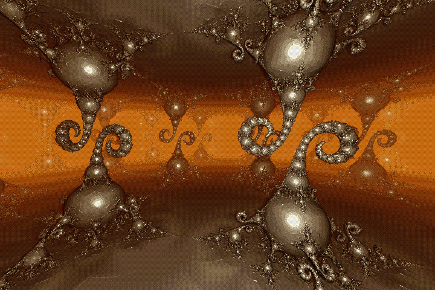

```glsl
x -= s;
  return ( x - a * floor( x / a ) ) + s;
}

void TransA( inout vec3 z, inout float DF, float a, float b ) {
  float iR = 1. / dot(z,z);
  z *= -iR;
  z.x = -b - z.x; 
  z.y =  a + z.y; 
  DF *= max( 1.0, iR );
}

float de ( vec3 z ) {
  float adjust = 6.2; // use this for time varying behavior
  float box_size_x = 1.0;
  float box_size_z = 1.0;
  float KleinR = 1.94 + 0.05 * abs( sin( -adjust * 0.5 ) ); //1.95859103011179;
  float KleinI = 0.03 * cos( -adjust * 0.5 ); //0.0112785606117658;
  vec3 lz = z +  vec3( 1.0 ), llz = z + vec3( -1.0 );
  float d = 0.0; float d2 = 0.0;
  float DE = 1e10;
  float DF = 1.0;
  float a = KleinR;
  float b = KleinI;
  float f = sign( b ) * 1.0;
  for ( int i = 0; i < 20 ; i++ ){
    z.x = z.x + b / a * z.y;
    z.xz = wrap( z.xz, vec2( 2.0 * box_size_x, 2.0 * box_size_z ), vec2( -box_size_x, -box_size_z ) );
    z.x = z.x - b / a * z.y;
    if ( z.y >= a * 0.5 + f * ( 2.0 * a - 1.95 ) / 4.0 * sign( z.x + b * 0.5 ) * 
     ( 1.0 - exp( -( 7.2 - ( 1.95 - a ) * 15.0 ) * abs( z.x + b * 0.5 ) ) ) ) { 
      z = vec3( -b, a, 0.0 ) - z;
    } //If above the separation line, rotate by 180° about (-b/2, a/2)

    TransA( z, DF, a, b ); //Apply transformation a
    if ( dot( z - llz, z - llz ) < 1e-5 ) { break; } //If the iterated points enters a 2-cycle , bail out.
    llz=lz; lz=z;  //Store previous iterates
  }
  
  float y =  min( z.y, a - z.y );
  DE = min( DE, min( y, 0.3 ) / max( DF, 2.0 ) );
  return DE;
}
```

### vec3 orbitColor; — michael0884

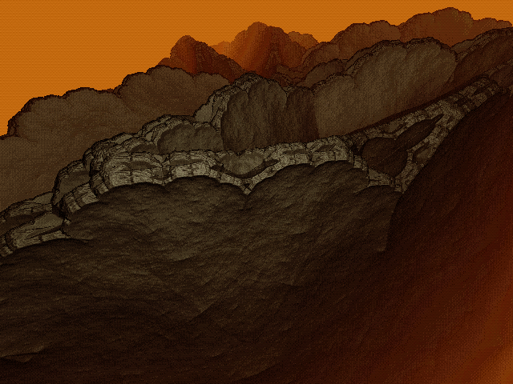

```glsl
float de( vec3 p ) {
// Jump the crater
  float scale = 1.8f;
  float angle1 = -0.12f;
  float angle2 = 0.5f;
  vec3 shift = vec3( -2.12f, -2.75f, 0.49f );
  vec3 color = vec3( 0.42f, 0.38f, 0.19f );
  vec2 a1 = vec2(sin(angle1), cos(angle1));
  vec2 a2 = vec2(sin(angle2), cos(angle2));
  mat2 rmZ = mat2(a1.y, a1.x, -a1.x, a1.y);
  mat2 rmX = mat2(a2.y, a2.x, -a2.x, a2.y);
  float s = 1.0;
  orbitColor = vec3( 0.0f );
  for (int i = 0; i <11; ++i) {
    p.xyz = abs(p.xyz);
    p.xy *= rmZ;
    p.xy += min( p.x - p.y, 0.0 ) * vec2( -1., 1. );
    p.xz += min( p.x - p.z, 0.0 ) * vec2( -1., 1. );
    p.yz += min( p.y - p.z, 0.0 ) * vec2( -1., 1. );
    p.yz *= rmX;
    p *= scale;
    s *= scale;
    p.xyz += shift;
    orbitColor = max( orbitColor, p.xyz * color);
  }
  vec3 d = abs( p ) - vec3( 6.0f );
  return ( min( max( d.x, max( d.y, d.z ) ), 0.0 ) + length( max( d, 0.0 ) ) ) / s;
}
```

### vec3 orbitColor; — michael0884

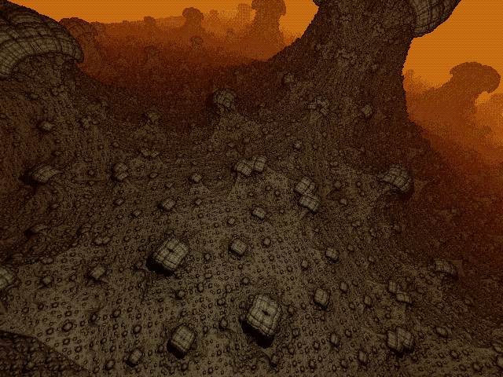

```glsl
float de( vec3 p ) {
  //Too many trees
  float scale = 1.9073f;
  float angle1 = -9.83f;
  float angle2 = -1.16f;
  vec3 shift = vec3( -3.508f, -3.593f, 3.295f );
  vec3 color = vec3( -0.34, 0.12f, -0.08f );
  vec2 a1 = vec2(sin(angle1), cos(angle1));
  vec2 a2 = vec2(sin(angle2), cos(angle2));
  mat2 rmZ = mat2(a1.y, a1.x, -a1.x, a1.y);
  mat2 rmX = mat2(a2.y, a2.x, -a2.x, a2.y);
  float s = 1.0;
  orbitColor = vec3( 0.0f );
  for (int i = 0; i <11; ++i) {
    p.xyz = abs(p.xyz);
    p.xy *= rmZ;
    p.xy += min( p.x - p.y, 0.0 ) * vec2( -1., 1. );
    p.xz += min( p.x - p.z, 0.0 ) * vec2( -1., 1. );
    p.yz += min( p.y - p.z, 0.0 ) * vec2( -1., 1. );
    p.yz *= rmX;
    p *= scale;
    s *= scale;
    p.xyz += shift;
    orbitColor = max( orbitColor, p.xyz * color);
  }
  vec3 d = abs( p ) - vec3( 6.0f );
  return ( min( max( d.x, max( d.y, d.z ) ), 0.0 ) + length( max( d, 0.0 ) ) ) / s;
}
```

### vec3 orbitColor; — michael0884

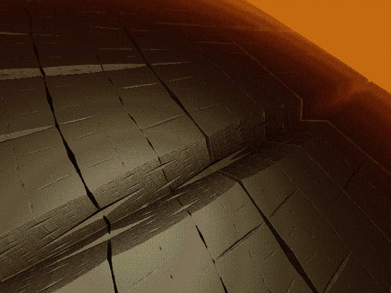

```glsl
float de( vec3 p ) {
  //Hole in one
  float scale = 2.02f;
  float angle1 = -1.57f;
  float angle2 = 1.62f;
  vec3 shift = vec3( -3.31f, 6.19f, 1.53f );
  vec3 color = vec3( 0.12f, -0.09f, -0.09f );
  vec2 a1 = vec2(sin(angle1), cos(angle1));
  vec2 a2 = vec2(sin(angle2), cos(angle2));
  mat2 rmZ = mat2(a1.y, a1.x, -a1.x, a1.y);
  mat2 rmX = mat2(a2.y, a2.x, -a2.x, a2.y);
  float s = 1.0;
  orbitColor = vec3( 0.0f );
  for (int i = 0; i <11; ++i) {
    p.xyz = abs(p.xyz);
    p.xy *= rmZ;
    p.xy += min( p.x - p.y, 0.0 ) * vec2( -1., 1. );
    p.xz += min( p.x - p.z, 0.0 ) * vec2( -1., 1. );
    p.yz += min( p.y - p.z, 0.0 ) * vec2( -1., 1. );
    p.yz *= rmX;
    p *= scale;
    s *= scale;
    p.xyz += shift;
    orbitColor = max( orbitColor, p.xyz * color);
  }
  vec3 d = abs( p ) - vec3( 6.0f );
  return ( min( max( d.x, max( d.y, d.z ) ), 0.0 ) + length( max( d, 0.0 ) ) ) / s;
}
```

### vec3 orbitColor; — michael0884

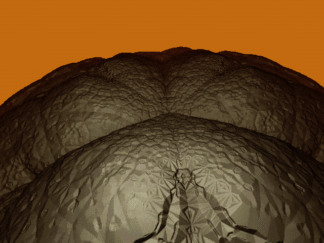

```glsl
float de( vec3 p ) {
  //Around the world
  float scale = 1.65f;
  float angle1 = 0.37f;
  float angle2 = 5.26f;
  vec3 shift = vec3( -1.41f, -0.22f, -0.77f );
  vec3 color = vec3( 0.14f, -1.71f, 0.31f );
  vec2 a1 = vec2(sin(angle1), cos(angle1));
  vec2 a2 = vec2(sin(angle2), cos(angle2));
  mat2 rmZ = mat2(a1.y, a1.x, -a1.x, a1.y);
  mat2 rmX = mat2(a2.y, a2.x, -a2.x, a2.y);
  float s = 1.0;
  orbitColor = vec3( 0.0f );
  for (int i = 0; i <11; ++i) {
    p.xyz = abs(p.xyz);
    p.xy *= rmZ;
    p.xy += min( p.x - p.y, 0.0 ) * vec2( -1., 1. );
    p.xz += min( p.x - p.z, 0.0 ) * vec2( -1., 1. );
    p.yz += min( p.y - p.z, 0.0 ) * vec2( -1., 1. );
    p.yz *= rmX;
    p *= scale;
    s *= scale;
    p.xyz += shift;
    orbitColor = max( orbitColor, p.xyz * color);
  }
  vec3 d = abs( p ) - vec3( 6.0f );
  return ( min( max( d.x, max( d.y, d.z ) ), 0.0 ) + length( max( d, 0.0 ) ) ) / s;
}
```

### vec3 orbitColor; — michael0884

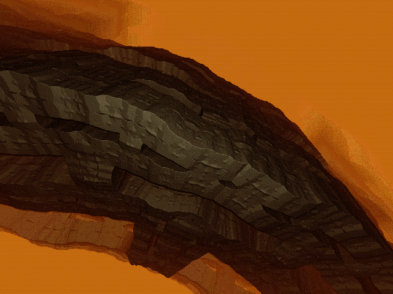

```glsl
float de( vec3 p ) {
  //Beware Of Bumps
  float scale = 1.66f;
  float angle1 = 1.52f;
  float angle2 = 0.19f;
  vec3 shift = vec3( -3.83f, -1.94f, -1.09f );
  vec3 color = vec3( 0.42f, 0.38f, 0.19f );
  vec2 a1 = vec2(sin(angle1), cos(angle1));
  vec2 a2 = vec2(sin(angle2), cos(angle2));
  mat2 rmZ = mat2(a1.y, a1.x, -a1.x, a1.y);
  mat2 rmX = mat2(a2.y, a2.x, -a2.x, a2.y);
  float s = 1.0;
  orbitColor = vec3( 0.0f );
  for (int i = 0; i <11; ++i) {
    p.xyz = abs(p.xyz);
    p.xy *= rmZ;
    p.xy += min( p.x - p.y, 0.0 ) * vec2( -1., 1. );
    p.xz += min( p.x - p.z, 0.0 ) * vec2( -1., 1. );
    p.yz += min( p.y - p.z, 0.0 ) * vec2( -1., 1. );
    p.yz *= rmX;
    p *= scale;
    s *= scale;
    p.xyz += shift;
    orbitColor = max( orbitColor, p.xyz * color);
  }
  vec3 d = abs( p ) - vec3( 6.0f );
  return ( min( max( d.x, max( d.y, d.z ) ), 0.0 ) + length( max( d, 0.0 ) ) ) / s;
}
```

### vec3 orbitColor; — michael0884

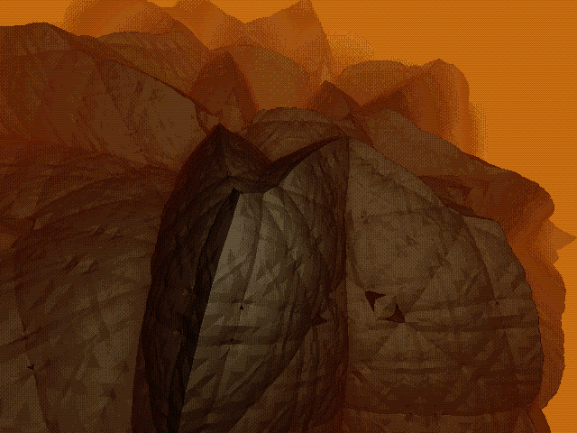

```glsl
float de( vec3 p ) {
  //Mountain Climbing
  float scale = 1.58f;
  float angle1 = -1.45f;
  float angle2 = 3.95f;
  vec3 shift = vec3( -1.55f, -0.13f, -2.52f );
  vec3 color = vec3( -1.17f, -0.4f, -1.0f );
  vec2 a1 = vec2(sin(angle1), cos(angle1));
  vec2 a2 = vec2(sin(angle2), cos(angle2));
  mat2 rmZ = mat2(a1.y, a1.x, -a1.x, a1.y);
  mat2 rmX = mat2(a2.y, a2.x, -a2.x, a2.y);
  float s = 1.0;
  orbitColor = vec3( 0.0f );
  for (int i = 0; i <11; ++i) {
    p.xyz = abs(p.xyz);
    p.xy *= rmZ;
    p.xy += min( p.x - p.y, 0.0 ) * vec2( -1., 1. );
    p.xz += min( p.x - p.z, 0.0 ) * vec2( -1., 1. );
    p.yz += min( p.y - p.z, 0.0 ) * vec2( -1., 1. );
    p.yz *= rmX;
    p *= scale;
    s *= scale;
    p.xyz += shift;
    orbitColor = max( orbitColor, p.xyz * color);
  }
  vec3 d = abs( p ) - vec3( 6.0f );
  return ( min( max( d.x, max( d.y, d.z ) ), 0.0 ) + length( max( d, 0.0 ) ) ) / s;
}
```

### vec3 orbitColor; — michael0884

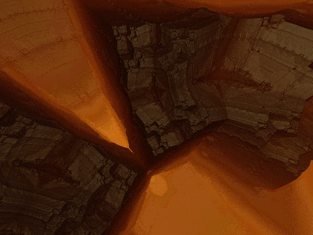

```glsl
float de( vec3 p ) {
  //Mind the gap
  float scale = 1.81f;
  float angle1 = -4.84f;
  float angle2 = -2.99f;
  vec3 shift = vec3( -2.905f, 0.765f, -4.165f );
  vec3 color = vec3( 0.251f, 0.337f, 0.161f );
  vec2 a1 = vec2(sin(angle1), cos(angle1));
  vec2 a2 = vec2(sin(angle2), cos(angle2));
  mat2 rmZ = mat2(a1.y, a1.x, -a1.x, a1.y);
  mat2 rmX = mat2(a2.y, a2.x, -a2.x, a2.y);
  float s = 1.0;
  orbitColor = vec3( 0.0f );
  for (int i = 0; i <11; ++i) {
    p.xyz = abs(p.xyz);
    p.xy *= rmZ;
    p.xy += min( p.x - p.y, 0.0 ) * vec2( -1., 1. );
    p.xz += min( p.x - p.z, 0.0 ) * vec2( -1., 1. );
    p.yz += min( p.y - p.z, 0.0 ) * vec2( -1., 1. );
    p.yz *= rmX;
    p *= scale;
    s *= scale;
    p.xyz += shift;
    orbitColor = max( orbitColor, p.xyz * color);
  }
  vec3 d = abs( p ) - vec3( 6.0f );
  return ( min( max( d.x, max( d.y, d.z ) ), 0.0 ) + length( max( d, 0.0 ) ) ) / s;
}
```

### vec3 orbitColor; — michael0884

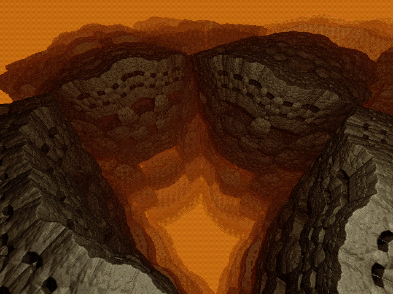

```glsl
float de( vec3 p ) {
  //The Sponge
  float scale = 1.88f;
  float angle1 = 1.52f;
  float angle2 = 4.91f;
  vec3 shift = vec3( -4.54f, -1.26f, 0.1f );
  vec3 color = vec3( -1.0f, 0.3f, -0.43f );
  vec2 a1 = vec2(sin(angle1), cos(angle1));
  vec2 a2 = vec2(sin(angle2), cos(angle2));
  mat2 rmZ = mat2(a1.y, a1.x, -a1.x, a1.y);
  mat2 rmX = mat2(a2.y, a2.x, -a2.x, a2.y);
  float s = 1.0;
  orbitColor = vec3( 0.0f );
  for (int i = 0; i <11; ++i) {
    p.xyz = abs(p.xyz);
    p.xy *= rmZ;
    p.xy += min( p.x - p.y, 0.0 ) * vec2( -1., 1. );
    p.xz += min( p.x - p.z, 0.0 ) * vec2( -1., 1. );
    p.yz += min( p.y - p.z, 0.0 ) * vec2( -1., 1. );
    p.yz *= rmX;
    p *= scale;
    s *= scale;
    p.xyz += shift;
    orbitColor = max( orbitColor, p.xyz * color);
  }
  vec3 d = abs( p ) - vec3( 6.0f );
  return ( min( max( d.x, max( d.y, d.z ) ), 0.0 ) + length( max( d, 0.0 ) ) ) / s;
}
```

### vec3 orbitColor; — michael0884

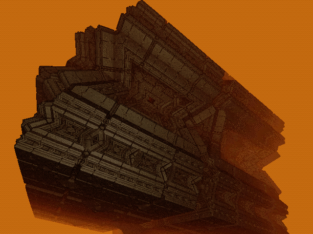

```glsl
float de( vec3 p ) {
  //Around The Citadel
  float scale = 2.0773f;
  float angle1 = -9.66f;
  float angle2 = -1.34f;
  vec3 shift = vec3( -1.238f, -1.533f, 1.085f );
  vec3 color = vec3( 0.42f, 0.38f, 0.19f );
  vec2 a1 = vec2(sin(angle1), cos(angle1));
  vec2 a2 = vec2(sin(angle2), cos(angle2));
  mat2 rmZ = mat2(a1.y, a1.x, -a1.x, a1.y);
  mat2 rmX = mat2(a2.y, a2.x, -a2.x, a2.y);
  float s = 1.0;
  orbitColor = vec3( 0.0f );
  for (int i = 0; i <11; ++i) {
    p.xyz = abs(p.xyz);
    p.xy *= rmZ;
    p.xy += min( p.x - p.y, 0.0 ) * vec2( -1., 1. );
    p.xz += min( p.x - p.z, 0.0 ) * vec2( -1., 1. );
    p.yz += min( p.y - p.z, 0.0 ) * vec2( -1., 1. );
    p.yz *= rmX;
    p *= scale;
    s *= scale;
    p.xyz += shift;
    orbitColor = max( orbitColor, p.xyz * color);
  }
  vec3 d = abs( p ) - vec3( 6.0f );
  return ( min( max( d.x, max( d.y, d.z ) ), 0.0 ) + length( max( d, 0.0 ) ) ) / s;
}
```

### vec3 orbitColor; — michael0884

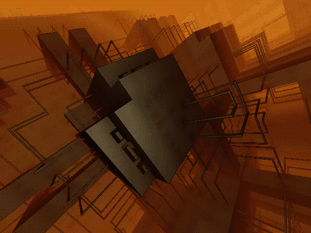

```glsl
float de( vec3 p ) {
  //Mega Citadel
  float scale = 1.4731f;
  float angle1 = 0.0f;
  float angle2 = 0.0f;
  vec3 shift = vec3( -10.27f, 3.28f, -1.90f );
  vec3 color = vec3( 1.17f, 0.07f, 1.27f );
  vec2 a1 = vec2(sin(angle1), cos(angle1));
  vec2 a2 = vec2(sin(angle2), cos(angle2));
  mat2 rmZ = mat2(a1.y, a1.x, -a1.x, a1.y);
  mat2 rmX = mat2(a2.y, a2.x, -a2.x, a2.y);
  float s = 1.0;
  orbitColor = vec3( 0.0f );
  for (int i = 0; i <11; ++i) {
    p.xyz = abs(p.xyz);
    p.xy *= rmZ;
    p.xy += min( p.x - p.y, 0.0 ) * vec2( -1., 1. );
    p.xz += min( p.x - p.z, 0.0 ) * vec2( -1., 1. );
    p.yz += min( p.y - p.z, 0.0 ) * vec2( -1., 1. );
    p.yz *= rmX;
    p *= scale;
    s *= scale;
    p.xyz += shift;
    orbitColor = max( orbitColor, p.xyz * color);
  }
  vec3 d = abs( p ) - vec3( 6.0f );
  return ( min( max( d.x, max( d.y, d.z ) ), 0.0 ) + length( max( d, 0.0 ) ) ) / s;
}
```

### vec3 orbitColor; — michael0884

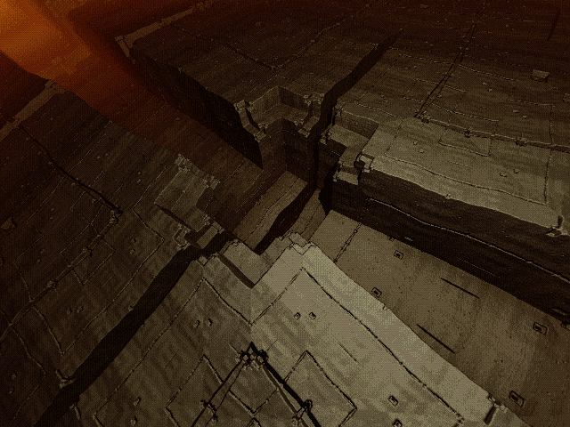

```glsl
float de( vec3 p ) {
  //Build Up Speed
  float scale = 2.08f;
  float angle1 = -4.79f;
  float angle2 = 3.16f;
  vec3 shift = vec3( -7.43f, 5.96f, -6.23f );
  vec3 color = vec3( 0.16f, 0.38f, 0.15f );
  vec2 a1 = vec2(sin(angle1), cos(angle1));
  vec2 a2 = vec2(sin(angle2), cos(angle2));
  mat2 rmZ = mat2(a1.y, a1.x, -a1.x, a1.y);
  mat2 rmX = mat2(a2.y, a2.x, -a2.x, a2.y);
  float s = 1.0;
  orbitColor = vec3( 0.0f );
  for (int i = 0; i <11; ++i) {
    p.xyz = abs(p.xyz);
    p.xy *= rmZ;
    p.xy += min( p.x - p.y, 0.0 ) * vec2( -1., 1. );
    p.xz += min( p.x - p.z, 0.0 ) * vec2( -1., 1. );
    p.yz += min( p.y - p.z, 0.0 ) * vec2( -1., 1. );
    p.yz *= rmX;
    p *= scale;
    s *= scale;
    p.xyz += shift;
    orbitColor = max( orbitColor, p.xyz * color);
  }
  vec3 d = abs( p ) - vec3( 6.0f );
  return ( min( max( d.x, max( d.y, d.z ) ), 0.0 ) + length( max( d, 0.0 ) ) ) / s;
}
```

### vec3 pmin ( vec3 a, vec3 b, vec3 k ) { — mrange

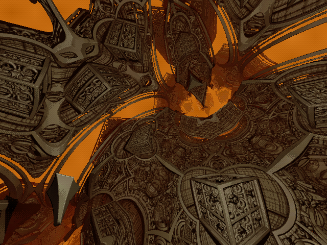

```glsl
vec3 h = clamp( 0.5 + 0.5 * ( b - a ) / k, 0.0, 1.0 );
  return mix( b, a, h ) - k * h * ( 1.0 - h );
}
void sphere_fold ( inout vec3 z, inout float dz ) {
  const float fixed_radius2 = 1.9;
  const float min_radius2 = 0.5;
  float r2 = dot( z, z );
  if ( r2 < min_radius2 ) {
    float temp = ( fixed_radius2 / min_radius2 );
    z *= temp;
    dz *= temp;
  } else if ( r2 < fixed_radius2 ) {
    float temp = ( fixed_radius2 / r2 );
    z *= temp;
    dz *= temp;
  }
}
void box_fold(float k, inout vec3 z, inout float dz) {
  vec3 zz = sign( z ) * pmin( abs( z ), vec3( 1.0 ), vec3( k ) );
  z = zz * 2.0 - z;
}
float sphere ( vec3 p, float t ) {
  return length( p ) - t;
}
float boxf ( vec3 p, vec3 b, float e ) {
  p = abs( p ) - b;
  vec3 q = abs( p + e ) - e;
  return min( min(
    length( max( vec3( p.x, q.y, q.z ), 0.0 ) ) + min( max( p.x, max( q.y, q.z ) ), 0.0 ),
    length( max( vec3( q.x, p.y, q.z ), 0.0 ) ) + min( max( q.x, max( p.y, q.z ) ), 0.0 ) ),
    length( max( vec3( q.x, q.y, p.z ), 0.0 ) ) + min( max( q.x, max( q.y, p.z ) ), 0.0 ) );
}
float de ( vec3 z ) {
  const float scale = -2.8;
  vec3 offset = z;
  float dr = 1.0;
  float fd = 0.0;
  const float k = 0.05;
  for ( int n = 0; n < 5; ++n ) {
    box_fold( k / dr, z, dr );
    sphere_fold( z, dr );
    z = scale * z + offset;
    dr = dr * abs( scale ) + 1.0;
    float r1 = sphere( z, 5.0 );
    float r2 = boxf( z, vec3( 5.0 ), 0.5 );
    float r = n < 4 ? r2 : r1;
    float dd = r / abs( dr );
    if ( n < 3 || dd < fd ) {
      fd = dd;
    }
  }
  return fd;
}
```

### vec3 Rotate(vec3 z,float AngPFXY,float AngPFYZ,float AngPFXZ) { — scaprendering

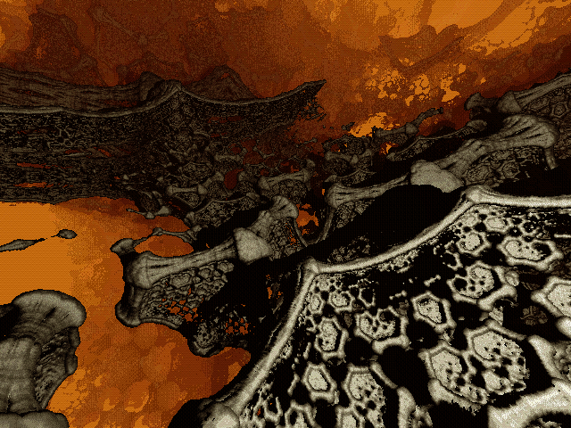

```glsl
float sPFXY = sin(radians(AngPFXY)); float cPFXY = cos(radians(AngPFXY));
        float sPFYZ = sin(radians(AngPFYZ)); float cPFYZ = cos(radians(AngPFYZ));
        float sPFXZ = sin(radians(AngPFXZ)); float cPFXZ = cos(radians(AngPFXZ));

        float zx = z.x; float zy = z.y; float zz = z.z; float t;

        // rotate BACK
        t = zx; // XY
        zx = cPFXY * t - sPFXY * zy; zy = sPFXY * t + cPFXY * zy;
        t = zx; // XZ
        zx = cPFXZ * t + sPFXZ * zz; zz = -sPFXZ * t + cPFXZ * zz;
        t = zy; // YZ
        zy = cPFYZ * t - sPFYZ * zz; zz = sPFYZ * t + cPFYZ * zz;
        return vec3(zx,zy,zz);
}


float de( vec3 p ) {
    float Scale = 1.34f;
    float FoldY = 1.025709f;
    float FoldX = 1.025709f;
    float FoldZ = 0.035271f;
    float JuliaX = -1.763517f;
    float JuliaY = 0.392486f;
    float JuliaZ = -1.734913f;
    float AngX = -51.080209f;
    float AngY = 0.0f;
    float AngZ = -29.096322f;
    float Offset = -3.036726f;
    int EnableOffset = 1;
    int Iterations = 80;
    float Precision = 1.0f;
    // output _sdf c = _SDFDEF)

    vec4 OrbitTrap = vec4(1,1,1,1);
    float u2 = 1;
    float v2 = 1;
    if(EnableOffset)p = Offset+abs(vec3(p.x,p.y,p.z));

    vec3 p0 = vec3(JuliaX,JuliaY,JuliaZ);
    float l = 0.0;
    int i=0;
    for (i=0; i<Iterations; i++) {
        p = Rotate(p,AngX,AngY,AngZ);
        p.x=abs(p.x+FoldX)-FoldX;
        p.y=abs(p.y+FoldY)-FoldY;
        p.z=abs(p.z+FoldZ)-FoldZ;
        p=p*Scale+p0;
        l=length(p);
        float rr = dot(p,p);
    }
    return Precision*(l)*pow(Scale, -float(i));
}
```

### vec3 triangles ( vec3 p ) { — krakel

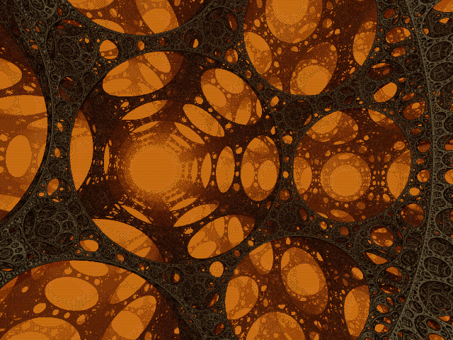

```glsl
const float sqrt3 = sqrt( 3.0 );
  float zm = 1.;
  p.x = p.x-sqrt3*(p.y+.5)/3.;
  p = vec3( mod( p.x + sqrt3 / 2.0, sqrt3 ) - sqrt3 / 2.0, mod( p.y + 0.5, 1.5 ) - 0.5, mod( p.z + 0.5 * zm, zm ) - 0.5 * zm );
  p = vec3( p.x / sqrt3, ( p.y + 0.5 ) * 2.0 / 3.0 - 0.5, p.z );
  p = p.y > -p.x ? vec3( -p.y, -p.x , p.z ) : p;
  p = vec3( p.x * sqrt3, ( p.y + 0.5 ) * 3.0 / 2.0 - 0.5, p.z );
  return vec3( p.x + sqrt3 * ( p.y + 0.5 ) / 3.0, p.y , p.z );
}
float de ( vec3 p ) {
  float scale = 1.0;
  float s = 1.0 / 3.0;
  for ( int i = 0; i < 10; i++ ) {
    p = triangles( p );
    float r2 = dot( p, p );
    float k = s / r2;
    p = p * k;
    scale=scale * k;
  }
  return 0.3 * length( p ) / scale - 0.001 / sqrt( scale );
}
```

### void r45 ( inout vec2 p) { — mrange

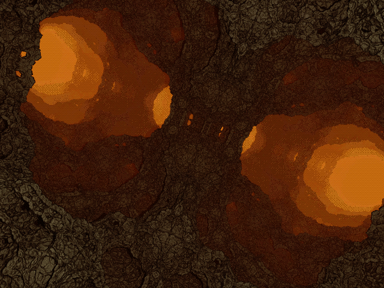

```glsl
p = ( p + vec2( p.y, -p.x ) ) * sqrt( 0.5 );
}
float de ( vec3 p ) {
  int layer = 0;
  const float s = 1.9;
  float scale = 1.0;
  float r = 0.2;
  vec3 o = vec3( 0.22, 0.0, 0.0 );
  float d = 0.0;
  for ( int i = 0; i < 11; ++i ) {
    p = ( -1.00 + 2.0 * fract( 0.5 * p + 0.5 ) );
    r45( p.xz );
    float r2 = dot( p, p ) + 0.0;
    float k = s / r2;
    float ss = pow( ( 1.0 + float( i ) ), -0.15 );
    p *= pow( k, ss );
    scale *= pow( k, -ss * ss );
    d = 0.25 * abs( p.y ) * scale;
    layer = i;
    if( abs( d ) < 0.00048 ) break;
  }
  return d;
}
```

### void rotT ( inout vec2 p, float a ) { — mrange

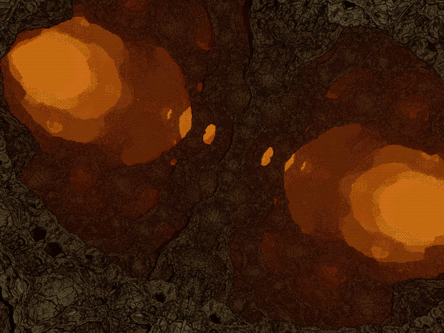

```glsl
float c = cos( a );
  float s = sin( a );
  p = vec2( c * p.x + s * p.y, -s * p.x + c * p.y );
}
void r45 ( inout vec2 p) {
  p = ( p + vec2( p.y, -p.x ) ) * sqrt( 0.5 );
}
float de ( vec3 p ) {
  int layer = 0;
  const float s = 1.9;
  float scale = 1.0;
  float r = 0.2;
  vec3 o = vec3( 0.22, 0.0, 0.0 );
  float d = 0.0;
  for ( int i = 0; i < 11; ++i ) {
    p = ( -1.00 + 2.0 * fract( 0.5 * p + 0.5 ) );
    rotT(p.xz, -float(i)*PI/4.0);
    r45( p.xz );
    float r2 = dot( p, p ) + 0.0;
    float k = s / r2;
    float ss = pow( ( 1.0 + float( i ) ), -0.15 );
    p *= pow( k, ss );
    scale *= pow( k, -ss * ss );
    d = 0.25 * abs( p.y ) * scale;
    layer = i;
    if( abs( d ) < 0.00048 ) break;
  }
  return d;
}
```

### void rotT ( inout vec2 p, float a ) { — mrange

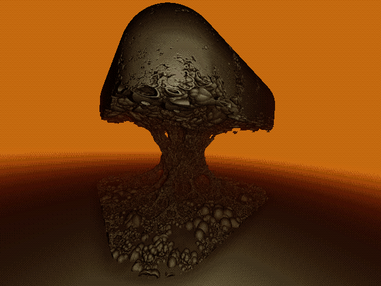

```glsl
float c = cos( a );
  float s = sin( a );
  p = vec2( c * p.x + s * p.y, -s * p.x + c * p.y );
}
float box ( vec3 p, vec3 b ) {
  vec3 q = abs( p ) - b;
  return length( max( q, 0.0 ) ) + min( max( q.x, max( q.y, q.z ) ), 0.0 );
}
float mod1 ( inout float p, float size ) {
  float halfsize = size * 0.5;
  float c = floor( ( p + halfsize ) / size );
  p = mod( p + halfsize, size ) - halfsize;
  return c;
}
vec2 modMirror2 ( inout vec2 p, vec2 size ) {
  vec2 halfsize = size * 0.5;
  vec2 c = floor( ( p + halfsize ) / size );
  p = mod( p + halfsize, size ) - halfsize;
  p *= mod( c, vec2( 2 ) ) * 2.0 - vec2( 1.0 );
  return c;
}
float de ( vec3 p ) {
  vec3 op = p;
  float s = 1.3 + smoothstep( 0.15, 1.5, p.y ) * 0.95;
  float scale = 1.0;
  float r = 0.2;
  vec3 o = vec3( 0.22, 0.0, 0.0 );
  float d = 10000.0;
  const int rep = 7;
  for ( int i = 0; i < rep; i++ ) {
    mod1( p.y, 2.0 );
    modMirror2( p.xz, vec2( 2.0 ) );
    rotT( p.xz, PI / 5.5 );
    float r2 = dot( p, p ) + 0.0;
    float k = s / r2;
    float r = 0.5;
    p *= k;
    scale *= k;
  }
  d = box( p - 0.1, 1.0 * vec3( 1.0, 2.0, 1.0 ) ) - 0.5;
  d = abs( d ) - 0.01;
  float d1 = 0.25 * d / scale;
  float db = box( op - vec3( 0.0, 0.5, 0.0 ), vec3( 0.75, 1.0, 0.75 ) ) - 0.5;
  float dp = op.y;
  return min( dp, max( d1, db ) );
}
```

### void rotT ( inout vec2 p, float a ) { — mrange

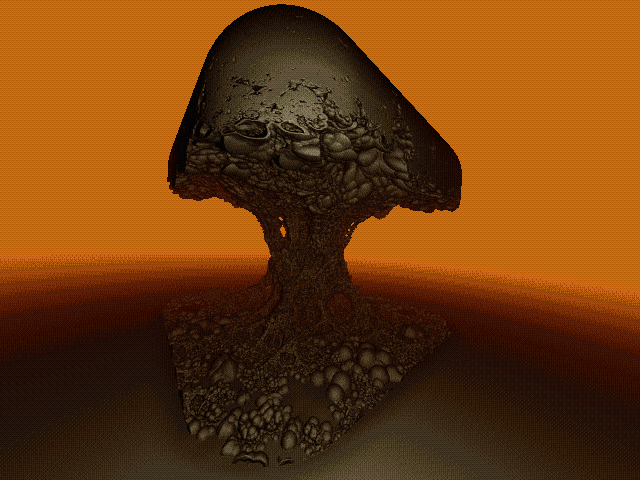

```glsl
float c = cos( a );
  float s = sin( a );
  p = vec2( c * p.x + s * p.y, -s * p.x + c * p.y );
}
float box ( vec3 p, vec3 b ) {
  vec3 q = abs( p ) - b;
  return length( max( q, 0.0 ) ) + min( max( q.x, max( q.y, q.z ) ), 0.0 );
}
float mod1 ( inout float p, float size ) {
  float halfsize = size * 0.5;
  float c = floor( ( p + halfsize ) / size );
  p = mod( p + halfsize, size ) - halfsize;
  return c;
}
vec2 modMirror2 ( inout vec2 p, vec2 size ) {
  vec2 halfsize = size * 0.5;
  vec2 c = floor( ( p + halfsize ) / size );
  p = mod( p + halfsize, size ) - halfsize;
  p *= mod( c, vec2( 2 ) ) * 2.0 - vec2( 1.0 );
  return c;
}
float de ( vec3 p ) {
  vec3 op = p;
  float s = 1.3 + min( pow( max( p.y - 0.25, 0.0 ), 1.0 ) * 0.75, 1.5 );
  float scale = 1.0;
  float r = 0.2;
  vec3 o = vec3( 0.22, 0.0, 0.0 );
  float d = 10000.0;
  const int rep = 7;
  for ( int i = 0; i < rep; i++ ) {
    mod1( p.y, 2.0 );
    modMirror2( p.xz, vec2( 2.0 ) );
    rotT( p.xz, PI / 5.5 );
    float r2 = dot( p, p ) + 0.0;
    float k = s / r2;
    float r = 0.5;
    p *= k;
    scale *= k;
  }
  d = box( p - 0.1, 1.0 * vec3( 1.0, 2.0, 1.0 ) ) - 0.5;
  d = abs( d ) - 0.01;
  float d1 = 0.25 * d / scale;
  float db = box( op - vec3( 0.0, 0.5, 0.0 ), vec3( 0.75, 1.0, 0.75 ) ) - 0.5;
  float dp = op.y;
  return min( dp, max( d1, db ) );
}
```

## Composed Shapes (37 entries)

### #define opRepEven(p,s) mod(p,s)-0.5*s — gaziya5 aka gaz

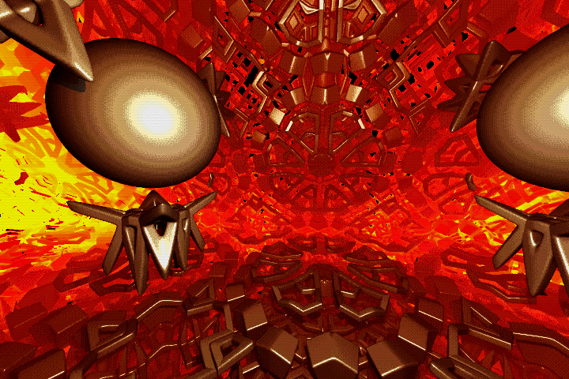

```glsl
#define opRepOdd(p,s) p-s*round(p/s)
  #define rot(a) mat2(cos(a),sin(a),-sin(a),cos(a))
  float lpNorm_83(vec3 p, float n){
  	p = pow(abs(p), vec3(n));
  	return pow(p.x+p.y+p.z, 1.0/n);
  }
  vec2 pSFold_83(vec2 p,float n){
    float h=floor(log2(n)),a =6.2831*exp2(h)/n;
    for(float i=0.0; i < h+2.0; i++){
      vec2 v = vec2(-cos(a),sin(a));
      float g= dot(p,v);
      p-= (g - sqrt(g * g + 5e-3))*v;
      a*=0.5;
    }
    return p;
  }
  vec2 sFold45_83(vec2 p, float k){
    vec2 v = vec2(-1,1)*0.7071;
    float g= dot(p,v);
    return p-(g-sqrt(g*g+k))*v;
  }
  float frameBox_83(vec3 p, vec3 s, float r){
    p = abs(p)-s;
    p.yz=sFold45_83(p.yz, 1e-3);
    p.xy=sFold45_83(p.xy, 1e-3);
    p.x = max(0.0,p.x);
    return lpNorm_83(p,5.0)-r;
  }
  float sdRoundBox_83( vec3 p, vec3 b, float r ){
    vec3 q = abs(p) - b;
    return length(max(q,0.0)) + min(max(q.x,max(q.y,q.z)),0.0) - r;
  }
  float deObj_83(vec3 p){
    return min(sdRoundBox_83(p,vec3(0.3),0.05),frameBox_83(p,vec3(0.8),0.1));
  }
  float de(vec3 p){
    float de=1.0;
    // p.z-=iTime*1.1;
    vec3 q= p;
    p.xy=pSFold_83(-p.xy,3.0);
    p.y-=8.5;
    p.xz=opRepEven(p.xz,8.5);
    float de1=length(p.yz)-1.;
    de=min(de,de1);
    p.xz=pSFold_83(p.xz,8.0);
    p.z-=2.0;
    float rate=0.5;
    float s=1.0;
    for(int i=0;i<3;i++){
      p.xy=abs(p.xy)-.8;
      p.xz=abs(p.xz)-0.5;
      p.xy*=rot(0.2);
      p.xz*=rot(-0.9);
      s*=rate;
      p*=rate;
      de=min(de,deObj_83(p/s));
    }
    q.z=opRepOdd(q.z,8.5);
    float de0=length(q)-1.5;
    de=min(de,de0);
    return de;
  }
```

### #define sabs(a) sqrt(a * a + 0.005) — gaziya5 aka gaz

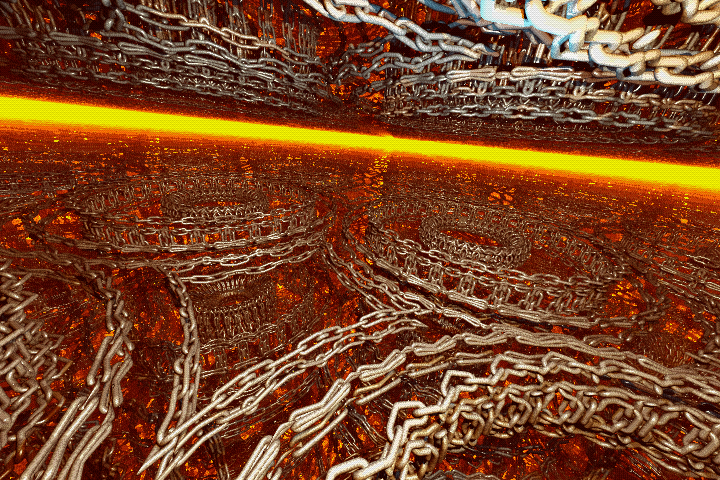

```glsl
#define smin(a,b) SMin1(a,b,0.0003)
  #define rot(a) mat2(cos(a),sin(a),-sin(a),cos(a))
  float SMin1(float a, float b, float k){
    return a + 0.5 * ((b-a) - sqrt((b-a) * (b-a) + k));
  }
  vec2 fold(vec2 p, int n){
    p.x=sabs(p.x);
    vec2 v=vec2(0,1);
    for(int i=0;i < n;i++){
      p-=2.0*smin(0.0,dot(p,v))*v;
      v=normalize(vec2(v.x-1.0,v.y));
    }
    return p;
  }
  float sdTorus( vec3 p, vec2 t ){
    vec2 q = vec2(length(p.xz)-t.x,p.y);
    return length(q)-t.y;
  }
  float de(vec3 p){
    float A=5.566;
    float c=7.0;
    p=mod(p,c)-c*0.5;
    p.xz=fold(p.xz,5);
    for(int i=0;i<5;i++){
      p.xy=abs(p.xy)-2.0;
      p.yz=abs(p.yz)-2.5;
      p.xy*=rot(A);
      p.yz*=rot(A*0.5);
      p=abs(p)-2.0;
    }
    vec2 s=vec2(0.05,0.02);
    float h=0.08;
    float de=1.0;
    vec3 q=p;
    q.xy=fold(q.xy,5);
    q.y-=2.;
    q.x-=clamp(q.x,-h,h);
    de=min(de,sdTorus(q,s));
    q=p;
    q.xy*=rot(M_PI/exp2(5.0));
    q.xy=fold(q.xy,5);
    q.y-=2.0;
    q.x-=clamp(q.x,-h,h);
    de=min(de,sdTorus(q.xzy,s));
    return de;
  }
```

### float cylUnion(vec3 p){ — russ

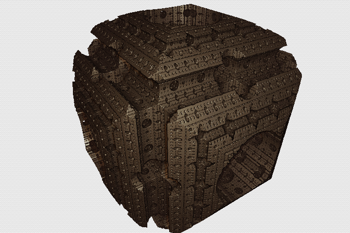

```glsl
float xy = dot(p.xy,p.xy);
    float xz = dot(p.xz,p.xz);
    float yz = dot(p.yz,p.yz);
    return sqrt(min(xy,min(xz,yz))) - 1.;
  }

  float cylIntersection(vec3 p){
    float xy = dot(p.xy,p.xy);
    float xz = dot(p.xz,p.xz);
    float yz = dot(p.yz,p.yz);
    return sqrt(max(xy,max(xz,yz))) - 1.;
  }

  float DE(vec3 p){
    float d = cylIntersection(p);
    float s = 1.;
    for(int i = 0;i<5;i++){
      p *= 3.; s*=3.;
      float d2 = cylUnion(p) / s;
      d = max(d,-d2);
      p = mod(p+1. , 2.) - 1.;
    }
    return d;
  }
```

### float cylUnion(vec3 p){ — russ

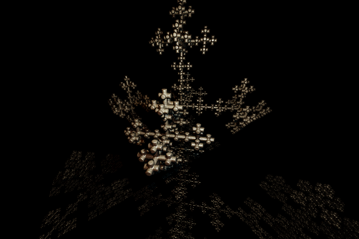

```glsl
float xy = dot(p.xy,p.xy);
    float xz = dot(p.xz,p.xz);
    float yz = dot(p.yz,p.yz);
    return sqrt(min(xy,min(xz,yz))) - 1.;
  }

  float cylIntersection(vec3 p){
    float xy = dot(p.xy,p.xy);
    float xz = dot(p.xz,p.xz);
    float yz = dot(p.yz,p.yz);
    return sqrt(max(xy,max(xz,yz))) - 1.;
  }

  float DE(vec3 p){
    float d = cylIntersection(p);
    float s = 1.;
    for(int i = 0;i<5;i++){
      p *= 3.; s*=3.;
      float d2 = cylUnion(p) / s;
      d = max(d,d2);
      p = mod(p+1. , 2.) - 1.;
    }
    return d;
  }
```

### float de(vec3 p){ — kamoshika

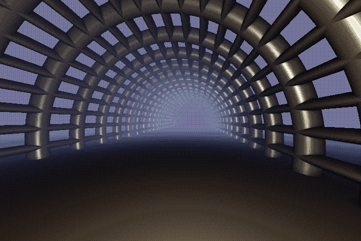

```glsl
vec3 Q;
    Q=p;
    Q.xy=vec2(atan(Q.x,Q.y)/.157,length(Q.xy)-3.);
    Q.zx=fract(Q.zx)-.5;
    return min(min(length(Q.xy),length(Q.yz))-.2,p.y+.5);
  }
```

### float de2(vec3 p) { — jorge2017a1

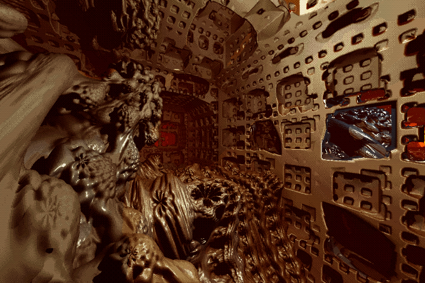

```glsl
vec3 op = p;
    p = abs(1.0 - mod(p, 2.));
    float r = 0., power = 8., dr = 1.;
    vec3 z = p;
    for (int i = 0; i < 7; i++) {
      op = -1.0 + 2.0 * fract(0.5 * op + 0.5);
      float r2 = dot(op, op);
      r = length(z);
      if (r > 1.616) break;
      float theta = acos(z.z / r);
      float phi = atan(z.y, z.x);
      dr = pow(r, power - 1.) * power * dr + 1.;
      float zr = pow(r, power);
      theta = theta * power;
      phi = phi * power;
      z = zr * vec3(sin(theta) * cos(phi), sin(phi) * sin(theta), cos(theta));
      z += p;
    }
    return (.5 * log(r) * r / dr);
  }

  float de1(vec3 p) {
    float s = 1.;
    float d = 0.;
    vec3 r,q;
    r = p;
    q = r;
    for (int j = 0; j < 6; j++) {
      r = abs(mod(q * s + 1.5, 2.) - 1.);
      r = max(r, r.yzx);
      d = max(d, (.3 - length(r *0.985) * .3) / s);
      s *= 2.1;
    }
    return d;
  }
  float de(vec3 p) {
    return min(de1(p), de2(p));
  }
```

### float mandelbulb(vec3 p) — neozhaoliang

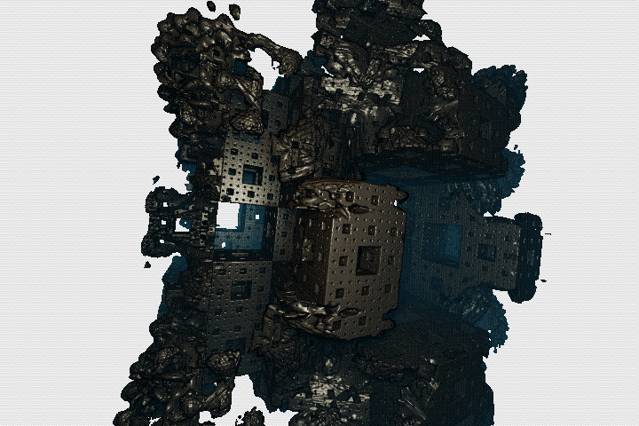

```glsl
{
    p /= 1.192;
    p.xyz = p.xzy;
    vec3 z = p;
    vec3 dz = vec3(0.0);
    float dr = 1.0;
    float power = 8.0;
    float r, theta, phi;
    for (int i = 0; i < 7; i++)
    {
      r = length(z);
      if (r > 2.0)
          break;
      float theta = atan(z.y / z.x);
      float phi = asin(z.z / r);
      dr = pow(r, power - 1.0) * power * dr + 1.0;
      r = pow(r, power);
      theta = theta * power;
      phi = phi * power;
      z = r * vec3(cos(theta) * cos(phi), cos(phi) * sin(theta), sin(phi)) + p;
    }
    return 0.5 * log(r) * r / dr;
  }

  float sdSponge(vec3 z)
  {
    for(int i = 0; i < 9; i++)
    {
      z = abs(z);
      z.xy = (z.x < z.y) ? z.yx : z.xy;
      z.xz = (z.x < z.z) ? z.zx : z.xz;
      z.zy = (z.y < z.z) ? z.yz : z.zy;
      z = z * 3.0 - 2.0;
      z.z += (z.z < -1.0) ? 2.0 : 0.0;
    }
    z = abs(z) - vec3(1.0);
    float dis = min(max(z.x, max(z.y, z.z)), 0.0) + length(max(z, 0.0));
    return dis * 0.6 * pow(3.0, -float(9));
  }

  float de(vec3 p)
  {
    float d1 = mandelbulb(p);
    float d2 = sdSponge(p);
    return max(d1, d2);
  }
```

### float maxcomp(in vec3 p ) { return max(p.x,max(p.y,p.z));} — jorge2017a1

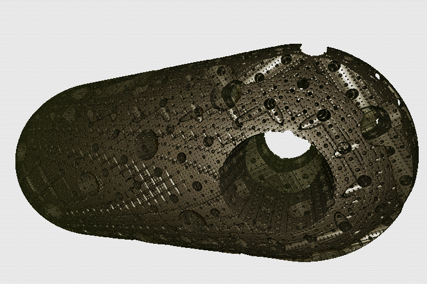

```glsl
float sdBox( vec3 p, vec3 b ){
    vec3  di = abs(p) - b;
    float mc = maxcomp(di);
    return min(mc,length(max(di,0.0)));
  }

  float cylUnion(vec3 p){
    float xy = dot(p.xy,p.xy);
    float xz = dot(p.xz,p.xz);
    float yz = dot(p.yz,p.yz);
    return sqrt(min(xy,min(xz,yz))) - 1.;
  }

  float cylIntersection(vec3 p){
    float xy = dot(p.xy,p.xy);
    float xz = dot(p.xz,p.xz);
    float yz = dot(p.yz,p.yz);
    return sqrt(max(xy,max(xz,yz))) - 1.;
  }

  float dsCapsule(vec3 point_a, vec3 point_b, float r, vec3 point_p)
  {
    vec3 ap = point_p - point_a;
    vec3 ab = point_b - point_a;
    float ratio = dot(ap, ab) / dot(ab , ab);
    ratio = clamp(ratio, 0.0, 1.0);
    vec3 point_c = point_a + ratio * ab;
    return length(point_c - point_p) - r;
  }

  float DE(vec3 p){
    float d = dsCapsule(vec3(-0.0,0.0,0.0), vec3(2.0,1.0,0.1), 1.0, p);
    float s = 1.;
    for(int i = 0;i<5;i++){
      p *= 3.; s*=3.;
      float d2 = cylUnion(p) / s;
      float d3=sdBox(p, vec3(2.0,1.0,2.5));
      d = max(d,-d2);
      p = mod(p+1. , 2.) - 1.;
    }
    return d;
  }
```

### float maxcomp(in vec3 p ){ — iq

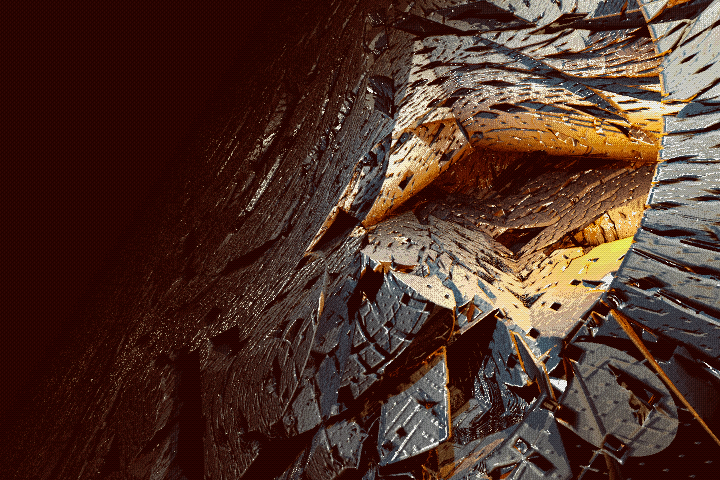

```glsl
return max(p.x,max(p.y,p.z));
  }

  float sdBox( vec3 p, vec3 b ){
    vec3  di = abs(p) - b;
    float mc = maxcomp(abs(p)-b);
    return min(mc,length(max(di,0.0)));
  }

  float de(vec3 p){
    vec3 w = p; vec3 q = p;
    q.xz = mod( q.xz+1.0, 2.0 ) -1.0;
    float d = sdBox(q,vec3(1.0));
    float s = 1.0;
    for( int m=0; m<7; m++ ){
      float h = float(m)/6.0;
      p =  q.yzx - 0.5*sin( 1.5*p.x + 6.0 + p.y*3.0 + float(m)*5.0 + vec3(1.0,0.0,0.0));
      vec3 a = mod( p*s, 2.0 )-1.0;
      s *= 3.0;
      vec3 r = abs(1.0 - 3.0*abs(a));
      float da = max(r.x,r.y);
      float db = max(r.y,r.z);
      float dc = max(r.z,r.x);
      float c = (min(da,min(db,dc))-1.0)/s;
      d = max( c, d );
    }
    return d*0.5;
  }
```

### float op_u(float d1, float d2){ — raziel

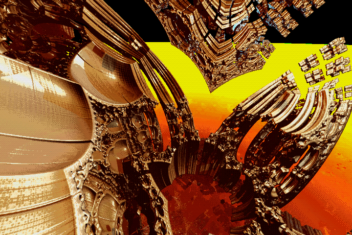

```glsl
return (d1 < d2) ? d1 : d2;
  }
  void sphere_fold(inout vec3 p, inout float dr, float m_rad_sq, float f_rad_sq, float m_rad_sq_inv){
    float r_sq = dot(p, p);
    if (r_sq < m_rad_sq){
      float t = f_rad_sq * m_rad_sq_inv;
      p *= t;
      dr *= t;
    }
    else if (r_sq < f_rad_sq){
      float t = f_rad_sq / r_sq;
      p *= t;
      dr *= t;
    }
  }
  void box_fold(inout vec3 p, float fold_limit){
    p = clamp(p, -fold_limit, fold_limit) * 2.0 - p;
  }
  // estimators return (dist, mat_id, custom_value)
  float estimator_mandelbox(vec3 p, float scale, float m_rad_sq, float f_rad_sq, float fold_limit){
    vec3 off = p;
    float dr = 1.0;
    float mrs_inv = 1.0 / m_rad_sq;
    for (int i = 0; i < 10; ++i){
      box_fold(p, fold_limit);
      sphere_fold(p, dr, m_rad_sq, f_rad_sq, mrs_inv);

      p = scale * p + off;
      dr = dr * abs(scale) + 1.0;
      vec3 ot = p - vec3(0.5);
    }
    return length(p) / abs(dr);
  }
  vec3 mod_pos(vec3 p, float a, float b){
    p.zx = mod(p.zx, a) - b;
    return p;
  }
  float de(vec3 p){
    vec3 p_mb = mod_pos_77(p, 4.4, 2.2);
    float res_mb = estimator_mandelbox(p, -2.5, 0.1, 2.5, 1.0);
    vec3 p_pl = p;
    p_pl.y += 4.0;
    p_pl = mod_pos(p_pl, 2.0, 1.0);
    float res_pl = estimator_mandelbox(p_pl, -1.5, 0.3, 2.9, 1.0);

    return op_u(res_mb, res_pl);
  }
```

### float periodic(float x,float period,float dutycycle){ — WAHa_06x36

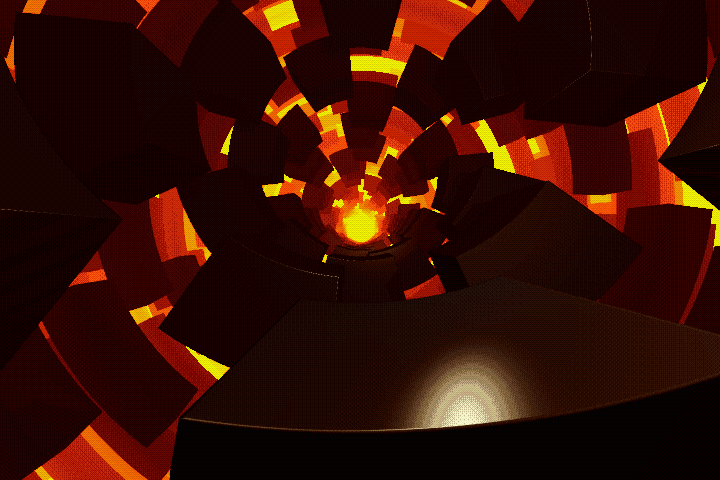

```glsl
x/=period;
    x=abs(x-floor(x)-0.5)-dutycycle*0.5;
    return x*period;
  }
  float de(vec3 pos){
    vec3 gridpos=pos-floor(pos)-0.5;
    float r=length(pos.xy);
    float a=atan(pos.y,pos.x);
    a+=12.*0.3*sin(floor(r/3.0)+1.0)*sin(floor(pos.z)*13.73);
    return min(max(max(
    periodic(r,3.0,0.2),
    periodic(pos.z,1.0,0.7+0.3*cos(4.))),
    periodic(a*r,3.141592*2.0/6.0*r,0.7+0.3*cos(4.))),0.25);
  }
```

### float sdBox( vec3 p, vec3 b ){ — plento

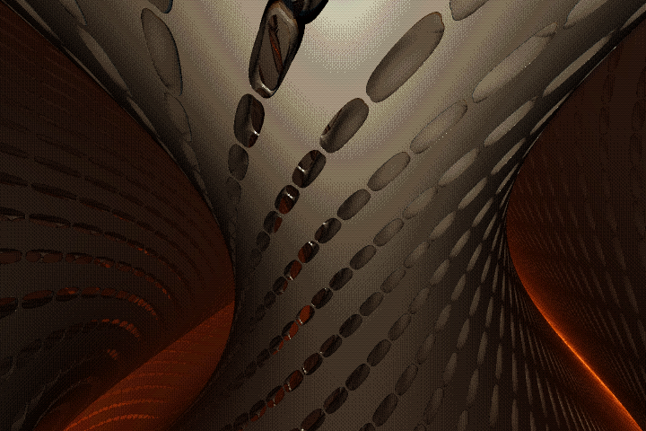

```glsl
vec3 d = abs(p) - b;
    return min(max(d.x,max(d.y,d.z)),0.0) + length(max(d,0.0));
  }

  vec2 rotate(vec2 k,float t){
    return vec2(cos(t) * k.x - sin(t) * k.y, sin(t) * k.x + cos(t) * k.y);
  }

  float de(vec3 pos){
    vec3 b = vec3(0.9 , 4.5, 0.70);
    float p = sin(pos.z * 0.1) * 2.0;

    pos = vec3(rotate(pos.xy, p), pos.z);
    pos.y += 1.2;
    pos = mod(pos, b) -0.5 * b;
    pos.x *= sin(length(pos * 1.8) * 2.0) * 1.4;

    return sdBox(pos - vec3(0.0, 0.0, 0.0), vec3(0.4));
  }
```

### float sdHexPrism( vec3 p, vec2 h ){ — russ

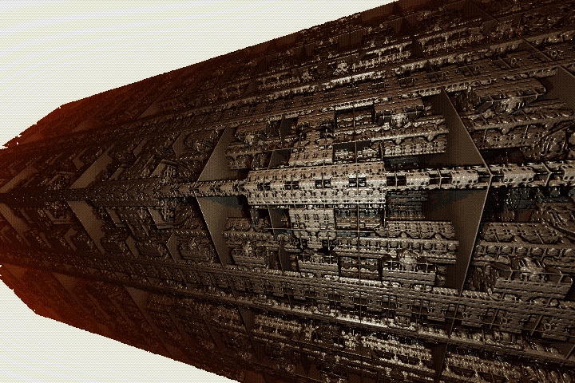

```glsl
const vec3 k = vec3(-0.8660254, 0.5, 0.57735);
    p = abs(p);
    p.xy -= 2.0*min(dot(k.xy, p.xy), 0.0)*k.xy;
    vec2 d = vec2(
         length(p.xy-vec2(clamp(p.x,-k.z*h.x,k.z*h.x), h.x))*sign(p.y-h.x),
         p.z-h.y );
    return min(max(d.x,d.y),0.0) + length(max(d,0.0));
  }

  float sdCrossHex( in vec3 p ){
    float sdh1= sdHexPrism(  p-vec3(0.0), vec2(1.0,1.0) );
    float sdh2= sdHexPrism(  p-vec3(0.0), vec2(0.5,1.5) );
    float sdh3= sdHexPrism(  p.xzy-vec3(0.0), vec2(0.5,1.1) );
    float sdh4= sdHexPrism(  p.yzx-vec3(0.0), vec2(0.5,1.5) );
    return max( max( max(sdh1, -sdh2), -sdh3),-sdh4);
  }

  float sdCrossRep(vec3 p) {
    vec3 q = mod(p + 1.0, 2.0) - 1.0;
    return sdCrossHex(q);
  }

  float sdCrossRepScale(vec3 p, float s) {
    return sdCrossRep(p * s) / s;
  }

  float de(vec3 p) {
    float scale = 3.025;
    float dist= sdHexPrism(p, vec2(1.0,2.0) );
    for (int i = 0; i < 5; i++) {
      dist = max(dist, -sdCrossRepScale(p, scale));
      scale *= 3.0;
    }
    return dist;
  }
```

### float sdRoundBox( vec3 p, vec3 b, float r ){ — adapted from code by sdfgeoff

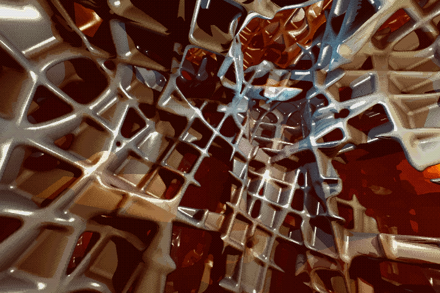

```glsl
vec3 q = abs(p) - b;
    return length(max(q,0.0)) + min(max(q.x,max(q.y,q.z)),0.0) - r;
  }

  float df(vec3 co) {
    float rad = clamp(co.z * 0.05 + 0.45, 0.1, 0.3);
    co = mod(co, vec3(1.0)) - 0.5;
    return sdRoundBox(co, vec3(rad, rad, 0.3), 0.1);
  }

  float de(vec3 p){
    float body = 999.0;
    float scale = 0.2;
    vec3 co = p;
    mat4 m = mat4(
    vec4(0.6373087, -0.0796581,  0.7664804, 0.0),
    vec4(0.2670984,  0.9558195, -0.1227499, 0.0),
    vec4(-0.7228389,  0.2829553,  0.6304286, 0.0),
    vec4(0.1, 0.6, 0.2, 0.0));
    for (int i=0; i<3; i++) {
      co = (m * vec4(co, float(i))).xyz;
      scale *= (3.0);
      float field = df(co * scale) / scale;
      body = smin_op(body, field, 0.05);
    }
    return -body;
  }
```

### float sdTriPrism( vec3 p, vec2 h ){ — russ

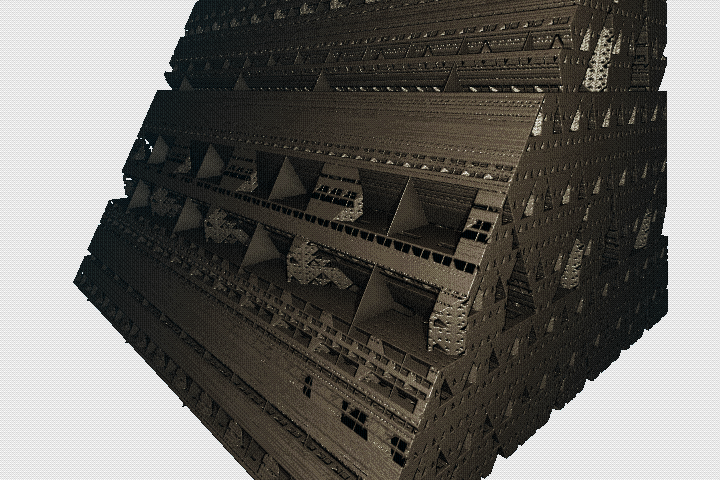

```glsl
vec3 q = abs(p);
    return max(q.z-h.y,max(q.x*0.866025+p.y*0.5,-p.y)-h.x*0.5);
  }

  float sdCrossHex( in vec3 p ){
    float sdfin=1000.0;
    float sdt1= sdTriPrism( p- vec3(0.0), vec2(1.0) );
    float sdt2= sdTriPrism( -p.xyz- vec3(0.0), vec2(0.5,1.2) );
    float sdt3= sdTriPrism( p.xzy- vec3(0.0), vec2(0.5,1.2) );
    sdfin =max(sdt1, -sdt2);
    sdfin =max(sdfin, -sdt3);
    return sdfin;
  }

  float sdCrossRep(vec3 p) {
  	vec3 q = mod(p + 1.0, 2.0) - 1.0;
  	return sdCrossHex(q);
  }

  float sdCrossRepScale(vec3 p, float s) {
  	return sdCrossRep(p * s) / s;
  }

  float de(vec3 p) {
    float scale = 4.0;
    float dist=sdTriPrism( p-vec3(0.0), vec2(1.0,1.0) );
  	for (int i = 0; i < 5; i++) {
  		dist = max(dist, -sdCrossRepScale(p, scale));
  		scale *= 3.0;
  	}
  	return dist;
  }
```

### float smin( float a, float b, float k ){ — glkt

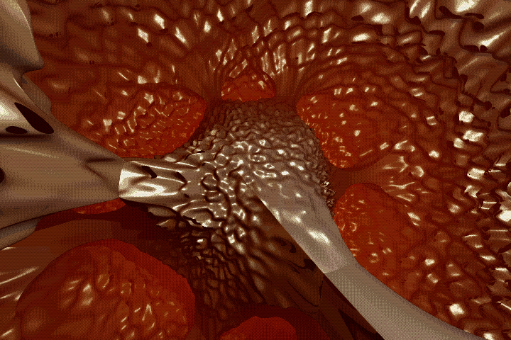

```glsl
float h = clamp( 0.5+0.5*(b-a)/k, 0.0, 1.0 );
    return mix( b, a, h ) - k*h*(1.0-h);
  }
  float noise(vec3 p){
    vec3 np = normalize(p);

    float a = 0.1*snoise2D(np.xy*10.);
    float b = 0.1*snoise2D(0.77+np.yz*10.);

    a = mix(a,.5,abs(np.x));
    b = mix(b,.5,abs(np.z));
    return mix(a+b-.4,.5,abs(np.y)/2.);
  }
  float de(vec3 p){
    float d = (-1.*length(p)+3.)+1.5*noise(p);
    d = min(d, (length(p)-1.5)+1.5*noise(p) );
    float m = 1.5; float s = .03;
    d = smin(d, max( abs(p.x)-s, abs(p.y+p.z*.2)-.07 ) , m);
    d = smin(d, max( abs(p.z)-s, abs(p.x+p.y/2.)-.07 ), m );
    d = smin(d, max( abs(p.z-p.y*.4)-s, abs(p.x-p.y*.2)-.07 ), m );
    d = smin(d, max( abs(p.z*.2-p.y)-s, abs(p.x+p.z)-.07 ), m );
    d = smin(d, max( abs(p.z*-.2+p.y)-s, abs(-p.x+p.z)-.07 ), m );
    return d;
  }
```

### float snoise(vec2 p) { — karang

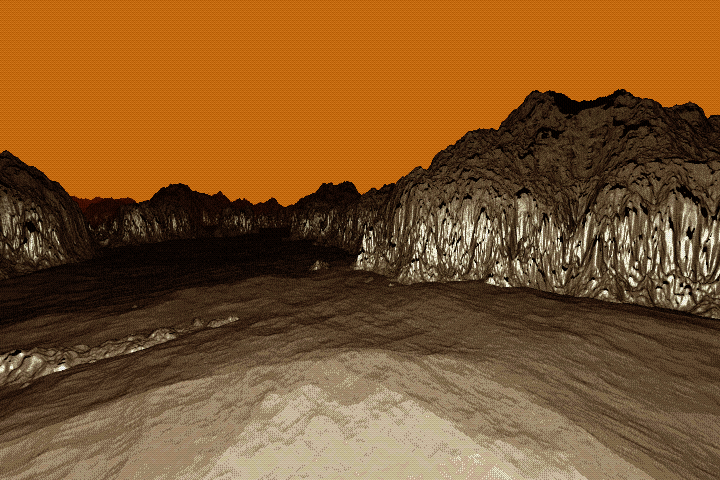

```glsl
vec2 f = fract(p);
    p = floor(p);
    float v = p.x+p.y*1000.0;
    vec4 r = vec4(v, v+1.0, v+1000.0, v+1001.0);
    r = fract(100000.0*sin(r*.001));
    f = f*f*(3.0-2.0*f);
    return 2.0*(mix(mix(r.x, r.y, f.x), mix(r.z, r.w, f.x), f.y))-1.0;
  }
  float terrain(vec2 p, int octaves) {
    float h = 0.0;
    float w = 0.5;
    float m = 0.4;
    for (int i=0; i<12; i++) {
      if (i==octaves) break;
      h += w * snoise((p * m));
      w *= 0.5;
      m *= 2.0;
    }
    return h;
  }
  float terrainSand(vec2 p, int octaves) {
    float h = 0.0;
    float f = 1.0;
    for (int i=0 ; i<12 ; i++) {
      if (i==octaves) break;
      h += abs(snoise(p*f)/f);
      f *= 2.0;
    }
    return h;
  }
  float map(vec3 p) {
    float dMin = 28.0;
    float d;
    escape = -1.0;
    int octaves = 9;
    float h = terrain(p.xz, octaves);
    h += smoothstep(0.0, 1.1, h);
    h += smoothstep(-0.1, 1.0, p.y)*0.6;
    d = p.y - h;
    if (d<dMin) { // Mountains
      dMin = d;
      escape = 0.0;
    }
    if (h<0.5) { // Sand dunes
      float s = 0.3 * terrainSand(p.xz*0.2, octaves);
      d = p.y -0.35 + s;
      if (d<dMin) {
        dMin = d;
        escape = 1.1;
      }
    }
    return dMin;
  }
```

### IcoDodecaStar — tholzer

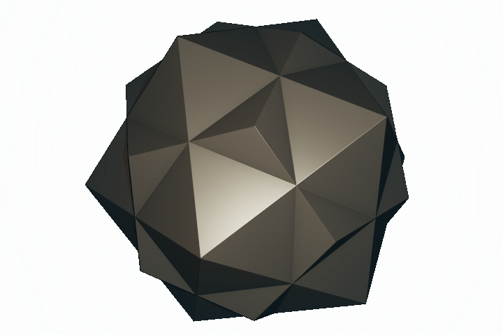

```glsl
// Dodecahedron: radius = circumsphere radius
  float sdDodecahedron(vec3 p, float radius){
    const float phi = 1.61803398875;  // Golden Ratio = (sqrt(5)+1)/2;
    const vec3 n = normalize(vec3(phi,1,0));

    p = abs(p / radius);
    float a = dot(p, n.xyz);
    float b = dot(p, n.zxy);
    float c = dot(p, n.yzx);
    return (max(max(a,b),c)-n.x) * radius;
  }
  // Icosahedron: radius = circumsphere radius
  float sdIcosahedron(vec3 p, float radius){
    const float q = 2.61803398875;  // Golden Ratio + 1 = (sqrt(5)+3)/2;
    const vec3 n1 = normalize(vec3(q,1,0));
    const vec3 n2 = vec3(0.57735026919);  // = sqrt(3)/3);

    p = abs(p / radius);
    float a = dot(p, n1.xyz);
    float b = dot(p, n1.zxy);
    float c = dot(p, n1.yzx);
    float d = dot(p, n2) - n1.x;
    return max(max(max(a,b),c)-n1.x,d) * radius;
  }
  float de(vec3 p){
    float radius = 0.5;
    return min(sdDodecahedron(p,radius),  sdIcosahedron(p.zyx,radius));
  }
```

### Large Sierpinski area with cube superstructure — butadiene

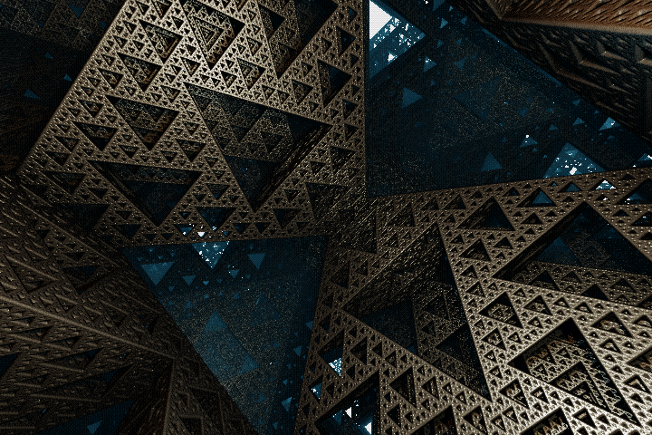

```glsl
mat2 rot(float r){
    vec2 s = vec2(cos(r),sin(r));
    return mat2(s.x,s.y,-s.y,s.x);
  }
  float cube(vec3 p,vec3 s){
    vec3 q = abs(p);
    vec3 m = max(s-q,0.);
    return length(max(q-s,0.))-min(min(m.x,m.y),m.z);
  }
  float tetcol(vec3 p,vec3 offset,float scale,vec3 col){
    vec4 z = vec4(p,1.);
    for(int i = 0;i<12;i++){
      if(z.x+z.y<0.0)z.xy = -z.yx,col.z+=1.;
      if(z.x+z.z<0.0)z.xz = -z.zx,col.y+=1.;
      if(z.z+z.y<0.0)z.zy = -z.yz,col.x+=1.;
      z *= scale;
      z.xyz += offset*(1.0-scale);
    }
    return (cube(z.xyz,vec3(1.5)))/z.w;
  }
  float de(vec3 p){
    float s = 1.;
    p = abs(p)-4.*s;
    p = abs(p)-2.*s;
    p = abs(p)-1.*s;
    return tetcol(p,vec3(1),1.8,vec3(0.));
  }
```

### mat2 rot(float a) { — Kali

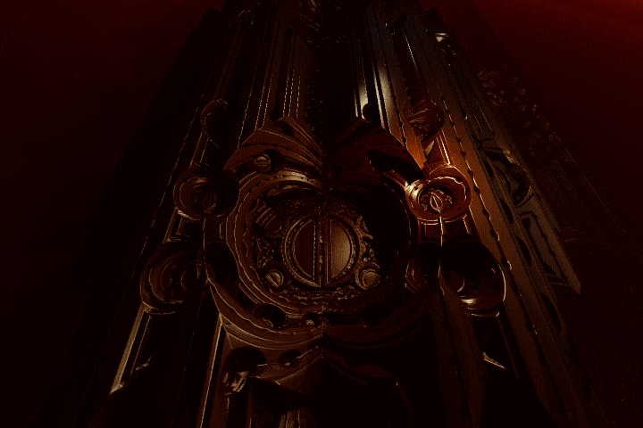

```glsl
return mat2(cos(a),sin(a),-sin(a),cos(a));
  }
  vec4 formula(vec4 p) {
    p.xz = abs(p.xz+1.)-abs(p.xz-1.)-p.xz;
    p=p*2./clamp(dot(p.xyz,p.xyz),.15,1.)-vec4(0.5,0.5,0.8,0.);
    p.xy*=rot(.5);
    return p;
  }
  float screen(vec3 p) {
    float d1=length(p.yz-vec2(.25,0.))-.5;
    float d2=length(p.yz-vec2(.25,2.))-.5;
    return min(max(d1,abs(p.x-.3)-.01),max(d2,abs(p.x+2.3)-.01));
  }
  float de(vec3 pos) {
    vec3 tpos=pos;
    tpos.z=abs(2.-mod(tpos.z,4.));
    vec4 p=vec4(tpos,1.5);
    float y=max(0.,.35-abs(pos.y-3.35))/.35;

    for (int i=0; i<8; i++) {p=formula(p);}
    float fr=max(-tpos.x-4.,(length(max(vec2(0.),p.yz-3.)))/p.w);

    float sc=screen(tpos);
    return min(sc,fr);
  }
```

### mat3 rotate( in vec3 v, in float angle) { — XT95

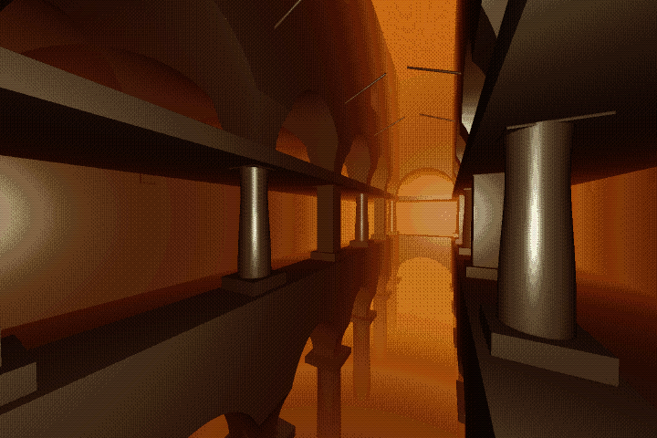

```glsl
float c = cos(angle); float s = sin(angle);
    return mat3(c + (1.0 - c) * v.x * v.x, (1.0 - c) * v.x * v.y - s * v.z, (1.0 - c) * v.x * v.z + s * v.y,
      (1.0 - c) * v.x * v.y + s * v.z, c + (1.0 - c) * v.y * v.y, (1.0 - c) * v.y * v.z - s * v.x,
      (1.0 - c) * v.x * v.z - s * v.y, (1.0 - c) * v.y * v.z + s * v.x, c + (1.0 - c) * v.z * v.z);
  }
  float box( in vec3 p, in vec3 data ){ return max(max(abs(p.x)-data.x,abs(p.y)-data.y),abs(p.z)-data.z); }
  float arch( vec3 p ) { 
    if(p.y<40.1) p.y += 3.3;
    vec3 a = vec3( fract(p.x/45.5-.5)-.5, -p.y+40., fract(p.z/32.9-.5)-.5 );
    float d = -sqrt( a.y*a.y + min(a.x*a.x,a.z*a.z)*2000.)+19.5;
    if (abs(p.x)<28.) d -= 1.;
    d = max(d, a.y);
    d = max(d, -a.y-24.);
    return d*.8;
  }
  float column1( vec3 p ) {
    vec3 pp = p;
    pp.z = mod(p.z, 32.9)-32.9/2.;
    pp.x = mod(p.x-44., 44.0)-44.0/2.;
    float d = length(pp.xz) - 4.;
    d = min(d, box(pp-vec3(0.,40.,0.), vec3(6.,2.,6.)));
    d = max(d, abs(p.x)-50.);
    d = max(d, p.y-40.);
    d = min(d, arch(p));
    return d;
  }
  float column2( vec3 p ) {
    float yy = pow(p.y-13., .5)*1.2;
    vec3 pp = p;
    pp.z = mod(p.z-32.9/2., 65.8)-65.8/2.;
    pp.x = mod(p.x-44., 44.0)-44.0/2.;
    float d = length(pp.xz) - 3. + sin(p.y*p.y*.004+3.8)*.3;
    pp.z = mod(p.z+32.9/2., 65.8)-65.8/2.;
    d = min(d, max(abs(pp.x), abs(pp.z)) - 3.);
    pp.z = mod(p.z, 32.9)-32.9/2.;
    float y = pow(p.y-40., .5)*1.;
    d = min(d, box(pp-vec3(0.,40.,0.), vec3(6.-y,3.,6.-y))*.8);d = min(d, box(pp-vec3(0.,12.,0.), vec3(4.5,3.,4.5))*.8);
    d = max(d, abs(p.x)-50.);
    d = max(d, p.y-40.);
    d = min(d, arch(p));
    return d;
  }
  float stings( in vec3 p ) {
    vec3 pp = p;
    pp.z = mod(p.z, 32.9)-32.9/2.;
    vec3 ppp = pp;
    pp = rotate(vec3(0.,0.,1.), .4*-sign(p.x)) * pp; 
    float d = length(pp.zy-vec2(0.,120.))-1.4;
    d = max(d, -abs(ppp.x)+16.5);
    d = min(d, length(pp.zy-vec2(0.,120.))-.3);
    d = max(d, abs(p.x)-30.);
    d = max(d, -abs(p.x)+3.);
    d = max(d, abs(p.z)-60.);
    return d;
  }
  float map( in vec3 p ) {
    const vec3 dim = vec3(66.2, 77.75, 142.0);
    const vec3 dim2 = vec3(dim.x-49., 80., dim.z-32.);
    float d = -box(p-vec3(0.,dim.y, 0.), dim );
    d = min(d, column1(p));  d = min(d, column2(p-vec3(0.,60.,0.)));
    d = min(d, box(p-vec3(0., 67., 0.),vec3(dim2.x+10.,5.,dim2.z+10.)));
    d = min(d, box(p-vec3(0., 72., 0.),vec3(dim2.x+10.4,.5,dim2.z+10.4)));
    d = min(d, -p.y+120.);  d = max(d, -box(p-vec3(0.,186.,0.), dim2+vec3(-1.,100.,0.)));    
    d = max(d, p.y-dim2.y-100.);
    vec3 pp = p;    // windows on the top
    pp.z = mod(p.z-32.9/2., 65.8)-65.8/2.;
    d = max(d, -box(pp-vec3(0.,140.,0.), vec3(dim.x,5.,5.) ) );
    pp.z = mod(p.z+32.9/2., 65.8)-65.8/2.;
    d = max(d, -length(pp.zy-vec2(0.,160.))+4. );
    d = min(d, stings(p));
    return d;
  }
```

### Rack Wheel — tholzer

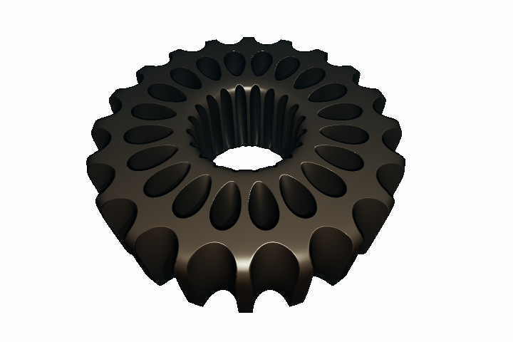

```glsl
#define opRepeat(p,c) (mod(p,c)-0.5*c)
  #define opDifference(a,b) max(a,-b)

  float length2( vec2 p ) {
    return sqrt( p.x*p.x + p.y*p.y );
  }

  float length8( vec2 p ) {
    p = p*p; p = p*p; p = p*p;
    return pow( p.x + p.y, 1.0/8.0 );
  }

  float sdCylinder (in vec3 p, in vec2 h ){
  vec2 d = abs(vec2(length(p.xz), p.y)) - h;
  return min(max(d.x, d.y), 0.0) + length(max(d, 0.0)); }


  float sdTorus82( vec3 p, vec2 t ){
    vec2 q = vec2(length2(p.xz)-t.x, p.y);
    return length8(q) - t.y;
  }

  float de( in vec3 pos){
    return opDifference(sdTorus82(pos, vec2(0.20, 0.1)),
      sdCylinder (opRepeat (vec3 (atan(pos.x, pos.z)/6.2831
                                  ,pos.y
                                  ,0.02+0.5*length(pos))
                            ,vec3(0.05, 1.0, 0.05))
                  ,vec2(0.02, 0.6)));
  }
```

### vec2 Rot2D (vec2 q, float a) — dr2

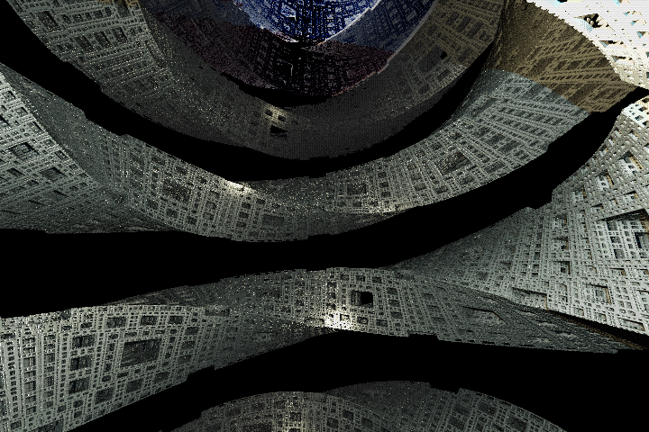

```glsl
{
    vec2 cs;
    cs = sin (a + vec2 (0.5 * M_PI, 0.));
    return vec2 (dot (q, vec2 (cs.x, - cs.y)), dot (q.yx, cs));
  }
  float PrBoxDf (vec3 p, vec3 b)
  {
    vec3 d;
    d = abs (p) - b;
    return min (max (d.x, max (d.y, d.z)), 0.) + length (max (d, 0.));
  }
  float de(vec3 p)
  {
    vec3 b;
    float r, a;
    const float nIt = 5., sclFac = 2.4;
    b = (sclFac - 1.) * vec3 (1., 1.125, 0.625);
    r = length (p.xz);
    a = (r > 0.) ? atan (p.z, - p.x) / (2. * M_PI) : 0.;
    p.y = mod (p.y - 4. * a + 2., 4.) - 2.;
    p.x = mod (16. * a + 1., 2.) - 1.;
    p.z = r - 32. / (2. * M_PI);
    p.yz = Rot2D (p.yz, 2. * M_PI * a);
    for (float n = 0.; n < nIt; n ++) {
      p = abs (p);
      p.xy = (p.x > p.y) ? p.xy : p.yx;
      p.xz = (p.x > p.z) ? p.xz : p.zx;
      p.yz = (p.y > p.z) ? p.yz : p.zy;
      p = sclFac * p - b;
      p.z += b.z * step (p.z, -0.5 * b.z);
    }
    return 0.8 * PrBoxDf (p, vec3 (1.)) / pow (sclFac, nIt);
  }
```

### vec2 Rot2D(vec2 q, float a) — dr2

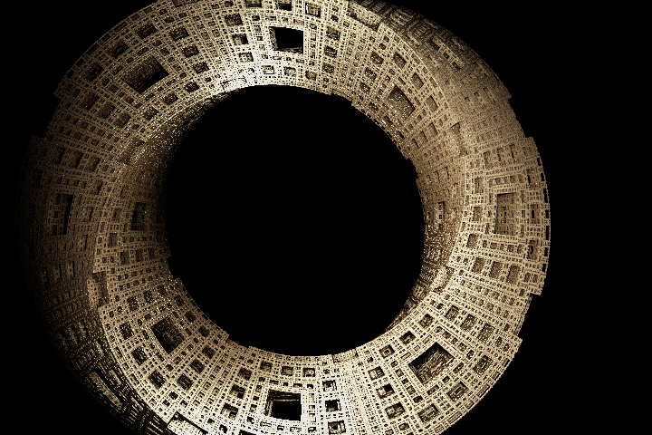

```glsl
{
    vec2 cs;
    cs = sin (a + vec2 (0.5 * M_PI, 0.));
    return vec2 (dot (q, vec2 (cs.x, - cs.y)), dot (q.yx, cs));
  }
  float PrBoxDf(vec3 p, vec3 b)
  {
    vec3 d;
    d = abs (p) - b;
    return min (max (d.x, max (d.y, d.z)), 0.) + length (max (d, 0.));
  }
  float de(vec3 p)
  {
    vec3 b;
    float r, a;
    const float nIt = 5., sclFac = 2.4;
    b = (sclFac - 1.) * vec3 (1., 1.125, 0.625);
    r = length (p.xz);
    a = (r > 0.) ? atan (p.z, - p.x) / (2. * M_PI) : 0.;
    p.x = mod (16. * a + 1., 2.) - 1.;
    p.z = r - 32. / (2. * M_PI);
    p.yz = Rot2D (p.yz, M_PI * a);
    for (float n = 0.; n < nIt; n ++) {
      p = abs (p);
      p.xy = (p.x > p.y) ? p.xy : p.yx;
      p.xz = (p.x > p.z) ? p.xz : p.zx;
      p.yz = (p.y > p.z) ? p.yz : p.zy;
      p = sclFac * p - b;
      p.z += b.z * step (p.z, -0.5 * b.z);
    }
    return 0.8 * PrBoxDf (p, vec3 (1.)) / pow (sclFac, nIt);
  }
```

### vec3 mod3(inout vec3 p, vec3 size) { — mrange

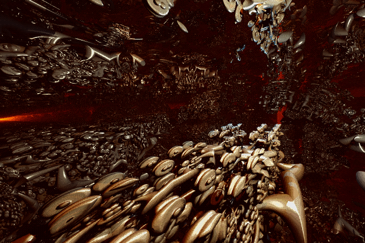

```glsl
vec3 c = floor((p + size*0.5)/size);
    p = mod(p + size*0.5, size) - size*0.5;
    return c;
  }
  void sphere_fold(float fr, inout vec3 z, inout float dz) {
  const float fixed_radius2 = 4.5;
  const float min_radius2   = 0.5;
    float r2 = dot(z, z);
    if(r2 < min_radius2) {
      float temp = (fr / min_radius2);
      z *= temp;
      dz *= temp;
    } else if(r2 < fr) {
      float temp = (fr / r2);
      z *= temp;
      dz *= temp;
    }
  }
  void box_fold(float fl, inout vec3 z, inout float dz) {
    z = clamp(z, -fl, fl) * 2.0 - z;
  }
  float sphere(vec3 p, float t) {
    return length(p)-t;
  }
  float torus(vec3 p, vec2 t) {
    vec2 q = vec2(length(p.xz)-t.x,p.y);
    return length(q)-t.y;
  }
  float mb(float fl, float fr, vec3 z) {
    vec3 offset = z;
    const float scale = -3.0;
    float dr = 1.0;
    float fd = 0.0;
    for(int n = 0; n < 5; ++n) {
      box_fold65(fl, z, dr);
      sphere_fold65(fr, z, dr);
      z = scale * z + offset;
      dr = dr * abs(scale) + 1.0;
      float r1 = sphere65(z, 5.0);
      float r2 = torus65(z, vec2(8.0, 1));
      float r = n < 4 ? r2 : r1;
      float dd = r / abs(dr);
      if (n < 3 || dd < fd) {
        fd = dd;
      }
    }
    return fd;
  }
  #define PATHA 0.4*vec2(0.11, 0.21)
  #define PATHB 0.7*vec2(13.0, 3.0)
  float de(vec3 p) {
    float tm = p.z;
    const float folding_limit = 2.3;
    const vec3  rep = vec3(10.0);

    vec3 wrap = vec3(sin(tm*PATHA)*PATHB, tm);
    vec3 wrapDeriv = normalize(vec3(PATHA*PATHB*cos(PATHA*tm), 1.0));
    p.xy -= wrap.xy;
    p -= wrapDeriv*dot(vec3(p.xy, 0), wrapDeriv)*0.5*vec3(1,1,-1);

    p -= rep*vec3(0.5, 0.0, 0.0);
    p.y *= (1.0 + 0.1*abs(p.y));
    vec3 i = mod3(p, rep);

    const float fixed_radius2 = 4.5;
    float fl = folding_limit + 0.3*sin(0.025*p.z+1.0)- 0.3;
    float fr = fixed_radius2 - 3.0*cos(0.025*sqrt(0.5)*p.z-1.0);

    return mb(fl, fr, p);
  }
```

### vec3 rot(vec3 p,vec3 a,float t){ — gaziya5 aka gaz

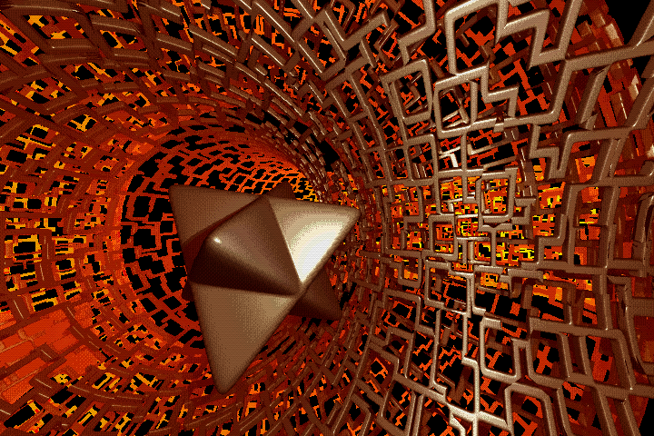

```glsl
a=normalize(a);
  	vec3 v = cross(a,p),u = cross(v,a);
  	return u * cos(t) + v * sin(t) + a * dot(p, a);
  }
  float lpNorm(vec2 p, float n){
  	p = pow(abs(p), vec2(n));
  	return pow(p.x+p.y, 1.0/n);
  }
  float sdTorus( vec3 p, vec2 t ){
    vec2 q = vec2(length(p.xz)-t.x,p.y);
    return length(q)-t.y;
  }
  float smin( float a, float b, float k ) {
    float h = clamp(.5+.5*(b-a)/k, 0., 1.);
    return mix(b, a, h) - k*h*(1.-h);
  }
  float deTetra(vec3 p){
  	vec2 g=vec2(-1,1)*0.577;
  	return pow(
  		pow(max(0.0,dot(p,g.xxx)),8.0)
  		+pow(max(0.0,dot(p,g.xyy)),8.0)
  		+pow(max(0.0,dot(p,g.yxy)),8.0)
  		+pow(max(0.0,dot(p,g.yyx)),8.0),
  		0.125);
  }
  float deStella(vec3 p){
    p=rot(p,vec3(1,2,3),time*3.0);
  	return smin(deTetra_85(p)-1.0,deTetra(-p)-1.0,0.05);
  }
  #define Circle 2.2
  vec2 hash2( vec2 p ){
    p = mod(p, Circle*2.0);
  	return fract(sin(vec2(
          dot(p,vec2(127.1,311.7)),
          dot(p,vec2(269.5,183.3))
      ))*43758.5453);
  }
  vec3 voronoi(vec2 x){
    x*=Circle;
    vec2 n = floor(x);
    vec2 f = fract(x);
    vec2 mg, mr;
    float md = 8.0;
    for( int j=-1; j<=1; j++ )
    for( int i=-1; i<=1; i++ ){
      vec2 g = vec2(float(i),float(j));
      vec2 o = hash2( n + g );
      o = 0.5 + 0.5*sin( time*0.3 + 6.2831*o );
      vec2 r = g + o - f;
      float d = dot(r,r);
      if( d < md ){
        md = d;
        mr = r;
        mg = g;
      }
    }
    md = 8.0;
    for( int j=-2; j <= 2; j++ )
    for( int i=-2; i <= 2; i++ ){
      vec2 g = mg + vec2(float(i),float(j));
      vec2 o = hash2( n + g );
      o = 0.5 + 0.5*sin( time*0.3 + 6.2831*o );
      vec2 r = g + o - f;
      if( dot(mr-r,mr-r)>0.00001 )
        md = min( md, dot( 0.5*(mr+r), normalize(r-mr) ) );
    }
    return vec3( md, mr );
  }
  float voronoiTorus(vec3 p){
    vec2 size = vec2(12,5);
    vec2 q = vec2(length(p.xz) - size.x, p.y);
    vec2 uv=vec2(atan(p.z, p.x),atan(q.y, q.x))/3.1415;
    vec3 vr=voronoi(uv*vec2(20,8));
    vec2 p2=vec2(lpNorm(vr.yz,12.0)-0.5, sdTorus(p,size));
    return lpNorm(p2,5.0)-0.1;
  }
  float fractal(vec3 p)
  {
    vec3 offset = vec3(6,0,0);
    float de = min(voronoiTorus(p-offset),voronoiTorus(p.xzy+offset));
    vec3 co = vec3(cos(time),0,sin(time))*10.0;
    float s1= abs(sin(time))*3.0+2.0;
    float deSG = min(deStella((p-co-offset)/s1),deStella((p-(co-offset).xzy)/s1))*s1;
    float deS = min(deStella(p-co-offset),deStella(p-(co-offset).xzy));
    de=min(de,deS);
    return de;
  }
```

### vec4 fold1(vec4 z) { — unconed

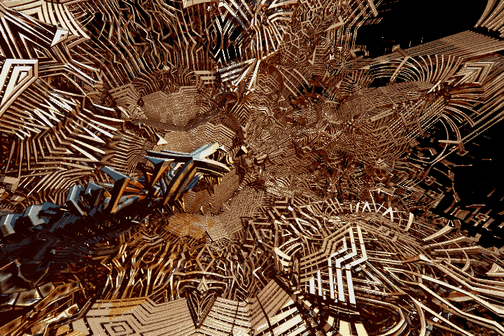

```glsl
vec3 p = z.xyz;
    p = p - 2.0 * clamp(p, -1.0, 1.0);
    return vec4(p, z.w);
  }
  vec4 fold2(vec4 z) {
    vec3 p = z.xyz;
    p = p - 2.0 * clamp(p, -1.0, 1.0);
    return vec4(p * 2.0, 2.0 * z.w);
  }
  vec4 invertRadius(vec4 z, float radius2, float limit) {
    float r2 = dot(z.xyz, z.xyz);
    float f = clamp(radius2 / r2, 1., limit);
    return z * f;
  }
  vec4 affine(vec4 z, float factor, vec3 offset) {
    z.xyz *= factor;
    z.xyz += offset;
    z.w *= abs(factor);
    return z;
  }
  vec4 mandel(vec4 z, vec3 offset) {
    float x = z.x;
    float y = z.y;
    z.w = 2. * length(z.xy) * z.w + 1.;
    z.x = x*x - y*y + offset.x;
    z.y = 2.*x*y + offset.y;
    return z;
  }
  vec4 invert(vec4 z, float factor) {
    float r2 = dot(z.xyz, z.xyz);
    float f = factor / r2;
    return z * f;
  }
  vec4 rotateXY(vec4 z, float angle) {
    float c = cos(angle);
    float s = sin(angle);
    mat2 m = mat2(c, s, -s, c);
    return vec4(m * z.xy, z.zw);
  }
  vec4 rotateXZ(vec4 z, float angle) {
    float c = cos(angle);
    float s = sin(angle);
    mat2 m = mat2(c, s, -s, c);
    vec2 r = m * z.xz;
    return vec4(r.x, z.y, r.y, z.w);
  }
  vec4 shiftXY(vec4 z, float angle, float radius) {
    float c = cos(angle);
    float s = sin(angle);
    return vec4(vec2(c, s) * radius + z.xy, z.zw);
  }
  float de(vec3 p) {
    vec4 z = vec4(p, 1.0);
    float t = 344. * .2; // change this number for different shapes
    vec3 vo1 = vec3(sin(t * .1), cos(t * .0961), sin(t * .017)) * 1.1;
    vec3 vo2 = vec3(cos(t * .07), sin(t * .0533), sin(t * .138)) * 1.1;
    vec3 vo3 = vec3(sin(t * .031), sin(t * .0449), cos(t * .201)) * 1.1;

    z = invertRadius_73(z, 10.0, 1.5);
    z = invertRadius_73(z, 10.0*10.0, 2.0);
    z = rotateXY(z, t);
    z = fold1(z);
    z = rotateXZ(z, t * 1.112);
    z.xyz += vo3;
    z = fold2(z);
    z.xyz += vo1;
    z = affine(z, -1.5, p);
    z = invertRadius(z, 4.0*4.0, 2.0);
    z = affine(z, -1.5, p);
    z = rotateXY(z, t * .881);
    z = fold1(z);
    z = rotateXZ(z, t * .783);
    z = fold1(z);
    z = affine_73(z, -1.5, p);
    z = invertRadius(z, 10.0*10.0, 3.0);
    z = fold1(z);
    z = fold1(z);
    z = affine(z, -1.5, p);
    z = invertRadius(z, 10.0*10.0, 2.0);

    vec3 po = vec3(0.0, 0.0, 0.0);
    vec3 box = abs(z.xyz);
    float d1 = (max(box.x - 2.0, max(box.y - 2.0, box.z - 10.0))) / z.w;
    float d2 = (max(box.x - 20.0, max(box.y - .5, box.z - .5))) / z.w;
    float d3 = min(d1, d2);
    return d3;
  }
```

### vec4 sphere (vec4 z) { — gaziya5 aka gaz


```glsl
float r2 = dot (z.xyz, z.xyz);
    if (r2 < 2.0)
      z *= (1.0 / r2);
    else z *= 0.5;
    return z;
  }
  vec3 box (vec3 z) {
    return clamp (z, -1.0, 1.0) * 2.0 - z;
  }
  float DE0 (vec3 pos) {
    vec3 from = vec3 (0.0);
    vec3 z = pos - from;
    float r = dot (pos - from, pos - from) * pow (length (z), 2.0);
    return (1.0 - smoothstep (0.0, 0.01, r)) * 0.01;
  }
  float DE2 (vec3 pos) {
    vec3 params = vec3 (0.5, 0.5, 0.5);
    vec4 scale = vec4 (-20.0 * 0.272321);
    vec4 p = vec4 (pos, 1.0), p0 = p;
    vec4 c = vec4 (params, 0.5) - 0.5; // param = 0..1

    for (float i = 0.0; i < 10.0; i++) {
      p.xyz = box(p.xyz);
      p = sphere(p);
      p = p * scale + c;
    }
    return length(p.xyz) / p.w;
  }
  float de (vec3 pos) {
    return max (DE0(pos), DE2(pos));
  }
```

### void sphere_fold(inout vec3 z, inout float dz) { — evilryu

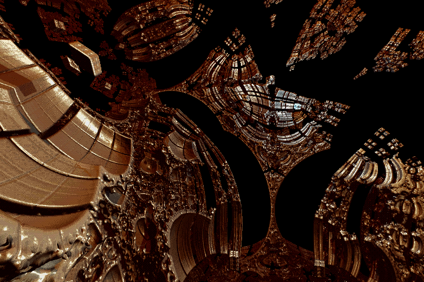

```glsl
float fixed_radius2 = 1.9;
    float min_radius2 = 0.1;
    float r2 = dot(z, z);
    if(r2 < min_radius2) {
      float temp = (fixed_radius2 / min_radius2);
      z *= temp; dz *= temp;
    }else if(r2 < fixed_radius2) {
      float temp = (fixed_radius2 / r2);
      z *= temp; dz *= temp;
    }
  }
  void box_fold(inout vec3 z, inout float dz) {
    float folding_limit = 1.0;
    z = clamp(z, -folding_limit, folding_limit) * 2.0 - z;
  }
  float de(vec3 z) {
    vec3 offset = z;
    float scale = -2.8;
    float dr = 1.0;
    for(int n = 0; n < 15; ++n) {
      box_fold(z, dr);
      sphere_fold(z, dr);
      z = scale * z + offset;
      dr = dr * abs(scale) + 1.0;
    }
    float r = length(z);
    return r / abs(dr);
  }
```

### void sphere_fold(inout vec3 z, inout float dz) { — mrange

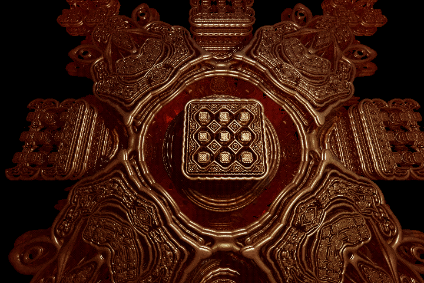

```glsl
const float fixed_radius2 = 1.9;
  const float min_radius2   = 0.5;
    float r2 = dot(z, z);
    if(r2 < min_radius2) {
      float temp = (fixed_radius2 / min_radius2);
      z *= temp;
      dz *= temp;
    } else if(r2 < fixed_radius2) {
      float temp = (fixed_radius2 / r2);
      z *= temp;
      dz *= temp;
    }
  }
  vec3 pmin(vec3 a, vec3 b, vec3 k) {
    vec3 h = clamp( 0.5+0.5*(b-a)/k, 0.0, 1.0);
    return mix(b, a, h) - k*h*(1.0-h);
  }
  void box_fold(float k, inout vec3 z, inout float dz) {
    // soft clamp after suggestion from ollij
    const vec3  folding_limit = vec3(1.0);
    vec3 zz = sign(z)*pmin(abs(z), folding_limit, vec3(k));
    z = zz * 2.0 - z;
  }
  float sphere(vec3 p, float t) {
    return length(p)-t;
  }
  float torus(vec3 p, vec2 t) {
    vec2 q = vec2(length(p.xz)-t.x,p.y);
    return length(q)-t.y;
  }
  float de(vec3 z) {
    const float scale = -2.8;
    vec3 offset = z;
    float dr = 1.0;
    float fd = 0.0;
    const float k = 0.05;
    for(int n = 0; n < 5; ++n) {
      box_fold(k/dr, z, dr);
      sphere_fold(z, dr);
      z = scale * z + offset;
      dr = dr * abs(scale) + 1.0;
      float r1 = sphere(z, 5.0);
      float r2 = torus(z, vec2(8.0, 1));
      float r = n < 4 ? r2 : r1;
      float dd = r / abs(dr);
      if (n < 3 || dd < fd) {
        fd = dd;
      }
    }
    return fd;
  }
```

### void sphereFold(inout vec3 z, inout float dz){ — lewiz

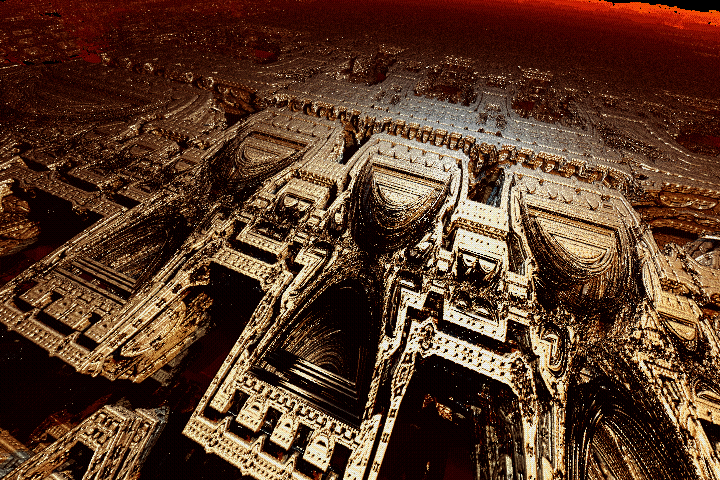

```glsl
float r2 = dot(z,z);
    if (r2 < 0.5){
      float temp = 2.0;
      z *= temp;
      dz*= temp;
    }else if (r2 < 1.0){
      float temp = 1.0 / r2;
      z *= temp; dz*= temp;
    }
  }
  void boxFold(inout vec3 z, inout float dz){
    z = clamp(z, -1.0, 1.0) * 2.0 - z;
  }
  float de(vec3 z){
    float scale = 2.0;
    vec3 offset = z;
    float dr = 1.0;
    for (int n = 0; n < 10; n++){
      boxFold(z,dr);
      sphereFold(z,dr);
      z = scale * z + offset;
      dr = dr * abs(scale) + 1.0;
    }
    float r = length(z);
    return r / abs(dr);
  }
```

### // European 4 in 1 Chain Maille Pattern — athibaul

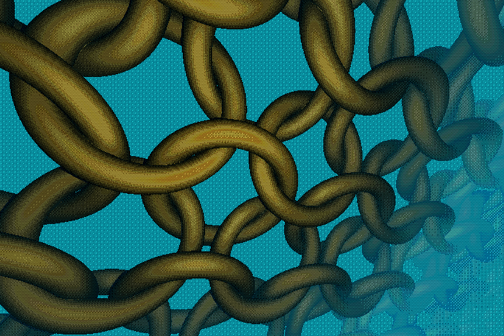

```glsl
#define R(th) mat2(cos(th),sin(th),-sin(th),cos(th))
float dTorus( vec3 p, float r_large, float r_small ) {
  float h = length( p.xy ) - r_large;
  float d = sqrt( h * h + p.z * p.z ) - r_small;
  return d;
}

float torusGrid( vec3 p, float r_small, float r_large, float angle, vec2 sep ) {
  // Create a grid of tori through domain repetition
  vec3 q = p - vec3( round( p.xy / sep ) * sep, 0 ) - vec3( 0, sep.y / 2., 0 );
  q.yz *= R( angle );
  float d = dTorus( q, r_large, r_small );
  q = p - vec3( round( p.xy / sep ) * sep, 0 ) - vec3( 0, -sep.y / 2., 0 );
  q.yz *= R( angle );
  d = min( d, dTorus( q, r_large, r_small ) );
  return d;
}

float material = 0.;
float de( vec3 p ) {
  float angle = 0.3;
  vec2 sep = vec2(1,0.8);
  float d = torusGrid(p, 0.07, 0.4, angle, sep);
  d = min(d, torusGrid(p-vec3(sep/2.,0), 0.07, 0.4, -angle, sep));
  // vec3 p2 = 12.3*p // displaced plane background;
  // p2.yz *= R(0.7);
  // p2.xz *= R(-0.7);
  // vec2 q = p2.xy-round(p2.xy);
  // float bump = dot(q,q) * 0.005;
  // float d2 = p.z+0.15+bump;
  // d = min(d, d2);
  return d;
}
```

### // Moorish Rose Chain Maille Pattern — athibaul

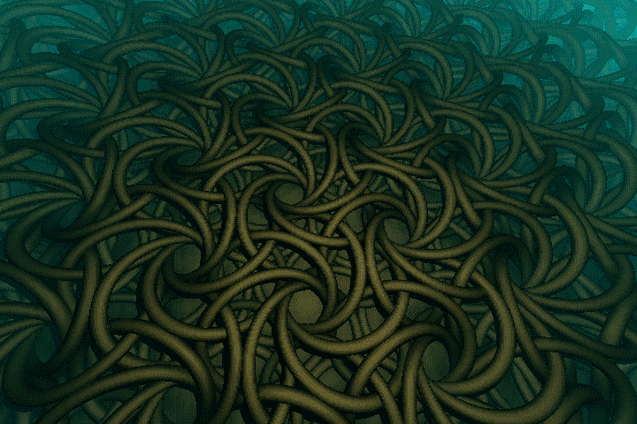

```glsl
#define R(th) mat2(cos(th),sin(th),-sin(th),cos(th))
float dTorus(vec3 p, float r_large, float r_small) {
  float h = length(p.xy) - r_large;
  float d = sqrt(h*h + p.z*p.z) - r_small;
  return d;
}

float torusGrid(vec3 p, float r_small, float r_large, float angle, vec2 sep) {
  p += vec3(0,sep.y/2.,0);
  vec3 q = p - vec3(round(p.xy/sep)*sep,0) - vec3(0,sep.y/2.,0);
  q.yz *= R(angle);
  float d = dTorus(q, r_large, r_small);
  q = p - vec3(round(p.xy/sep)*sep,0) - vec3(0,-sep.y/2.,0);
  q.yz *= R(angle);
  d = min(d, dTorus(q, r_large, r_small));
  return d;
}

float de(vec3 p) {
  float d = 1e5;
  for(float i=0.;i<6.;i++) {
    vec3 q = p;
    q.xy *= R(2.*3.14159*i/6.);
    float angle = 0.55;
    float rt3 = sqrt(3.);
    vec2 sep = vec2(1,rt3);
    float r1 = 0.47, r2 = 0.04, shift=0.3;
    d = min(d, torusGrid(q-vec3(shift,0,0), r2, r1, angle, sep));
    d = min(d, torusGrid(q-vec3(shift,0,0)-vec3(0.5,rt3/2.,0), r2, r1, angle, sep));
  }
  return d;
}
```

### float box ( vec3 p, vec3 b ) { — zackpudil

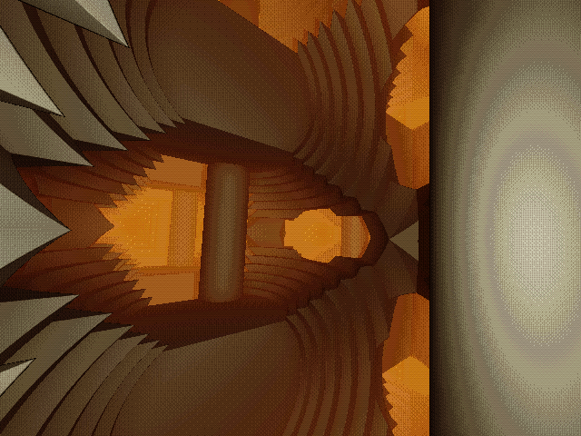

```glsl
vec3 q = abs( p ) - b;
  return max( q.x, max( q.y, q.z ) );
}

vec2 un ( vec2 a, vec2 b ) {
  return a.x < b.x ? a : b;
}

vec2 shape ( vec3 p ) {
  vec2 s = vec2( box( p.xyz + vec3( 0.6, 0, 0 ), vec3( 0.6 ) ), 1.0 );
  vec2 t = vec2( box( p.xyz - vec3( 0.6, 0, 0 ), vec3( 0.6 ) ), 1.0 );
  return un( s, t );
}

float de ( vec3 p ) {
  vec4 q = vec4( p, 1 );
  for ( int i = 0; i < 7; i++ ) {
    q.xyz = -1.0 + 2.0 * fract( 0.5 + 0.5 * q.xyz );
    q = 1.01 * q / max( dot( q.xyz, q.xyz ), 0.95 );
  }
  vec2 s = shape( q.xyz ) / vec2( q.w, 1.0 );
  vec2 t = vec2( p.y - 0.3, 2.0 );
  p.xz = abs( p.xz ) - vec2( 0.2, 0.4 );
  p.xz = mod( p.xz + 1.0, 2.0 ) - 1.0;
  vec2 u = vec2( length( p.xz ) - 0.2, 3.0 );
  return un( un( s, t), u ).x;
}
```

### float cube(vec4 cube, vec3 pos){ — psonice

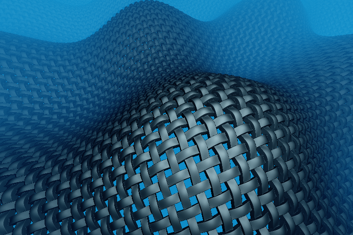

```glsl
cube.xyz -= pos;
  return max(max(abs(cube.x)-cube.w,abs(cube.y)-cube.w),abs(cube.z)-cube.w);
}

int m; // material id
float de(vec3 p){
  float t = time; // time varying term
  vec3 mp = mod(p, 0.1);
  mp.y = p.y + sin(p.x*2.+t)*.25 + sin(p.z * 2.5 + t)*.25;
  float s1 = cube(
    vec4(0.05, 0.05, 0.05, 0.025),
    vec3(mp.x, mp.y + (sin(p.z * PI * 10.) * sin(p.x * PI * 10.)) * 0.025, 0.05));
  float s2 = cube(
    vec4(0.05, 0.05, 0.05, 0.025), 
    vec3(0.05, mp.y + (sin(p.x * PI * 10.) * -sin(p.z * PI * 10.)) * 0.025, mp.z));
  m = s1 < s2 ? 0 : 1;
  return min(s1, s2);
}
```

### float cube(vec4 cube, vec3 pos){ — psonice

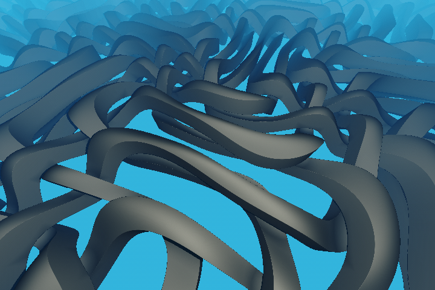

```glsl
cube.xyz -= pos;
  return max(max(abs(cube.x)-cube.w,abs(cube.y)-cube.w),abs(cube.z)-cube.w);
}

int m; // material id
float df(vec3 p){
  float t = time; // time varying term
  p += vec3(
    sin(p.z * 1.55 + t) + sin(p.z * 1.34 + t),
    0.,
    sin(p.x * 1.34 + t) + sin(p.x * 1.55 + t)
  ) * .5;
  vec3 mp = mod(p, 1.);
  mp.y = p.y;
  
  float s1 = cube(
    vec4(0.5, 0.5, 0.5, 0.15),
    vec3(mp.x, mp.y + (sin(p.z * PI) * sin(p.x * PI)) * 0.25, 0.5));
  float s2 = cube(
    vec4(0.5, 0.5, 0.5, 0.15), 
    vec3(0.5, mp.y + (sin(p.x * PI) * -sin(p.z * PI)) * 0.25, mp.z));
  m = s1 < s2 ? 0 : 1;
  return min(s1, s2);
}
```

### float sdVerticalCapsule( vec3 p, float h, float r ) { — theepicsnail

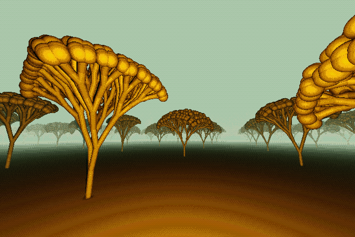

```glsl
p.y -= clamp( p.y, 0.0, h );
  return length( p ) - r;
}
vec2 rotate(vec2 v, float angle) {
  return cos(angle)*v+sin(angle)*vec2(v.y,-v.x);
}
float rand( vec2 co ) {
  return fract(sin(dot(co.xy ,vec2(12.9898,78.233))) * 43758.5453);
}
float de( vec3 ro ) {
  float d = 100.0;
  d = min( d, ro.y );
  float r = rand(floor(ro.xz/10.0-.5));
  ro.xz = fract(ro.xz/10.0-.5)*10.0-5.0;
  for(float len = 1.0; len > 0.0 ; len -= .1) {
    ro.xz = rotate(ro.xz, 1.4);
    d = min(d, sdVerticalCapsule(ro, len, .1));
    ro.x = abs(ro.x);
    ro -= vec3(0.0,len,0);
    ro = reflect(ro, normalize(vec3(rotate(vec2(0,1),1.7+ r*.1), 0)));
    d = min( d, sdVerticalCapsule(ro, len, .1));
  }
  d = min(d, length(ro)-.2);
  return d;
}
```

## Licensing

This is an educational resource provided under the [CC Attribution-NonCommercial-ShareAlike 3.0 Unported License](https://creativecommons.org/licenses/by-nc-sa/3.0/legalcode).

This is the default Shadertoy license unless otherwise specified by the shader author, the same license provided with the hg_sdf header. There are some utility functions referenced which are provided by the [Twigl noise header](https://jbaker.graphics/resources/noise.glsl), available under the MIT license, and the [hg_sdf header](https://jbaker.graphics/resources/hg_sdf.glsl). The primitives provided by Inigo Quilez are under the [MIT License](https://jbaker.graphics/writings/images/DEC/inigo.txt).

I have gathered these distance estimator functions from several sources (discussions with individuals, the hg_sdf header, Shadertoy examples, code deobfuscated from the #つぶやきGLSL tag on Twitter, among others). I have done my best to give credit to the authors, but I do not have a complete record - if you have information to that end, please contact me via email. If you are doing something cool with them, or would like to contribute to this resource, please contact me at jb239812@ohio.edu.